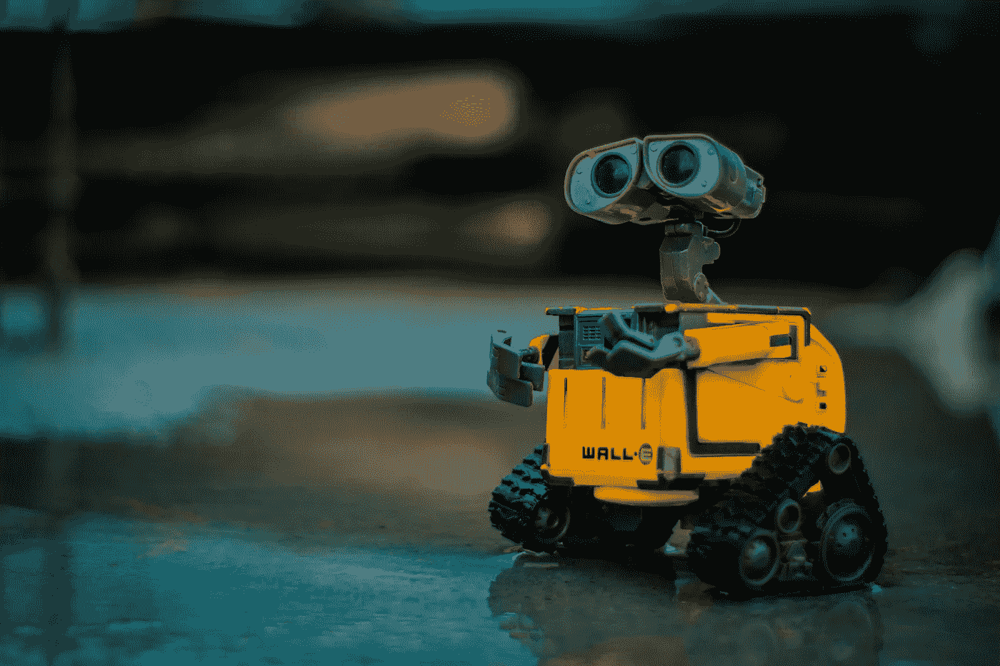
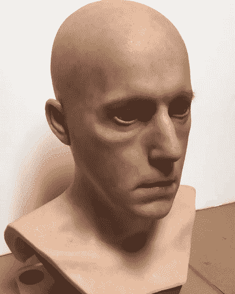
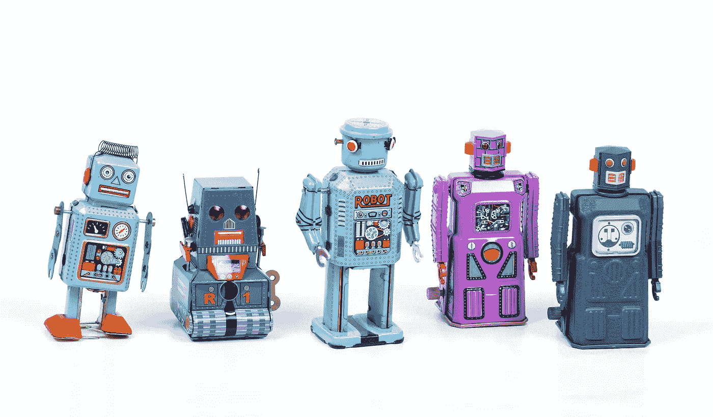
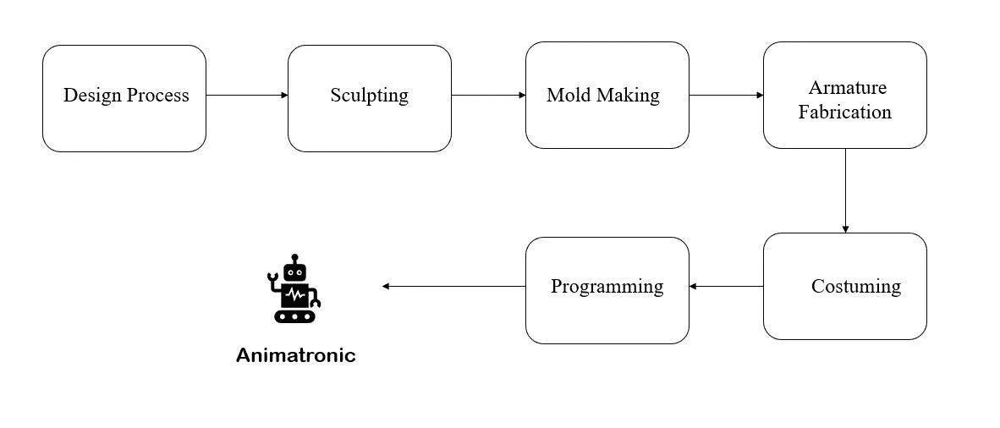
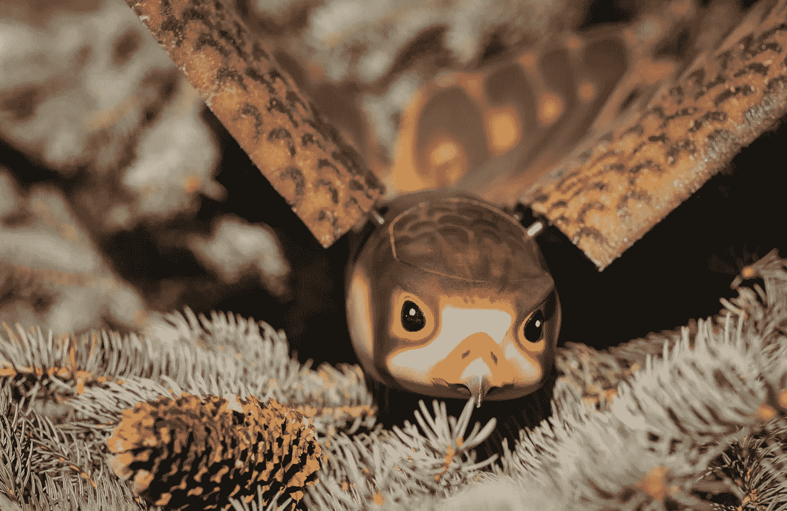

# 人工智能电子动画——带来难以想象的结果

> 原文：<https://towardsdatascience.com/animatronics-with-artificial-intelligence-brings-unimaginable-results-407983acf39?source=collection_archive---------24----------------------->

## 当前创新背景下电子动画的重要性——人工智能

来自 [Unsplash](https://unsplash.com/photos/OI1ToozsKBw) 的照片

> 动画+电子=动画电子学

小时候，我总是喜欢有机器人的电影。尤其是那些穿得像人类的。我一直在想，如果我们可以用电子动画制作出有生命的物体，并赋予它们人工智能的能力，让它们像人或动物一样思考和行动，那不是很酷吗？

在这篇文章中，我将概述 Animatronics，并讨论它与人工智能的合作，以使机器人看起来更好，并提供良好的用户体验。

遇见一个由[制作的电子动画特效](http://www.visionaryeffects.com/)

# 什么是电子动画？

动画电子学是动画和电子学的混合体。它可以预先定制(编程)或远程控制。动画可能执行开发，或者他们可能是不可思议的适应性。这是利用链接拉动小工具或驱动器，以加快人类或生物的繁殖或携带类似的属性，在任何情况下，无生命的东西。

这个概念最初是为迪士尼工作室开发的，用于 1954 年的电影。

我知道这很难接受。因此，简单地说，Animatronic 是一个展示人类或动物特征的自动化人体模型。一些特征包括用腿行走、眼球运动和像蛇一样爬行。某些动作和特征是使用伺服电机开发的(以控制运动、角位置)。

照片由[埃里克·库尔](https://unsplash.com/@ekrull)从 [Unsplash](https://unsplash.com/photos/Ejcuhcdfwrs) 拍摄

电子动作融合了生物(包括恐龙)、植物，甚至传说中的动物。一个旨在令人信服地模仿人类的机器人被更具体地称为**机器人。**

这是一个多学科领域，融合了生命系统、机器人、机电一体化和木偶戏带来的确切活动。它们覆盖着由坚硬而敏感的塑料材料制成的身体外壳和多功能皮肤，并以色调、头发和羽毛等微妙之处和各种部件完成，使人物逐渐变得可感知和真实。

电子动画的开发和设计(使用 Canva 设计)

但是它的许多应用被限制在娱乐领域。当与人工智能集成时，该概念可用于卫生、教育和军事行业。

 [## 迪士尼正在开发与公园游客互动的人工智能电子动画

### 电视节目《幻想工程的故事》和凯文·p·拉弗蒂的书《魔法之旅》展示了学术研究的进展…

www.newscientist.com](https://www.newscientist.com/article/mg24632881-000-disney-is-working-on-ai-animatronics-that-interact-with-park-guests/) 

在这个领域有大量的工作在进行，但许多人对**电子动画知之甚少。**让我们来看几个可以与 Animatronics 成为好伙伴的应用或行业。

# 与人工智能的集成

电子动画和人工智能可以解决许多问题。电子动画与人工智能的结合产生了机器人，就像人们所熟知的模仿人类行为的机器人一样。我们拥有所有我们需要的设备，从电子动物中挑选外观，从人工智能中挑选像生物一样的思维能力。

照片由 [Maximalfocus](https://unsplash.com/@maximalfocus) 从 [Unsplash](https://unsplash.com/photos/naSAHDWRNbQ)

我们正在**适应**机器人。我们有一种方法可以把生物的外表和行为赋予机器。我们正在使机器人人性化。

> 迪士尼协会将使用动画电子学和人为思维来建立他们的一个角色，在现实中:帕斯卡，电影*中的角色之一。*

* [## 照片:可爱的 Pascal Animatronic 正在为即将到来的东京迪士尼海洋“纠结”船开发…

### 东方置地有限公司于 2018 年 6 月宣布，已与华特·迪士尼公司达成协议…

wdwnt.com](https://wdwnt.com/2019/09/photos-adorable-pascal-animatronic-under-development-for-upcoming-tokyo-disneysea-tangled-boat-ride-attraction-revealed/) 

# 安奇·科兹莫

科兹莫是一个有特殊头脑的天才小家伙。他会逼你玩，让你持续震惊。他是一个真实的机器人，就像你最近在电影中看到的那样，有一个独一无二的角色，你和他在一起的时间越长，他就越有进步。

安奇·科兹莫(来源— [安奇](https://anki.com/en-us/cozmo.html))

科兹莫是你的伙伴在一个疯狂的乐趣比例。他的能力包括**面部识别、物体检测、与环境的互动**以及随着访问应用程序的激励而不断发展的智能，以提供更好的方式来处理学习和娱乐。

视频由[数字梦想实验室](https://www.youtube.com/channel/UCmKJa5Oq034X68K-FTIgR3A)

这个著名的机器人被用来帮助孩子们开始有趣地学习复杂的东西。

# SPOT —波士顿动力公司

波士顿动力公司是一家美国结构和应用自治安排协会，成立于 1992 年，是麻省理工学院的副业。这是对日本混合软银集团的一种肯定的强化。

它在多功能机器人方面处于世界领先地位，毫无疑问，它解决了最困难的机械自治难题。波士顿动力公司有一个非凡的和迅速创造的特殊的计划者和专家的聚会，他们可靠地得到先进的论证推导和严肃的结构。

波士顿动力公司的视频

**SPOT、****T5【移动机器人】专为传感、检测和远程操作而设计。波士顿动力公司宣布引入 Spot 的交易，这是一种可以轻松爬楼梯和穿越恶劣地区的敏捷机器人。此次发布标志着该组织首次可以购买波士顿动力公司的机器人，也代表了波士顿动力公司的首次在线交易。**

想象一下，如果有合适的外表，就像真正的动物一样，那该有多酷。

# 劳斯莱斯——虫子和蛇机器人

> 你有没有想象过如果你拥有一些动物的力量或能力会发生什么？

我们确实有超级英雄，他们拥有并使用一些动物或昆虫的能力，比如蜘蛛侠和蚁人。

照片由[像素](https://www.pexels.com/photo/person-holding-silver-pin-on-left-hand-4631059/)中的 [cottonbro](https://www.pexels.com/@cottonbro) 拍摄

想象一下一个系统的综合能力，它由一个小虫子或蟑螂一样的元件组成，可以在蛇形机器人的帮助下进入(人类不能进入的)地方，以利用其爬行的本性。这听起来好像我在谈论一部以蛇和蟑螂为英雄的电影。但是罗尔斯·罗伊斯公司提出了同样的系统来修理飞机引擎。

在与哈佛大学和诺丁汉大学的合作中，劳斯莱斯正在努力开发比预期小 10 毫米的名为 SWARM 的社群机器人，该机器人可以选择通过小型摄像机的方法为人类导演提供发动机内部的现场视频。

劳斯莱斯[的视频](https://www.youtube.com/channel/UCSPHdK9LVastTeN8yFPHKSQ)

为了让 SWARM 到达引擎，这些小机器人将乘坐 FLARE——两到三个内窥镜蛇形机器人，它们可以在一个巨大设备的专业和角落里滑行，并将 SWARM 存储在检查点。该协会同样计划让 FLARE 进行内部修复。

很久以前，在电影工业中，通过电子动画，人们就开始使用生物的能力。

# 哥鲁达无人机

哥鲁达无人机(来源— [ROBIRD](https://www.robird.com/projects-and-effects/uri-the-surgical-strike/) )

一部受欢迎的印度军事动作电影， *Uri: The Surgical Strike，*于 2019 年 1 月 11 日上映。在影片中，军方将其用于间谍目的。这是一个多产、电控、无人驾驶的航空情报收集框架，用于情报、监视、目标跟踪&获取。

> 电子动画——“活动但不活动的东西。”* 

*感谢[萨迪亚哈桑](https://medium.com/@saadiahassan786)的校对和建议。*

* [## 开发人员-cosmos/Animatronics-初学者指南

### 动画电子学是动画和电子学的交叉。电子动物是一个机械化的木偶。可能是…

github.com](https://github.com/developers-cosmos/Animatronics-BeginnersGuide) 

## 结论

我们已经看到了一些创新，这些创新类似于开发电子动画的原因。当与人工智能合作时，这可能会解决许多问题，并使世界变得更加现代和令人困惑。我们开始与动物真正对话的那一天似乎不远了。

如果你有什么建议，我很乐意听听。我很快会带着另一个有趣的话题回来。在那之前，呆在家里，保持安全，继续探索！

如果想联系，**在**[**LinkedIn**](https://www.linkedin.com/in/ritheesh-baradwaj-yellenki-8a6988173/)**上联系我。***