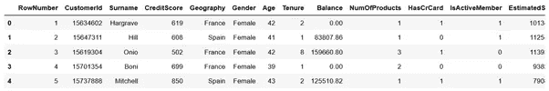
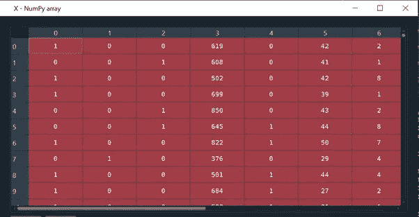
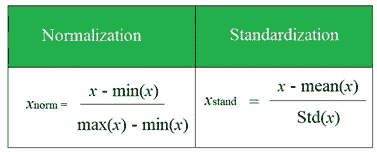
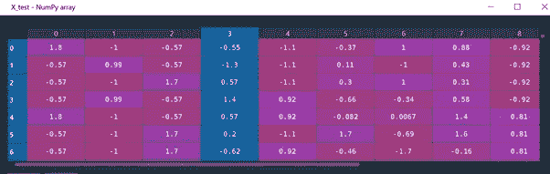

# 用神经网络预测银行客户流失

> 原文：<https://towardsdatascience.com/ann-classification-banking-customer-leave-or-stay-1cba16441185?source=collection_archive---------9----------------------->

## 基于 Keras 的人工神经网络构建在银行客户去留预测中的直观演示


来自 pixabay 的 Img 通过[链接](https://pixabay.com/photos/brexit-leave-remain-europe-exit-4131852/)

本文旨在解释如何创建一个人工神经网络(ANN ),以使用银行客户的原始数据来预测银行客户是否会离开。本文分为以下六个部分。

1.  问题陈述
2.  数据处理
3.  模型结构
4.  模型编译
5.  模型拟合
6.  模型预测法

现在让我们开始旅程🏃‍♂️🏃‍♀️!

**1。问题陈述**

一家银行让我们预测客户是否有可能离开银行。给出了 6 个月的客户银行数据。该银行计划利用你的调查结果，与即将离开的客户重新建立联系。

**2。数据处理**

首先，使用 *read_csv()* 导入带有 *Pandas* 的数据，如下所示。

```
dataset = pd.read_csv(‘Churn_Modelling.csv’)
```

图 1 显示了数据片段。前 13 列是关于客户 ID、姓名、信用评分、地理位置、性别、年龄等的**独立**变量。最后一列是因变量**决定客户是离开还是留下。**



图 1 导入数据片段

现在，让我们开始数据处理。

1)特征选择

*第一个问题:我们需要所有的自变量来拟合模型吗*🤔*？*答案是**否**。例如，行号、客户 ID 或姓氏对客户的去留没有影响。但是客户的年龄可能有变化，因为年轻的客户可能会离开银行。根据这个逻辑，我们可以判断哪些独立变量会影响结果。但是请记住，只有神经网络才能判断哪些特征对结果有很大影响。

所以自变量 *X* 是:

```
X = dataset.iloc[:, 3: 13].values
```

因变量 *y* 为:

```
y = dataset.iloc[:, 13].values
```

2)分类编码

> 神经网络只取数值进行学习。

因此，分类变量，如地理和性别需要编码成数字变量。这里我们用***fit _ transform()***的方法***label encoder***from***sk learn***。我们为每一列创建两个标签编码器。

```
from sklearn.preprocessing import LabelEncoder
labelencoder_X_1 = LabelEncoder()
X[:, 1] = labelencoder_X_1.fit_transform(X[:, 1])
```

注意上面，我们输入索引 1，因为 *X* 中地理列的索引是 1。编码后，国家德语变为 1，法国为 0，西班牙为 2。用同样的方法，对性别列进行如下编码。

```
labelencoder_X_2 = LabelEncoder()
X[:, 2] = labelencoder_X_2.fit_transform(X[:, 2])
```

现在，男性是 1，女性变成 0(希望亲爱的女士不会觉得被冒犯，因为这纯粹是随机的😊).

3)一键编码

注意上面的编码后，德语变成了 1，法国是 0，西班牙是 2。然而，国与国之间没有关系秩序。即西班牙不比德国高，法国不比西班牙低。所以我们需要为分类变量创建 ***虚拟变量*** 来去除分类编码引入的数值关系。**这里只需要为地理列做这件事，因为性别列只有 2 个类别。**

```
from sklearn.preprocessing import OneHotEncoder
onehotencoder = OneHotEncoder(categorical_features = [1])
X = onehotencoder.fit_transform(X).toarray()
```

图 2 是编码数据。**请注意，前 3 列是针对德国、法国和西班牙国家的一次性编码虚拟变量。**



图 2 编码数据片段

> 为了**避免伪数据陷阱**，我们删除了第 1 列，因为具有 0 和 1 的两列足以编码 3 个国家。

```
X = X[:, 1:]
```

4)数据分割

接下来，将数据分为训练集和测试集，测试集占 20%。我们使用 *random_state* 来确保每次分割保持不变。

```
from sklearn.model_selection import train_test_split
X_train, X_test, y_train, y_test = train_test_split(X, y,test_size = 0.2, random_state = 0)
```

5)特征缩放

> 缩放特征是为了避免密集的计算，也是为了避免一个变量支配其他变量。对于二元分类问题，不需要缩放因变量。但是对于回归，我们需要缩放因变量。

正常的方法包括标准化和规范化，如图 3 所示。这里我们拿**标准化**来说。



图 3 特征缩放方法(作者创建的 Img)

```
from sklearn.preprocessing import StandardScaler
sc = StandardScaler()
X_train = sc.fit_transform(X_train)
X_test = sc.transform(X_test)
```

注意，我们使用来自训练集的标度集来转换测试集。这一步，数据处理就完成了。图 4 是您应该得到的测试数据。



图 4 最终测试数据片段

**3。模型构建**

这里我们使用 ***Keras*** 建立一个序列模型。第一步是初始化顺序模型。

```
classifier = Sequential()
```

对于这个问题，模型由两个密集层构成。

```
#add input layer and first hidden layer
classifier.add(Dense(output_dim = 6, init = ‘uniform’, activation = ‘relu’, input_dim = 11))#add 2nd hidden layer
classifier.add(Dense(output_dim = 6, init = ‘uniform’, activation = ‘relu’))
```

注意 ***Output_dim*** 对于隐藏层来说是一种艺术的选择，看你的经验了。**作为提示，基于实验，选择它作为输入层节点数和输出层节点数的平均值。**一个更明智的方法是使用**参数调整**，使用类似 k-fold 交叉验证的技术，用不同的参数测试不同的模型。这里，输入维度是 11 个特征，输出维度是 1，因此输出维度是 6。这里我们使用 ***均匀*** 分布来随机化 0 和 1 之间的权重。使用 ***ReLU*** 函数进行隐藏层激活，根据我的实验，这是最好的。请随意尝试你的。

下面添加输出层。

```
classifier.add(Dense(output_dim = 1, init = ‘uniform’, activation = ‘sigmoid’))
```

对于输出层，我们使用 ***Sigmoid*** 函数来获得客户离开或留在银行的概率。如果处理多分类，使用 ***Softmax*** 功能。

**4。模型编译**

> 模型编译是在网络上应用**随机梯度下降(SGD)** 。

```
classifier.compile(optimizer = ‘Adam’, loss =’binary_crossentropy’, metrics = [‘accuracy’])
```

这里我们使用 ***Adam*** (一种 **SGD** )作为优化器，寻找使神经网络最强大的优化权重。优化器所依据的损失函数是 ***二元交叉熵*** 。我们用来评估模型性能的指标是 ***准确性*** 。

**5。模型拟合**

由于我们使用 **SGD** ，批量被设置为 10，表明神经网络在 10 次观察后更新其权重。Epoch 是通过网络的一轮完整数据流。这里我们选 100。

```
classifier.fit(X_train, y_train, batch_size = 10, epochs = 100)
```

现在是拟合模型的时候了。大约 35 个历元后，模型精度收敛到 ***0.837*** 。不错吧，✨✨？

**6。模型预测**

随着模型的拟合，我们在测试数据上测试模型。使用阈值 0.5，将数据转换为真(离开)和假(停留)数据。

```
y_pred = classifier.predict(X_test)
y_pred = (y_pred > 0.5)
```

然后我们使用 ***混淆 _ 矩阵*** 在测试集上考察模型性能。

```
from sklearn.metrics import confusion_matrix
cm = confusion_matrix(y_test, y_pred
```

精度为 0.859，高于训练精度，暗示过拟合。

有了上面的模型，银行可以测试新客户，得到离开或留下的概率。然后，银行可以抽取 10%可能性最高的客户，对客户数据进行深度挖掘，了解他们为什么有可能离开。这就是人工神经网络的目的。

**现在最后一个问题:**如何对新客户数据进行预测🤔？例如，图 5 中的客户数据:


图 5 新客户数据

正如你所想象的，我们需要遵循同样的数据处理。首先，对变量进行编码。例如，在虚拟变量中，地理位置法国被编码为(0，0)，性别男性为 1。按照这个方法，我们产生了下面的数组。

```
new_customer = [[0, 0, 600, 1, 40, 3, 60000, 2, 1, 1, 50000]]
```

好了，一个家庭作业问题:为什么我们使用 ***[[]]*** 来创建数组🤔？

下一步是将变量调整到与训练集相同的范围。

```
new_customer = sc.transform(sc.transform(new_customer))
```

数据准备就绪后，通过以下方式进行预测:

```
new_prediction = classifier.predict(new_customer)
new_prediction = (new_prediction > 0.5)
```

预测结果为假，可能性为 *0.418%* ，表明该客户不太可能离开银行👍👍。

**太好了！仅此而已。如果你需要一些额外的，请访问我的** [**Github**](https://github.com/luke4u/Customer_Behaviour_Prediction) **回购(仅供参考，回购是积极维护的)💕💕。**