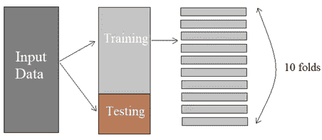
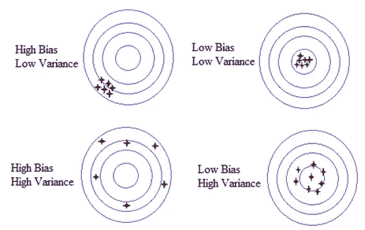
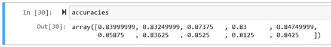
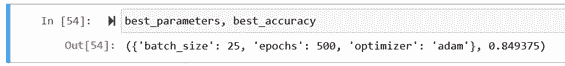

# 神经网络优化的模型评估和参数调整

> 原文：<https://towardsdatascience.com/ann-classification-model-evaluation-and-parameter-tuning-9174fd5ad0c2?source=collection_archive---------30----------------------->

## 使用 Keras 的交叉验证和网格搜索的分步走查


Img 改编自 pixabay 通过[链接](https://pixabay.com/photos/seo-sem-google-marketing-793035/)

在之前的[文章](https://medium.com/@vistaxjtu/ann-classification-banking-customer-leave-or-stay-1cba16441185)中，我们构建了一个人工神经网络来解决一个二元分类问题。**如果你还记得的话，留做家庭作业的一个问题是为什么我们对新客户数据使用[[]]。** *答案是我们需要将客户数据放入一个水平向量中，而不是垂直向量中，因为输入数据中的所有观察值都是行而不是列。希望你没弄错😎*。**

本文主要关注模型优化的交叉验证和网格搜索，分为两个部分:

1.  模型评估
2.  参数调谐
3.  摘要

现在让我们开始旅程🏃‍♀️🏃‍♂️.

1.  **模型评估**

*你可能想知道为什么我们要花精力在模型评估上*🤔*？*问题是如果我们重新运行 ANN，每次模型不仅在训练集和测试集上产生不同的精度。因此，在一次测试中评估模型性能并不是最恰当的方式。

典型的方法是使用 K-fold 交叉验证。图 1 展示了它是如何工作的。



图 1 K 倍交叉验证图(作者创建的 Img)

我们将训练集分成 K 个折叠(例如，K=10)。然后在 9 个褶皱上训练模型，在最后剩下的褶皱上测试。10 折，我们用 9 个训练集和 1 个测试集做 10 个不同的组合，训练/测试模型 10 次。之后，我们取 10 次评估的平均值，并计算标准偏差。这样，我们可以确定模型属于哪个类别，如图 2 所示。



图 2 偏差-方差权衡图(Img 由作者创建)

为了实现 K-fold 交叉验证，我们在*Keras*:***Keras classifier***中使用了一个 ***scikit_learn*** 包装器。具体来说，我们使用 ***Keras*** 构建模型，使用 ***scikit_learn*** 进行交叉验证。首先要为模型架构构建一个函数，因为该函数是 ***Keras*** 包装器的必需参数。正如你在下面注意到的，这和我们之前建立的人工神经网络结构是一样的。

```
from keras.wrappers.scikit_learn import KerasClassifier
from sklearn.model_selection import cross_val_score
from keras.models import Sequential
from keras.layers import Densedef build_classifier():
 classifier = Sequential()
 classifier.add(Dense(units = 6, kernel_initializer = ‘uniform’, activation = ‘relu’, input_dim = 11))
 classifier.add(Dense(units = 6, kernel_initializer = ‘uniform’, activation = ‘relu’))
 classifier.add(Dense(units = 1, kernel_initializer = ‘uniform’, activation = ‘sigmoid’))
 classifier.compile(optimizer = ‘adam’, loss = ‘binary_crossentropy’, metrics = [‘accuracy’])
 return classifier
```

通过使用上述函数构建的分类器，我们创建了一个 *KerasClassifier* 对象。下面我们指定批量大小为 10，需要训练的模型的时期数为 100。

```
classifier = KerasClassifier(build_fn = build_classifier, batch_size = 10, epochs = 100)
```

现在，让我们使用***cross _ val _ score()***方法对分类器应用 K-fold 交叉验证。这个函数返回一个训练精度列表。参数 ***cv*** 是我们用于交叉验证的折叠数。这里，分类器将在 10 个不同的训练集上进行训练，这些训练集是从初始训练集中分离出来的。

```
accuracies = cross_val_score(estimator = classifier, X = X_train, y = y_train, cv = 10)
mean = accuracies.mean()
std = accuracies.std()
```

在这里，交叉验证可能需要一段时间。最终，我们得到了如图 2 所示的准确度为 10 的评估。平均准确度为 0.843，标准偏差为 1.60%🤪。



图 2 交叉验证的准确性

2.**参数调谐**

有了可靠的模型准确性，让我们尝试使用两种技术来提高它。

2.1 辍学正规化

我们没有提到的一个技术是**退出**正则化。**这是与高方差相关的过拟合的解决方案。**辍学是如何进行的？在每次训练迭代中，一些神经元被随机禁用，以防止它们相互依赖。通过覆盖这些神经元，神经网络每次都会保留不同的神经元配置，帮助神经网络学习数据的独立相关性。这可以防止神经元过度学习。

让我们使用 ***Keras*** 来实现它。基本上，我们在每个隐藏层后添加一个退出层。注意 *p* =0.1 意味着每次迭代将禁用 10%的神经元。

```
from keras.layers import Dropout
classifier.add(Dense(output_dim = 6, init = ‘uniform’, activation = ‘relu’, input_dim = 11))
#add dropout layer
**classifier.add(Dropout(p =0.1))** classifier.add(Dense(output_dim = 6, init = ‘uniform’, activation = ‘relu’))
#add dropout layer
**classifier.add(Dropout(p =0.1))** #add output layer
classifier.add(Dense(output_dim = 1, init = ‘uniform’, activation = ‘sigmoid’))
```

2.2 参数调整

> 神经网络有一些超参数，如时期数、批量大小和学习速率。参数调整就是找到模型的最佳参数。这里我们使用**网格搜索**来测试参数的不同组合。

为了实现它，我们在*Keras*:***Keras classifier***中使用一个 ***scikit_learn*** 包装器来包装神经网络。然后创建一个网格搜索对象，并在包装的分类器上应用参数调整。首先，如下构建分类器函数。

```
def build_classifier(optimizer):
 classifier = Sequential()
 classifier.add(Dense(units = 6, kernel_initializer = ‘uniform’, activation = ‘relu’, input_dim = 11))
 classifier.add(Dense(units = 6, kernel_initializer = ‘uniform’, activation = ‘relu’))
 classifier.add(Dense(units = 1, kernel_initializer = ‘uniform’, activation = ‘sigmoid’))
 classifier.compile(optimizer = optimizer, loss = ‘binary_crossentropy’, metrics = [‘accuracy’])
 return classifierclassifier = KerasClassifier(build_fn = build_classifier)
```

**上面注意，没有指定历元数和批量大小，因为它们是我们计划调优的参数，将在**下面的网格搜索对象中指定。

让我们为参数创建一个字典，其中包含我们希望模型尝试的值。

```
parameters = {‘batch_size’: [25, 32], ‘nb_epoch’: [100, 500], ‘optimizer’: [‘adam’, ‘rmsprop’]}
```

如果你注意到上面，我们有一个参数**优化器**用于 *build_classifier()* 函数。该参数提供了一种调优优化器的方法。为了实现网格搜索，我们首先用分类器和参数创建一个 *GridSearchCV* 类的对象。

```
grid_search = GridSearchCV(estimator=classifier, param_grid =parameters, scoring = ‘accuracy, cv = 10’)
```

最后，让我们在运行网格搜索以找到最佳参数的同时，在训练集上拟合 ANN。

```
grid_search = grid_search.fit(X_train, y_train)
```

我们最感兴趣的是产生最高精度的最佳参数。所以有了下文:

```
best_parameters = grid_search.best_params_
best_accuracy = grid_search.best_score_
```

最后，几个小时后，我们的精确度提高到了 0.849 ✨✨.最佳参数是批处理大小 25、纪元编号 500 和优化器 Adam，如图 3 所示。



图 3 参数调整的精度

3.**总结**

综上所述，通过交叉验证，我们发现该模型的精度约为 0.843。通过使用随机丢弃正则化和网格搜索，我们将模型精度提高到 0.849。通常，网格搜索可以分两步进行，第一步是找到大致范围，另一小步是细化最佳范围。

**太好了！仅此而已！✨✨If 你需要一些额外的，访问我的** [**Github**](https://github.com/luke4u/Customer_Behaviour_Prediction) **页面。(仅供参考，回购得到积极维护💕💕)**