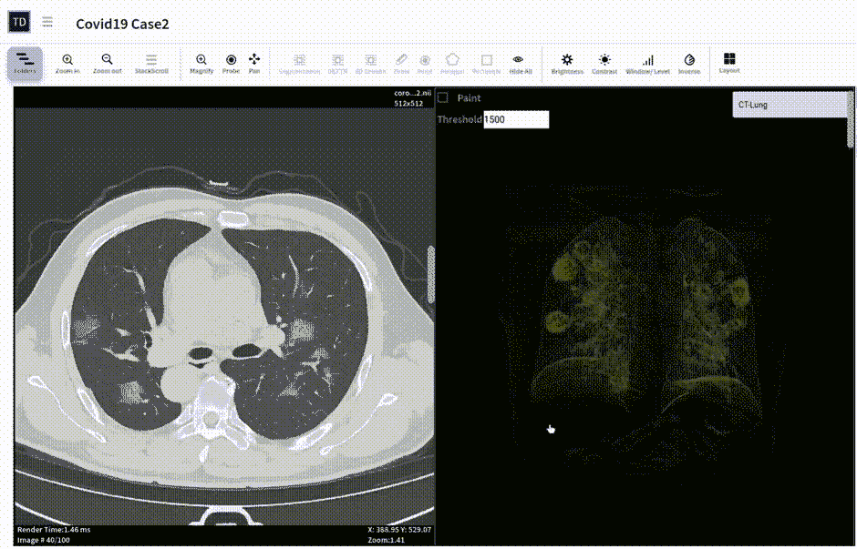

# 使用 NVIDIA Clara 在 TrainingData.io 上自动检测胸部 CT 中的新冠肺炎感染(第二部分)

> 原文：<https://towardsdatascience.com/annotate-data-train-ai-for-covid-19-detection-in-chest-ct-using-nvidia-clara-on-trainingdata-io-e25df2bfd0aa?source=collection_archive---------49----------------------->

## 注释数据并训练您自己的分割模型，用于检测胸部 CT 中的新冠肺炎。**请注意**training data . io 上生成的 ggo/consolidation 仅用于研究目的，不用于临床诊断。

2020 年 3 月，为了帮助数据科学家研究新冠肺炎诊断工具，TrainingData.io 提供了一个免费的协作工作区，预装了开源数据集，包括胸部 X 射线和胸部 CT 图像。我们要感谢用户的贡献。我们从用户身上学到了很多。现在，TrainingData.io 推出了拖放式用户体验，将人工智能的力量带给世界各地抗击新冠肺炎感染的每一位数据科学家、医院和诊所。

患者胸部 CT 显示的新冠肺炎感染。

在与新冠肺炎的斗争中，医务人员有四种不同的诊断数据可供他们使用:a)RT-聚合酶链式反应测试结果，b)抗体测试结果，c)胸部 x 光成像，以及 d)胸部 CT 成像。RT-聚合酶链式反应测试结果和抗体检测结果正被用作检测新冠肺炎的第一步。胸部 x 光和胸部 CT 成像被用于通过被诊断患有新冠肺炎的患者的肺部观察疾病的进展。

**无症状病例中的肺损伤**:研究人员研究了无症状感染的临床模式，并在[自然医学](https://www.trainingdata.io/blog/annotate-detect-and/#1https://www.nature.com/articles/s41591-020-0965-6.pdf)发表。他们发现，无症状的新冠肺炎病例会对肺部造成长期损害。在一项这样的研究中，发现无症状患者的胸部 CT 检查显示“条纹状阴影”，并且在某些情况下显示“毛玻璃阴影”，这是肺部炎症的迹象。

由于受这种病毒影响的人群规模庞大，研究无症状病例肺损伤的能力依赖于在胸部 ct 检查中自动检测和可视化新冠肺炎感染的软件工具的容易获得性。

# 胸部 CT 数据中的新冠肺炎磨玻璃影和实变

当新冠肺炎患者体内的病毒扩散时，肺部被称为肺泡的小气囊中就会积聚液体。这种液体的存在导致肺部发炎。肺部炎症的增长可以在 x 光和 CT 成像中观察到。肺部炎症表现为磨玻璃样阴影(GGOs ),随后是磨玻璃样实变。

医务人员必须使用一些标准来决定是给病人使用氧气治疗或呼吸机系统，还是让康复中的病人脱离呼吸机系统。在 CT 成像中可视化 GGOs 实变模式在帮助医务人员做出正确决策方面起着重要作用。

## 新冠肺炎培训数据的 GGOs 整合细分. io

从在 PCR 测试中被诊断患有新冠肺炎的患者的胸部 CT 数据集开始，数据科学家需要创建肺部的分割掩模和毛玻璃阴影(新冠肺炎感染)的分割掩模。TrainingData.io 提供了一个隐私保护的并行分布式框架，用于将注释工作外包给多个放射科医生。CT 检查中的所有切片都可以在像素级别进行精确注释，并在 TrainingData.io 提供的 3D 注释客户端中进行可视化。

# GGOs 合并的半自动人工智能辅助分割

TrainingData.io 提供了一个分割 ML 模型，为输入胸部 CT 检查生成毛玻璃阴影/实变。该模型可用于初始分割的种子。放射科医生可以稍后修复自动分割的结果。

使用 TrainingData.io 自动分割新冠肺炎的 GGOs 合并

# 从带注释的胸部 CT 数据集到 ML(分割)模型，只需点击几下鼠标

为什么区域医院或诊所需要 ML 模型来分割使用其数据集训练的 GGOs 合并？这个问题的答案在于病毒变异背后的科学。新冠肺炎是由一种叫做新型冠状病毒的病毒引起的。已经发现这种病毒变异速度很快，在所有受影响的国家都发现有很大比例的遗传多样性。病毒的不同变异可能以不同方式影响当地人口。

一旦 CT 数据集和分割掩模准备就绪，数据科学家就必须重新训练现有的机器学习模型，以更好地适应当地的人口统计数据。这可以通过在 TrainingData.io 网络应用程序中点击几下来实现。

**注意**:training data . io 上生成的 ggo/consolidation 仅用于研究目的，不用于临床诊断。

[1]https://www.nature.com/articles/s41591-020-0965-6.pdf

[2]https://www.webmd.com/lung/what-does-covid-do-to-your-lungs

本博客最早发表于 [TrainingData.io](https://www.trainingdata.io) [博客](https://www.trainingdata.io/blog/annotate-detect-and/)。

系列第一篇:[https://towards data science . com/新冠肺炎-成像-数据集-胸部-x 光-CT-用于注释-协作-5f6e076f5f22](/covid-19-imaging-dataset-chest-xray-ct-for-annotation-collaboration-5f6e076f5f22)