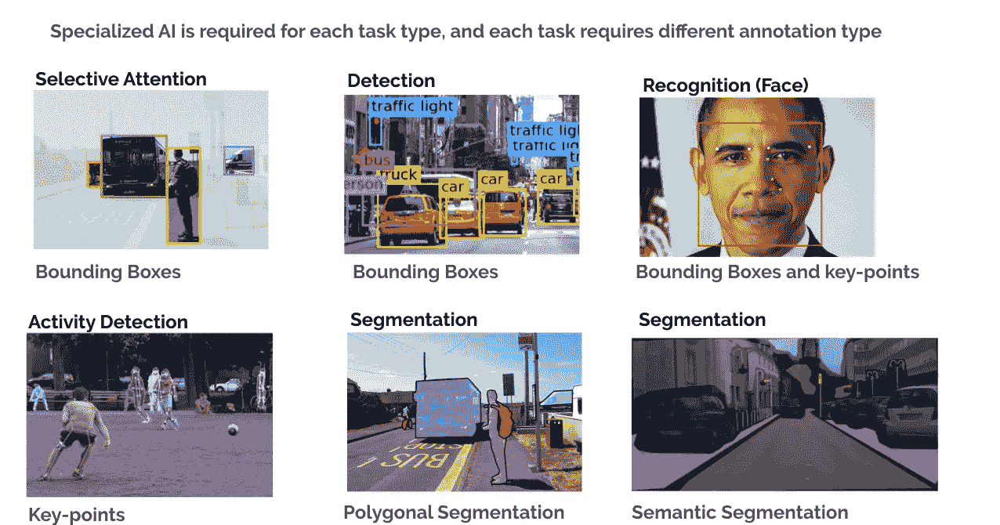
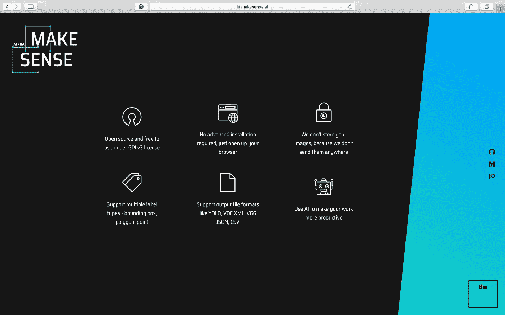
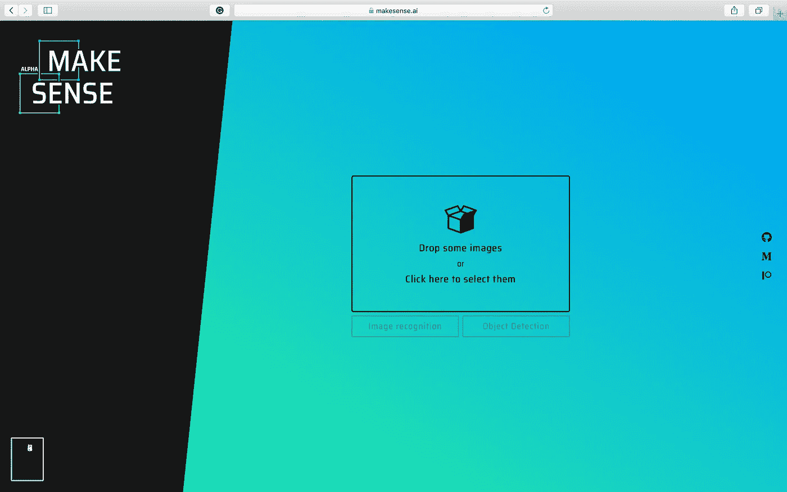
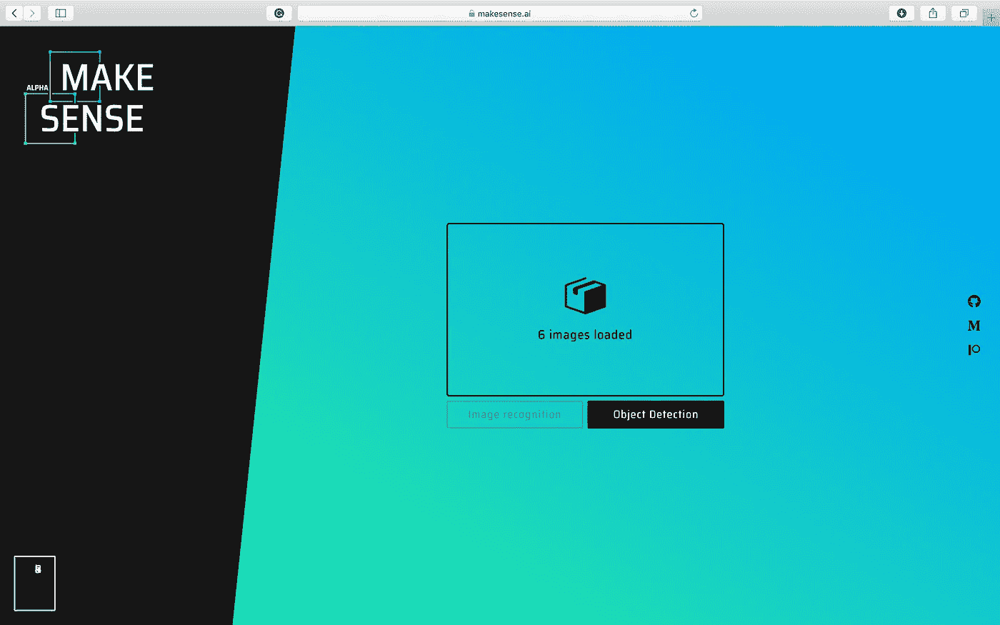
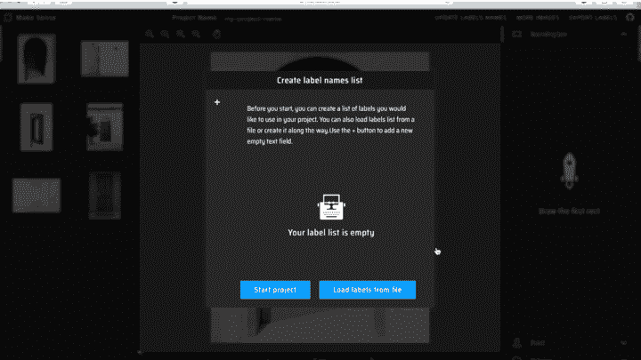
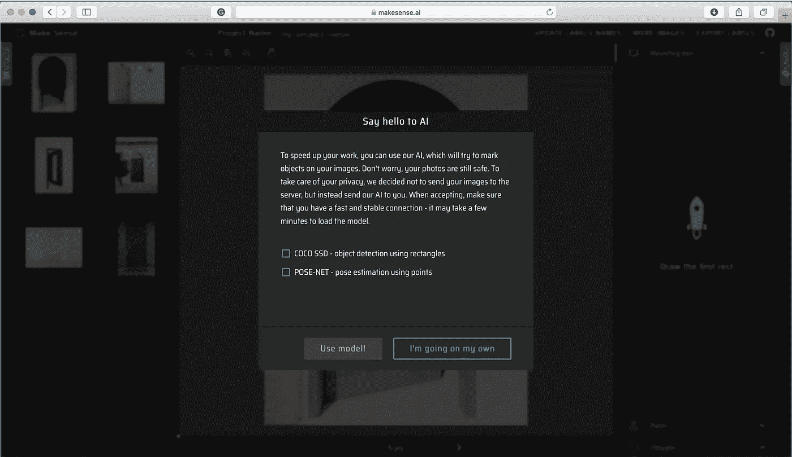
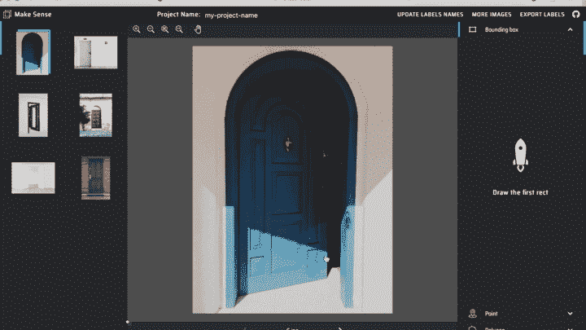
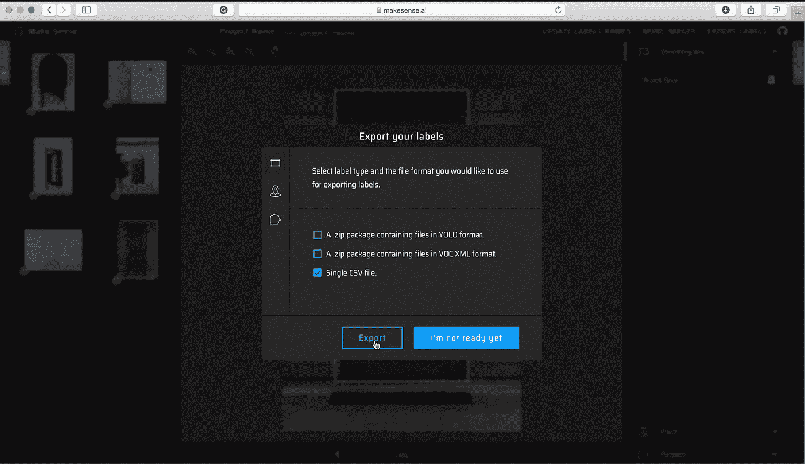

# 使用在线注释工具注释您的图像！

> 原文：<https://towardsdatascience.com/annotate-your-image-using-online-annotation-tool-52d0a742daff?source=collection_archive---------4----------------------->

## 图像标记变得简单

门的图像(由 [Unsplash](https://unsplash.com/?utm_source=unsplash&utm_medium=referral&utm_content=creditCopyText) 上的 [Robert Anasch](https://unsplash.com/@diesektion?utm_source=unsplash&utm_medium=referral&utm_content=creditCopyText) 拍摄)

你刚刚得到了一个令人兴奋的项目，你必须建立一个程序来使用图像检测门是开着还是关着。你已经收集了几百张开门和关门的照片。现在，你需要注释和标记图像中的每扇门，以便你可以训练一个机器学习模型来检测开/关的门。

> 图像标注是为诸如对象检测、图像分类和图像分割等任务创建机器学习模型的重要步骤。

你在谷歌上搜索注释工具，找到了很多选项，但现在不知道该用哪种工具来注释你的图像。如果这是你，我将通过一个现有的开源注释工具，让你的决策过程变得简单一些。

不同的计算机视觉任务，每个任务都有注释类型

如果您想详细了解不同的图像注释类型:包围盒、多边形分割、语义分割、3D 长方体、关键点和界标、直线和样条线，[在此阅读更多信息](/image-data-labelling-and-annotation-everything-you-need-to-know-86ede6c684b1)。

## 让我们进入开源在线注释工具——make sense。

MakeSense 是一个开放源代码的注释工具，在 GPLv3 许可下可以免费使用。它不需要任何高级安装，只需要一个网络浏览器来运行它。

*   *开源*
*   *免费*
*   *基于网络的*

用户界面简单易用。您只需上传您想要注释的图像，注释图像并导出标签。MakeSense 支持多种标注:包围盒、多边形和点标注。您可以导出不同格式的标签，包括 YOLO，VOC XML，VGG JSON 和 CSV。

根据该网站的说法，MakeSense 不存储图像，因为它们不会将图像发送到任何地方。

以下是使用 MakeSense 注释工具的分步指南。

1.  前往 [www.makesense.ai](http://www.makesense.ai)

MakeSense 主页

2.点击右下角的框进入注释页面，你会看到下面的页面，你可以上传你想注释的图片。

MakeSense 图像选择页面

3.选择并上传图像后，点击*“物体检测”*按钮。

MakeSense 上传图像页面

4.因为您没有加载任何标签，所以会要求您为项目创建标签名称列表。
要添加新标签，点击消息框左上角的+号，在*“插入标签”*文本框中输入标签。对所有标签重复上述步骤。
添加完所有标签后，选择*“开始项目”*。

MakeSense 创建标签页

5.在这里，您可以选择使用预先训练好的模型来帮助您进行标记，或者自己进行标记。对于这篇文章，让我们用*“我自己去”*并手动完成所有的标记。

MakeSense 手动注释选项

6.您将在左栏看到已上传的图像，在右栏看到注释，在中间栏看到当前选择进行注释的图像。

在注释栏中，您可以选择不同的注释类型:*边界框、点、*和*多边形*。对于这篇文章，让我们使用边界框注释，并在图像中注释开门和关门。

MakeSense 图像标签

要注释对象，只需将鼠标悬停在所选图像中的对象上，单击并拖动鼠标，即可创建一个所需大小的矩形框。

创建边界框后，会在右侧的边界框列下添加一个新条目。单击为对象选择所需的标签。

7.对所有图像中的所有对象重复注释步骤。

8.当您注释完所有图像后，就可以导出标签了。要导出，点击页面右上角的*“导出标签”*按钮，选择您想要的输出格式，然后点击*“导出”*。

MakeSense 出口标签

通过这些简单的步骤，您现在已经注释了您的数据集，并准备好训练您的机器学习模型。

使用该工具时，您需要记住以下几点:

1.  MakeSense 是一个在线网络工具。这意味着，您需要将您的所有图像加载到 web 门户来对其进行注释。
2.  MakeSense 不提供上传 zip 文件的选项。您将不得不通过选择您想要注释的所有图像来上传。
3.  MakeSense 并没有提供一种保存注释项目的方法。这意味着，如果您有意或无意地刷新您的 web 浏览器，您的所有注释进度都将消失，您将不得不从头开始(上传所有图像)。
4.  您不能与您的团队协作处理同一个注释项目。
5.  你可以使用人工智能来帮助加速你的图像注释任务。您可以选择两个选项:COCO SSD 对象检测模型用于包围盒注释，POSE-NET 姿势估计用于关键点注释。请注意，要使用 AI，您需要在开始项目之前选择此选项。一旦你选择不使用人工智能模式的帮助，你不能改变它。

考虑到以上几点，当您有多达几百个图像要注释时，比如在开/关门的例子中，MakeSense 是一个很好的选择。由于不需要设置或安装，当您有一个小数据集时，该工具会变得非常方便，您可以一次标注。你可以上传开放门户的图片，添加注释并导出标签。
如果一幅图像包含两扇门，并且您使用边界框注释，平均来说，您可以在 1 分钟内注释 10 幅图像。在一个小时内，您可以使用此工具注释大约 600 张图像。

如果您有一个大型数据集，比如说 10，000 张图像，我建议您查看其他离线注释工具(如果您单独工作)，或者在线注释工具(如果您在团队中工作)，它们可以选择暂停和恢复注释任务。另一种选择是将图像标注任务外包给其他公司，这些公司专门从事这项工作。

在这篇文章中，我们讨论了如何使用名为 MakeSense 的开源在线注释工具来注释图像数据，何时使用 MakeSense 以及一些限制。

*您使用哪种图像注释工具？* ***在下面留下你的想法作为评论。***

原载于*[*【www.xailient.com/blog】*](https://www.xailient.com/post/annotate-your-image-using-online-annotation-tool)*。**

*找一个**预先训练好的人脸检测模型**。[点击这里](https://sdk.xailient.com/register.html)下载。*

*[查看这篇文章](https://www.xailient.com/post/obstacle-to-robust-object-detection)了解更多关于创建一个健壮的对象检测模型的细节。*

****关于作者****

*Sabina Pokhrel 在 Xailient 工作，这是一家计算机视觉初创公司，已经建立了世界上最快的边缘优化物体探测器。*