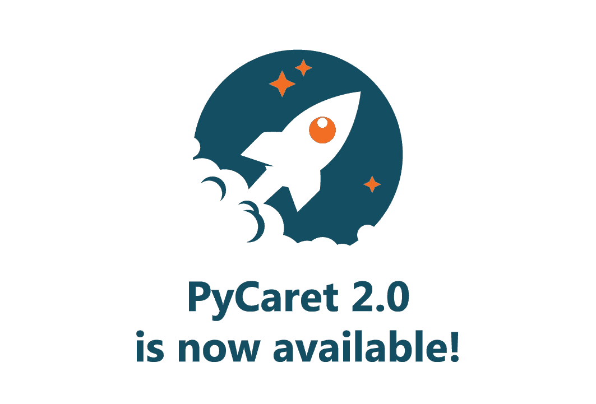
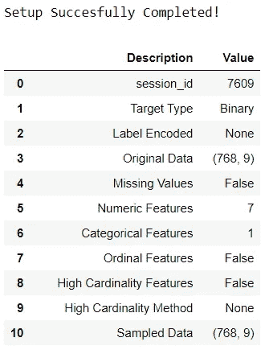
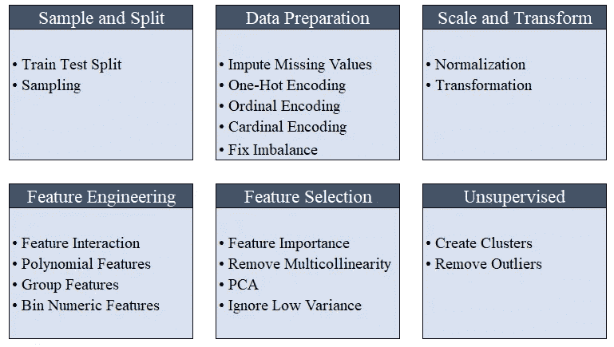
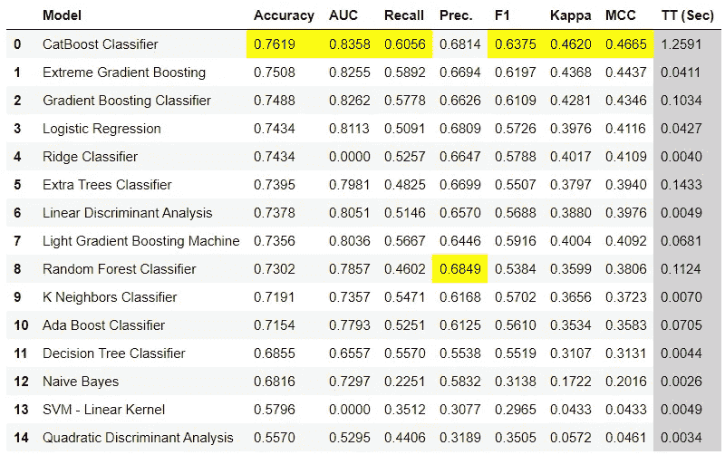
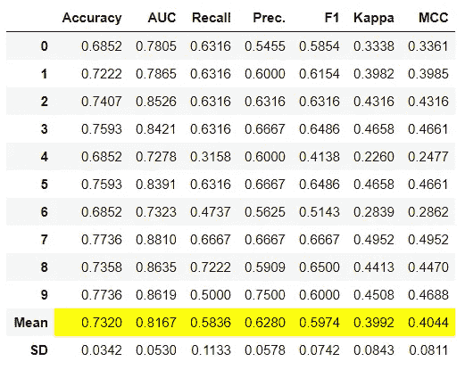
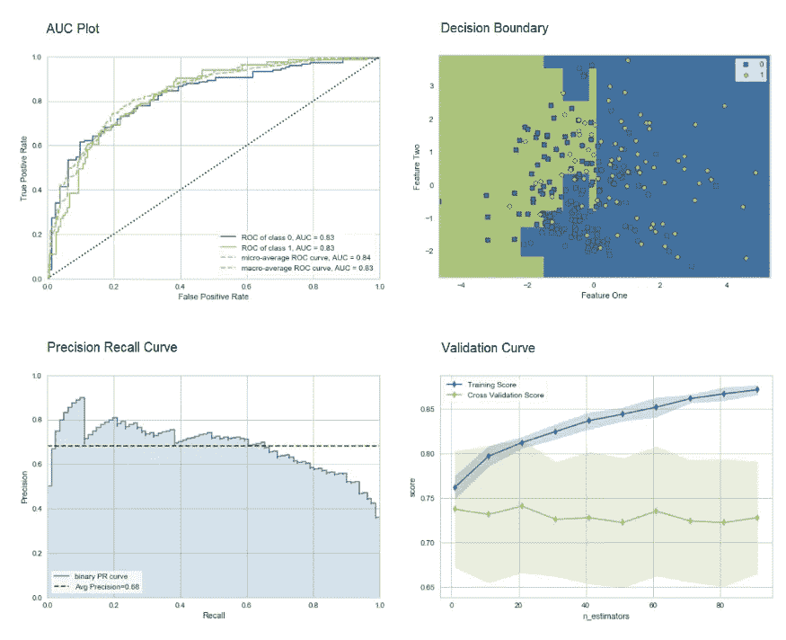
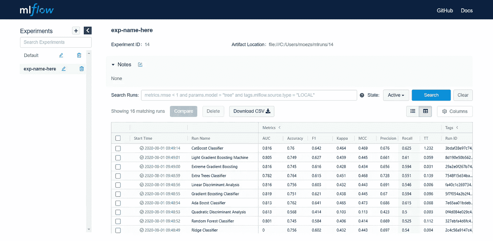

# 宣布 PyCaret 2.0

> 原文：<https://towardsdatascience.com/announcing-pycaret-2-0-39c11014540e?source=collection_archive---------3----------------------->



https://www.pycaret.org

我们很高兴今天宣布 PyCaret 的第二次发布。

PyCaret 是一个开源的、**Python 中的低代码**机器学习库，可以自动化机器学习工作流。它是一个端到端的机器学习和模型管理工具，可以加快机器学习实验周期，让你更有效率。

与其他开源机器学习库相比，PyCaret 是一个替代的低代码库，可以用来替换数百行代码，只需要几个单词。这使得实验快速有效。

请参见 PyCaret 2.0 的详细[发行说明](https://github.com/pycaret/pycaret/releases/tag/2.0)。

# **为什么使用 PyCaret？**


PyCaret 2.0 功能

# 正在安装 PyCaret 2.0

安装 PyCaret 非常容易，只需要几分钟。我们强烈建议使用虚拟环境来避免与其他库的潜在冲突。参见下面的示例代码，创建一个 ***conda*** ***环境*** 并在该 conda 环境中安装 pycaret:

```
**# create a conda environment** 
conda create --name yourenvname python=3.6 **# activate environment** 
conda activate yourenvname **# install pycaret** 
pip install **pycaret==2.0** **# create notebook kernel linked with the conda environment python -m** ipykernel install --user --name yourenvname --display-name "display-name"
```

如果你使用的是 Azure 笔记本或者 Google Colab，运行下面的代码来安装 PyCaret。

```
!pip install **pycaret==2.0**
```

当您使用 pip 安装 PyCaret 时，所有硬依赖项都会自动安装。[点击此处](https://github.com/pycaret/pycaret/blob/master/requirements.txt)查看依赖关系的完整列表。

# 👉PyCaret 2.0 入门

PyCaret 中任何机器学习实验的第一步都是通过导入相关模块来设置环境，并通过传递数据帧和目标变量的名称来初始化**设置函数**。参见示例代码:

**样本输出:**



输出被截断

所有预处理转换都在**设置功能中应用。** PyCaret 提供超过 20 种不同的预处理转换，可以在设置函数中定义。[点击这里](https://www.pycaret.org/preprocessing)了解更多关于 PyCaret 的预处理能力。



https://www.pycaret.org/preprocessing

# 👉**对比车型**

这是我们建议任何监督机器学习任务的第一步。此函数使用默认超参数训练模型库中的所有模型，并使用交叉验证评估性能指标。它返回训练好的模型对象类。使用的评估指标包括:

*   **用于分类:**准确度、AUC、召回率、精确度、F1、Kappa、MCC
*   **用于回归:** MAE、MSE、RMSE、R2、RMSLE、MAPE

以下是使用 **compare_models** 函数的几种方法:

**样本输出:**



compare_models 函数的输出示例

# 👉**创建模型**

创建模型功能使用默认超参数训练模型，并使用交叉验证评估性能指标。这个函数是 PyCaret 中几乎所有其他函数基础。它返回训练好的模型对象类。以下是使用该功能的几种方法:

**样本输出:**



create_model 函数的示例输出

要了解更多关于**创建模型**功能的信息，[点击此处](https://www.pycaret.org/create-model)。

# 👉调整模型

调整模型函数调整作为估计量传递的模型的超参数。它使用随机网格搜索和预定义的完全可定制的调谐网格。以下是使用该功能的几种方法:

要了解更多关于**调谐模式**功能的信息，[点击此处](https://www.pycaret.org/tune-model)。

# 👉集合模型

对于合奏基础学习者来说，可用的功能很少。 **ensemble_model** 、 **blend_models** 和 **stack_models** 就是其中的三个。以下是使用该功能的几种方法:

要了解更多关于 PyCaret 中集合模型的信息，[请点击此处](https://www.pycaret.org/ensemble-model)。

# 👉预测模型

顾名思义，这个函数用于推断/预测。你可以这样使用它:

# 👉绘图模型

绘图模型函数用于评估训练好的机器学习模型的性能。这里有一个例子:



plot_model 函数的输出示例

[点击此处](https://www.pycaret.org/plot-model)了解 PyCaret 中不同可视化的更多信息。

或者，您可以使用 **evaluate_model** 功能，通过笔记本内的用户界面查看图*。*


PyCaret 中的 evaluate_model 函数

# 👉实用函数

PyCaret 2.0 包括几个新的 util 函数，在使用 PyCaret 管理您的机器学习实验时非常方便。其中一些如下所示:

要查看 PyCaret 2.0 中实现的所有新功能，请参见[发行说明](https://github.com/pycaret/pycaret/releases/tag/2.0)。

# 👉实验记录

PyCaret 2.0 嵌入了 MLflow 跟踪组件作为后端 API 和 UI，用于在运行机器学习代码时记录参数、代码版本、指标和输出文件，并用于以后可视化结果。以下是你如何在 PyCaret 中记录你的实验。

**输出(在本地主机上:5000)**



https://本地主机:5000

# 👉将所有这些放在一起—创建您自己的 AutoML 软件

使用所有函数，让我们创建一个简单的命令行软件，它将使用默认参数训练多个模型，调整顶级候选模型的超参数，尝试不同的集成技术，并返回/保存最佳模型。下面是命令行脚本:

该脚本将动态选择并保存最佳模型。在短短的几行代码中，你已经开发了你自己的 Auto ML 软件，它有一个完全成熟的登录系统，甚至还有一个呈现漂亮排行榜的用户界面。

使用 Python 中的轻量级工作流自动化库，您可以实现的目标是无限的。如果你觉得这有用，请不要忘记给我们 github 回购⭐️，如果你喜欢 PyCaret。

想了解更多关于 PyCaret 的信息，请在 LinkedIn 和 Youtube 上关注我们。

# 重要链接

【PyCaret 2.0 发行说明
[用户指南/文档](https://www.pycaret.org/guide) [](https://github.com/pycaret/pycaret/releases/tag/2.0) [Github](http://www.github.com/pycaret/pycaret)
[安装 PyCaret](https://www.pycaret.org/install)
[笔记本教程](https://www.pycaret.org/tutorial)
[投稿于 PyCaret](https://www.pycaret.org/contribute)

# 想了解某个特定模块？

单击下面的链接查看文档和工作示例。

[分类](https://www.pycaret.org/classification)
[回归](https://www.pycaret.org/regression) 聚类
[异常检测](https://www.pycaret.org/anomaly-detection) [自然语言处理](https://www.pycaret.org/nlp)
[关联规则挖掘](https://www.pycaret.org/association-rules)