# 宣布 PyCaret 1.0.0

> 原文：<https://towardsdatascience.com/announcing-pycaret-an-open-source-low-code-machine-learning-library-in-python-4a1f1aad8d46?source=collection_archive---------3----------------------->

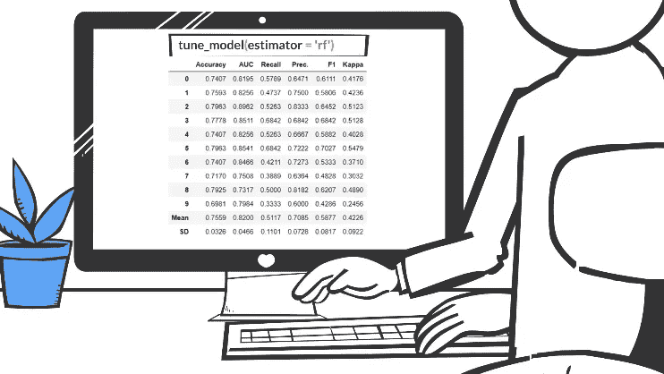

## Python 中一个开源的**低代码**机器学习库。

我们很兴奋地宣布 [PyCaret](https://www.pycaret.org) ，这是一个用 Python 编写的开源机器学习库，用于在**低代码**环境中训练和部署有监督和无监督的机器学习模型。PyCaret 允许您从选择笔记本电脑环境开始，在几秒钟内从准备数据到部署模型。

与其他开源机器学习库相比，PyCaret 是一个替代的低代码库，可以用来替换数百行代码，只需要几个单词。这使得实验快速有效。PyCaret 本质上是几个机器学习库和框架的 Python 包装器，比如 [scikit-learn](https://scikit-learn.org/stable/) 、 [XGBoost](https://xgboost.readthedocs.io/en/latest/) 、 [Microsoft LightGBM](https://github.com/microsoft/LightGBM) 、 [spaCy](https://spacy.io/) 等等。

py caret**简单** **好用**。PyCaret 中执行的所有操作都顺序存储在一个完全为**部署编排的**管道**中。**无论是输入缺失值、转换分类数据、特征工程还是超参数调整，PyCaret 都能实现自动化。要了解 PyCaret 的更多信息，请观看这段 1 分钟的视频。

*PyCaret 1.0.0 发布 Python 中的开源低代码机器学习库*

# PyCaret 入门

PyCaret 版本 1.0.0 的第一个稳定版本可以使用 pip 安装。使用命令行界面或笔记本环境，运行下面的代码单元来安装 PyCaret。

```
pip install pycaret
```

如果你使用的是 [Azure 笔记本](https://notebooks.azure.com/)或 [Google Colab](https://colab.research.google.com/) ，运行下面的代码单元来安装 PyCaret。

```
!pip install pycaret
```

安装 PyCaret 时，所有依赖项都会自动安装。[点击此处](https://github.com/pycaret/pycaret/blob/master/requirements.txt)查看完整的依赖关系列表。

# 没有比这更容易的了👇

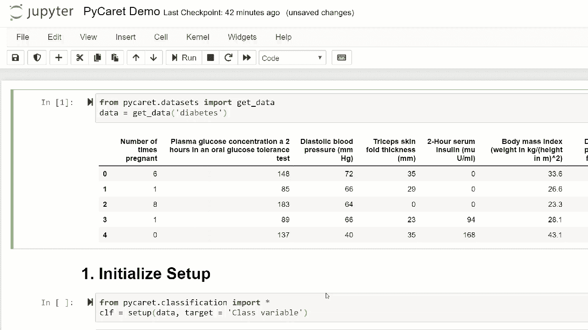

# 📘循序渐进的教程

# 1.获取数据

在本分步指南中，我们将使用**“糖尿病”**数据集，目标是根据血压、胰岛素水平、年龄等几个因素预测患者结果(二进制 1 或 0)。数据集可以在 PyCaret 的 [github 库](https://github.com/pycaret/pycaret)上获得。直接从存储库中导入数据集的最简单方法是使用 **pycaret.datasets** 模块中的 **get_data** 函数。

```
from **pycaret.datasets** import **get_data**
diabetes = **get_data**('diabetes')
```

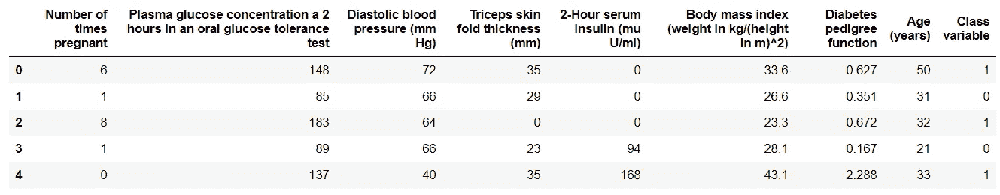

get_data 的输出

💡PyCaret 可以直接处理 **pandas** dataframe。

# 2.设置环境

PyCaret 中任何机器学习实验的第一步都是通过导入所需的模块并初始化 **setup** ()来设置环境。本例中使用的模块是[**py caret . class ification**](https://www.pycaret.org/classification)**。**

模块导入后， **setup()** 通过定义数据帧(*【糖尿病】*)和目标变量(*【类变量】*)进行初始化。

```
from **pycaret.classification** import ***** exp1 = **setup**(diabetes, target = 'Class variable')
```

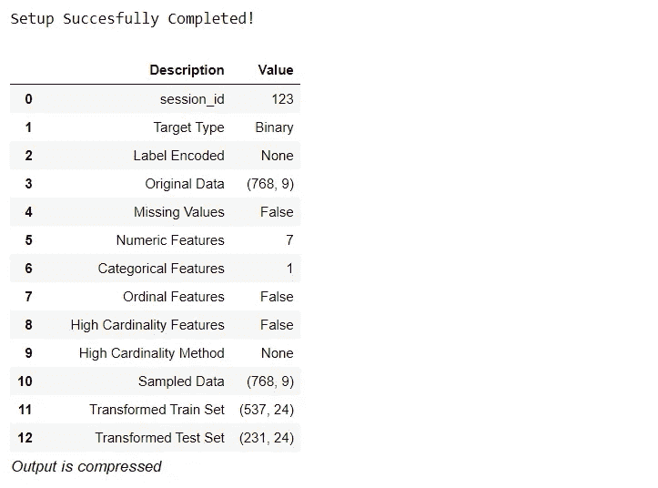

所有预处理步骤都在**设置()中应用。**py caret 有超过 20 个特征为机器学习准备数据，它根据*设置*功能中定义的参数创建一个转换管道。它会自动编排一个**管道**中的所有依赖项，这样您就不必手动管理测试或不可见数据集上转换的顺序执行。PyCaret 的管道可以轻松地跨环境传输，以便大规模运行或轻松部署到生产中。下面是 PyCaret 第一次发布时提供的预处理特性。

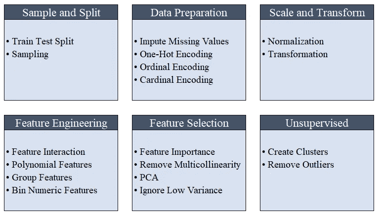

PyCaret 的预处理功能

💡初始化 setup()时，会自动执行机器学习必需的数据预处理步骤，例如缺失值插补、分类变量编码、标签编码(将是或否转换为 1 或 0)以及训练-测试-分割。[点击这里](https://www.pycaret.org/preprocessing)了解更多关于 PyCaret 的预处理能力。

# 3.比较模型

这是监督机器学习实验中推荐的第一步([分类](https://www.pycaret.org/classification)或[回归](https://www.pycaret.org/regression))。此函数训练模型库中的所有模型，并使用 k 倍交叉验证(默认为 10 倍)比较常用评估指标。使用的评估指标包括:

*   **用于分类:**准确度、AUC、召回率、精确度、F1、Kappa
*   **用于回归:** MAE，MSE，RMSE，R2，RMSLE，MAPE

```
**compare_models**()
```

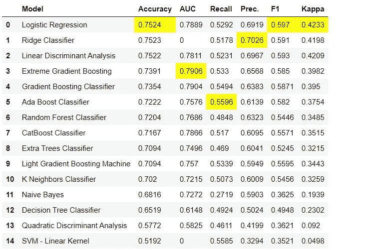

compare_models()函数的输出

💡默认情况下，使用 10 重交叉验证来评估指标。可以通过改变 ***折叠*** 参数的值来改变。

💡默认情况下，表格按“精确度”(从高到低)值排序。可以通过改变 ***排序*** 参数的值来改变。

# 4.创建模型

在 PyCaret 的任何模块中创建一个模型就像编写 **create_model 一样简单。**它只有一个参数，即作为字符串输入传递的型号名称。该函数返回一个表，其中包含 k 倍交叉验证的分数和一个训练好的模型对象。

```
adaboost = **create_model**('ada')
```

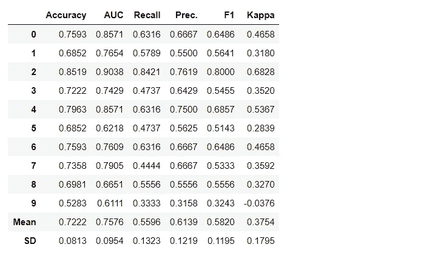

变量“adaboost”存储由 **create_model** 函数返回的训练模型对象，它是一个 scikit-learn 估计器。被训练对象的原始属性可以通过使用*句点( .)*复变。参见下面的例子。


训练模型对象的属性

💡PyCaret 拥有超过 60 种开源的现成算法。点击这里查看 PyCaret 中可用的评估者/模型的完整列表。

# 5.调整模型

**tune_model** 函数用于自动调整机器学习模型**的超参数。** PyCaret 在预定义的搜索空间内使用**随机网格搜索**。该函数返回一个表，其中包含 k 倍交叉验证的分数和一个训练好的模型对象。

```
tuned_adaboost = tune_model('ada')
```

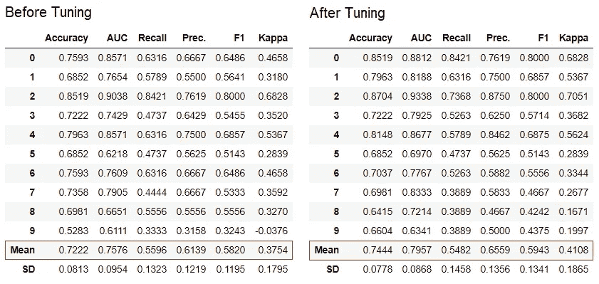

💡无监督模块 [pycaret.nlp](https://www.pycaret.org/nlp) 、 [pycaret.clustering](https://www.pycaret.org/clustering) 和 [pycaret.anomaly](https://www.pycaret.org/anomaly) 中的 **tune_model** 函数可以与有监督模块配合使用。例如，PyCaret 的 NLP 模块可用于调整*主题数量*参数，方法是评估监督 ML 模型的目标/成本函数，如“准确度”或“R2”。

# 6.集合模型

**ensemble_model** 函数用于集合训练好的模型**。**它只需要一个参数，即一个训练好的模型对象。这个函数返回一个表，其中包含 k 倍交叉验证的分数和一个训练好的模型对象。

```
# creating a decision tree model
dt = **create_model**('dt')# ensembling a trained dt model
dt_bagged = **ensemble_model**(dt)
```

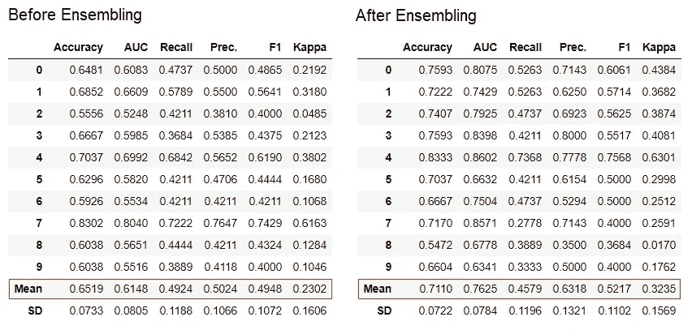

💡默认情况下，集合使用“Bagging”方法，可以通过使用 ensemble_model 函数中的 ***方法*** 参数将其更改为“Boosting”。

💡PyCaret 还提供了 [blend_models](https://www.pycaret.org/blend-models) 和 [stack_models](https://www.pycaret.org/stack-models) 功能来集成多个训练模型。

# 7.绘图模型

可以使用 **plot_model** 函数对经过训练的机器学习模型进行性能评估和诊断。它在 **plot_model** 函数中将一个训练好的模型对象和绘图类型作为字符串输入。

```
# create a model
adaboost = **create_model**('ada')# AUC plot
**plot_model**(adaboost, plot = 'auc')# Decision Boundary
**plot_model**(adaboost, plot = 'boundary')# Precision Recall Curve
**plot_model**(adaboost, plot = 'pr')# Validation Curve
**plot_model**(adaboost, plot = 'vc')
```

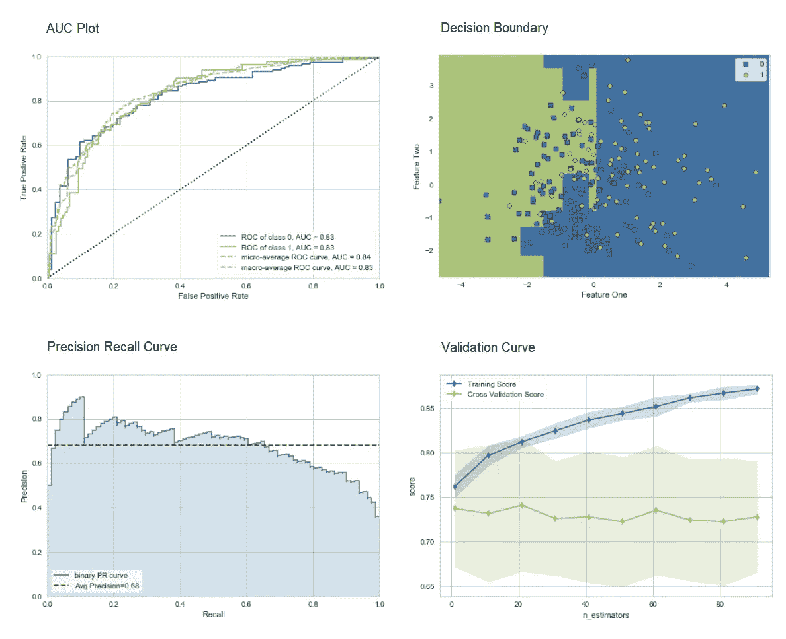

[单击此处](https:///www.pycaret.org/plot-model)了解 PyCaret 中不同可视化的更多信息。

或者，您可以使用 **evaluate_model** 函数，通过笔记本内的用户界面查看图*。*

```
**evaluate_model**(adaboost)
```

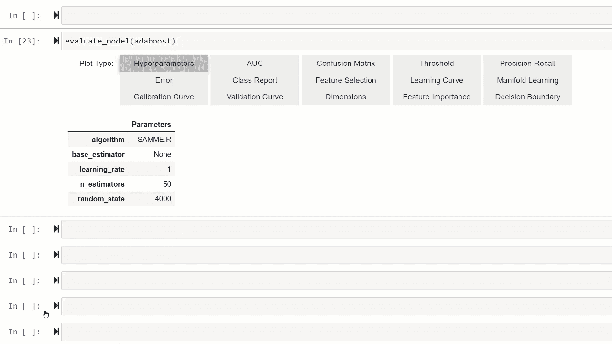

💡**py caret . NLP**模块中的 plot_model 函数可以用来可视化*文本语料库*和*语义主题模型*。点击这里了解更多信息。

# 8.解释模型

当数据中的关系是非线性的时，这在现实生活中是常见的情况，我们总是看到基于树的模型比简单的高斯模型做得更好。然而，这是以失去可解释性为代价的，因为基于树的模型不像线性模型那样提供简单的系数。PyCaret 使用 **interpret_model** 函数实现[SHAP(SHapley Additive exPlanations](https://shap.readthedocs.io/en/latest/))。

```
# create a model
xgboost = **create_model**('xgboost')# summary plot
**interpret_model**(xgboost)# correlation plot
**interpret_model**(xgboost, plot = 'correlation')
```

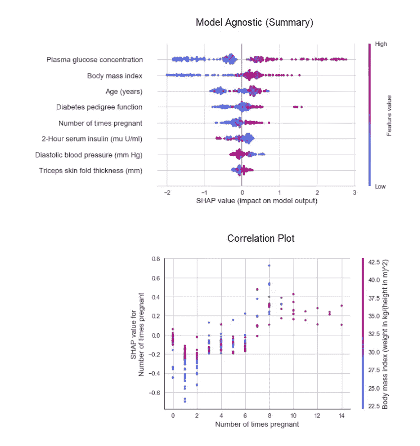

测试数据集中特定数据点(也称为原因参数)的解释可使用“原因”图进行评估。在下面的例子中，我们检查测试数据集中的第一个实例。

```
**interpret_model**(xgboost, plot = 'reason', observation = 0) 
```

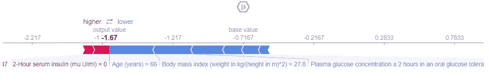

# 9.预测模型

到目前为止，我们看到的结果仅基于训练数据集的 k-fold 交叉验证(默认为 70%)。为了在测试/保留数据集上查看模型的预测和性能，使用了 **predict_model** 函数。

```
# create a model
rf = **create_model**('rf')# predict test / hold-out dataset
rf_holdout_pred **= predict_model**(rf)
```

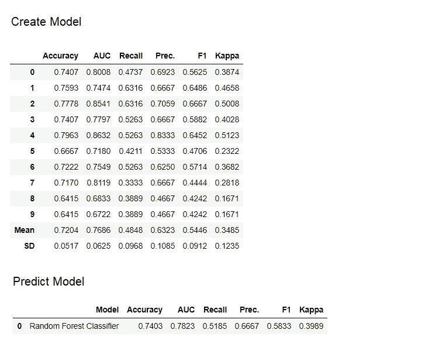

**predict_model** 函数也用于预测未知数据集。现在，我们将使用我们用于训练的相同数据集作为新的看不见的数据集的*代理*。在实践中， **predict_model** 函数将被迭代使用，每次使用一个新的看不见的数据集。

```
predictions = **predict_model**(rf, data = diabetes)
```

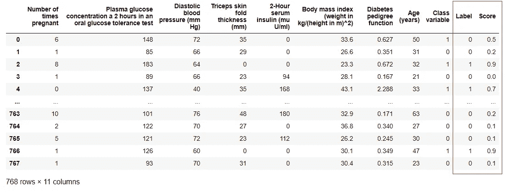

💡predict_model 函数还可以预测使用 [stack_models](https://www.pycaret.org/stack-models) 和 [create_stacknet](https://www.pycaret.org/classification/#create-stacknet) 函数创建的一系列模型。

💡predict_model 函数也可以使用 [deploy_model](https://www.pycaret.org/deploy-model) 函数直接从 AWS S3 上托管的模型进行预测。

# 10.部署模型

利用已定型模型对未知数据集生成预测的一种方法是，在模型已定型的笔记本/ IDE 中使用 predict_model 函数。然而，对未知数据集进行预测是一个迭代过程；根据使用情况，进行预测的频率可以从实时预测到批量预测。PyCaret 的 **deploy_model** 函数允许从笔记本环境部署整个管道，包括云上的训练模型。

```
**deploy_model**(model = rf, model_name = 'rf_aws', platform = 'aws', 
             authentication =  {'bucket'  : 'pycaret-test'})
```

# 11.保存模型/保存实验

一旦训练完成，包含所有预处理转换和训练的模型对象的整个管道可以保存为二进制 pickle 文件。

```
# creating model
adaboost = **create_model**('ada')# saving model **save_model**(adaboost, model_name = 'ada_for_deployment')
```


您还可以将包含所有中间输出的整个实验保存为一个二进制文件。

```
**save_experiment**(experiment_name = 'my_first_experiment')
```


💡您可以使用 PyCaret 所有模块中可用的 **load_model** 和 **load_experiment** 函数加载已保存的模型和已保存的实验。

# 12.下一个教程

在下一个教程中，我们将展示如何在 Power BI 中使用经过训练的机器学习模型，以在真实的生产环境中生成批量预测。

请参见我们的初级笔记本，了解这些模块:

[回归](https://www.pycaret.org/reg101)
[聚类](https://www.pycaret.org/clu101)
[异常检测](https://www.pycaret.org/anom101)
[自然语言处理](https://www.pycaret.org/nlp101)
关联规则挖掘

# 开发管道中有什么？

我们正在积极改进 PyCaret。我们未来的开发管道包括一个新的**时间序列预测**模块，与 **TensorFlow** 的集成，以及对 PyCaret 可扩展性的重大改进。如果您想分享您的反馈并帮助我们进一步改进，您可以[在网站上填写此表格](https://www.pycaret.org/feedback)，或者在我们的 [GitHub](http://www.github.com/pycaret/) 或 [LinkedIn](https://www.linkedin.com/company/pycaret/) 页面上发表评论。

# 想了解某个特定模块？

从第一个版本 1.0.0 开始，PyCaret 有以下模块可供使用。单击下面的链接查看文档和工作示例。

[分类](https://www.pycaret.org/classification)
[回归](https://www.pycaret.org/regression) [聚类](https://www.pycaret.org/clustering)
[异常检测](https://www.pycaret.org/anomaly-detection) 自然语言处理
[关联规则挖掘](https://www.pycaret.org/association-rules)

# 重要链接

[用户指南/文档](https://www.pycaret.org/guide)
[Github 资源库](http://www.github.com/pycaret/pycaret)
[安装 PyCaret](https://www.pycaret.org/install)
[笔记本教程](https://www.pycaret.org/tutorial)
[贡献于 PyCaret](https://www.pycaret.org/contribute)

如果你喜欢 PyCaret，给我们 github 回购⭐️。

想了解更多关于 PyCaret 的信息，请在 LinkedIn 和 Youtube 上关注我们。