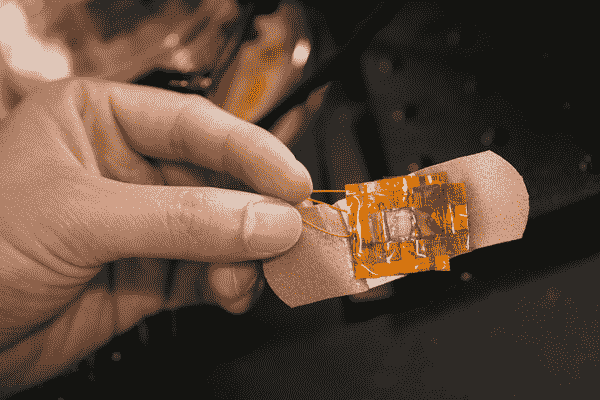
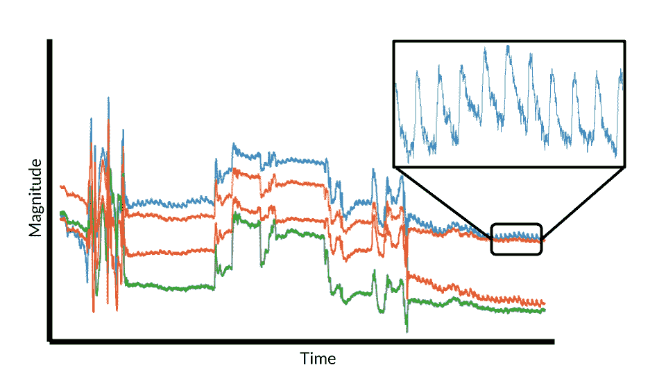
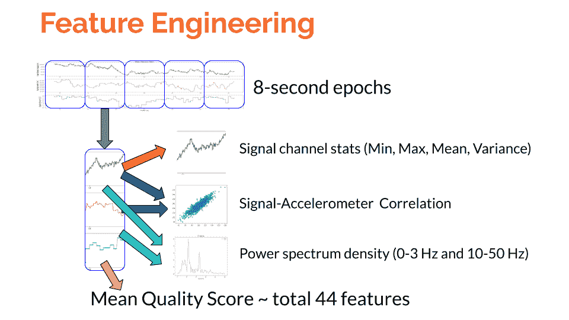
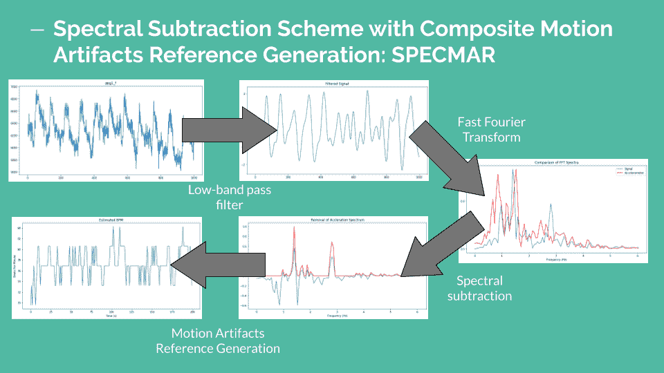

# 生物传感器数据中的异常检测和校正

> 原文：<https://towardsdatascience.com/anomaly-detection-and-correction-in-biosensor-data-a1a4c371bbb?source=collection_archive---------21----------------------->

## 机器学习|信号处理|可穿戴技术

Owen r . Bidder-Insight 健康数据科学研究员

## 目前监测血压的方法是有缺陷的

三分之一的美国成年人患有高血压，即高血压。高血压会增加心脏病发作和中风的风险，而心脏病和中风本身就是美国的主要死亡原因。仅在 2017 年，美国就有超过 50 万例死亡病例将高血压列为加重因素，美国疾病预防控制中心估计，高血压每年在医疗保健成本、处方药和因误工和病假导致的生产力损失方面给美国经济造成超过 559 亿美元的损失。不幸的是，高达 10%的患者还表现出“隐性”高血压，即在诊所通过袖带方法测量的血压明显低于患者日常生活时的血压。这种低估的后果可能是可怕的；不正确的预测或者更糟的是，完全漏诊。

显然，允许人们在诊所外监测血压的方法对于抗击这种“无声杀手”至关重要。然而，大多数当前的方法在某些方面是有缺陷的。在手术过程中，使用导管通过静脉监测血压，但这增加了感染的风险，因此几乎只在重症监护中使用。由于这个原因，它也不适合日常测量。基于袖带的血压测量是非侵入性的，因此感染的风险很小。然而，它们通常由训练有素的医疗保健专业人员在门诊期间进行管理，因此它们也不允许我们在患者的日常生活中监测他们的血压——这是我们之前确定的对捕捉隐性高血压病例至关重要的。

血压在一天中会有波动，所以看医生时的一次测量只能提供一个快照(鸣谢:omronhealthcare.com)

## PyrAmes 通过其新颖的传感器设计解决了这一问题

在我担任 Insight 数据科学项目的健康数据科学研究员期间，我有机会为一家公司提供咨询，该公司试图解决现有血压监测方法的缺陷。PyrAmes 开发了一种放置在风险上的传感器，使其成为静脉监测的非侵入性替代方法。与基于袖带的方法不同，它还可以连续监测血压，使其成为手术和长期监测患者的理想解决方案。

PyrAmes 传感器的早期原型(左)和 4 个信号通道记录的数据示例(右)。

PyrAmes 面临的一个挑战是运动可能在信号数据中产生运动伪影。该传感器依靠身体压力的微小变化来监控动脉波形，由此可以将各种指标(峰值高度、宽度、曲线下面积)校准为平均动脉压(MAP)，这是我们感兴趣的血压指标。受运动伪影影响的数据必须被识别并从分析中排除，但这意味着用户无法在体育活动中监测他们的血压。考虑到这一点，皮拉梅斯要求我考虑以下几点:

1.  开发一个简单的异常检测模型，该模型可以准确地标记低延迟的信号质量，以便可以即时执行运动伪影检测。
2.  PyrAmes 不是排除所有受运动伪影影响的数据，而是希望开发一种信号处理方法，通过这种方法可以恢复有用的信息，提供用户健康的更完整图像，并增加设备的价值。

## 开发低延迟模型

目前，PyrAmes 使用深度学习方法在后处理中执行异常检测。该模型提供了范围从-5 到+5 的分数，在任何极端的值表示良好的信号质量，接近 0 的分数表示差的信号质量。虽然深度学习模型可以提供高精度，但它们往往是计算密集型的。这使得它们不适合可穿戴设备，因为可穿戴设备可能需要将有限的硬件用于异常检测以外的任务。我开始尝试开发一个模型，可以重现这些信号质量分数，但使用一种计算量较小的方法，以便可以在运行中进行异常检测。

PyrAmes 提供的数据包括来自传感器的 4 个通道，用于检测动脉波形和一个记录三维动态运动的加速度计。加速度计应该对设备的运动非常敏感，但是不包含关于动脉波形的信息。任何重复的运动，比如运动节奏产生的运动，都会在加速度计中形成明显的信号。所提供的数据是在 660 小时的总持续时间内在 2 个不同的参与者身上的 5 次设备部署中获得的。参与者进行各种典型的活动，如走路、坐着、在电脑前工作等。传感器以 125 赫兹的频率记录(也就是每小时 450，000 条记录！)，产生超过 4 Gb 的总数据集。

## 特征工程

在异常检测中，简化建模过程的一个策略是将我们的高分辨率数据转换为定义长度的仓，称为“时期”。每个时期代表一个 8 秒的数据窗口，这个窗口在时间序列上每次下移 2 秒，这样我们的时期就重叠了。对于每个时期，我计算了分为三类的汇总统计数据；

—关于信号和加速度计通道的广泛统计数据(如最小值、最大值、方差等)。)

—每对通道的相关系数，包括信号通道对和信号与加速度计的相关性。

—两个频率范围内的功率谱密度，0 至 3 Hz 用于捕捉典型的心率节奏(通常在每分钟 60 至 180 次之间)，10 至 50 Hz 用于捕捉更高频率的噪声。

总的来说，这产生了 44 个特征，我可以用它们来为每个时期的平均质量分数(从-5 到+5)建模。

## 建模程序

对于这个任务，我选择尝试随机森林(RF)回归模型。我的基本原理是，RF 模型往往计算成本低，对过拟合具有鲁棒性，并且能够很好地处理大量的特征。最后一点是随机森林中每棵树的制作方式的产物，每棵树都使用了可用特征的随机子集。RF 还提供了相对变量重要性的便捷测量方法，让我们有更多机会进行特性选择，并进一步优化可穿戴设备的使用。

每个 8 秒的时期总共设计了 44 个特征。这些特征大致分为三类。

对于模型拟合程序，我选择排除每个部署数据 20%的分层样本进行验证。剩余的 80%进行了分层的 10 倍交叉验证。我使用这种方法是因为我想确保我们的最终模型可以推广到未来后续部署中收集的新数据。从模型拟合中排除每个部署的 20%的数据模拟了遇到新数据的过程。

## 随机森林准确检测运动伪影

我使用两个指标评估了异常检测模型，均方根误差(RMSE)和决定系数(R)。该模型在 10 倍和验证集中产生的误差很小，RMSE 分别为 0.24 和 0.52。为了验证该结果，如果我们的目标质量分数可以从-5 到+5(范围为 10)，深度学习模型(以验证集为例)给出的分数平均低 0.5 分是可以接受的。在验证集中，我们的 R 值是 0.89，表示由工程特征解释的质量分数的变化量，对于计算开销如此低的模型来说，这是一个非常积极的结果。

## 从噪声中恢复信号

因为随机森林在检测运动伪影方面表现非常好，而不是迭代模型以获得边际性能收益，所以我开始通过处理 PyrAmes 设定的下一个任务来增加项目的价值，从受运动伪影影响的数据中恢复可用的指标。为了做到这一点，我借鉴了我在学术界的经验，并从文献中寻找灵感。PyrAmes 用来计算血压的最重要的指标之一是心率。幸运的是，我能够找到 Islam 等人的一篇论文([你可以在这里阅读](https://arxiv.org/pdf/1810.06196.pdf))，其中详细介绍了一种从类似的生物传感器(PPG 的光电容积描记器)恢复心率的方法。该方法被称为具有复合运动伪影参考生成的修改的谱减法方案，或简称为 SPECMAR，对于每个历元具有以下步骤:

—使用低带通滤波器去除每个通道原始数据中的高频噪声

—对滤波后的数据进行快速傅立叶变换，然后在频域中表示每个历元

—加速度计频谱中每个频率的幅度可以通过频谱减法从信号频谱的相应频率中去除。这是根据 Islam 等人指定的重量来完成的。

—心率数据中的自相关用于执行运动伪影参考生成。这里，我们使用来自前一时段的频域中的峰值来改进所考虑的时段中的峰值场。然后，我们可以忽略任何会导致心率突变的频率。

SPECMAR 方法的简单直观总结

在 SPECMAR 的验证试验中，该方法产生的心率估计值与使用 ECG 获得的地面实况高度相关(r=0.99)，并且在 29 次不同记录中的平均绝对误差仅为 2.09 BPM。PyrAmes 提供的数据不包括来自 ECG 等来源的经过验证的基本事实，因此我无法完全验证将 SPECMAR 应用于 PyrAmes 传感器时产生的估计值。然而，该方法在 89%的测试时期产生了合理的心率估计(在 50 和 200 BPM 之间)。与以前排除任何不符合必要质量分数的数据的做法相比，这使得每个记录中可使用的数据量增加了 66%。增加可用数据量对用户有切实的影响，让他们更全面地了解自己的健康状况，增加 PyrAmes 传感器的价值。

## 未来方向

心率只是 PyrAmes 用来得出血压的指标之一。理论上，我们应该能够使用傅里叶逆变换将频域中的干净频谱转换回时域中的可用波形。不幸的是，在我分配给这个咨询项目的时间里，我无法调整这最后一步。然而，这确实为 PyrAmes 的工程师们继续研究提供了一个有用的起点。一旦这一阶段完善，他们应该能够消除信号中的所有运动伪影。一段时间以来，运动伪影一直是生物传感器行业的一个重要问题，这项技术代表了该领域技术水平的重大飞跃。

## 最后

在我与 PyrAmes 进行咨询的短暂时间里，我能够以两种重要的方式推进他们的产品开发；

首先，我能够优化他们用于可穿戴设备的异常检测算法。这允许实时的低延迟运动伪影检测，并且降低了该过程的硬件要求。降低 PyrAmes 传感器的硬件要求使他们的产品更加通用，并与目前市场上更多的可穿戴设备兼容。

其次，我能够利用最近开发的信号处理方法，从受运动伪影影响的数据中恢复心率估计值。这一过程将可用数据量增加了 66%。鉴于 PyrAmes 开发其传感器的部分动机是为其用户提供比目前不频繁的门诊更好的血压记录，开发对用户日常活动稳定的系统与他们的商业模式和他们与市场上其他生物传感器竞争的能力相关。