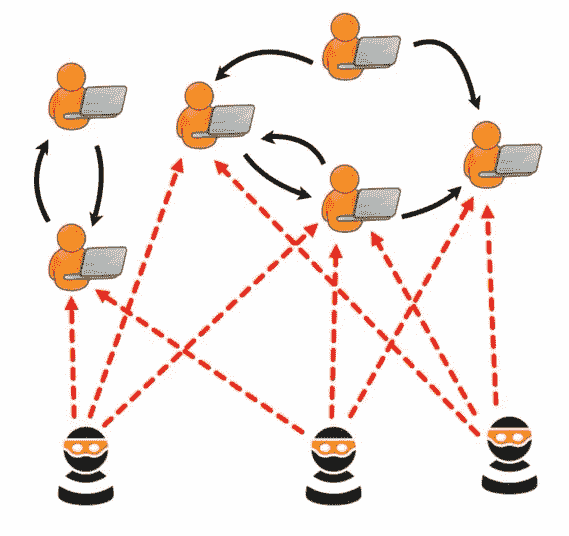
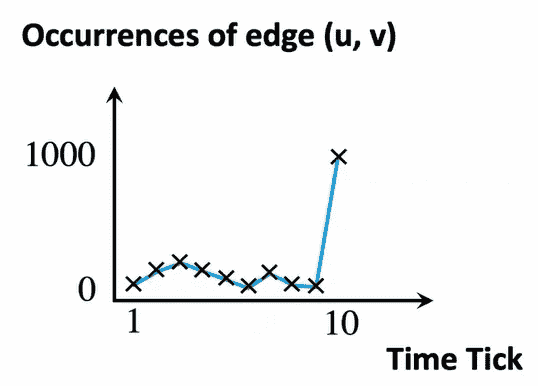
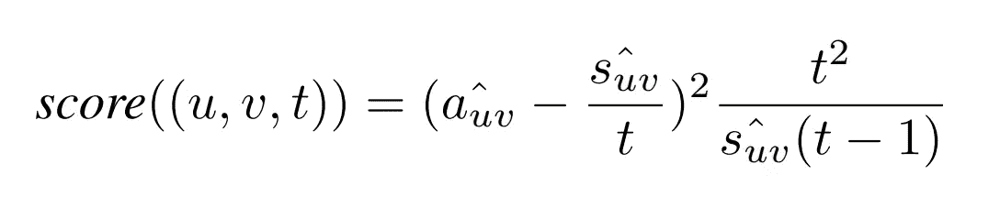
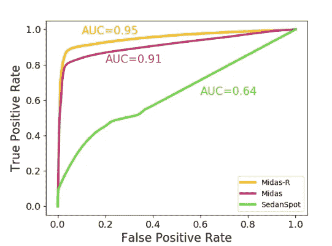
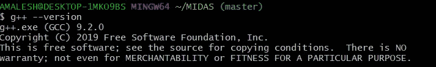
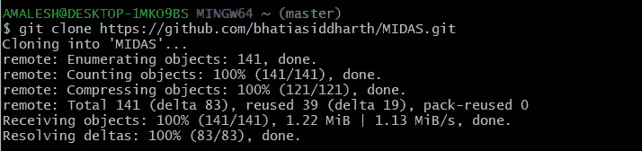
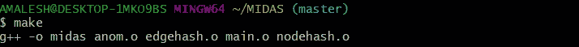
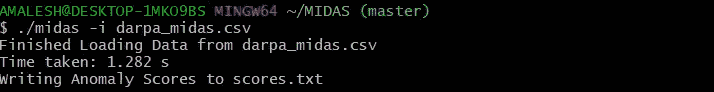
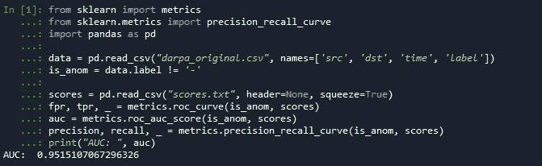

# 动态图中的异常检测

> 原文：<https://towardsdatascience.com/anomaly-detection-in-dynamic-graphs-be3ec7ff7a5c?source=collection_archive---------38----------------------->

## MIDAS:基于微簇的边缘流异常检测器

**动机:**

拒绝服务攻击(DoS 攻击)是一种网络攻击，旨在关闭网络，使其目标用户无法访问。2018 年 2 月 Github 上最近的一个重大([来源](https://www.wired.com/story/github-ddos-memcached/))。

简单的可视化展示一个 DoS 攻击- [来源](https://github.com/bhatiasiddharth/MIDAS)

在这里，我们可以看到一个异常行为，在很短的时间内在动态图中创建了突然的可疑边。

**什么是动态图？**

节点是实体的视觉表示，而边是节点之间关系的视觉表示，表示为连接它们的线。图是由节点和边组成的非线性数据结构。经过一系列更新的图称为动态图。大多数现实世界的问题都属于这一类，包括交易网络，所有的即时通讯网络，包括 twitter，脸书等等。

**问题:**

在所有这些情况下都可以发现异常行为，在本文中，我们专注于检测微集群异常，如在 DoS 攻击的情况下突然到达可疑相似边缘的组，甚至是重大事件期间的推文等。

**迈达斯:**

基于微聚类的边缘流异常检测器是一种方法

(I)检测微团簇异常，同时提供关于其假阳性概率的理论保证。

(ii)由于它是在线的，因此在恒定时间和恒定存储器中处理每个边沿，并且处理数据的速度比最先进的方法快 162-644 倍。

(iii)它提供了比最先进的方法高 42%-48%的准确性(就 AUC 而言)。

**方法:**

我们将输入一个时间演化图，证明异常分数输出到边缘。

**假设:**

假设与时间戳小于 10 相比，时间戳为 10 时有大量的边(~1000)。如下图所示。t=10 时的平均水平等于 t 的平均水平<10.

[来源](https://github.com/bhatiasiddharth/MIDAS)

考虑到这一假设，我们使用 Count-Min-Sketch 数据结构，该数据结构使用哈希函数将事件映射到频率，与哈希表不同，它使用可能发生冲突的子线性空间，这被认为是由于使用子线性空间而产生的成本，更多详细信息可在本文[中找到](https://www.comp.nus.edu.sg/~sbhatia/assets/pdf/midas.pdf)。

*   *sᵤᵥ* : *u-v* 边沿直到时间 *t*
*   *aᵤᵥ* :当前时间 *t* 时 *u-v* 边沿
*   *ŝᵤᵥ* :大致总计数
*   *âᵤᵥ* :近似电流计数

异常分数由下式给出

**快速准确:**

与最近在动态图(如 SEDANSPOT)中发现边缘流异常的方法相比，由于需要几个子过程(随机游走、采样等)，需要花费大量计算时间。对于 [DARPA 数据集](https://www.ll.mit.edu/r-d/datasets/1998-darpa-intrusion-detection-evaluation-dataset)，SEDANSPOT 的运行时间为~1.2 min，其中作为 MIDAS <的计算时间为 0.4 sec。

与 DARPA 数据集上的 SEDANSPOT 相比，MIDAS 具有更好的准确度和精密度。

DARPA 数据集的 ROC-[来源](https://github.com/bhatiasiddharth/MIDAS)

您可以通过此[链接](https://github.com/bhatiasiddharth/MIDAS)、[论文](https://www.comp.nus.edu.sg/~sbhatia/assets/pdf/midas.pdf)找到 MIDAS 的源代码。

**实施:**

**C++编译器:**

按照[链接](https://nuwen.net/mingw.html)使用 MinGW 发行版安装最新的 C++17 编译器。将默认路径 C:\MinGW\bin 添加到系统环境变量%path%中。

**Git Bash:**

添加系统环境变量路径后检查 g++版本，确保其≥ 9.2.0

使用以下命令克隆 MIDAS 存储库。

运行*使*编译并创建可执行文件。

让我们在 DARPA 数据集上运行 midas，您可以下载原始格式和使用原始格式转换的 MIDAS 格式(‘源’、‘目的地’和‘时间戳’),这些格式可以通过[链接](https://github.com/bhatiasiddharth/MIDAS)从数据集下载。

scores.txt 文件提供了每条边的异常得分，对于约 450 万个 IP 到 IP 通信，该文件在不到 1.3 秒的时间内生成。使用原始数据集中的“攻击”变量，我们可以在存储库中 auc.py 文件的帮助下找到 AUC 得分。

AUC 为~0.95！

**结论:**

Dos 攻击、检测银行交易中的异常、推特寻找一些特定事件等。现实世界中有许多问题都是时间演变图。应用这些技术来更好地了解和发现可疑活动，实时可能是一个很好的解决方案。

**参考文献:**

*   [SEDANSPOT](https://www.cs.cmu.edu/~deswaran/papers/icdm18-sedanspot.pdf)
*   西达尔特·巴蒂亚，布莱恩·胡伊，姬敏·尹，吉荣·申和克里斯特斯·法鲁索斯。" MIDAS:基于微团簇的边缘流异常检测器."2020 年 AAAI 人工智能大会(AAAI)。https://arxiv.org/abs/1911.04464
*   [CMS](https://en.wikipedia.org/wiki/Count%E2%80%93min_sketch)