# 基于 MIDAS 的动态图异常检测

> 原文：<https://towardsdatascience.com/anomaly-detection-in-dynamic-graphs-using-midas-e4f8d0b1db45?source=collection_archive---------21----------------------->

## 一种有趣的网络安全建模方法

随着网络攻击范围的不断扩大，网络安全研究近年来变得至关重要。从遗传算法到深度学习的各种想法已经被用来识别可能的攻击场景，并通知网络管理员。

在这些方法的花哨细节下，大多数都有一个相似的核心思想:注意到*怪异* *模式*。作为一个密切观察网络的人，凭直觉您会对来自某些地理位置的请求的突然增加或网络流量的突然捕获/重新路由感到忧虑。

从技术上讲，这些*怪异图案*被称为**异常、**不寻常的东西。在识别可能的攻击时，这些是最明显的要点。

异常检测对于研究人员和工业家来说都是一个重要的问题。在本文中，我将重点介绍如何使用图表来识别这种模式。我们需要做的就是使用这些数学结构对整个网络流量(是的，您当前连接的局域网或 WiFi)进行建模。

*一些帮助您入门的链接:*

1.  一篇关于 MIDAS 应用和实现细节的有趣的 TDS 文章:[https://towards data science . com/controlling-fake-news-using-graphs-and-statistics-31ed 116 a 986 f](/controlling-fake-news-using-graphs-and-statistics-31ed116a986f)
2.  源代码:[https://github.com/bhatiasiddharth/MIDAS](https://github.com/bhatiasiddharth/MIDAS)
3.  西达尔特·巴蒂亚，布莱恩·胡伊，姬敏·尹，申基贞和克里斯特斯·法鲁索斯。" MIDAS:基于微团簇的边缘流异常检测器."2020 年 AAAI 人工智能大会(AAAI)。[https://arxiv.org/abs/1911.04464](https://arxiv.org/abs/1911.04464)

# 那么我们如何用图来建模网络呢？

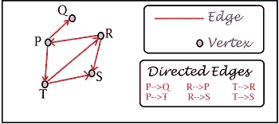

图是一种简单的数学结构:它有几个点，称为节点或顶点，以及一些连接它们的线，称为边。逻辑上，*边代表顶点之间的某种关系。*

我们可以利用这个抽象的定义。

要将问题建模为图形，您可以将某些实体标识为顶点，然后在它们之间绘制边来表示某些关系。

> 在我们的例子中，我们将计算机节点(如笔记本电脑、台式机等计算机设备)建模为图的**顶点**，并将它们之间的连接建模为**边。**

因此，上图可以理解为:

1.  网络中的 5 台计算机设备:P、Q、R、S、T
2.  上图是一个有向图。这意味着对于每条边，我们定义一个源顶点和一个目的顶点；例如，考虑有向边 P → Q，这意味着从顶点(或者在我们的情况下，计算机设备 P)到另一个顶点(也称为计算机设备 Q)的有向边。

我们现在得到了模拟我们网络的完美材料。假设我们创建一个由特定网络中的所有节点组成的有向图，每当一个节点试图与另一个节点建立连接时，我们就连接一条有向边。基于这些连接/边缘中已建立的模式，可能会注意到一些*奇怪的模式*和异常。

# 但是网络不是很动态吗？他们不经常改变吗？

是的，他们是。这是任何网络模型都面临的一个大问题。

您一定见过任何设备都有可能在几秒钟内上线。到目前为止一切顺利。现在，想象一下在一个巨大的人口统计区域中同样的事情——几个设备正在进入，其他几个正在进行。我说的进出，并不是指你*简单地*走进一个网络。有很多事情正在进行，其中最重要的也是理解*子网*的一个很好的起点是网络上每个节点的*动态* *IP 配置*。而且，人们总是在发送文件、图像、视频、文本、HTTP 请求等等；服务器通常发现很难处理过多的流量。

除此之外，了解以下这一点是很有用的:*您的节点/计算机和另一个(比如说服务器)之间的一个*连接使用一个非常常见的协议——TCP——可能来回需要多达 3-4 个事务才能*成功地*传递一个信息单元(称为*数据包*)。你通常在几分钟内发送和接收数千个数据包。成千上万的人在和你完全相同的时刻做着完全相同的事情。

如果你深入思考，所有这些意味着一件事:

> 互联网是一个非常繁忙的地方。一个遍布全球的虚拟网络。而且很容易藏在那里。

# 那么这对异常检测意味着什么呢？

意味着变得强硬。在如此密集的网络动态中，你可以想象在数百个顶点上会有多少条边(最初是数千条)。那么，我们实际上如何开始触及问题的表面呢？

这就是迈达斯的用武之地。它建立在它的前辈(其细节超出了本文的范围)的基础上，在某种意义上，它通过考虑网络的*时间性质*和通过考虑微簇而不是单个边缘*来执行检测。*

## MIDAS-R(MIDAS 的近似变体)考虑了网络的时间特性

到现在为止，你一定已经对计算机网络强烈的动态特性有了一个概念——它们变化的速度和规模。

使用使用*静态图的异常检测技术，*我们立即看到一个问题:*没有时间关系*(时间=时间，或者网络如何随时间演变)。让我们更详细地探讨一下这个问题。

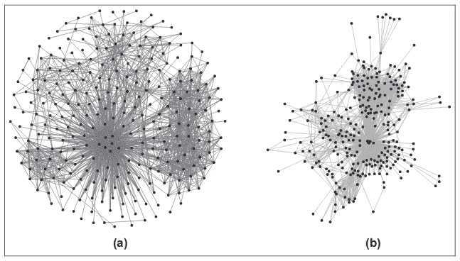

仅用于演示目的。来源:[https://towards data science . com/large-graph-visualization-tools-and-approach-2b 8758 a1 CD 59](/large-graph-visualization-tools-and-approaches-2b8758a1cd59)

仔细看上面的图表。考虑一个你正在观察的网络。现在看起来*像图(b)中的*。一小时后，看起来像(a)。有哪些异常？如何判断是否有人攻击？

使用**静态图，**您可以在特定的时间间隔拍摄网络配置的快照。你看到的图形就像独立的现存实体。

很直观的，这个方法没有意义。为什么？因为网络配置*不是独立存在的。(a)中发生的每件事都与过去某个时候发生的事情有某种联系，就像(b)中一样。这就是*时间特征的全部概念。*这就是使用**动态图**的 MIDAS(和其他类似算法)所做的。他们会问以下问题:*

> 当前的情景与过去有什么联系？什么变了，什么没变？

从你开始问这些问题的那一刻起，你就意识到了与网络过去配置的重要联系——你可以利用这一点更好地发现一些奇怪的模式并得到提醒。

## MIDAS 考虑微团簇(这是它的一个新颖特征)

考虑一种非常流行的网络攻击:DoS(或另一种变种 DDoS)。虽然细节不在讨论范围之内，但是这些攻击非常粗略地向服务器加载了如此多的请求，以至于服务器不可用于来自真正客户端的真正请求，实际上使整个系统崩溃。

如果我们试图用我们的*动态有向图、*来对此建模，我们会期望什么呢？

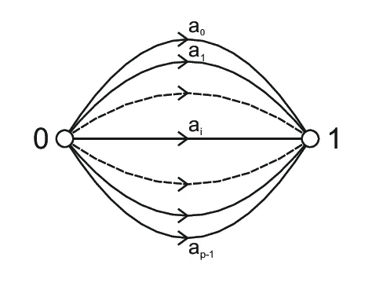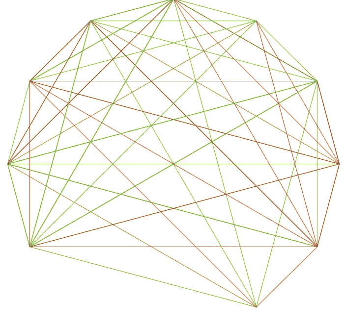

左 iamge 来源:[https://www . research gate . net/publication/301453477 _ Dynamic _ Graph _ Visualization _ with _ Multiple _ Visual _ anatomies/figures？lo = 1](https://www.researchgate.net/publication/301453477_Dynamic_Graph_Visualization_with_Multiple_Visual_Metaphors/figures?lo=1)；右图来源:[https://www . research gate . net/publication/277649495 _ A _ class ification _ of _ pentagent _ arc-transitive _ bicirculants/figures？lo=1](https://www.researchgate.net/publication/277649495_A_classification_of_pentavalent_arc-transitive_bicirculants/figures?lo=1)

观察到了什么？

让我们首先考虑第二幅图像，所有点(被认为是节点)正在接收来自不同节点的几条边。然而，在第一幅图像中，由 *1* 标记的节点正在从单个节点 *0 接收几条边。*

早期的算法没有区分这些。但是迈达斯问了一个有趣的问题:

> 为什么两个相似的节点之间有这么多平行的边？

我们的网络模型中的并行节点意味着一台计算机正在向另一台计算机发送几个独立的请求。说 *1* 是服务器， *0* 是运行浏览器的家用电脑。这个浏览器可能会同时请求几个东西:一个 YouTube 视频、一篇维基百科文章、一篇媒体文章、一篇关于数据科学的文章，以及其他几个东西。这仍然是对实际发生的事情过于简单化。事实上，你在浏览器中输入的每个 URL 都会被映射到分布在世界各地的不同服务器上。不要把来自一个浏览器的所有请求都发送到一个服务器。但是为了理解，我们假设他们真的做了。

到目前为止一切顺利。现在，如果并行请求的数量开始攀升，该怎么办呢？如下图所示:

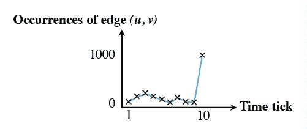

资料来源:迈达斯文件原件

作者的上图说明了这一点。在一段时间的正常活动之后，两个节点之间会突然爆发活动。回想一下我们关于图的时间特性的讨论:*现在发生的事情也取决于过去。*在这里，过去有大约 100–200 个连接，突然计数上升到大约 1000。

> 迈达斯说，在这种情况下，可能会出问题。仔细检查这个。

这是 ***微簇检测的整个核心:*** 在用于监控异常的几个参数中，包括监控*突然出现的活动突发，这些突发共享在图形表示(空间局部性)* *意义上邻近的几个节点或边* ***。这是迈达斯非常强大的原因。***

# MIDAS 与现有解决方案相比如何？

MIDAS(或 MIDAS-R)的性能优于现有的解决方案/算法。作者报道的一些有趣的亮点包括:

## 假阳性概率的理论保证

我将把详细的讨论留在本文范围之外。粗略地说，作者表明 MIDAS (MIDAS-R)可以给出二元决策(异常是否存在),最高可达*用户定义的* *阈值* ε *。*因此，根据你是否希望将 10%或 1%作为**误报的最大概率，** MIDAS 可以处理它。

*注意:*假阳性意味着算法将某个事件检测为*假阳性，*即事件是阴性，但算法却说是阳性。在目前的情况下，这将意味着没有异常，但迈达斯说有。这只是通过设置一个*高概率而应用的额外一层谨慎。*你可能更愿意检查一个正常的事件，而不是让一个异常事件溜走(由于概率太低)。

然而，这并不总是令人满意的，这在很大程度上取决于用例。考虑一种检测癌症肿瘤的算法。你希望门槛高吗？这意味着几个没有患癌症的人被报道患有癌症。另一方面，过低的阈值意味着一些癌症患者可能会逃避检测。这两种情况都是危险的；因此，选择阈值是基于问题用例的经验决策。

## 恒定存储和更新时间

考虑一个典型网络的可能场景:

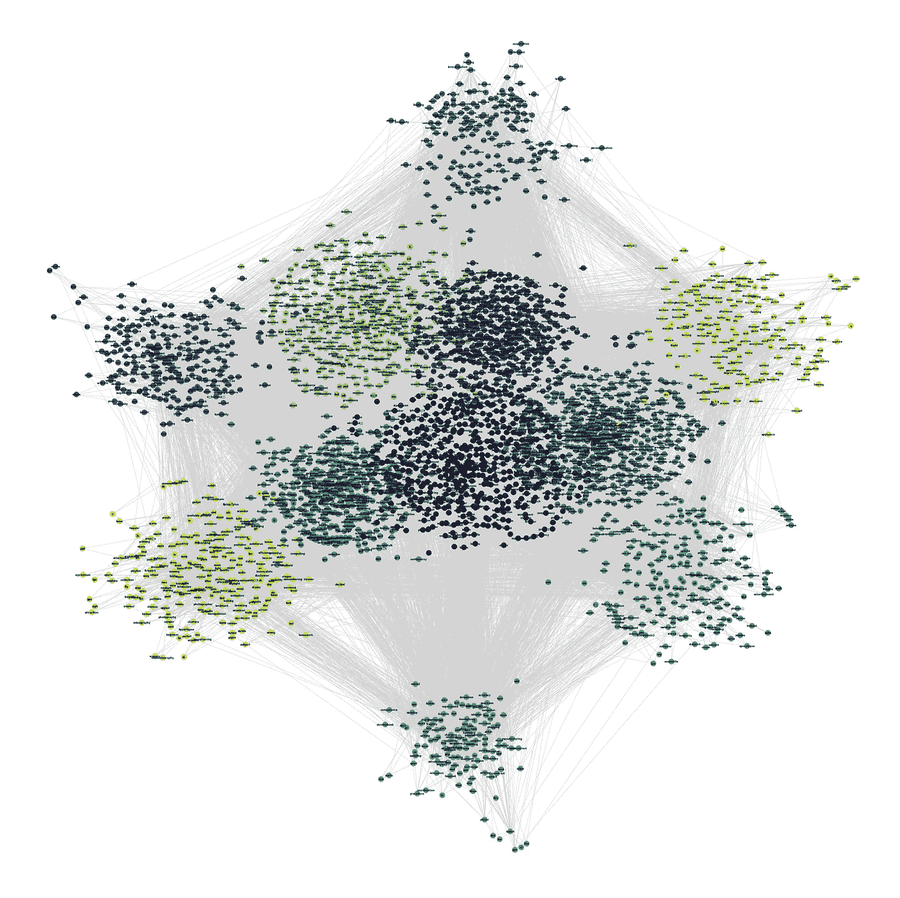

来源:[https://towards data science . com/getting-started-with-graph-analysis-in-python-pandas-and-networkx-5e 2d 2 f 82 f 18 e](/getting-started-with-graph-analysis-in-python-with-pandas-and-networkx-5e2d2f82f18e)

真正的网络要比这密集得多。问题出现了:

> 你把这么大的一个网络模型存储在哪里？

为了理解更多困扰我们的内存和时间复杂性问题，举一个例子:

> 找出所有小于给定数 n 的质数？

一个非常简单的算法:

1.  取任何小于 n 的数。
2.  检查 *q* 是否为质数。(这本身是在步骤 3 之后详述的算法)
3.  重复直到 *q* 到达 *n-1*

(步骤 2 展开)检查 *q* 是否质数:

1.  考虑所有比 *q.* 小的数字 *p*
2.  *p* 除以 *q 吗？* *是*:增加某个计数器。*否*:重复。
3.  在最末端(当 *p* 到达 *q-1* 时)，查看计数器是否为 2(意味着有 2 个因子:1 和数字本身)。*是*:数字是质数。*否*:不是质数。

一个糟糕的算法，但它做到了。你现在对问题有感觉了:先把 *n:* 增加到几十，再增加到几千，再增加到几万；你将开始看到时差。

粗略地说，我们认为**时间和空间复杂性**是这样的，当输入大小增加时，时间和空间需求都增加很多，以至于在某个限制之后解决问题是不可行的。

将此移植到我们的网络图问题中，MIDAS 面临着将几千台计算机表示为节点/顶点和几万条边的挑战。你可以查找图的标准表示法(邻接表、矩阵等)。)，你马上就会看到问题。与素数算法一样，在这种表示中，随着节点和它们之间的连接的数量增加，用于存储的空间需求和用于执行算法的时间需求急剧增加。

作者使用一种不常见的数据结构解决了这个问题:计数最小草图(CMS)。细节不在讨论范围内，但这消除了上述问题。

## 迈达斯(MIDAS-R)简直更好

引用作者所做实验的一些结果:

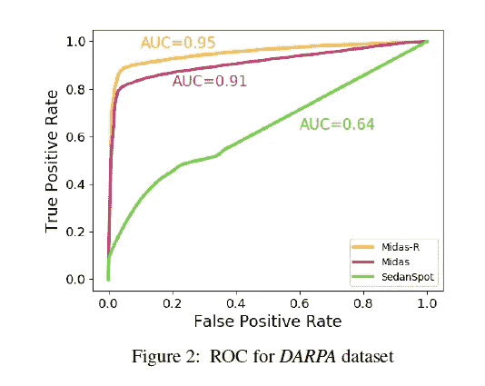

MIDAS 和 MIDAS-R 得分高于基准。资料来源:迈达斯文件原件。

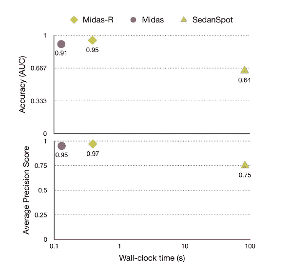

实验证明，MIDAS 和 MIDAS-R 比基准测试更准确、更精确。资料来源:迈达斯文件原件

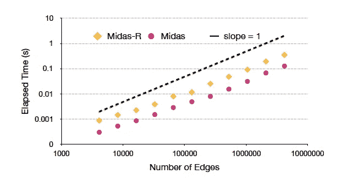

随着图形越来越密集，线性时间和空间关系。资料来源:迈达斯文件原件

# 结论

我认为基于微聚类，包括时间和空间局部性，动态图上的异常检测将会有很长的路要走，并在不久的将来找到有趣的应用。作为一个整体，作者对重要的安全事件检测进行了基准测试，并发现了以下内容:

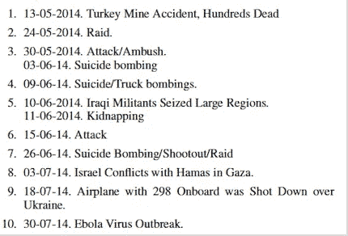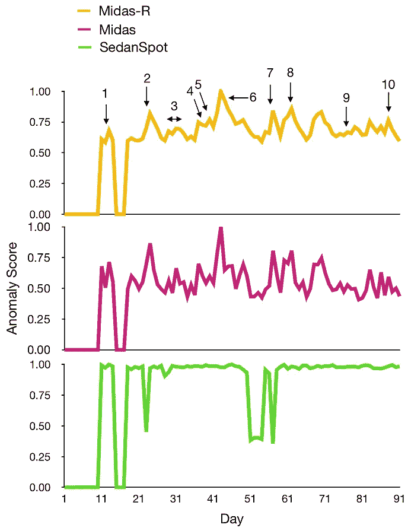

MIDAS 捕捉重要事件，就像之前建立的基准一样。资料来源:迈达斯文件原件

在未来的几年里，我们将会看到越来越多的研究致力于开发越来越干净和新颖的异常检测方法，并继续在其他领域实现对*怪异模式*的搜索。