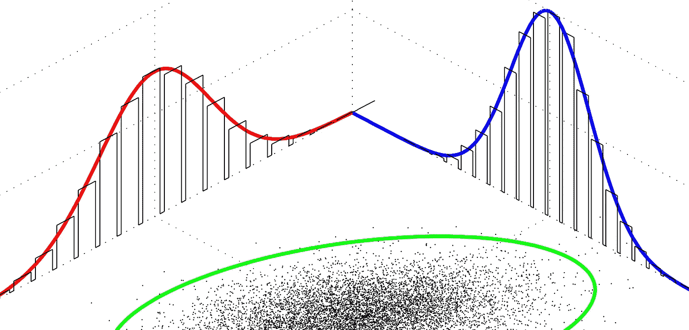
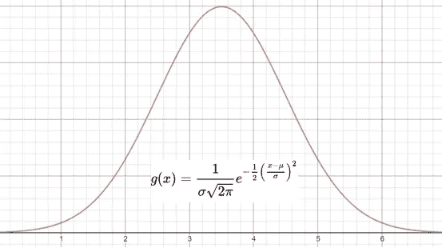
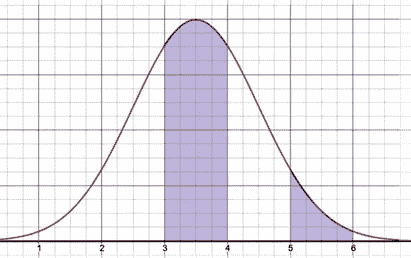

# 监控系统中的异常检测(上)

> 原文：<https://towardsdatascience.com/anomaly-detection-in-monitored-systems-part-1-a6080da61c75?source=collection_archive---------49----------------------->

## 了解高斯分布及其属性如何帮助我们对监控数据执行异常检测。

监控系统中的异常检测(图片来自[维基媒体](https://upload.wikimedia.org/)

自上世纪中叶第一台计算机问世以来，监控解决方案就一直存在，并且一直试图回答一个简单的问题:“我的计算机内部发生了什么？”。就像老师可能要求学生解释他的思维过程一样，我们也想了解我们程序的内部运作。如果我们找出了它运行时的问题所在，我们就可以获得更好的见解，帮助我们纠正它的行为。

回答这个问题最简单的方法可能是将数据写入任何标准输出，比如计算机屏幕或日志文件。在预定义的时间间隔或在程序执行到某个点时进行定期日志记录，可以让我们将它的状态与我们预期的结果进行比较。如果输出与我们预期的不匹配，我们可以修改代码来纠正这种情况。

这些年来，计算机沿着许多不同的道路发展。你可能在一部老电影里看到的笨重的电脑，已经被笔记本电脑、手机、物联网设备、网络系统、工业电脑，你能想到的都有了；这些系统，从现在开始我将称之为“设备”，通常有许多我们不能监控给定设备内部的应用。由于我们仍然希望监控它们的行为，以验证它们是否按预期运行，因此我们需要找到一种新的方法，仅基于输出就能给出可靠的结果。

最初的方法是为特定设备编写定制的监控解决方案。例如，如果我们有一个组件向我们发送一栋办公楼的功耗，我们可以用给定的指令集编写一个程序来监控该设备的输出值。虽然这种解决方案首次出现时被认为是一种好的方法，但它们有两个主要缺点。第一个是我们必须在编写程序时知道程序允许的操作参数，而在很多情况下我们并不知道。第二个缺点是，即使我们知道这些参数，我们也需要编写一个定制的算法，其中包含一组固定的指令，用于检查设备的输出是否在允许的工作参数范围内。

除非您是专业的电工或工程师，否则您必须长时间监控您的设备，经历许多电源故障、电涌和短缺，然后才能区分正常功耗和异常功耗。即使这样，你的知识也只对一个用电范围的办公楼有用。

我们能克服这两个缺点吗？答案是肯定的，这就是事情变得有趣的地方:一种称为“**多元分布**的测量方法可以帮助我们推广我们的监控解决方案，只需要很少的数据来进行初始预测，并且可以在我们编写算法时无需指定任何阈值的情况下检测异常。

那么多元分布是什么呢？让我们从本文中的“分布”部分开始，然后在第二篇文章中学习如何使用它，并在最后一篇文章中解释“多元”部分。如果你在阅读方程时感到自信，并且了解基本统计学，你可以[安全地跳到下一篇文章。](https://medium.com/@yonatanalon/anomaly-detection-in-monitored-systems-part-2-c2108c143a6)

在统计学中，分布向我们展示了我们的数据可以取的所有可能的值，以及落入给定范围内的任何额外样本的概率。为了使事情变得简单，并且因为我不想太深入问题背后的数学，我将假设我们的数据是“**正态分布**”。如果你学习统计学，你应该知道它的意思，但是对于那些不知道它的人来说，知道正态分布给我们一些关于我们监控的输出的有用属性就足够了。

如果我们将被监控设备的输出视为数字(从现在开始我将称之为“数据”)，并假设它是正态分布的，我们就可以开始对它们进行预测。如果你从高中就不记得什么函数了，知道函数会根据我们给它的数字返回给我们数字就够了。正态分布的数据可以用一个叫做**高斯函数**的函数来描述。它有一个比你的标准高中函数稍微复杂一点的公式，但是如果你曾经看过为智商测试展示的著名的“钟形曲线”，它们是完全相同的函数。

带有高斯函数公式的钟形曲线(i *作者图片)*

这个函数具体描述了什么？原来它描述了很多东西。其中第一个叫做“**概率**”。概率告诉我们数据中的随机数有给定值的机会。结果是任何给定值的概率都是零，但是高斯函数可以告诉我们一个数在两个值之间的概率。

钟形曲线下方的较大区域表示获得该范围内的值的可能性较高(I*image by author)*

它通过计算曲线下的面积来实现，由这两个值来界定。在上面的例子中，由数字 3 和 4 限定的区域大于由数字 5 和 6 限定的区域。这意味着，如果我们从数据中测量一个随机数，并将其称为 x，那么 x 在 3 和 4 之间的概率比在 5 和 6 之间的概率更高。我们将这个概率表示为 **p(x)** 。

出现的第二个问题是关于高斯函数公式中的许多符号:它们是什么意思？除了数学运算，公式中我们还有四个字母: **e** 、 **π** 、 **μ** 、 **σ** 。前两个是众所周知的常数值，在数学中有许多应用。e 大约等于 2.71828，而π大约是 3.14159。可能需要解释的是后两种情况。

数学家们有一个奇怪的习惯，他们从英语术语中抽取第一个字母，并用发音相同的希腊字母来表示它们。这使得希腊字母μ (Mu)成为表示英语单词“**意思是**”的标准符号。如果我们用一个字母和一个数字的组合来标记数据中的每个输出，我们可以得到如下所示的一系列值:x1，x2，x3 …等等。我们对这个系列的一个衡量标准是平均值，它给出了我们收到的所有值的平均值:

平均值方程

其中 **n** 是我们已经测量平均值的值的数量。写这个公式的一种更简洁的方式是使用“适马符号”。希腊字母**σ**(大写适马)标记多个元素的总和。如果我们想对 x 的所有值求和，我们可以写

适马记谱法对斯佩德记谱法

这意味着我们迭代 1 到 n 之间的所有值；用 I 标记当前迭代的值，我们取 x 的第 I 个值，并把它加到所有先前求和的值上。我们现在可以用适马符号来定义我们均值:

平均值方程，使用西格玛符号

第二个值称为“**标准偏差**”，描述 x 的不同值偏离平均值的程度。标准差用希腊字母σ(小写适马)标记，其公式如下:

标准偏差方程，无贝塞尔校正

现在，我们可以将这四个值结合起来，得出高斯函数的等式:

高斯函数 g(x)，表示具有均值μ和标准差σ的正态分布

高斯函数还有另外两个简单的特性:它取的最大值等于我们数据的平均值，曲线的高度和宽度与标准偏差成比例。这在下图中可以清楚地看到:紫色曲线的标准差是红色曲线的两倍，但它们的均值相同。

这两个高斯函数具有相同的平均值，但是不同的标准偏差(i *作者的图片)*

这让我们对 x 可以取的值有了几何上的了解:给定范围的值越接近我们数据的平均值，x 包含在该范围内的概率就越高。如果该值离我们数据的平均值太远，我们可以将其归类为异常。

看看你是否能找出这个图中的问题。提示:单值的概率是多少？(作者本人*法师)*

**简单回顾一下，我们已经了解到:**

我们希望检测受监控系统中的异常，但这并不总是那么简单

通过将输出视为数据并查看其分布，可以检测出输出中的异常

我们数据中的均值、标准差和概率代表什么

高斯函数有很多有趣的特性，可以用来检测异常。

这都是在此期间。在下一篇文章中，我们将讨论如何在实践中使用高斯函数来检测异常，并实现一个简单的程序来做到这一点。

该系列的第二部分现已准备就绪:

[https://medium . com/@ yonatanalon/anomaly-detection-in-monitored-systems-part-2-c 2108 c143 a6](https://medium.com/@yonatanalon/anomaly-detection-in-monitored-systems-part-2-c2108c143a6)