# 监控系统中的异常检测(下)

> 原文：<https://towardsdatascience.com/anomaly-detection-in-monitored-systems-part-2-c2108c143a6?source=collection_archive---------53----------------------->

## 了解高斯分布及其属性如何帮助我们对监控数据执行异常检测。

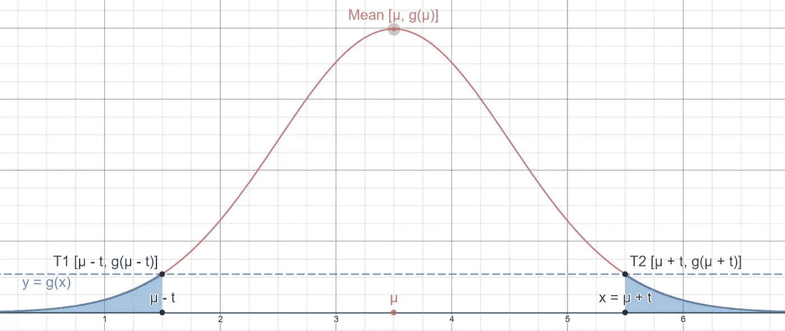

使用高斯分布进行异常检测(图片由作者提供)

在本系列的第一篇文章中，我们讨论了高斯函数的属性以及如何使用它们来检测监控数据中的异常。在这一部分中，我们将把这些知识付诸实践，并构建我们自己的异常检测程序。

概括地说，我们用上图中的高斯函数完成了上一篇文章，其中两点标记了给定数据样本 x 可能取的不同值。然后我们说明 x 离平均值越远，它代表异常的概率就越高。

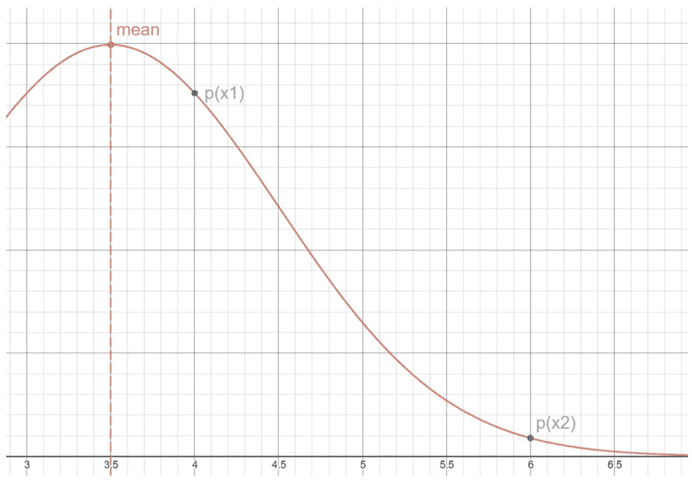

绘制在高斯函数 g(x)上的两点 p(x1)和 p(x2)(图片由作者提供)

该语句中唯一的问题是，获得任何单个值的概率恰好为零。这是为什么呢？原来高斯函数是一组函数中的一员，这组函数被称为“**概率密度函数**，简称 PDF。无需深究 pdf 背后的数学，理解它们给我们一个“**连续随机变量**在给定的“**范围”**内产生一个值的概率就足够了。

现在让我们来解释一下:范围就是两个数字之间的长度，用两个数字相减来表示。两点 a 和 b 之间的距离的常用符号是(a，b)。在下列情况下，数字 x 被认为是“在”一个范围内

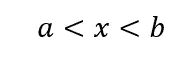

随机变量是我们输出数据的正式术语。虽然我们将每个值视为单个数据点，但是当我们查看我们的输出随着时间推移所取的所有值时，我们可以将我们的输出视为一个整体，就像一个随机变量一样。我们要做一个小的捷径——我们要假设，对于给定的输出取值范围，没有一个值是不可能出现的。这种能够取任何可能值的性质，我们称之为“连续的”。因此，表现出这种性质的随机变量称为连续随机变量。标准符号是大写的 x。

回到 PDF 和高斯函数，它们表达概率的方式是计算给定范围内曲线下的面积。这种面积的计算是用积分来完成的。如果你有微积分背景，那么你就知道积分和面积的联系。对于那些不熟悉微积分的人来说，把它们当作工具就足够了，它允许我们计算给定范围内函数所限定的面积。

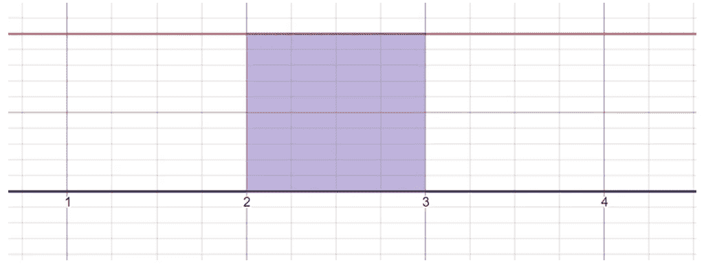

使用经典几何计算图形下的面积(图片由作者提供)

通过检查一个常数直线函数，例如 f(x) = 1(上面用红色标出)，您仍然可以深入了解曲线下的区域。我们可以用两种不同的方法计算函数下面的面积:使用积分和使用矩形面积公式。首先，我们计算矩形的高度和宽度:我们可以看到底边是范围(2，3)，我们通过减去左边的右点来获得它的长度。这样我们得到 3–2 = 1，这使得矩形的宽度正好为 1。

接下来，我们将计算矩形左边缘的长度。如果你不知道如何去做，看看这个关于测量距离的维基百科页面。因为我希望你知道如何做到这一点，如果你一直在阅读我到这一点，你可以很容易地验证左边缘的长度(代表高度)也等于 1。

通过使用矩形的面积公式，我们可以计算出它的表面积:

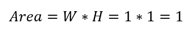

矩形区域，按宽度和高度

这给了我们一个关于测量由函数限定的面积的几何观点。即，在对应于矩形宽度的范围和它的表面积之间存在关系。事实证明，这种关系对每个函数都成立，这就给我们带来了以下问题:如果我们将值域的定义扩展到单点 x，我们可以说任何点都是形状(x，x)的值域。这个范围的长度是用同样的方法得到的——从左边减去右边的点。这使得长度 x - x = 0。

但是由于矩形的宽度是该范围的长度，我们将得到 W = 0。将新值代入面积公式，我们现在得到:

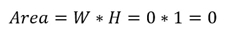

矩形区域，按宽度和高度

这就是为什么 p(x)对于任何给定值都是零。如果是这种情况，我们如何使用随机变量 X 的属性来执行异常检测呢？事实证明这比听起来简单，我们将再次使用我们的几何直觉。

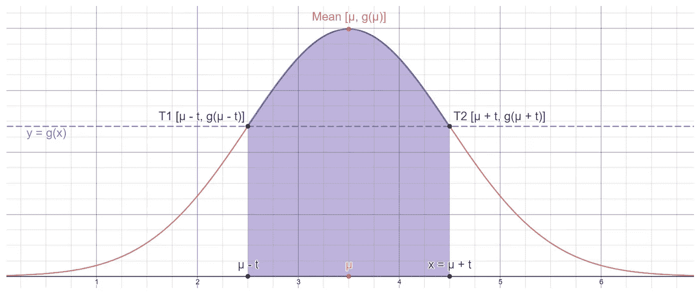

给定值 X 在点 T1 和 T2 之间的概率(图片由作者提供)

对于任何给定值 x，我们计算范围(μ，x)的长度，并用常数 t 标记该长度。然后，我们使用以下公式选择两个值 T1 和 T2:

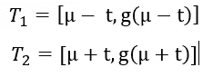

其中 g 表示高斯函数。事实证明高斯函数有一个很好的性质，它是一个关于均值的对称函数。即对于 x 的每一个值，g(μ - x) = g(μ + x)。因为每两个点只有一条剖切它们的线，所以 g(x)对称的事实意味着通过 T1 和 T2 的线垂直于 x 轴。

高斯函数的另一个特性是，当不受 x 轴限制时，曲线下的面积等于 1。这可以用积分表示为:

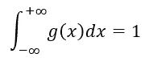

表示高斯函数下方面积的无界积分

这意味着，如果我们计算由范围(T1，T2)界定的面积，我们可以通过从 1:

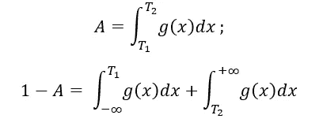

概率 p(x) w.r.t. μ和σ的表示

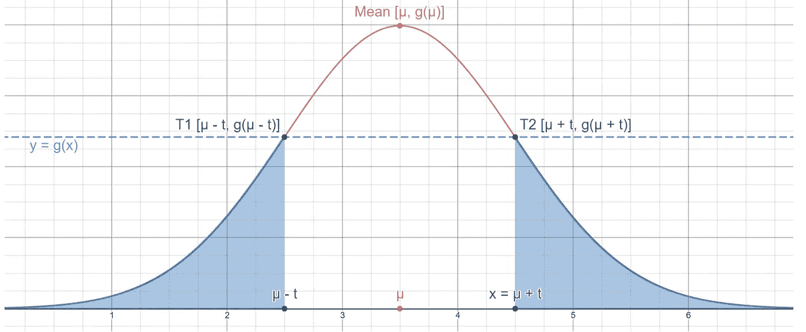

使用高斯函数下方的区域可视化我们的概率(图片由作者提供)

这些结果在几何上意味着什么？请记住，这里的关键参数是我们用 t 表示的长度:x 离平均值越远，范围 t 就变得越长。t 的尺寸每增加一点，T1 和 T2 之间的面积 A 就相应增加一点。A 的增加自然意味着 1-A 值的减少，这被视为钟形曲线边缘下面的蓝色“尾部”。

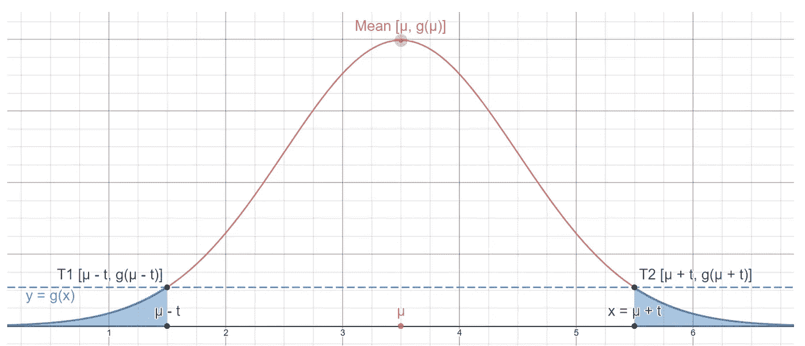

在这个图中，x 比前面的图离μ更远；代表该概率的区域确实更小(图片由作者提供)

现在我们已经有了结果，我们需要决定的是一个给定的值 x 需要异常到什么程度，我们才能把它归类为异常。这个值完全取决于您和您试图监控的设备的域。常见的值可能是 0.1%，1%，5%，但当然，你可以选择最适合你的值。

**简单回顾一下，我们已经了解到:**

随机变量是一种统计上表示我们输出数据的方式。

概率密度函数和高斯函数一样，给出了我们的随机变量在一个范围内产生值的概率。

高斯传递这种概率的方式是通过其曲线下的表面积，以目标范围为界。

这个系列的第三部分已经准备好了:

[https://medium . com/@ yonatanalon/anomaly-detection-in-monitored-systems-part-3-52c 172 CFA 589](https://medium.com/@yonatanalon/anomaly-detection-in-monitored-systems-part-3-52c172cfa589)

**python 中的代码示例**(版本 3.8.3):

使用高斯分布的单变量异常检测—源代码