# 监控系统中的异常检测(第三部分)

> 原文：<https://towardsdatascience.com/anomaly-detection-in-monitored-systems-part-3-52c172cfa589?source=collection_archive---------45----------------------->

## 了解高斯分布及其属性如何帮助我们对监控数据执行异常检测。

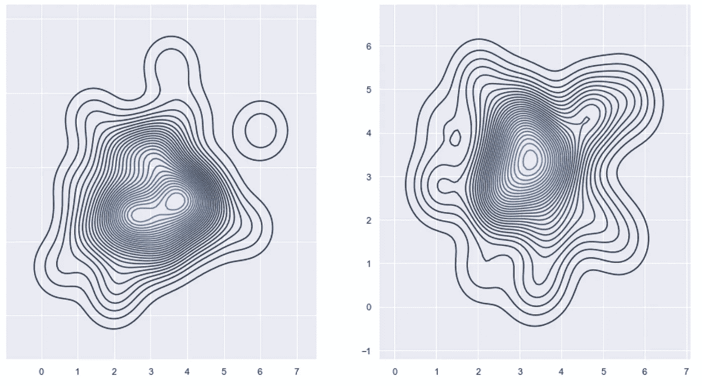

检测高维数据中的异常(图片由作者提供)

在本系列的第二篇文章中，我们学习了更多关于高斯函数的知识，然后我们使用它的属性构建了一个工作异常检测系统。在这最后一部分中，我们将处理多变量的情况，正如在本系列的第 1 部分中所承诺的。与第 1 和第 2 部分不同，第 1 和第 2 部分不需要任何先前的知识，本文将需要至少线性代数的基础知识(特别是使用向量和矩阵)。

那么到底什么是多元分布呢？“多元”部分将一个维度中的分布推广到任意有限个维度。这使得多元分布在建模与给定设备的许多监控参数相关的数据时非常有用。我们将我们的定义扩展到更高维度的方法是通过一个叫做“**随机向量**”的东西。如果 Xk 是每个 1≤k≤n 的随机变量，则向量 X = (X1，X2，…，Xn)称为随机向量。除了上述性质外，如果随机变量的任何线性组合也是正态分布的随机变量，则认为随机向量是正态分布的。

我们如何解读这些读数，从而对受监控设备的异常行为进行分类？最简单的方法也许是将随机变量相乘。因为随机变量随着时间监控输出，所以我们可以将随机变量视为向量，其值只是给定字段中的普通数字。然后，我们可以将它们按元素相乘，得到所谓的乘积分布:

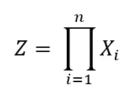

z 是随机向量 X 中所有随机变量的乘积分布

我们可以建立产品分布的平均值和标准偏差，并使用它们来计算样本相对于产品分布 Z 异常的概率:每当我们从被监控设备读取一组新值时，我们就构造一个向量 z = (z1，z2，…，zn)，其中 zi 表示第 I 个被监控参数的最新值。然后，我们通过将独立值相乘来计算 z 成为异常的概率:

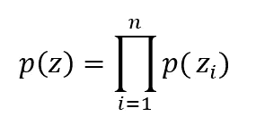

读取样本向量 z 的概率是读取其各个分量的概率的乘积

使用乘积分布的主要好处是，计算数字之间的乘积是执行成本最低的计算之一。但是使用产品分销也有几个缺点。想到的两个这样的缺点是，不能保证 Z 将是正态分布的，并且 Z 可能无法捕捉某些类型的异常。

来自监控计算机网络中的防火墙的示例数据。注意异常的红色 X(图片由作者提供)

假设我们正在监控一个计算机网络，并且正在从我们的一个防火墙收集数据。我们对这个防火墙的两个操作参数感兴趣:并发连接数和每秒传输的千字节数。我们开始监控防火墙，并将 X1 指定为连接的用户数量，将 X2 指定为传输的 kb/s 数量。

经过一段时间后，我们得到一个读数 z = (z1，z2 ),并在上图中将其标为红色的“X”标记。当我们查看图表时，我们可以清楚地看到 z 是一个异常值——它被绘制在远离主要读数“簇”的地方。但是如果我们沿着红色的虚线，我们发现 z 是一个正常的读数:z1 非常接近连接用户的平均读数，z2 也接近传输的 kb/s 的平均值。因此，如果我们将 p(z1)*p(z2)相乘来检查异常，结果将显示 z 不是异常。

但事实证明，我们可以使用另一种统计方法，它也可以捕捉我们数据中的这些异常。这种方法使用所谓的多元高斯分布，它是一维高斯函数的多维抽象。

在解释其含义之前，让我们先来看看这个公式:

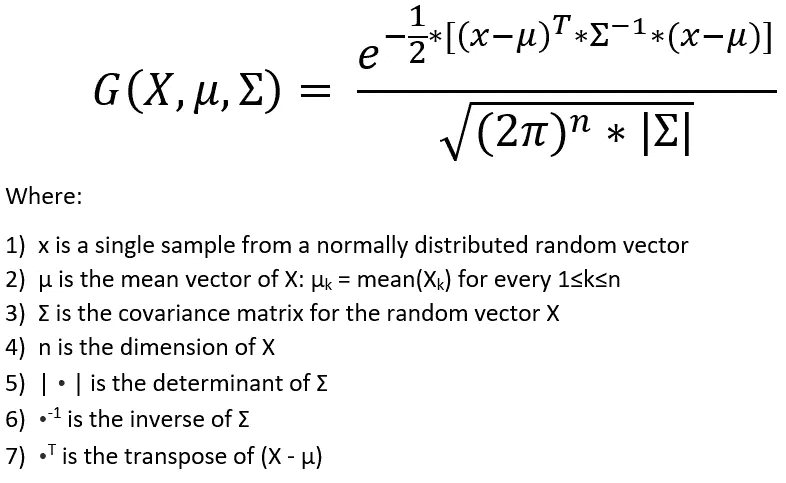

多元高斯分布方程

因为我假设你在第一段接受了我的建议，我希望你知道这个公式中的大多数符号。如果你有足够的勇气在没有这些知识的情况下继续下去，你至少应该知道向量就像一行或一列数字，矩阵是数字的网格(或一行向量)。向量和矩阵都有自己特殊的加法和乘法规则，而行列式、求逆和转置则是我们对矩阵进行的更专门的运算。

然而，该公式中真正的精华是协方差矩阵:这个非常特殊的矩阵在统计学中有一些有用的属性，包括作为多元高斯的基础。协方差矩阵的公式如下所示:

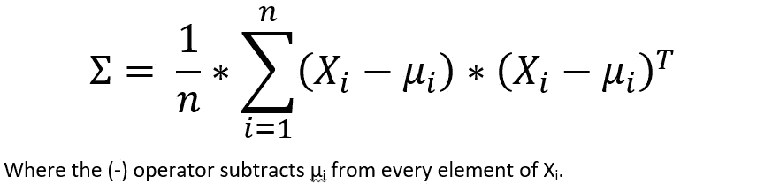

随机向量与其自身的协方差矩阵

我们在此描述的协方差矩阵测量随机向量与其自身之间的关系，由矩阵的每个单元中的标量值表示。表达这种关系的一种有用的方式是通过协方差矩阵的近亲，称为相关矩阵。相关矩阵将协方差矩阵中的每个值除以随机变量 Xi 和 Xj 的标准偏差的乘积

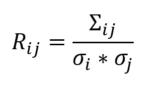

从协方差矩阵导出相关矩阵

这种划分的实际结果是协方差矩阵的值现在被限制在-1 和+1 之间。Rij = 1 表示 Xi 和 Xj 之间的正线性关系——测量 Xi 的大值表明 Xj 的相同测量值增加。相反，Rij = 1 表示 Xi 和 Xj 之间的负线性关系——测量大值的 Xi 表示减小相同的 Xj 测量值。

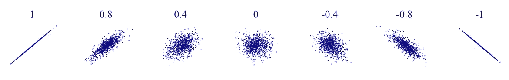

随机向量元素之间的关系(图片来自[维基媒体](https://en.wikipedia.org/wiki/Correlation_and_dependence#/media/File:Correlation_examples2.svg)

介于-1 和 1 之间的值表示非线性关系，0 表示 Xi 和 Xj 线性无关。由于这种关系的性质，它立即意味着σ(和 R)是对称矩阵。即—σij =σJi 对于每 1≤i≤j≤n。

这些统计的非线性关系正是协方差矩阵如此强大的原因。因为它可以捕捉组成随机向量 X 的随机变量之间的所有这些关系，所以多元高斯可以检测我们在产品分布中未检测到的异常。它们可能接近于每个随机变量的平均值，但是因为它们位于多元分布之外，所以它们可以被归类为异常。

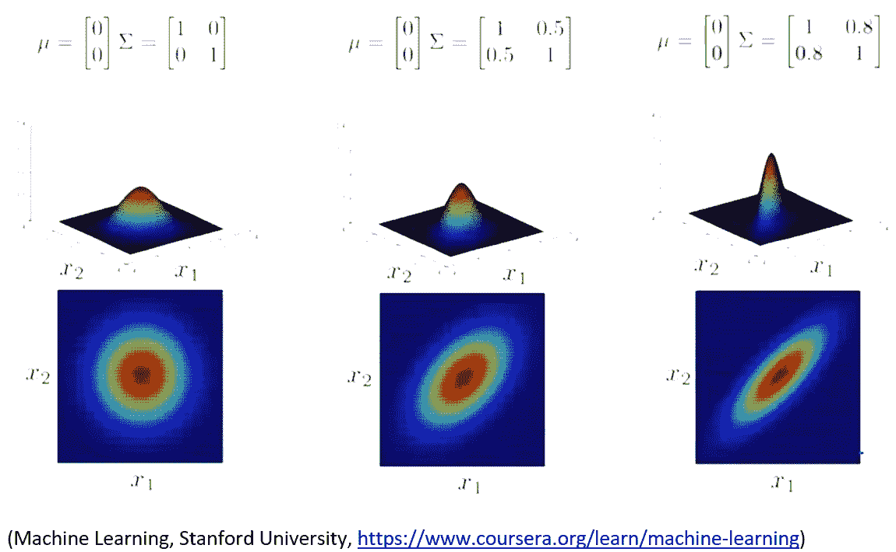

同一个分布被绘制了三次，不同的协方差矩阵塑造了每一次绘制(图片来自 [Coursera](https://www.coursera.org/learn/machine-learning/)

我们将使用的技术类似于我们在单变量情况下使用的技术:我们将使用一个平面(或更高维的类似物)来“分割”分布，然后计算多变量高斯和坐标平面之间的体积。

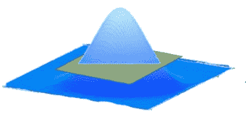

请注意绿色平面是如何“切割”高斯曲线的，就像我们用直线切割单变量分布一样(图片由作者提供)

因为我们在一个 n 维空间中工作，所以我们需要进行 n 次积分。这让我们计算:

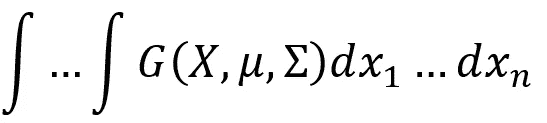

样本向量落入由任意范围界定的多元高斯下方体积内的概率

但是解析地计算 n 个积分，特别是当 n 可能非常大(例如超过 10，000)时，计算量非常大。这就是为什么我要走捷径:高斯的“钟形曲线”意味着返回值越低(您可能已经注意到 G(X，μ，σ)返回一个标量值，而不管 n 的大小)，高斯“尾部”下面的区域越小。

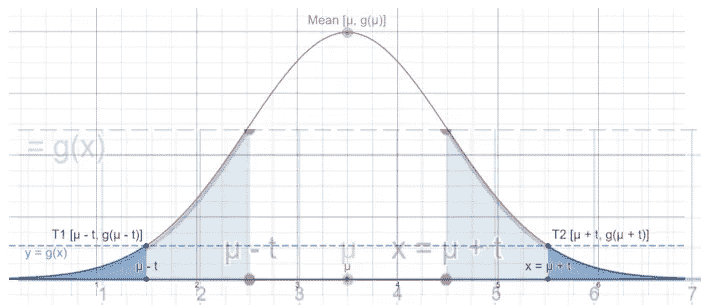

叠加两个具有不同ε值的高斯图显示了不同的值如何设置不同的异常阈值(图片由作者提供)

由于 G 返回的值与距离分布平均值给定距离的观察值的概率之间的关系，我可以将 p(x)与任意阈值进行比较，并将任何小于给定阈值的值归类为异常。这可能不是直接计算在我们的数据中观察到给定值的概率，但也许您可以证明这种分类的一种方法是注意到，因为高斯是一个连续函数，每个阈值ε ∈ (0，max(G))都有一个匹配值 t，因此 p(t) = ε。不是将异常分类为 p(x) < ε, we can think of our classification as marking any x for which p(x) < p(t) as an anomaly.

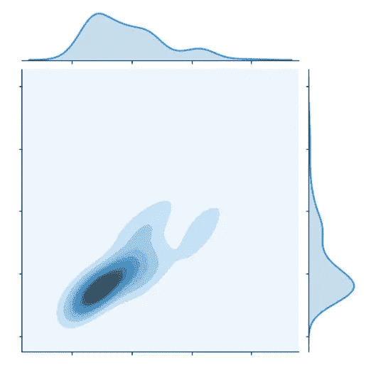

Plotting a density function for a multivariate distribution as a height map. Darker colours indicate a larger volume underneath a given slice (image by author)

**概括的任何值，我们已经知道:**

乘积分布是一种简单的多元异常分类方法，计算量也很小。

他们的主要缺点是无法对某些异常进行分类。

协方差矩阵(及其近亲，相关矩阵)可以用来度量随机向量 x 的随机变量之间的关系

这些关系允许多元高斯函数对产品分布遗漏的所有异常进行分类。

我们可以通过将异常与任意值ε ∈ (0，max(G))进行比较来对异常进行分类，因为执行高维积分在计算上是昂贵的。

**python 中的代码示例**(版本 3.8.3):