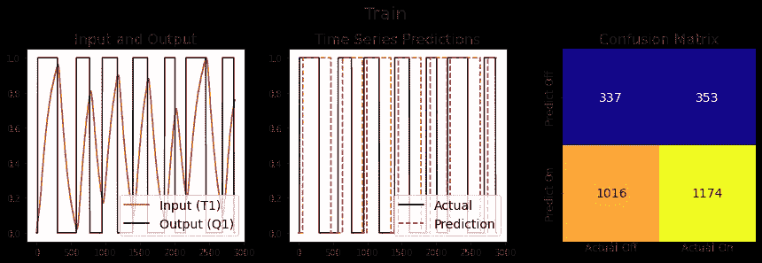
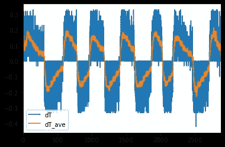
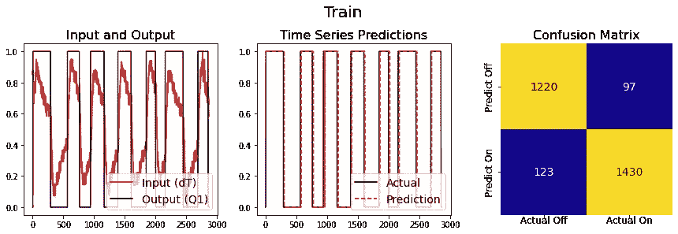
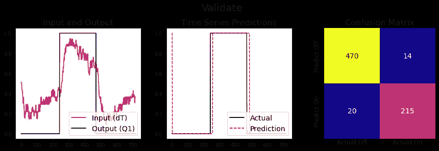

# 基于机器学习的过程控制数据异常检测

> 原文：<https://towardsdatascience.com/anomaly-detection-in-process-control-data-with-machine-learning-35056a867f5b?source=collection_archive---------32----------------------->

## [实践教程](https://towardsdatascience.com/tagged/hands-on-tutorials)

## 引入异常检测，使用您自己的温控实验室设备桌面上生成的数据

迪米特里·阿尼金在 [Unsplash](https://unsplash.com?utm_source=medium&utm_medium=referral) 上拍摄的照片

异常检测是机器学习在现实世界中的一个强大应用。从检测欺诈交易到预测组件故障，我们可以训练一个机器学习模型来确定什么时候发生了不寻常的事情。

说到机器学习，我非常支持通过实验来学习。机器学习模型背后的实际数学可能有点像黑箱，但这并不妨碍它的有用性；事实上，我觉得这是机器学习的优势之一。你可以用同样的算法来解决所有的问题。有时候，最好的学习方法是处理一些真实的数据，看看会发生什么。

在本例中，我们将能够使用温度控制实验室设备生成一些真实数据，并训练一个监督分类器来检测异常。TCLab 是一个很棒的小设备，可以通过简单的即插即用 Arduino 设备生成真实数据。如果你想为此创建自己的数据，这里有很棒的介绍性资源；否则，我会将我在自己的 TCLab 设备上生成的数据包含在 Github 存储库中。如果你想自己运行这些例子，你可以在这里下载并遵循代码。

# 问题框架

TCLab 是一个简单的 Arduino 设备，带有两个加热器和两个温度传感器。这是一个简单的即插即用设备，一个插头为加热器供电，一个 USB 端口与计算机通信。可以在 Python 脚本中调整加热器的级别(确保`pip install tclab`)，温度传感器用于读取每个加热器周围的温度。对于这个例子，我们将保持它的基本，只使用一个加热器和传感器，但同样的原则也可以适用于 2 加热器系统，甚至更复杂的系统，如你可能会发现在化学精炼厂。

图像来自 [APMonitor](http://apmonitor.com/pdc/index.php/Main/ArduinoTemperatureControl) 。经允许重新发布。

我们可以这样想象这个问题:我们的车库车间有一个加热器，有一个简单的开/关设置。我们可以设定加热器每天开启或关闭一定时间，以保持温度在一个舒适的水平。当然，我们可以使用更复杂的控制系统；然而，这是作为机器学习异常检测的介绍而设计的，所以我们现在将保持原始数据简单。

在正常情况下，这是一个足够简单的练习来验证加热器是否开启并工作——只要看看温度，看看它是否在上升。但是如果有外部因素使评估复杂化了呢？也许车库门开着，让一股气流进来，或者你的一些设备开始过热。或者更糟糕的是，如果温度控制受到网络攻击，并且被攻击者掩盖了，怎么办？有没有办法查看我们正在收集的数据，并确定什么时候出现了问题？这是异常检测的核心。

使用监督分类器，我们可以查看传感器数据，并训练它在加热器打开或关闭时进行分类。因为我们也知道何时加热器*应该*打开或关闭，我们可以将分类器应用于任何新的数据，并确定行为是否与我们看到的数据相符。**如果两者不匹配，我们知道存在某种类型的异常，并可以进一步调查。**

# 生成数据

为了模拟这个场景，我们将从 TCLab 生成一个数据文件，以不同的时间间隔打开和关闭加热器。如果你的 TCLab 设置有问题，这里有一些很好的故障诊断资源。

首先，我们将设置几个数组来存储数据，我们将以 1 秒的间隔收集这些数据。加热器开/关循环现在非常简单，只需将它一直打开或关闭，并让它保持几分钟。我们将运行一个小时，以确保我们有大量的数据进行训练和验证。

TCLab 输入很简单，根据我们生成的内容将`lab.Q1`设置为开或关。我们只将加热器开至 70%以避免过热，然后记录从`lab.T1`开始的每个时间点的温度。最后，让循环延迟 1 秒。

异常数据是以基本相同的方式创建的，但只用了 20 分钟。最大的不同是，我在指定的时间让风扇吹过加热器，模拟车库里的通风。风扇的对流会自然冷却系统，抵消加热器的作用。由于这是意料之外的，我们应该看到分类器拾取它——也许在我们知道加热器是开着的时候指示它是关着的。让我们继续下去，看看它是否有效！

# 数据预处理

机器学习的关键之一是研究如何以对模型有用的方式构建数据。当我做机器学习的任何项目时，这往往是最耗时的一步。如果我没弄错的话，这个模型非常有效；否则，我可能会花几个小时甚至几天的时间感到沮丧，想知道为什么我的模型行不通。

你应该总是为机器学习应用缩放你的数据，这可以很容易地用 [scikit-learn](https://scikit-learn.org/stable/modules/generated/sklearn.preprocessing.MinMaxScaler.html) 的`MinMaxScaler`来完成。此外，检查数据的格式对于模型是否正确(例如，numpy 数组的形状是否与分类器所期望的相匹配？否则，您可能会收到警告)。让我们看看目前为止这个是什么样子的。请注意，我们没有缩放 y 数据，因为它已经只是 0 和 1。

您会注意到，我们的输入只是温度，我们试图预测的输出是加热器状态(开或关)。这样有效吗？分类器能否仅根据温度判断加热器是开还是关？幸好有了 scikit-learn，使用监督分类器进行训练和预测只需要几行代码。我们还将使用逻辑回归分类器，但是还有许多其他监督分类器可以使用。

绘制结果会产生以下结果:

作者的情节

对于我们是否可以只使用原始温度作为输入，答案是断然否定的。这具有直观意义，例如，在 35°C 时，加热器要么打开，要么关闭。然而，温度的*变化*会告诉我们很多关于加热器在做什么。

# 特征工程

这介绍了特征工程的领域，这是为机器学习设置问题的另一个重要部分。我们可以在现有的基础上创造新的功能。从原始温度中我们还能收集到什么其他数据？我们可以得到一阶和二阶导数，过去几个读数的标准差，甚至可以看到长期的差异趋势。另一个可以尝试的技巧是对数据进行日志缩放，尤其是在数据是日志分布式的情况下。这些都是新特性，其中一些可能是分类器获得良好性能的灵丹妙药！

同样，一些特定问题的领域知识和直觉对于特征工程来说是非常有用的。让我们先来看看温度的变化。有一点传感器噪声，因此采用温度的滚动平均值会给出更好的曲线，这可能会导致更好的性能。

基于原始温度(dT)和滚动平均温度(dT_ave)的温度数据变化。作者的情节

让我们看看效果如何。唯一的区别是我们在 dataframe 中创建了`dT`列，并将其用作输入特性。我们还必须丢弃任何带有`NaN`值的数据。

结果…相当不错！有一些失误，但那些总是在加热器刚刚打开或关闭的边缘。我们可以研究更多的特性，例如二阶导数，这可能会有所帮助，但目前来看，这看起来就像它会做到这一点。

作者的情节

# 根据新数据验证分类器

在开始使用经过训练的分类器之前，最佳实践是验证从未见过的数据的性能。我个人喜欢在最初的原始训练数据上进行尝试，只是作为一种直觉检查；如果它在那里不起作用，它就不会对新数据起作用。然而，我们看到它在上述数据上运行良好，所以现在让我们在一组新的数据上进行检查。您可以从 TCLab 生成一个新的无异常数据文件，或者使用来自 [scikit-learn](https://scikit-learn.org/stable/modules/generated/sklearn.model_selection.train_test_split.html) 的`train_test_split` 。请注意，我们仅在数据缩放上使用`transform`功能，因为我们已经安装了缩放器，并使用该缩放来训练分类器。

这是结果的图表:

作者的情节

已经核实了。同样，当加热器打开或关闭时，会出现边缘情况。我们可以研究额外的特性来输入到分类器中，或者甚至改变分类器的超参数，但是对于一个简单的演示来说，这已经足够了。

# 利用训练好的分类器进行异常检测

这里是橡胶接触路面的地方。我们知道分类器可以很好地告诉我们加热器是开着还是关着。当意想不到的事情发生时，它能告诉我们吗？

流程真的一样。唯一的区别是现在我们有一个数据异常。我们将创建新特征(温度变化，使用平滑滚动平均值)，缩放数据，并将其输入分类器进行预测。

结果如下:

作者的情节

这看起来很有效！我们看到的预测是，当风扇运行时加热器关闭，而实际上加热器是打开的，这只是一个异常事件。即使在风扇关闭后，系统也在重新平衡，因此加热器的实际情况和分类器预测的情况之间存在一些额外的不匹配。如果一个操作者正在看进来的数据，他们可以比较他们期望加热器正在做什么和分类器正在预测什么；任何差异都表明异常，可以进行调查。

# 其他想法

这是一个很好的实验，只有一种异常，使用的是我们在桌面上生成的数据！当然这很简单，但是这类问题会很快变得复杂。然而，指导原则是相同的。

还有哪些异常事件可能发生？我们可以通过打开加热器 2 来模拟异常的外部热量。我们可以通过在更冷的房间中运行 TCLab 来模拟更冷的环境温度。这些设备还有一个巧妙的技巧:如果你在传感器附近打手机，电波会干扰信号，你会得到一种全新的异常。什么样的特征对检测这些其他类型的异常有用？我们可以调整超参数来提高性能吗？

最后，在分类器方面，也许我最喜欢的策略是训练几个不同的分类器，然后取一个总分数。继续尝试来自 [scikit-learn](https://scikit-learn.org/stable/supervised_learning.html) 的一些其他类型的分类器。哪些好用？哪个不是？如果您发现 4 或 5 个工作得很好，您可以训练所有的分类器，然后只在大多数分类器显示不匹配的情况下将某些东西标记为异常。

这有帮助吗？你喜欢能够生成自己的数据吗？你还发现了哪些对异常检测有用的想法？感谢您的阅读，我希望这篇介绍为您自己的项目打开了一些新的思路。