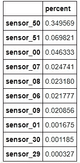
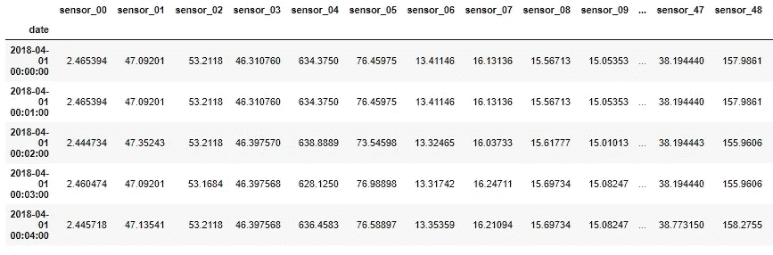
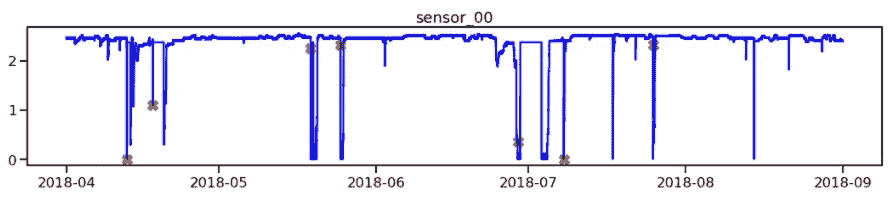
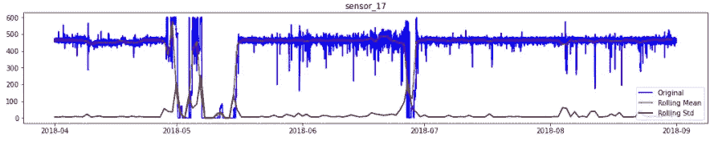
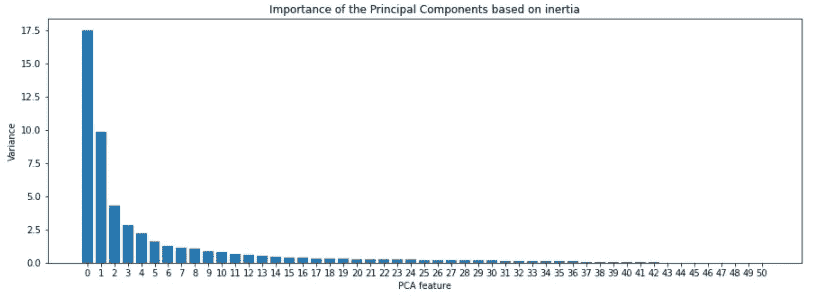
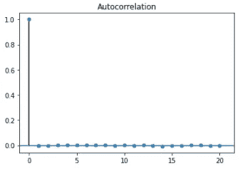
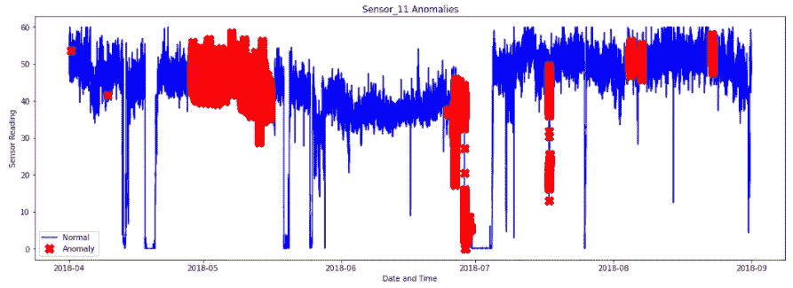
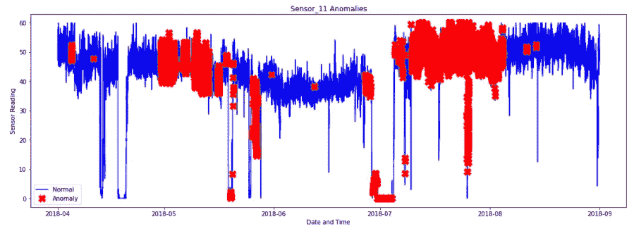
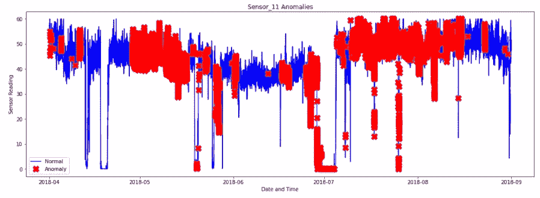
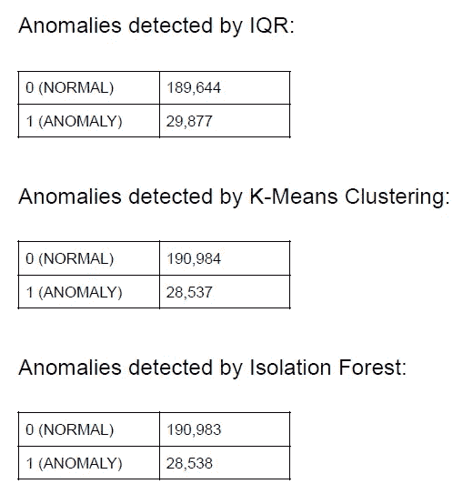

# 时间序列传感器数据中的异常检测

> 原文：<https://towardsdatascience.com/anomaly-detection-in-time-series-sensor-data-86fd52e62538?source=collection_archive---------0----------------------->


威尔·梅尔斯在 [Unsplash](https://unsplash.com?utm_source=medium&utm_medium=referral) 上拍照

> 异常检测包括识别数据集中与标准的差异、偏差和异常。它有时被称为离群点检测。

异常检测不是一个新概念或新技术，它已经存在很多年了，是机器学习的一个常见应用。其使用案例的真实示例包括(但不限于)检测欺诈交易、欺诈性保险索赔、检测异常设备行为的网络攻击。

在本文中，我将重点介绍异常检测在制造业中的应用，我认为与其他行业相比，制造业在有效利用机器学习技术方面远远落后。

# 问题描述

制造业被认为是重工业，其中他们倾向于使用各种类型的重型机械，如巨型电机、泵、管道、熔炉、传送带、拖运卡车、推土机、平地机和电铲等。这些通常被认为是他们运营中最重要的资产。因此，这些设备的完整性和可靠性通常是其资产管理计划的核心焦点。

他们如此关注这些资产的主要原因是，这些设备的故障通常会导致生产损失，从而导致数十万美元(如果不是数百万美元的话)的损失，这取决于运营的大小和规模。因此，对于制造工厂的维护经理来说，这是一件非常重要的事情，他们需要与高技能的可靠性工程师一起运行一个强大的资产管理框架，以确保这些关键资产的可靠性和可用性。

因此，提前检测异常情况并降低风险的能力是一项非常有价值的能力，可进一步防止计划外停机、不必要的维护(基于条件的维护与强制维护),还能更有效地管理这些资产的关键部件。计划外停机造成的生产损失、不必要的维护成本以及关键部件的过剩或短缺都会转化为严重的经济损失。

在这篇文章中，我将使用 Scikit-learn(又名 sklearn)在 Python 中实现不同的异常检测技术，我们的目标是使用无监督学习算法在泵的时间序列传感器读数中搜索异常。我们开始吧！

# 数据

很难从制造业中找到这种特定用例的公开数据，但我能够找到一个不完美的数据。数据集包含来自安装在泵上的 53 个传感器的传感器读数，以测量泵的各种行为。这个数据集可以在[这里](https://www.kaggle.com/nphantawee/pump-sensor-data)找到。

首先，我将使用以下代码和 Kaggle API 下载数据

```
!kaggle datasets download -d nphantawee/pump-sensor-data
```

下载完成后，用下面的代码将 CSV 文件读入 pandas 数据帧，并检查数据的细节。

```
df = pd.read_csv('sensor.csv')
df.info()<class 'pandas.core.frame.DataFrame'>
RangeIndex: 220320 entries, 0 to 220319
Data columns (total 55 columns):
 #   Column          Non-Null Count   Dtype  
---  ------          --------------   -----  
 0   Unnamed: 0      220320 non-null  int64  
 1   timestamp       220320 non-null  object 
 2   sensor_00       210112 non-null  float64
 3   sensor_01       219951 non-null  float64
 4   sensor_02       220301 non-null  float64
 5   sensor_03       220301 non-null  float64
 6   sensor_04       220301 non-null  float64
 7   sensor_05       220301 non-null  float64
 8   sensor_06       215522 non-null  float64
 9   sensor_07       214869 non-null  float64
 10  sensor_08       215213 non-null  float64
 11  sensor_09       215725 non-null  float64
 12  sensor_10       220301 non-null  float64
 13  sensor_11       220301 non-null  float64
 14  sensor_12       220301 non-null  float64
 15  sensor_13       220301 non-null  float64
 16  sensor_14       220299 non-null  float64
 17  sensor_15       0 non-null       float64
 18  sensor_16       220289 non-null  float64
 19  sensor_17       220274 non-null  float64
 20  sensor_18       220274 non-null  float64
 21  sensor_19       220304 non-null  float64
 22  sensor_20       220304 non-null  float64
 23  sensor_21       220304 non-null  float64
 24  sensor_22       220279 non-null  float64
 25  sensor_23       220304 non-null  float64
 26  sensor_24       220304 non-null  float64
 27  sensor_25       220284 non-null  float64
 28  sensor_26       220300 non-null  float64
 29  sensor_27       220304 non-null  float64
 30  sensor_28       220304 non-null  float64
 31  sensor_29       220248 non-null  float64
 32  sensor_30       220059 non-null  float64
 33  sensor_31       220304 non-null  float64
 34  sensor_32       220252 non-null  float64
 35  sensor_33       220304 non-null  float64
 36  sensor_34       220304 non-null  float64
 37  sensor_35       220304 non-null  float64
 38  sensor_36       220304 non-null  float64
 39  sensor_37       220304 non-null  float64
 40  sensor_38       220293 non-null  float64
 41  sensor_39       220293 non-null  float64
 42  sensor_40       220293 non-null  float64
 43  sensor_41       220293 non-null  float64
 44  sensor_42       220293 non-null  float64
 45  sensor_43       220293 non-null  float64
 46  sensor_44       220293 non-null  float64
 47  sensor_45       220293 non-null  float64
 48  sensor_46       220293 non-null  float64
 49  sensor_47       220293 non-null  float64
 50  sensor_48       220293 non-null  float64
 51  sensor_49       220293 non-null  float64
 52  sensor_50       143303 non-null  float64
 53  sensor_51       204937 non-null  float64
 54  machine_status  220320 non-null  object 
dtypes: float64(52), int64(1), object(2)
memory usage: 92.5+ MB
```

我们已经可以看到，数据需要一些清理，有丢失的值，一个空列和一个数据类型不正确的时间戳。因此，我将应用以下步骤来整理数据集。

*   移除多余的列
*   删除重复项
*   处理缺失值
*   将数据类型转换为正确的数据类型

```
# Drop duplicates
df = df.drop_duplicates()
# Entire "sensor_15" column is NaN therefore remove it from data
del df['sensor_15']
# Let's convert the data type of timestamp column to datatime format
import warnings
warnings.filterwarnings("ignore")
df_tidy['date'] = pd.to_datetime(df_tidy['timestamp'])
del df_tidy['timestamp']
```

接下来，让我们处理缺失值，为此，我们首先查看缺失值的列，并查看缺失数据的百分比。为此，我将编写一个计算缺失值百分比的函数，这样我就可以在整个笔记本中多次使用同一个函数。

```
# Function that calculates the percentage of missing values
def calc_percent_NAs(df):
    nans = pd.DataFrame(df.isnull().sum().sort_values(ascending=False)/len(df), columns=['percent']) 
    idx = nans['percent'] > 0
    return nans[idx]# Let's use above function to look at top ten columns with NaNs
calc_percent_NAs(df).head(10)
```



每列缺失值的百分比

经过一些分析后，我决定用它们的平均值来估算一些缺失的值，并去掉其余的。在数据争论过程之后，我最终整理的数据如下所示，并为下一步探索性数据分析做好了准备。tidy 数据集有 52 个传感器，机器状态列包含三个类别(正常、损坏、恢复),分别代表泵的正常运行、损坏和恢复状态，然后是日期时间列，代表时间戳。



整齐数据的前 10 行

# 探索性数据分析

既然我们已经清理了数据，我们可以开始探索以熟悉数据集。

在一些定量 EDA 之上，我执行了额外的图形 EDA 来寻找趋势和任何奇怪的行为。特别是，有趣的是看到传感器读数随着时间的变化而变化，机器状态“损坏”用红色标记在同一图表上。这样，我们可以清楚地看到泵何时出现故障，以及这如何反映在传感器读数中。下面的代码为每个传感器绘制了上面提到的图表，但是让我们看看 sensor_00 的图表。

```
# Extract the readings from the BROKEN state of the pump
broken = df[df['machine_status']=='BROKEN']
# Extract the names of the numerical columns
df2 = df.drop(['machine_status'], axis=1)
names=df2.columns
# Plot time series for each sensor with BROKEN state marked with X in red color
for name in names:
    _ = plt.figure(figsize=(18,3))
    _ = plt.plot(broken[name], linestyle='none', marker='X', color='red', markersize=12)
    _ = plt.plot(df[name], color='blue')
    _ = plt.title(name)
    plt.show()
```



从上面的图中可以清楚地看到，代表泵损坏状态的红色标记与传感器读数的观察到的干扰完全重叠。现在我们有了一个很好的直觉，当泵坏了和正常运行时，每个传感器读数是如何表现的。

# 平稳性和自相关性

在时间序列分析中，重要的是数据是平稳的，没有自相关。平稳性是指数据的平均值和标准偏差随时间变化的行为，具有这种行为的数据被认为是不平稳的。另一方面，自相关是指数据在不同时间段内与其自身相关的数据行为。下一步，我将直观地检查数据集中每个特征的稳定性，下面的代码将完成这一任务。稍后，我们还将执行 Dickey Fuller 测试来定量验证观察到的平稳性。此外，在将特征输入聚类算法以检测异常之前，我们将检查特征的自相关性。

```
# Resample the entire dataset by daily average
rollmean = df.resample(rule='D').mean()
rollstd = df.resample(rule='D').std()
# Plot time series for each sensor with its mean and standard deviation
for name in names:
    _ = plt.figure(figsize=(18,3))
    _ = plt.plot(df[name], color='blue', label='Original')
    _ = plt.plot(rollmean[name], color='red', label='Rolling Mean')
    _ = plt.plot(rollstd[name], color='black', label='Rolling Std' )
    _ = plt.legend(loc='best')
    _ = plt.title(name)
    plt.show()
```



时间序列看起来相当稳定

查看其中一个传感器(在本例中为 sensor_17)的读数，注意数据实际上看起来非常稳定，滚动平均值和标准偏差似乎不随时间变化，除非在预期的泵停机期间。该数据集中的大多数传感器都是这种情况，但在训练数据之前必须应用各种变换方法来使数据稳定的情况下，情况可能并不总是如此。

# 预处理和降维

用所有 52 个传感器/特征来训练模型在计算上非常昂贵，并且效率不高。因此，我将采用主成分分析(PCA)技术来提取用于建模的新特征。为了正确应用 PCA，必须对数据进行缩放和标准化。这是因为 PCA 和大多数学习算法都是基于距离的算法。如果从整洁数据的前 10 行注意到，每个特征的值的大小是不一致的。有些值非常小，而有些值非常大。我将使用管道库执行以下步骤。

1.  缩放数据
2.  执行主成分分析，并根据惯性查看最重要的主成分

```
# Standardize/scale the dataset and apply PCA
from sklearn.preprocessing import StandardScaler
from sklearn.decomposition import PCA
from sklearn.pipeline import make_pipeline
# Extract the names of the numerical columns
df2 = df.drop(['machine_status'], axis=1)
names=df2.columns
x = df[names]
scaler = StandardScaler()
pca = PCA()
pipeline = make_pipeline(scaler, pca)
pipeline.fit(x)# Plot the principal components against their inertiafeatures = range(pca.n_components_)
_ = plt.figure(figsize=(15, 5))
_ = plt.bar(features, pca.explained_variance_)
_ = plt.xlabel('PCA feature')
_ = plt.ylabel('Variance')
_ = plt.xticks(features)
_ = plt.title("Importance of the Principal Components based on inertia")
plt.show()
```



根据图表，前两个组件是最重要的

根据上述重要性图中 PCA 提取的特征，似乎前两个主成分是最重要的。因此，作为下一步，我将使用 2 个组件执行 PCA，这将是我在模型训练中使用的特征。

```
# Calculate PCA with 2 components
pca = PCA(n_components=2)
principalComponents = pca.fit_transform(x)
principalDf = pd.DataFrame(data = principalComponents, columns = ['pc1', 'pc2'])
```

现在，我将再次检查这两个主成分的平稳性和自相关性，以确保它们是平稳的，不是自相关的。

```
from statsmodels.tsa.stattools import adfuller
# Run Augmented Dickey Fuller Test
result = adfuller(principalDf['pc1'])
# Print p-value
print(result[1])
```

对第一个主成分运行 Dickey Fuller 测试，我得到的 p 值为 5.4536849418486247e-05，这是一个非常小的数字(远小于 0.05)。因此，我会拒绝零假设，说数据是平稳的。我对第二个组件执行了同样的操作，得到了类似的结果。所以两个主成分都是静止的，这就是我想要的。

现在，让我们检查这两个主成分的自相关性。有两种方法可以做到:使用 pandas autocorr()方法或 ACF 绘图。在这种情况下，我将使用后者来快速直观地验证没有自相关。下面的代码就是这样做的。

```
# Plot ACF
from statsmodels.graphics.tsaplots import plot_acf
plot_acf(pca1.dropna(), lags=20, alpha=0.05)
```



假设我的 PCA 的新特征是稳定的，并且不是自相关的，我已经准备好建模了。

# 建模

在这一步中，我将执行以下学习算法来检测异常。

1.  基准模型:四分位距(IQR)
2.  k 均值聚类
3.  隔离森林

让我们开始用这些算法进行训练。

## 四分位间距

策略:

1.  计算 IQR，即第 75(Q3)和第 25th)百分位数之间的差值。
2.  计算异常值的上限和下限。
3.  过滤超出上限和下限的数据点，并将其标记为异常值。
4.  最后，在时间序列数据(本例中是 sensor_11 的读数)的顶部绘制异常值

```
# Calculate IQR for the 1st principal component (pc1)q1_pc1, q3_pc1 = df['pc1'].quantile([0.25, 0.75])
iqr_pc1 = q3_pc1 - q1_pc1# Calculate upper and lower bounds for outlier for pc1lower_pc1 = q1_pc1 - (1.5*iqr_pc1)
upper_pc1 = q3_pc1 + (1.5*iqr_pc1)# Filter out the outliers from the pc1df['anomaly_pc1'] = ((df['pc1']>upper_pc1) | (df['pc1']<lower_pc1)).astype('int')# Calculate IQR for the 2nd principal component (pc2)
q1_pc2, q3_pc2 = df['pc2'].quantile([0.25, 0.75])
iqr_pc2 = q3_pc2 - q1_pc2# Calculate upper and lower bounds for outlier for pc2lower_pc2 = q1_pc2 - (1.5*iqr_pc2)
upper_pc2 = q3_pc2 + (1.5*iqr_pc2)# Filter out the outliers from the pc2df['anomaly_pc2'] = ((df['pc2']>upper_pc2) | (df['pc2']<lower_pc2)).astype('int')# Let's plot the outliers from pc1 on top of the sensor_11 and see where they occured in the time seriesa = df[df['anomaly_pc1'] == 1] #anomaly
_ = plt.figure(figsize=(18,6))
_ = plt.plot(df['sensor_11'], color='blue', label='Normal')
_ = plt.plot(a['sensor_11'], linestyle='none', marker='X', color='red', markersize=12, label='Anomaly')
_ = plt.xlabel('Date and Time')
_ = plt.ylabel('Sensor Reading')
_ = plt.title('Sensor_11 Anomalies')
_ = plt.legend(loc='best')
plt.show();
```



用红色标记的异常

如上所述，异常是在泵发生故障之前检测到的。对于操作员来说，这可能是一个非常有价值的信息，可以在泵实际停止工作之前正确地关闭泵。让我们看看是否能从接下来的两个算法中检测到相似的异常模式。

## k 均值聚类

策略:

1.  计算每个点与其最近质心之间的距离。最大的距离被认为是异常。
2.  我们使用 outliers_fraction 为算法提供关于数据集中离群值比例的信息。不同数据集的情况可能有所不同。然而，作为一个开始的数字，我估计 outliers_fraction=0.13 (13%的 df 是 outliers，如图所示)。
3.  使用离群值分数计算离群值的数量。
4.  将阈值设置为这些异常值的最小距离。
5.  anomaly1 的异常结果包含上述方法簇(0:正常，1:异常)。
6.  用时序视图可视化异常。

```
# Import necessary libraries
from sklearn.cluster import KMeans
# I will start k-means clustering with k=2 as I already know that there are 3 classes of "NORMAL" vs 
# "NOT NORMAL" which are combination of BROKEN" and"RECOVERING"kmeans = KMeans(n_clusters=2, random_state=42)
kmeans.fit(principalDf.values)
labels = kmeans.predict(principalDf.values)
unique_elements, counts_elements = np.unique(labels, return_counts=True)
clusters = np.asarray((unique_elements, counts_elements))# Write a function that calculates distance between each point and the centroid of the closest clusterdef getDistanceByPoint(data, model):
    """ Function that calculates the distance between a point and centroid of a cluster, 
            returns the distances in pandas series"""
    distance = []
    for i in range(0,len(data)):
        Xa = np.array(data.loc[i])
        Xb = model.cluster_centers_[model.labels_[i]-1]
        distance.append(np.linalg.norm(Xa-Xb))
    return pd.Series(distance, index=data.index)# Assume that 13% of the entire data set are anomalies outliers_fraction = 0.13# get the distance between each point and its nearest centroid. The biggest distances are considered as anomalydistance = getDistanceByPoint(principalDf, kmeans)# number of observations that equate to the 13% of the entire data setnumber_of_outliers = int(outliers_fraction*len(distance))# Take the minimum of the largest 13% of the distances as the thresholdthreshold = distance.nlargest(number_of_outliers).min()# anomaly1 contain the anomaly result of the above method Cluster (0:normal, 1:anomaly) principalDf['anomaly1'] = (distance >= threshold).astype(int)
```



异常用红色标记

## 隔离森林

```
# Import IsolationForestfrom sklearn.ensemble import IsolationForest# Assume that 13% of the entire data set are anomalies

outliers_fraction = 0.13model =  IsolationForest(contamination=outliers_fraction)
model.fit(principalDf.values) 
principalDf['anomaly2'] = pd.Series(model.predict(principalDf.values))# visualization
df['anomaly2'] = pd.Series(principalDf['anomaly2'].values, index=df.index)
a = df.loc[df['anomaly2'] == -1] #anomaly
_ = plt.figure(figsize=(18,6))
_ = plt.plot(df['sensor_11'], color='blue', label='Normal')
_ = plt.plot(a['sensor_11'], linestyle='none', marker='X', color='red', markersize=12, label='Anomaly')
_ = plt.xlabel('Date and Time')
_ = plt.ylabel('Sensor Reading')
_ = plt.title('Sensor_11 Anomalies')
_ = plt.legend(loc='best')
plt.show();
```



用红色标记的异常

## 模型评估

有趣的是，这三个模型都发现了许多相似的异常现象。仅仅从视觉上看上面的图表，人们可以很容易地得出结论，隔离林可能比其他两个检测到更多的异常。然而，下面的表格显示，相反，IQR 检测到的异常比 K-Means 和隔离森林要多得多。



每个模型检测到的异常数量

你认为这是为什么？当其他两个模型检测分布在不同时间段的异常时，IQR 是否主要检测相距较近的异常？IQR 比其他两位更科学吗？我们如何定义准确性？现在，让我把这些问题留给你去思考。我将在以后的帖子中更详细地写关于模型评估的更多内容。

# 结论

到目前为止，我们已经用三种不同的方法进行了异常检测。在此过程中，我们经历了常用数据科学流程的大部分步骤，包括以下步骤:

1.  **问题识别**
2.  **数据角力**
3.  **探索性数据分析**
4.  **预处理和训练数据开发**
5.  **建模**
6.  证明文件

在这个项目中，我面临的一个挑战是，使用无监督学习算法训练异常检测模型具有如此大的数据集，在计算上可能非常昂贵。例如，我不能用这些数据正确地训练 SVM，因为它花了很长时间来训练模型，却没有成功。

我建议接下来采取以下步骤，其中前 3 步侧重于改进模型，后两步则是让事情变得真实:

1.  利用高级特征工程技术进行特征选择
2.  高级超参数调谐
3.  实现其他学习算法，如 SVM，DBSCAN 等。
4.  使用给定测试集的最佳模型预测机器状态—砰！
5.  **将最佳模型部署到生产中——DOUBLE BAM！**

除了实施上述步骤，我将继续改进模型，并计划在未来的另一篇文章中分享结果。

Jupyter 笔记本可以在 [Github](https://github.com/bauyrjanj/Anomaly_Detection/tree/master/models) 上找到详情。享受检测异常，让我们在 LinkedIn 上联系。

## 在线参考和有用的资料

*   [检测时间序列数据的平稳性](/detecting-stationarity-in-time-series-data-d29e0a21e638)
*   [自相关和偏自相关的简明介绍](https://machinelearningmastery.com/gentle-introduction-autocorrelation-partial-autocorrelation/)
*   [主成分分析](https://setosa.io/ev/principal-component-analysis/)
*   [主成分分析的一站式商店](/a-one-stop-shop-for-principal-component-analysis-5582fb7e0a9c)
*   [K-均值聚类](https://matteucci.faculty.polimi.it/Clustering/tutorial_html/kmeans.html)
*   [Sklearn K-Means 文档](https://scikit-learn.org/stable/modules/generated/sklearn.cluster.KMeans.html)
*   [Sklearn 隔离森林文件](https://scikit-learn.org/stable/modules/generated/sklearn.ensemble.IsolationForest.html)