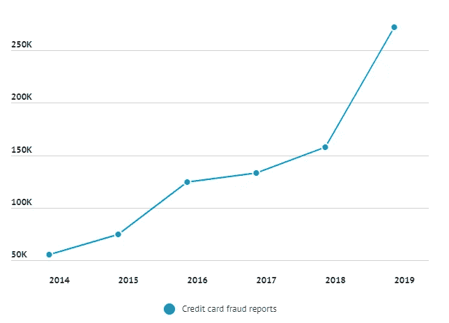
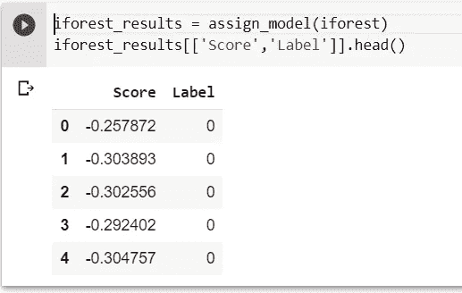
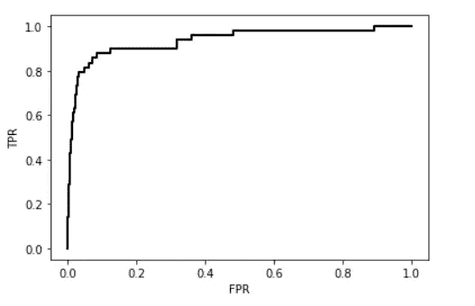
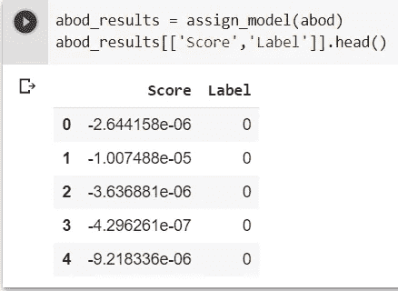
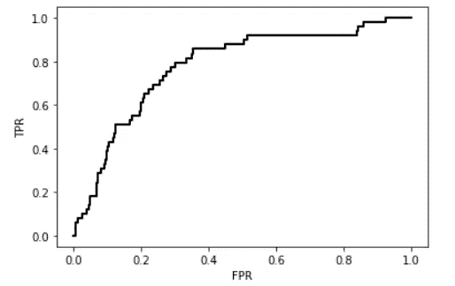
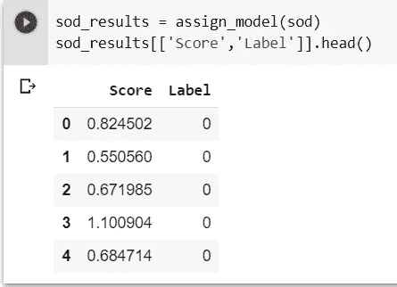
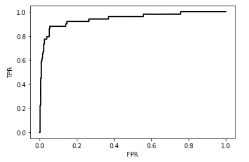
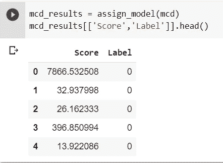
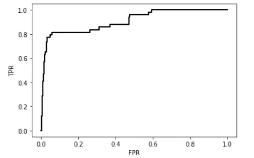
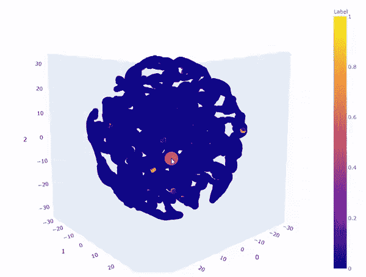

# 异常检测变得简单

> 原文：<https://towardsdatascience.com/anomaly-detection-made-simple-70775c914377?source=collection_archive---------21----------------------->

## 利用 pycaret 包的信用卡诈骗案

在这个银行业的新时代，Stripe、Square 等金融支付服务巨头使信用卡支付无缝化，信用卡交易每年都以倍数增长([来源](https://www.creditcards.com/credit-card-news/market-share-statistics.php))。因此也导致信用卡诈骗报告每年翻一番([来源](https://www.fool.com/the-ascent/research/identity-theft-credit-card-fraud-statistics/))。



按年份分类的信用卡欺诈报告([来源](https://www.fool.com/the-ascent/research/identity-theft-credit-card-fraud-statistics/))

**什么是异常？**

异常是偏离正常或预期的东西。在信用卡交易中，大多数欺诈案件偏离了正常交易的行为。说什么是正常的交易行为是主观的，但是有不同类型的异常检测技术来发现这种行为。这里我们将讨论三种类型的技术。


[来源](https://www.sdadata.org/digital-evangelism-blog/words-matter-so-do-you)

**信用卡诈骗侦破案例:**

我正在考虑卡格尔信用卡欺诈检测进行异常 detection⁴.

**从 API 调用下载数据集:**

首先，进入您的 Kaggle 我的帐户([https://www.kaggle.com/*Your-Username*/account)](https://www.kaggle.com/*Your-Username*/account))，进入“API”部分，点击“创建新的 API 令牌”，下载您的 API 令牌。您现在将下载一个名为“kaggle.json”的文件。你必须把这个文件上传到你的笔记本上。

```
from google.colab import files
uploaded = files.upload()
```

现在，您可以使用下面给出的代码来下载和解压缩数据集。

```
!pip uninstall -y kaggle
!pip install --upgrade pip
!pip install kaggle==1.5.6
!kaggle -v
!mkdir -p ~/.kaggle
!cp kaggle.json ~/.kaggle/
!chmod 600 ~/.kaggle/kaggle.json
!kaggle datasets download -d mlg-ulb/creditcardfraud
!unzip creditcardfraud.zip
```

## 预处理:

在给定的数据集中，284，807 笔交易中有 492 笔欺诈，我正在考虑一个 0.1 的样本用于我们的分析，而不会丢失离群分数用于进一步的无监督学习。异常分数是 0.001723。

设置初始化 pycaret⁵的环境，并创建转换管道，为建模和部署准备数据。

**1。隔离林:**

T 隔离森林算法通过随机选择一个特征，然后随机选择所选特征的最大值和最小值之间的分割值来分离观察值，类似地，通过创建随机决策 trees⁶.来构建分离因此，异常分数被计算为分离给定观察所需的条件的数量。

**建立模型:**

我们可以使用 pycaret 包中的 create_model 函数建立模型，可以使用下面的代码相应地修改参数。

使用 assign_model⁷函数寻找孤立森林异常分数和标签。



**评价:**

隔离林的 ROC_AUC 为 0.935。



**2。基于角度的异常检测:**

在中，基于角度的异常值检测通过比较距离向量对之间的**角度**来解决高维度问题，而不是使用距离 directly⁸.

**建立模型:**

我们可以使用 pycaret 包中的 create_model 函数建立模型，可以使用下面的代码相应地修改参数。

使用 assign_model 函数查找 ABOD 分数和标签。



**评估:**

基于角度的异常值检测的 ROC_AUC 是 0.777。



**3。子空间离群点检测:**

t**子空间离群值通过寻找低维空间中具有异常低 density⁹.的数据的局部区域来识别**

****建立模型:****

**我们可以使用 pycaret 包中的 create_model 函数建立模型，可以使用下面的代码相应地修改参数。**

**使用 assign_model 函数查找 SOD 分数和标签。**

****

****评价:****

**子空间离群点检测的 ROC_AUC 为 0.942。**

****

****4。最小协方差行列式:****

**这是发现异常值的最稳健的方法之一，它考虑使用称为 MCD 估计量的稳健估计量。这说明了掩蔽效应:经典估计值会受到污染的强烈影响，以至于诊断工具(如马氏距离)无法检测异常值⁰.由于稳健距离对掩蔽效应不敏感，因此它们可用于标记异常值。**

****建立模型:****

**我们可以使用 pycaret 包中的 create_model 函数建立模型，可以使用下面的代码相应地修改参数。**

**使用 assign_model 函数查找 MCD 异常分数和标签。**

****

****评价:****

**最小协方差行列式异常值检测的 ROC_AUC 为 0.906。**

****

# ****比较结果:****

**从这个 kaggle 信用欺诈检测数据集的所有四种异常检测技术中，我们看到，根据 ROC_AUC，子空间异常检测相对给出更好的结果。**

****

**子空间异常值检测的异常值的 3d TSNE 图(黄色欺诈，蓝色正常)**

**请从这个 [**colab**](https://colab.research.google.com/drive/1tlW9QZwJSYD1OCWt8lWTimfDw_EcKuP7#scrollTo=hI9a8EOzTRN1) **查看这些异常检测技术的详细代码。****

# **结论:**

**大多数银行和支付服务使用不同的异常评分方法，要么使用一个异常评分，要么对某些异常评分技术的分级异常评分进行平均，以确保不丢失任何欺诈交易。**

# **参考资料:**

1.  **[按年份统计的信用卡统计](https://www.creditcards.com/credit-card-news/market-share-statistics.php)。**
2.  **[信用卡报表统计](https://www.fool.com/the-ascent/research/identity-theft-credit-card-fraud-statistics/)。**
3.  **[人工智能的进展和趋势](https://books.google.be/books?id=8ZWfDwAAQBAJ&pg=PA335&lpg=PA335&dq=An+Anomaly+is+something+that+deviates+from+what+is+normal+or+expected.+In+credit+card+transactions,+mostly+fraudulent+cases+are+deviates+from+what+behavior+of+a+normal+transaction&source=bl&ots=_6T1OTpqPF&sig=ACfU3U1CNJOxUbokON2aVNrU2UIIdEnF0g&hl=en&sa=X&ved=2ahUKEwjMvv26n5PpAhVICewKHZVADfsQ6AEwAHoECAoQAQ#v=onepage&q=An%20Anomaly%20is%20something%20that%20deviates%20from%20what%20is%20normal%20or%20expected.%20In%20credit%20card%20transactions%2C%20mostly%20fraudulent%20cases%20are%20deviates%20from%20what%20behavior%20of%20a%20normal%20transaction&f=false)。**
4.  **[kaggle 信用卡欺诈检测](https://www.kaggle.com/mlg-ulb/creditcardfraud)。**
5.  **[pycaret](https://pycaret.org/)**
6.  **[隔离林研究论文](https://www.researchgate.net/publication/224384174_Isolation_Forest)。**
7.  **pycaret assign_model 。**
8.  **[基于角度的离群点检测研究论文](https://www.researchgate.net/publication/221653435_Angle-based_outlier_detection_in_high-dimensional_data)。**
9.  **[子空间离群点检测研究论文](https://link.springer.com/chapter/10.1007/978-3-642-03547-0_15)。**
10.  **[稳健统计异常检测](https://arxiv.org/pdf/1707.09752.pdf)。**
11.  **[最小协方差行列式估计量的快速算法](https://www.jstor.org/stable/1270566?seq=1#metadata_info_tab_contents)。**