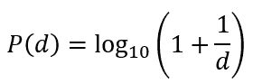
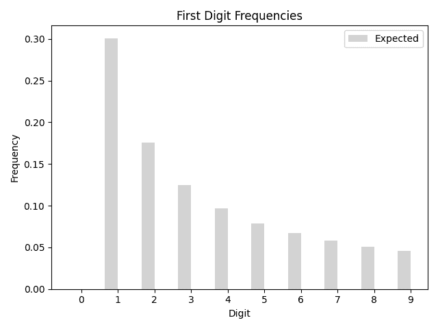
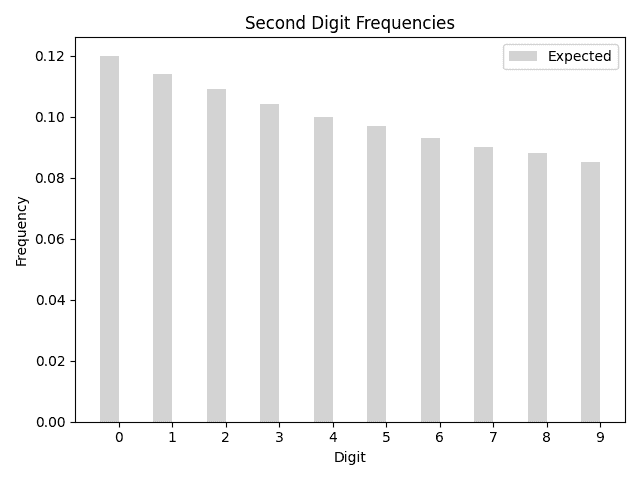
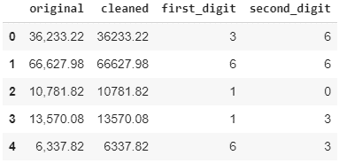
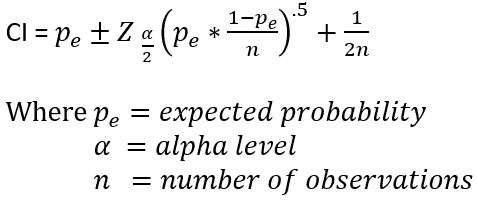
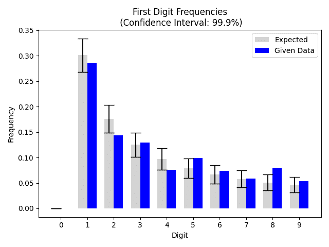

# 使用本福德定律的异常检测

> 原文：<https://towardsdatascience.com/anomaly-detection-using-benfords-law-253eaa25e6c5?source=collection_archive---------18----------------------->

## 掷骰子得到 5 的几率有多大？当然是 1/6。从 1 到 100 之间随机选择的数字是 32 的几率有多大？1/100.

假设你下载了 2020 年的银行交易。随机交易的金额以 3 开头的可能性有多大？考虑到有 9 个可能的数字(省略 0 作为第一个数字)，逻辑上你会猜测 1/9。令人惊讶的是，这是错误的。真实概率其实在 12%左右。第一个数字是 1 的概率惊人地超过了 30%。

那么这个规律是从哪里来的，我们又该如何运用呢？

# 历史

虽然通常被称为本福德定律，但和许多著名定律一样，它并不是以第一个发现它的人命名的。实际上，是一位名叫西蒙·纽康的天文学家在 19 世纪晚期注意到，在对数表中，一些页面比其他页面磨损得更多——尤其是前几页。他的发现后来被弗兰克·本福特重新发现，他继续做更多的实验来验证这一理论。

简而言之，该定律表明“真实”数据集中数字的首位数字不会以一致的概率出现。我们所说的“真实”是什么意思？这里，我们指的是自然出现的数字集合——银行账户交易、街道地址、数学常数。数字以 *d* (1，2，3…9)开头的概率由以下公式给出:

作者图片

如果我们画出第一位数字的预期频率，我们会得到以下图形:

作者图片

同样，我们可以对第二个数字做同样的事情。

作者图片

那么，我们如何利用新发现的知识呢？它最合乎逻辑的应用是在会计(尤其是审计)领域，但也可以在其他领域找到用途。这部法律被广泛记载，以至于在联邦、州和地方法院案件中经常被用作证据。

更多示例:

*   如果你看过本·阿弗莱克主演的电影《会计师 T2》，你会看到他利用本福德定律揭露欺诈。
*   Ciaponia 和 Mandanici 在一篇研究论文中使用该定律来调查意大利大学是否故意使用虚假数据来支持他们的书籍。
*   本福德定律曾被用于检测 2009 年伊朗选举中的选民欺诈。

# 利用法律

既然你理解了本福特定律的理论，让我们把它付诸实践。在我们的例子中，我们将检查大约 2，100 笔金融交易，看它们是否符合。如果我们检测到超出预期频率的数据，我们会将这些交易标记为可疑，并让其他人进一步调查。(代码和例子可以在我的 [github](https://github.com/gbushnell/benfords_law) 中找到。)

首先，我们需要创建一个预期频率的列表。出于我们的目的，我们将关注前两位数字，并利用 numpy 创建一个 10×2 矩阵。行将代表数字(0–9)。列将表示数字位置(第一或第二)。

现在，我们需要从我们的数据(2，100 笔交易)中计算每个位置上不同数字的频率。我们将首先把我们的数据加载到 pandas 数据框架中。然后，我们将清理数字(删除否定标识、逗号等)。)并提取第一个和第二个数字。

作者图片

为了便于与我们预先计算的预期概率进行比较，我们还将在另一个 numpy 数组中计算观察数据的概率。

根据 Nigrini 和 Mittermaier 在分析程序中使用本福特定律作为辅助手段，我们可以根据给定的α水平计算期望值的置信区间。

作者图片

我们可以在两个 numpy 数组中保存我们的上限和下限，然后比较我们的观察结果，看看我们是否落在计算置信区间之外。如果是这样，我们知道我们有可疑的数据。

为了形象化我们的发现，我们可以绘制第一个和第二个数字的分布，以及置信区间。

作者图片

作者图片

正如我们所看到的，在第一个数字中，我们看到 8 出现的频率比本福特定律预测的要高得多。在第二个数字中，我们发现 5 也出现得更频繁——实际上是第二个数字中出现频率最高的。

我希望你学到了一些东西，并能够找到本福特定律的另一个有用的应用。同样，代码在我的 [github](https://github.com/gbushnell/benfords_law) 上。

感谢您的阅读。

# 关注我的博客

将新内容直接发送到您的收件箱。

*原载于 2020 年 10 月 1 日 http://lowhangingfruitanalytics.com***。**