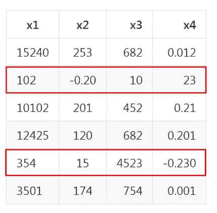
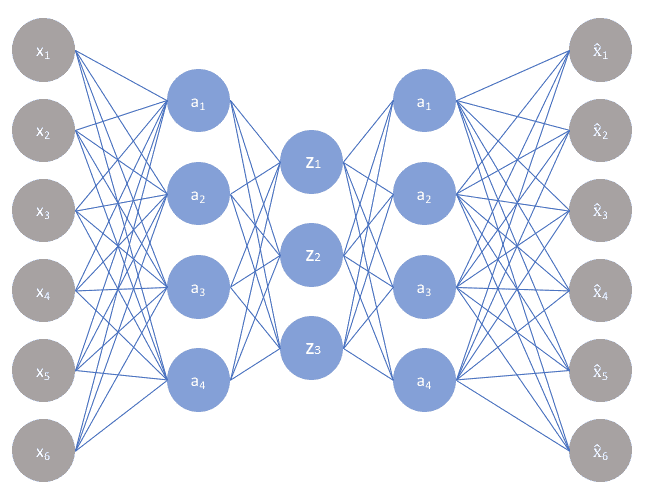
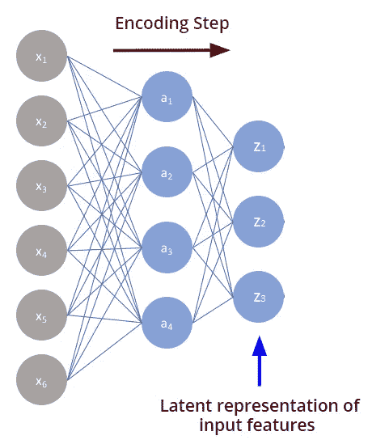
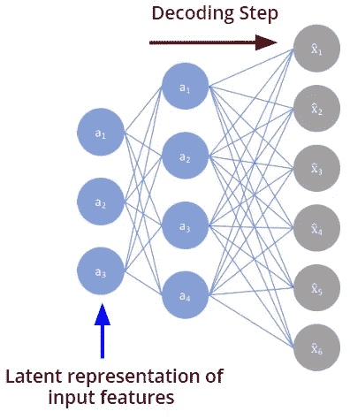
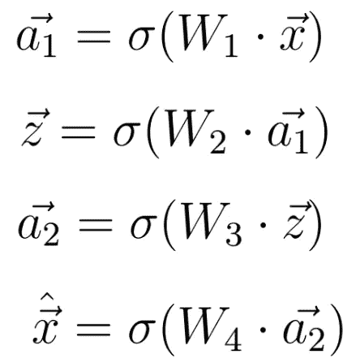
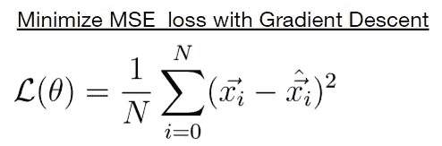
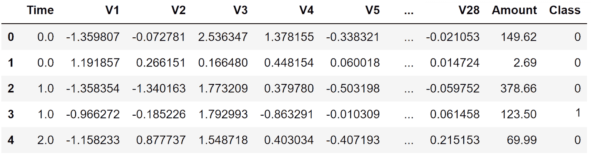
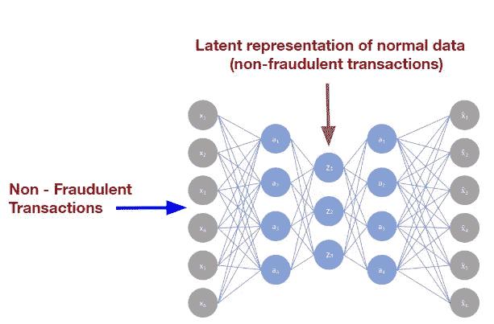
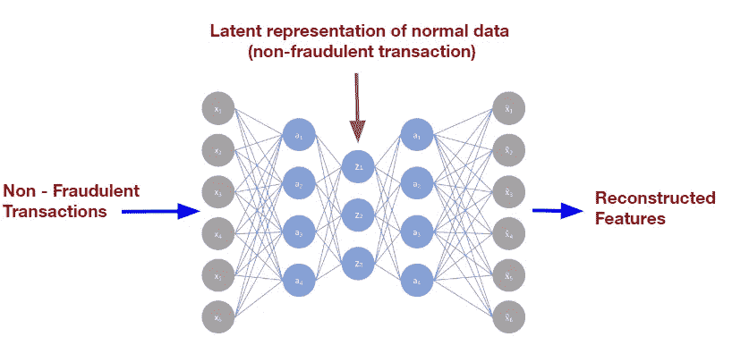
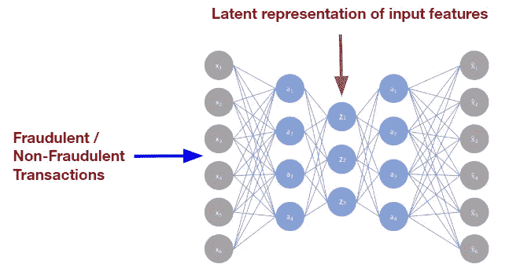

# TensorFlow 2.0 中的自动编码器异常检测

> 原文：<https://towardsdatascience.com/anomaly-detection-with-autoencoders-in-tensorflow-2-0-a1a6c9ebf495?source=collection_archive---------6----------------------->

## 如何在 TensorFlow 2.0 中实现神经网络以检测异常的指南。

在这篇详细的指南中，我将解释深度学习如何用于异常检测领域。此外，我将解释如何在 TensorFlow 2.0 中实现用于异常检测的深度神经网络模型。当然，所有的源代码和相应的数据集都可以下载——很好；)

# 目录

1.  **简介**
2.  **异常检测**
3.  **异常检测系统的用例**
4.  **异常案例研究:金融欺诈**
5.  **自动编码器如何工作？**
6.  **使用自动编码器的异常检测**
7.  **tensor flow 2.0 中的欺诈检测**

# 1.介绍

异常是指与数据集中的其他实例明显不同的数据实例。通常它们是无害的。这些只能是数据中的统计异常值或错误。但有时数据中的异常可能表明以前已经发生了一些潜在的有害事件。

**此类事件可能是金融欺诈。**

在本文中，我将向您展示如何使用深度神经网络的力量来识别欺诈性的金融信用卡交易，这些交易可以被识别为数据集中的异常。

# 2.异常检测

不幸的是，常规前馈神经网络不太适合检测异常。正因为如此，我将介绍一种新的神经网络架构，称为 Autoencoder。

但首先，我想更详细地解释术语异常，并说明为什么异常检测系统在预测分析领域发挥如此重要的作用。

在分析真实世界的数据时，一个常见的观察结果是，数据集中的一些实例或观察结果可能会让人产生怀疑，因为它们与数据集中的大多数数据有很大的不同。这些特定的数据实例是不同的，因为它们不匹配数据集中的其他预期模式或行为。这种情况通常被称为异常。

请考虑以下由 4 个要素组成的数据集。

仔细观察会发现这个数据集中的一些不规则之处。第二个和第五个数据实例中的值与其他实例中的值非常不同。这两个实例的特征值与其他实例的相应特征值有很大不同。

显然，我们在这里观察到两个异常现象。数据中的异常可能有几个原因。有时，异常是在数据收集或预处理过程中出现的数据错误。

当然，也有很大的可能性，异常可能属于实际数据。在这种情况下，它们只不过是一些统计异常值。另一方面，异常有时可以指示一个新的、先前未知的潜在事件，该事件首先导致这些异常。

在这种情况下，数据中的异常可能表明欺诈、滥用或服务中断等事件，所有这些都对企业或组织构成威胁。你现在可能会问自己的问题是，为什么我们可以将这些事件视为数据中的异常。

简单的答案是，欺诈、滥用或服务中断当然是不符合企业或组织中通常的、预期的行为或流程的事件。事实上，这些都是相当罕见的事件。

# 3.异常检测系统的用例

让我们来看看某个特定的业务领域，数据中的异常可能意味着潜在的威胁或问题。

**银行**:在银行领域，异常可能与异常高的购买/存款或网络入侵有关

**医疗保健**:在医疗保健领域，索赔和支付方面的欺诈可能是异常现象。但更重要的是，患者健康数据的异常可以暗示疾病或健康状况的恶化

**制造**:在制造过程中，异常的机器行为可以被记录为机器产生的数据中的异常

**金融**:正如前面的例子中已经提到的，在金融领域(也可以属于银行业，反之亦然)，欺诈性金融交易可以被注册为异常数据实例

**智能家居**:在智能家居的情况下，能量泄漏会导致数据中出现一些意想不到的观察结果

**电信**:在电信漫游滥用、收入欺诈、服务中断可能被识别为数据中的异常实例。

从这些例子中可以看出，异常检测是各种业务领域的重要组成部分。异常检测模型可以保护公司和机构免受财务和个人损失。甚至成为医疗保健领域的潜在救星。

# 4.异常用例:金融欺诈

以诈骗为例。想象一下，你正在从你的银行账户里取钱。你每周做一次，每次都是在你上班时间从自动取款机上取。每当金额在 100-250 美元之间时，你就在取款。当然，每次您取款时，您的银行都会收集与取款相关的数据，如时间、地点、金额等。

只要您坚持您通常的模式，收集的数据实例看起来几乎是一样的。现在想象一下，你的卡被偷了，小偷发现了你的 ATM 个人识别码。小偷利用这个机会，从一台不在你家乡的自动取款机上提取了一大笔远远超过你平时数额的钱。

正如您可以想象的那样，包含特定现金提取相关信息的数据实例在金额和提取地点方面与前面的实例有很大不同。

在这种情况下，数据实例将作为异常引起注意。

当然，异常和它可能暗示的威胁类型取决于行业和相关的数据类型。在任何情况下，异常检测模型的目标是检测异常数据，以便采取措施进一步调查检测到的异常，并避免公司或其客户可能面临的威胁或问题。

# 5.自动编码器是如何工作的？

在本文的其余部分，我将只把金融欺诈作为异常检测的案例研究。

这是我们可以利用深度神经网络的时候了。神经网络是通用的模式识别系统，可以识别模式，并将其与我们人类永远不会考虑的欺诈行为相关联。

例如，在准备交易时，停留在特定按钮或屏幕区域上的时间等模式。

一个人可能永远不会发现这种模式是否与某种欺诈行为有关。然而对于神经网络来说，这根本不是问题。非常适合于识别这种模式的神经网络架构被称为自动编码器。

向您详细解释这种神经网络架构肯定超出了本文的范围。相反，我想给这个网络一个简短的概述。关于 Autoencoder 更详细的解释，请随意阅读文章“[tensor flow 2.0 中的 Deep auto encoder](https://www.deeplearning-academy.com/p/ai-wiki-deep-autoencoder)”。

自动编码器最简单的形式是你已经熟悉的前馈神经网络。与前馈神经网络一样，自动编码器有一个输入层、一个输出层和一个或多个隐藏层。下图显示了自动编码器的体系结构。正如我们所见，自动编码器的输入层和输出层具有相同数量的神经元。

自动编码器可以分为两部分:

*   编码器
*   解码器

## 编码器

编码器指的是自动编码器的前半部分，其中隐藏神经元的数量随着网络的深入而减少。

神经元数量的减少迫使输入特征 *x* 被“编码”或压缩成可以在中间隐藏层中找到的更短的表示。我们姑且把这种 ***x*** 的表示称为隐向量*。*

**

# *解码器*

*解码器代表自动编码器的一部分，其中隐藏层中的神经元数量再次增加。*

*解码器使用编码到中间隐藏层中的输入特征的更短的潜在表示来重构原始输入特征 ***x*** 。让我们称重构的输入为 ***x_hat*** 。*

**

*如果解码器能够从比这短得多的向量*中重构输入特征 ***x*** ，这意味着 ***x*** 包含大量不相关的信息，并且可以被丢弃。**

**描述***x***100 的编码和解码的整个过程的等式如下:**

****

**这里 **W1** 、 **W2** 、 **W3** 和 **W4** 表示连接自动编码器各层的权重矩阵。西格玛代表任意的非线性激活函数。**

**这种潜在表示 ***z*** 非常重要，因为它可以用于许多不同的目的，比如检测金融交易中的欺诈，我们几分钟后就会看到。首先，我们将讨论如何训练自动编码器，以便获得输入的准确潜在表示。**

# **自动编码器的训练**

**自动编码器的训练方式与前馈神经网络相同。我们必须最小化输入特征和它们的重建对应物 ***x_hat*** 之间的距离。**

*****x*** 和 ***x_hat*** 之间的距离可以用均方误差损失函数来恰当地度量。为了最小化距离或损失函数的值，我们必须使用常规梯度下降法:**

****

**通过最小化 MSE 损失函数，我们减小了 ***x*** 和 ***x_hat*** 之间的差异。这些自动导致一个更好的潜在表象 ***z*** 的输入特征 ***x*** 。**

# **6.使用自动编码器的异常检测**

**现在，我们已经了解了什么是自动编码器以及如何训练它，让我们讨论如何使用这种神经网络架构来检测数据中的异常。**

**我们必须清楚一个事实，即数据集中的异常是非常罕见的事件。**

**这意味着应该检查任何类型异常的数据集是非常不平衡的。数据集中的绝大多数实例将是绝对正常的——与极少数异常数据实例形成对比。**

**客观地说，在接下来的异常检测示例中，我们将使用的数据集将包含超过 280，000 个信用卡交易数据实例，其中只有 492 个是欺诈性的。*这只是可被视为异常的数据实例的 0.17%。这种不平衡是一个严重的问题。***

**提到的数据集就是著名的“[信用卡诈骗数据集](https://www.kaggle.com/mlg-ulb/creditcardfraud)”。它包含欧洲持卡人在 2013 年 9 月通过信用卡进行的交易。该数据集显示了两天内发生的交易，其中 284，807 笔交易中有 492 笔欺诈。**

**数据集如下所示:**

****

*   **特征 **V1** ，…， **V28** 是用 PCA(主成分分析)得到的主成分**
*   ****“时间**”:每笔交易与第一笔交易之间经过的秒数**
*   ****【金额**】:交易金额**
*   ****“类**”:是我们的标签。1 表示欺诈交易，否则为 0**

# **用于异常检测的训练自动编码器**

**我们将很难像以前一样执行基于特征标签的神经网络监督训练。因为这一次我们没有足够的数据实例来描述我们想要检测的异常情况——在我们的案例中是欺诈交易。**

**因此，我们的模型可能很难了解异常或欺诈交易的一般概念，因为模型几乎从未见过这种情况。此外，我们需要将数据集划分为训练集、测试集和验证集，这将进一步减少相应数据集中的异常数量。**

**数量非常有限的异常数据实例的一般结果是，我们的模型在对这些事件进行分类时效率非常低，因为在绝大多数情况下，模型仅从正常数据实例中学习。幸运的是，现在我们可以使用自动编码器来帮助我们。我们可以使用这种神经网络的独特性质来解决数据集非常不平衡的问题。**

**这意味着，我们将自动编码器的预测与初始输入特征进行比较，而不是提供将输入特征分类为欺诈性或非欺诈性的标签。**

**此外，在欺诈检测的情况下，我们必须只在非欺诈数据实例上训练自动编码器。在训练期间，自动编码器将看到数百万次非欺诈性的信用卡交易。**

****

**通过这种方式，我们使用自动编码器将输入要素的基础信息或最相关的信息编码成更短的潜在表示。直觉上，我们可以说，这样自动编码器只学习绝对正常的信用卡交易的概念。**

**并且这种学习到的正常信用卡交易的概念可以作为中间层中的潜在表示被发现，其用于重新创建用作自动编码器的输入数据的原始特征。**

# **使用经过训练的自动编码器检测异常情况**

****

**在用正常数据实例训练之后，我们可以最终使用神经网络来检测异常。**

**这一次，我们可以显示两种类型的网络数据——异常数据和正常数据。如前所述，输入特征由自动编码器编码成用于重构输入的潜在表示。**

****

**如前所述，自动编码器使用均方误差函数作为损失函数来测量重构输入和原始输入之间的差异或误差。**

****请注意以下几点:**如果自动编码器经过适当训练，我们预计正常数据的输出和输入之间的误差会非常小。**

*****然而，对于异常情况或我们这里的欺诈性数据交易来说，情况并非如此。*****

**请记住，在培训过程中，autoencoder 仅学习普通数据实例的概念和特征。这意味着 autoencoder 的权重和偏差仅被调整为编码和重建正常数据——在我们的案例中为非欺诈性交易。**

**如果我们现在试图对欺诈性交易进行编码，该交易的潜在表示将与正常交易的潜在表示显著不同。**

****直接结果是，重建的输入将与原始输入相差更大，导致比正常交易情况下更大的误差。****

**欺诈性输入数据会导致均方误差损失函数的损失值更高，这一事实可以为我们所用。我们所需要做的就是找到一个**损失阈值**来区分正常数据和欺诈数据。**

****在实践中，这意味着我们获得的损失值高于该阈值的数据实例将该实例归类为异常或欺诈交易。****

**另一方面，丢失值低于此阈值的数据实例可被视为正常数据或非欺诈性交易。**

*   ****情况 1:** 输入特征的 MSE 损失值为**高于损失阈值** →输入特征为异常(此处:欺诈交易)**
*   ****情况 2:** 输入特征的 MSE 损失值**低于阈值** →输入特征正常(此处:非欺诈交易)**

# **概述:使用自动编码器进行异常检测**

**让我们总结一下关于如何检测数据集中的异常的知识。**

1.  **首先，如果应该检查异常的数据集是不平衡的(几乎总是这样)，您必须使用自动编码器**
2.  **仅在正常数据上使用均方误差损失函数来训练自动编码器，在训练期间不使用任何异常数据实例**
3.  **在训练之后，异常的损失值应该比正常数据实例的损失值高得多**
4.  **现在，您必须找出一个损失值阈值，该阈值能够最好地区分异常数据和正常数据。**

# **找到一个合适的损失值阈值**

**为了找到最佳区分异常数据和正常数据的阈值，您只需尝试许多不同的阈值。**

**对于这个过程，我建议取几千个数据实例，其中大约 5–10%的实例是异常的。然后，您只需计算每个实例的损失值，将其与阈值进行比较，并将其归类为异常或不异常。**

**最后，您必须使用实际的标签来检查这些分类有多好。为了量化分类结果，我建议使用我们在上一篇文章“[数据科学和机器学习中的评估指标](https://www.deeplearning-academy.com/p/ai-wiki-evaluation-metrics-in-data-science)”中介绍的评估指标。**

**有了评估指标的结果，您就可以决定这个阈值是否良好，并在必要时调整阈值。**

# **7.TensorFlow 2.0 中的欺诈检测**

**正如您可能已经猜到的，异常检测模型将是一个自动编码器，它将识别前面介绍的数据集中的欺诈性金融交易。**

**所有的源代码和使用的数据集都可以在这个项目的我的 GitHub 库中访问[。请随意下载代码并亲自试用。](https://github.com/artem-oppermann/Anomaly-Detection-in-TensorFlow-2.0)**

**不幸的是，我不能详细介绍所有使用的函数和类，因为这超出了课程的范围。相反，我想只关注神经网络模型的实现。所有其他使用的类和方法(特别是数据预处理可以在 GitHub 库中查看)。所有的源代码都有很好的文档记录，因此您在理解代码时不会有任何困难。**

**在这一点上，让我们开始…**

**首先，我喜欢定义一个 **BaseModel** 类，它包含初始化权重和偏差以及计算正向传递的方法。**

**这些方法稍后将被继承到定义实际异常检测模型的类中。通过这种方式，我们可以稍后定义几个自动编码器模型(例如，使用不同的超参数)，它们将从 **BaseModel** 类继承方法。通过这样做，我们可以节省相当多的代码，因为模型的不同版本共享相同的功能。**

**在**init _ variables(self)***中我们定义了权重和偏差。正如你所看到的，自动编码器总共有三个隐藏层。这些层中神经元的数量是[20，8，20]。***

*****forward_propagation(self，x)** 只计算自动编码器的输出，即重构的输入特征***

***在下面，我们可以定义自动编码器将被训练的实际类:***

***该类包含计算均方误差损失值和梯度下降步骤的方法。***

***培训过程应该一目了然:***

***首先，我们预测几个超参数，如批量大小、学习速率等。***

***一个非常重要的超参数是引入的损失值阈值，我在这里称之为 *THRESHOLD=10* 。MSE 损失函数值将在测试阶段从正常数据实例中区分异常。***

**然后我们定义类 **AnomalyDetector()、**的实例，这是实际的 Autoencoder 模型和**性能(阈值)**，其中将计算一些评估指标(精度、召回、F1 分数)。如果您不熟悉这些指标，请随时查看文章“[深度学习中的评估指标](https://www.deeplearning-academy.com/p/ai-wiki-evaluation-metrics-in-data-science)”**

**训练和评估数据集先前被转换成 TensorFlow 记录数据格式。在方法 *get_training_data()* 和**get _ test _ data()***中，我使用了 **tf.data API** 来提取、加载、生成小批量和混洗数据集。***

***在下一步中，我们迭代训练数据集，为每个小批量计算均方误差损失函数，并应用梯度下降。***

***在处理了 1000 个小批量之后，我使用了 **Performance()** 类和 loss-value-threshold 来评估异常检测器模型。测试数据集中有 34000 个实例。测试数据集包含所有 480 个欺诈性数据实例(异常)，其余为正常数据实例。***

***就在 5 个时期之后，我们得到以下结果:***

*   ***异常检测器具有非常好的精度值 93。这意味着模型在 93%的情况下正确地对异常进行分类。***
*   ***召回值 43.3 告诉我们，自动编码器已经识别了数据集中 43.3%的异常。不幸的是，超过一半的异常对模型来说仍然是不可见的。***

***有趣的是，对于非欺诈性数据实例，平均绝对误差损失值仅为 0.385。另一方面，欺诈性数据实例的 MSE 损失值是高得多的值 19.518。正如我们所期待的那样。***

****最初发布于*[https://www . deep learning-academy . com/p/ai-wiki-anomaly-detection](https://www.deeplearning-academy.com/p/ai-wiki-anomaly-detection)***