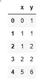
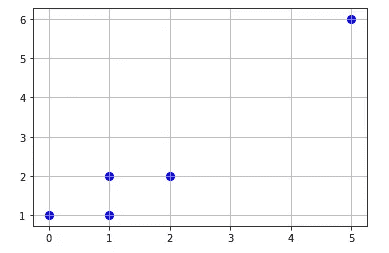
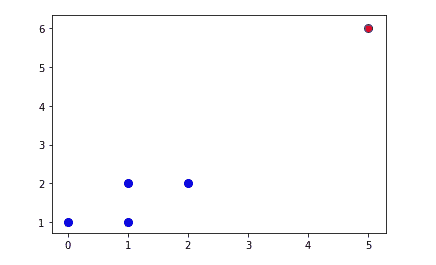

# 基于局部异常因子的异常检测(LOF)

> 原文：<https://towardsdatascience.com/anomaly-detection-with-local-outlier-factor-lof-d91e41df10f2?source=collection_archive---------10----------------------->


照片由 [Z S](https://unsplash.com/@kovacsz1?utm_source=medium&utm_medium=referral) 在 [Unsplash](https://unsplash.com?utm_source=medium&utm_medium=referral)

## 小型数据科学

今天的文章是我写的关于用于异常检测的不同技术的一系列“小文章”中的第 5 篇。如果有兴趣，以下是之前的四篇文章:

*   [异常检测的 Z 值](/z-score-for-anomaly-detection-d98b0006f510)
*   [异常检测的箱线图](/boxplot-for-anomaly-detection-9eac783382fd)
*   [异常检测的统计技术](/statistical-techniques-for-anomaly-detection-6ac89e32d17a)
*   [利用“异常化”库进行时间序列异常检测](/time-series-anomaly-detection-with-anomalize-library-67472003c003)

今天，我将超越统计技术，进入用于异常检测的机器学习算法。

## 什么是本地异常因素(LOF)？

LOF 是一种无监督(半监督)的机器学习算法，它使用分布中数据点的密度作为检测异常值的关键因素。

LOF 将任何给定数据点的密度与其相邻数据点的密度进行比较。由于异常值来自低密度区域，因此异常数据点的比率会更高。根据经验，正常数据点的 LOF 在 1 到 1.5 之间，而异常观测值的 LOF 要高得多。LOF 越高，越有可能是异常值。如果点 X 的 LOF 是 5，这意味着 X 的邻居的平均密度比其局部密度高 5 倍。

用数学术语来说，

```
LOF(X)=[(LRD(1st neighbor) + LRD(2nd neighbor ) + .................+ LRD(kth neighbor))/LRD(X)]/k
```

其中，LRD 是本地可达性距离，计算方法如下。

```
LRD(X) = 1/(sum of Reachability Distance (X, n))/k)where n is neighbors upto k
```

该算法有四个不同的部分:

*   **超参数** *k* :决定邻居的数量
*   **可达性距离**:使用 3 种方法测量的距离——欧几里德、闵可夫斯基、曼哈顿
*   **局部可达性:** (LRD) (X) = 1/(可达性距离之和(X，n))/k)，其中 n 是 k 以内的邻居
*   **本地异常值因子(LOF)**

理论和数学讲够了。如果你不太明白，不要难过。正如我过去常说，要驾驶一辆汽车，我们不需要了解它的机械结构，但我们需要知道如何驾驶！因此，请直接进入下一节，讨论用 Python 实现 LOF。

# Python 实现

我们将使用 Scikit-Learn 库实现 Python 环境中异常检测的 LOF。让我们首先导入所需的库:

```
# data preparation
import pandas as pd
import numpy as np# data visualzation
import matplotlib.pyplot as plt
import seaborn as sns# outlier/anomaly detection
from sklearn.neighbors import LocalOutlierFactor
```

现在让我们创建一个包含 5 个数据点的假设数据集。

```
# data
df = pd.DataFrame(np.array([[0,1], [1,1], [1,2], [2,2], [5,6]]), columns = ["x", "y"], index = [0,1,2,3,4])
```



如果你绘制数据点，用目视检查找出异常值并不困难。

```
# plot data points
plt.scatter(df["x"], df["y"], color = "b", s = 65)
plt.grid()
```



编造数据点

所以的确，我们不需要机器学习算法来发现第 5 个数据点是异常值。但是让我们看看算法是否能检测出来。

```
# model specification
model1 = LocalOutlierFactor(n_neighbors = 2, metric = "manhattan", contamination = 0.02)# model fitting
y_pred = model1.fit_predict(df)# filter outlier index
outlier_index = where(y_pred == -1) # negative values are outliers and positives inliers# filter outlier values
outlier_values = df.iloc[outlier_index]# plot data
plt.scatter(df["x"], df["y"], color = "b", s = 65)# plot outlier values
plt.scatter(outlier_values["x"], outlier_values["y"], color = "r")
```



使用 LOF 检测异常数据点

这就对了。该算法正确地检测出异常值。

## 总结和结论

本文的目的是介绍一种基于密度的异常检测技术——局部异常因子。LOF 将给定数据点的密度与其相邻数据点的密度进行比较，并确定该数据是正常的还是异常的。由于有了`sklearn`库，这个算法的实现并不太困难。对结果的解释也相当直接。

为了只关注一件事，我忽略了`LocalOutlierFactor()`算法的另一个重要用例——新奇感检测。这是另一篇文章的主题，但简单来说，LOF 是一种半监督 ML 算法，其中该算法仅在正常数据上训练*。在训练算法之后，显示新的数据来识别它是否新颖。*

*希望你喜欢这篇文章，欢迎随时关注我的[媒体](https://medium.com/@mab.datasc)或[推特](https://twitter.com/DataEnthus)。*