# 异常检测与实例

> 原文：<https://towardsdatascience.com/anomaly-detection-with-practical-example-d06b90f89caf?source=collection_archive---------14----------------------->

## 异常检测服务

## 假设你在一家金融科技公司做系统管理员。前端可能会出现问题，阻止您的客户在您的平台上购物。你如何知道当你的服务仍然正常运行时，你的客户支出是否突然下降？这时异常检测就派上了用场。

马库斯·温克勒在 [Unsplash](https://unsplash.com/s/photos/graph?utm_source=unsplash&utm_medium=referral&utm_content=creditCopyText) 上的照片

异常检测是一种在给定集合中发现异常点或异常模式的技术。术语异常也被称为异常值。离群值是在数据集中的其他对象中脱颖而出并且不符合数据集中的正常行为的数据对象。异常检测是一种数据科学应用程序，它结合了多种数据科学任务，如分类、回归和聚类。

**异常**可以大致分为:

*   **点异常:**如果数据的单个实例离其他实例太远，那么它就是异常的。*业务用例:*根据“消费金额”检测信用卡欺诈
*   **上下文异常:**异常是上下文特定的。这种异常在时间序列数据中很常见。*业务用例:*节日期间每天在食物上花费 100 美元是正常的，但在其他情况下可能是奇怪的。
*   **集体异常:**一组数据实例集体帮助检测异常。*业务用例:*有人试图将数据从远程机器意外地复制到本地主机，这种异常会被标记为潜在的网络攻击。

异常检测类似于噪声消除和新奇检测，但并不完全相同。**新奇感检测**关注的是在新的观察中发现一种未被观察到的模式，这种模式不包括在训练数据中——比如圣诞节期间突然对 YouTube 上的一个新频道感兴趣。**噪声去除** ( [NR](http://datamining.rutgers.edu/publication/tkdehcleaner.pdf) )是使分析免于出现不需要的观察结果的过程；换句话说，从有意义的信号中去除噪声。

# 异常检测中的数据类型

*   **离群值**

离群值是与数据的其余部分有很大不同的值或点。

异常值可能是这样的:

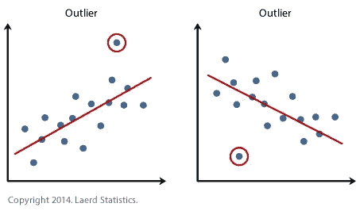

来自 Datanee

或者这个

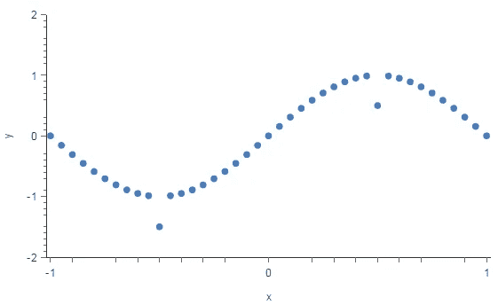

来自塔努卡的博客

*   **四分位间距**

**四分位距** (IQR)是一种可变性的度量，基于将数据集分成四分位。

四分位数将按等级排序的数据集分成四个相等的部分。划分每个部分的值称为第一、第二和第三四分位数；并且它们分别由 Q1、Q2 和 Q3 表示。

*   Q1 是排序数据集的第一个一半的*中的“中间”值。*
*   Q2 是集合中的[中值](https://stattrek.com/Help/Glossary.aspx?Target=Median)。
*   Q3 是排序数据集的第*第二*半部分的“中间”值。

四分位间距等于 Q3 减去 Q1。

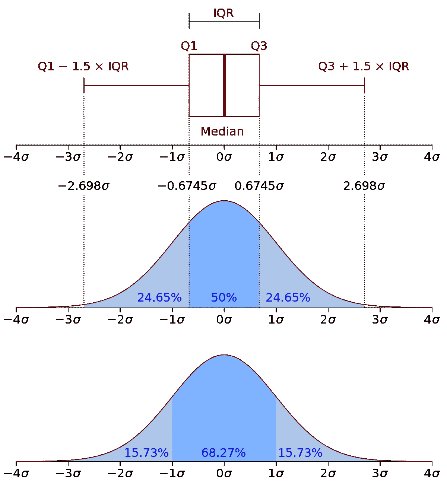

来自维基百科

*   **电平移动**

时间序列中的电平移动是指在特定的时间步长上，过程的标称值从一个电平移动到另一个电平。在两个连续的电平变化之间，该过程可以表现得像标准的自回归移动平均(ARMA)过程。

电平转换的两个例子:

*   当日交易股票，从某一天的收盘到第二天的开盘价不等
*   车间内的温度或湿度传感器，用于记录从一个加工操作结束到下一个加工操作开始之间的液位变化

这实际上意味着一些值会周期性地(或非周期性地)偏离过程平均值，从而导致异常值。电平移动分析通常是使用 ARIMA 等模型的时间序列分析的一部分。

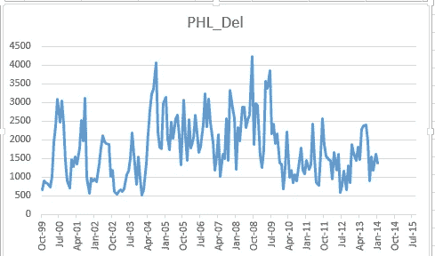

来自交叉验证

*   **道钉**

**棘波分类**是一类用于电生理数据分析的技术。棘波分类算法使用通过大脑中的一个或多个电极收集的波形的形状来从背景电噪声中区分一个或多个神经元的活动。

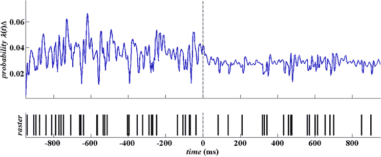

从研究门

*   **季节性**(日时、周时、月、假日)

在时间序列数据中，**季节性**是指以少于一年的特定固定间隔出现的变化，如每周、每月或每季度。季节性可能是由各种因素引起的，如天气、假期和假日，它由周期性的、重复的、通常有规律的和可预测的时间序列模式组成。

时间序列中的季节性波动可以与周期性模式相对照。后者发生在数据呈现非固定周期的上升和下降时。这种非季节性波动通常是由于经济状况，往往与“商业周期”有关；它们的周期通常超过一年，波动通常至少两年。

面临季节变化的组织，如冰淇淋供应商，通常有兴趣了解他们相对于正常季节变化的表现。劳动力市场的季节性变化可以归因于离校生进入就业市场，因为他们的目标是在完成学业后为劳动力做出贡献。对于那些研究就业数据的人来说，这些有规律的变化不如由于经济的基本状态而发生的变化有趣；他们关注的是劳动力中的失业率是如何变化的，尽管有规律的季节性变化的影响。

组织有必要识别和衡量市场中的季节性变化，以帮助他们规划未来。这可以让他们为劳动力需求和库存的暂时增加或减少做好准备，因为对他们产品或服务的需求在一定时期内会有波动。这可能需要提前组织培训、定期维护等等。除了这些考虑之外，组织需要知道他们所经历的变化是多于还是少于预期的量，超出了通常的季节性变化的范围。

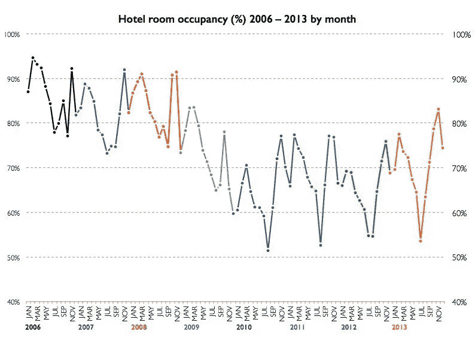

来自 simplexCT

# 使用 Grafana 和 Hastic 插件进行异常检测

我们将通过一个例子来说明异常检测是如何在 Grafana 和 Hastic 插件的帮助下工作的。为了与示例保持一致，我们需要安装和设置以下内容:

*   格拉夫纳
*   InfluxDB
*   石墨
*   Grafana 的 Hastic 插件
*   要测试的服务
*   运行负载测试的 Gatling 环境

这个想法是这样的:

1.  我们将在一个特定的服务上用 Gatling 运行负载测试
2.  loadtest 的测试结果将被加载到 InfluxDB 中的 Graphite 中
3.  我们设置了 Grafana 和 Hastic 插件来跟踪视觉效果

为了了解如何运行与 Grafana 集成的加特林，您可以参考[可视化实时加特林报告](https://medium.com/automation-with-donald/visualize-realtime-gatling-result-with-influxdb-and-grafana-8b9cdd2599c6)。

因为这篇文章的目的是向**展示异常检测是如何工作的**，我们将进入在 Grafana 设置 Hastic 的细节。

从 Grafana 中，选择配置->数据源

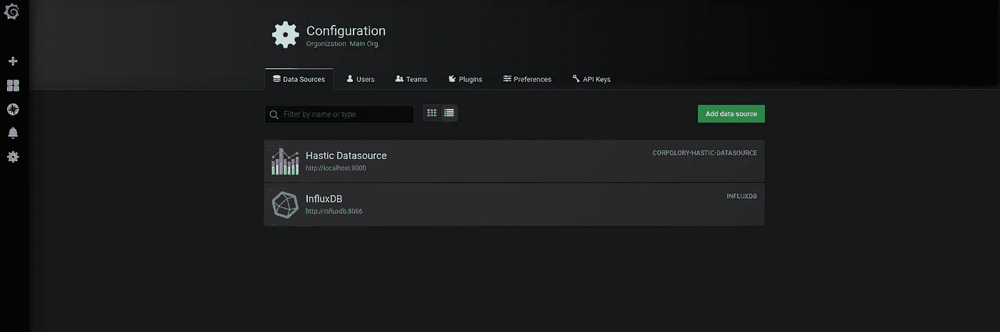

Hastic 数据源

在 Hastic 数据源信息中，我们设置从浏览器获取信息，然后点击“保存和测试”。

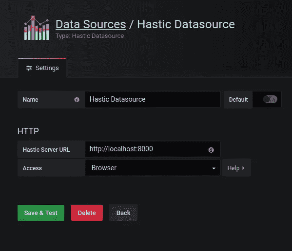

现在，我们将使用数据源 InfluxDB 和 Hastic visual 创建仪表板。

从 Grafana 中选择创建新仪表板。这里你选择可视化。

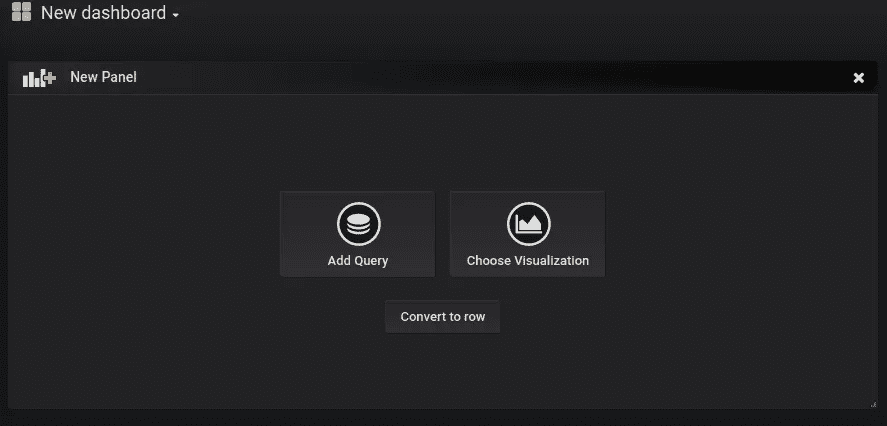

然后将哈斯蒂克图形设置为可视化

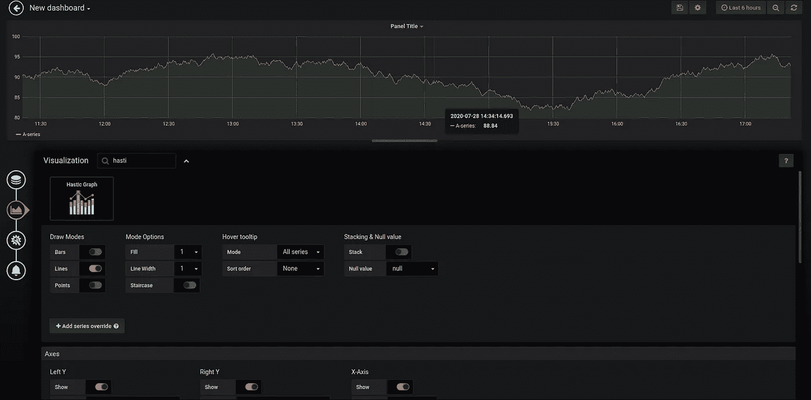

哈斯蒂克图形可视化

在查询选项卡中，选择 InfluxDB。如果您的时间序列数据库中存在数据，Grafana 将自动建议可用的查询。

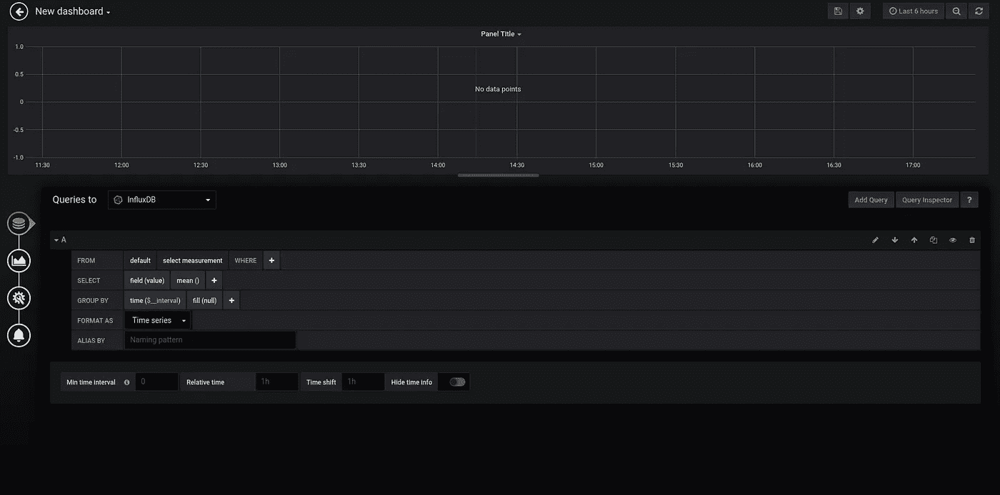

涌入数据库查询

然后，当我们保存您的仪表板并运行测试时，我们可以看到异常数据被突出显示。

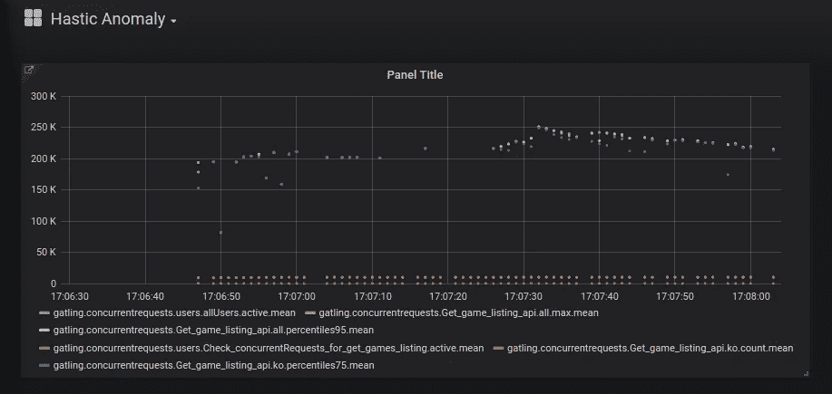

Hastic 异常仪表板实时

感谢您阅读我的帖子。

平安一如既往~~~。

# 参考

 [## 异常检测

### 异常检测是在给定的数据集中发现异常值的过程。离群值是突出的数据对象…

www.sciencedirect.com](https://www.sciencedirect.com/topics/computer-science/anomaly-detection)  [## 异常检测

### 11.1.1 研究问题异常检测是一种在给定集合中寻找异常点或模式的技术。的…

www.sciencedirect.com](https://www.sciencedirect.com/topics/engineering/anomaly-detection)  [## 异常检测

### 在各种领域，例如，但不限于，统计，信号处理，金融，计量经济学，制造业…

en.wikipedia.org](https://en.wikipedia.org/wiki/Anomaly_detection)  [## 异常检测简介

### 特定主题的经验:新手专业经验:无行业经验本概述旨在…

blogs.oracle.com](https://blogs.oracle.com/datascience/introduction-to-anomaly-detection)  [## 四分位范围:定义

### 四分位数范围的定义，来自 Stat Trek 统计术语和概念词典。这个统计数据…

stattrek.com](https://stattrek.com/statistics/dictionary.aspx?definition=interquartile%20range)  [## 四分位间距

### 在描述性统计中，四分位距(IQR)也称为中间分布、中间 50%或 H 分布，是一个…

en.wikipedia.org](https://en.wikipedia.org/wiki/Interquartile_range)  [## 时间序列中的移位级别是什么意思？

### 答:时间序列中的水平移动是指在特定的时间步长上，名义…

www.quora.com](https://www.quora.com/What-is-meant-by-a-shift-level-in-a-time-series)