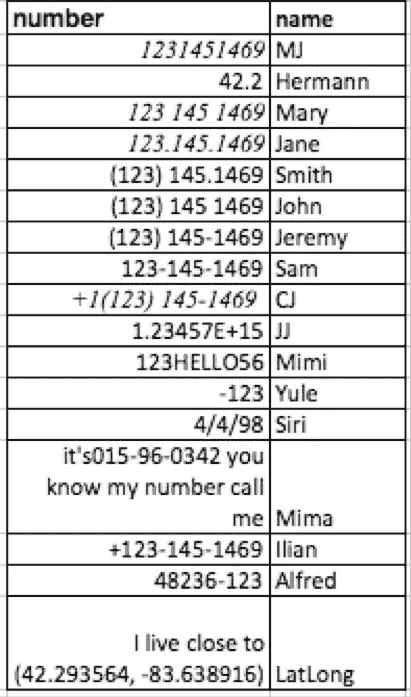

# 匿名数据集第 2 部分

> 原文：<https://towardsdatascience.com/anonymizing-data-sets-part-2-84b813a4ff7e?source=collection_archive---------28----------------------->

## 从数据中删除电子邮件、敏感号码、伊正和地址


由作者使用 Unsplash 的照片创建(照片由:Tarun Anand、Franck V .、宝琳娜·加西亚、Markus Spiske 提供)

回来的时候，一个同事让我帮忙匿名处理一些数据。他提供的数据集激起了我的兴趣，并引出了我们今天要讨论的一些内容。

当我们谈到匿名数据时，我们指的是删除个人信息或任何可用于识别或跟踪个人的信息。在某些情况下，这被称为个人身份信息(pii)。这些信息可能包括但不限于:姓名、电子邮件、地址、电话号码、地理位置、社会保险号(ssn)、车辆识别号、账号、身份证号、信用卡信息等

本文将向您介绍如何构建 python 查询，从数据集中提取这些项目。就范围而言，本文档采用正则表达式方法来识别和替换数据集或字符串中的电子邮件、敏感数字、vin 和地址。

**电子邮件**

电子邮件非常普遍，几乎在每个应用程序中都有使用。事实上，当大多数人发出电子邮件时，他们并没有意识到他们发出了大量的信息。虽然电子邮件可能对数据科学家有用，但为了赚钱或其他需要消除数据身份的目的，我们可能需要删除电子邮件数据，同时保留其余数据。使用简单的正则表达式函数可以帮助解决这个问题。

例如:


电子邮件示例 1，由作者创建

```
Note that in this case the regex is case insensitive. However, a space in the email such as *snubholic @yahoo.com* would change the results.
Code: *re.findall("\S+@\S+", dn)*
```

要用“xxx”替换字符串 *dn* 中出现的所有电子邮件地址，我们可以如下操作:


电子邮件示例 2，由作者创建

```
*Code: dn2 = re.sub(“\S+@\S+”, r’xxx’, dn)*
```

***敏感数字***

本节展示了如何从数据帧中移除敏感数字。这里使用的 regex 函数不包括电话号码、ssn、经度和纬度坐标、一些邮政编码等。

*演示:~*

```
*Creating the data set:**dat = {‘number’: [“1231451469”, “42.2”, “123 145 1469”, “123.145.1469”, “(123) 145.1469”, “(123) 145 1469”, “(123) 145–1469”, “123–145–1469”, “+1(123) 145–1469 “, “1234567890999111”, “123HELLO56”, “-123”, “04/04/1998”, “it’s015–96–0342 you know my number call me”, “+123–145–1469”, “48236–123”, “I live close to (42.293564, -83.638916)”], ‘name’: [“MJ”, “Hermann”, “Mary”, “Jane”, “Smith”, “John”, “Jeremy”,”Sam”, “CJ”, “JJ”, “Mimi”, “Yule”, “Siri”, “Mima”, “ilian”,”Alfred”, “Grid”]}**df = pd.DataFrame(dat)*
```

*Df 看起来像:*



作者创建的数字数据框架

*要查找上述所有敏感号码，请使用下面的函数:*

```
def patterner(x):
    mm = re.findall(r'[\+\(]?\d[\d .\-\(\)]{6,}', x)
    return mm
```

*要查找数据帧中的所有敏感数字并替换为 xxx，我们可以创建如下函数:*

```
def patterner2(x):
    mm = re.sub(r'[\+\(]?\d[\d .\-\(\)]{6,}',r'xxx', x)
    return mm
```

*要在数据集中创建一个新的列来替换所有敏感的数字，我们可以这样做:*

```
df['number2']= df['number'].apply(patterner2)
```

*这个查询的输出如下:*


替换列中的数字，由作者创建

关于上面的函数需要注意一些事情:它删除了数据帧中的所有电话号码格式——国内和国际，并删除了 latlong 坐标以及第 14 行(Mima 的行)上的 ssn 和第 15 行(Alfred 的行)上的 zipcode。但是，它不会删除小于 6 位的数字，但会删除所有大于 5 位的数字。

**车辆识别号:**

T 车辆识别号很敏感，因为一旦你买了一辆车，这个车辆识别号就和你的个人联系在一起了。当绑定到适当的数据时，它不仅可以用来跟踪你的移动模式，还可以跟踪你的家庭地址、注册和电话号码等。随着美国等发达国家越来越多的人(和组织)获得车辆以方便移动，并作为 covid 时代的一种预防措施，vin 号码变得越来越重要。我们可以从数据中删除 vin 号，如下所示。

演示:~

```
stringphrase = "hi, do you know whose is vin 1FA6P8CFGL5386177 and whose is MNAAXXMAWALE27598?"m = re.findall('[A-Za-z0-9]{1}[A-Za-z]{2}[A-Za-z0-9]{9}[\d+]{5}', stringphrase)
x= re.sub('[A-Za-z0-9]{1}[A-Za-z]{2}[A-Za-z0-9]{9}[\d+]{5}', r'xxx', stringphrase)
```

这给出了输出:

```
*“hi, do you know whose is vin xxx and whose is xxx?”*
```

**地址:**

对于许多企业来说，从数据帧中移除或替换地址是相当棘手的问题。这里，通过将正则表达式与列表理解和一些映射函数结合起来，我们能够从数据集中识别和删除几种不同的地址格式。

演示:~

创建您的数据集

```
data = {'addresstext': ["I had an ok experience and I live close by 2000 Vernier rd grosse pointe woods MI 48236\. I had a good time at 2999 vernier", "I used to know someone who lived at, 2025 magna rd grosse pointe MI 48237 they loved it and told us many cool stories about the lake","I liked their services 22000 moross rd, detroit MI 48236", "lots of diverse life experiences at 6233 orlina st, apt 1001, detroit MI 48217", "2013 1st ambonstreet", "245e ousterkade 9", "oh yeah, I had a great time at 20225 Liverni a really really good time" ], 'name': ["MJ", "Mary", "Killian", "Liroy","Alex", "Sammy", "Peter"]}
dff = pd.DataFrame(data)
```

创建的数据集如下所示:


示例地址数据框，由作者创建

*要识别地址，我们可以使用以下两个函数:艾迪和艾迪 2。第一个函数 addy 标识了地址，但也添加了额外的文本。第二个函数 addy2 清除 addy 并限制被标识为地址一部分的附加数据。*

```
def addy(x): ###returns addresses with a few extra characters
    mi = re.findall(r'\d+?[A-Za-z\-\,\ \d+]{4,}', x) 
    return mi
```

第二个功能:

```
def addy2(w):
    gm = re.sub(r'(\d\w+\b)\s+\b(\w+)\b\s+(\w+)\s+\b\D+$', r'\1 \2 \3', w)
    return gm
```

将这两个函数应用于数据集，如下所示:

```
dff['addressadd'] = dff['addresstext'].apply(addy)
dff['addressadd2']= dff['addressadd'].map(lambda x:[addy2(i) for i in x])
```

*这会产生输出:*


应用作者创建的 addy 函数

要替换数据集中的地址，使用下面的查询(注意列表理解和映射函数的使用消除了显式创建循环的需要并提高了速度) *:*

```
dff['testing2'] = dff.apply(lambda x: reduce(lambda a,r: a.replace(*r), list(product(x['addressadd2'], ['xxx'])), x['addresstext']), axis=1)
```

*输出如下所示:*


由作者创建的地址被替换时的输出

*注意，这些查询正确地替换了 dataframe 列中的所有地址，包括第一行中的两个地址。有一些小的数据丢失，因为一些额外的字也被替换为地址的一部分。在第 1 行中，“他们爱”和第 6 行中的“a”被捕获，并随后被替换为地址的一部分。然而，在这些大计划中，这些都是次要的，特别是考虑到留下地址的选择，以及潜在的诉讼或侵犯个人隐私。*

**把所有的东西放在一起**

A 在分别查看了每种类型的 pii 后，您可以将开发的功能转换成一个转换，并将其一次性应用于数据集。请记住，如果在具有数字列的数据集中包含要删除敏感数字的部分，则在应用函数或转换之前，应该排除数字列。同样在这里，我们创建了几个新列。当实现上面的查询时，不要忘记删除最终数据集中的初始列，以便它真正不包含个人身份数据。最后，在处理大型数据集时，直接使用 pyspark(或 scala)或将数据帧转换为 pyspark 数据帧并执行转换可能会更容易(您可能需要将大多数函数创建为 UDF)。

**鸣谢 **

这项工作是在 python 的[https://regex101.com](https://regex101.com)、excel 和 jupyter 笔记本的帮助下完成的。它还参考了几篇 stackoverflow 文章，包括[https://stack overflow . com/questions/34773317/python-pandas-removal-substring-using-other-column](https://stackoverflow.com/questions/34773317/python-pandas-removing-substring-using-another-column)