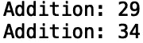

# Python 中的匿名函数

> 原文：<https://towardsdatascience.com/anonymous-functions-in-python-914a0a4b86ea?source=collection_archive---------34----------------------->

## Lambda 表达式简介


[来源](https://www.pexels.com/photo/photo-of-guy-fawkes-mask-with-red-flower-on-top-on-hand-38275/)

定义函数是软件编程的一个重要部分。定义简单函数的一种方法是匿名使用 lambda 表达式。例如，计算单个表达式的函数，如加法，可以用 lambda 表达式替换。在这篇文章中，我们将讨论如何使用 lambda 表达式定义匿名/内联函数。

我们开始吧！

假设我们有一个单行函数，它返回两个输入整数值之间的差:

```
def subtract(x, y):
    return x - y
```

如果我们用 x= 10 和 y =7 调用这个函数，并打印我们得到的返回值:

```
print("Difference:",subtract(10, 7))
```


由于这是一个简单的函数，它只对单个表达式“x-y”求值，因此可以用 lambda 表达式替换它:

```
subtract_value = lambda x, y: x - y 
```

lambda 表达式包含关键字“lambda”、输入 x 和 y、一个冒号以及我们想要计算的表达式。如果我们回头看看我们最初的函数定义:

```
def subtract(x, y):
    return x - y
```

我们看到这些表达看起来非常相似。最大的区别是在我们的 lambda 表达式中没有“def”关键字、“return”关键字和函数名。

让我们打印 x = 10 和 y = 7 作为输入的函数:

```
print("Difference:",subtract_value(10,7))
```


您可以将 lambda 表达式应用于更有趣的操作，如排序和数据简化。让我们考虑下面的编程语言创造者列表:

```
names = [**'**Guido van Rossum**',** 'Bjarne Stroustrup', 'James Gosling', 'Rasmus Lerdorf']
```

我们可以使用' sorted()'方法和 lambda 表达式，按照姓氏的字母顺序返回列表:

```
print(sorted(names, key = lambda name : name.split()[-1].lower()))
```


值得注意的是 lambda 表达式的局限性。因为我们只能计算单个表达式，所以像迭代、异常处理和条件这样的特性是无法指定的。尽管如此，lambda 表达式在代替评估单个表达式的单行函数时非常有用。

我们可以考虑的另一件事是如何在匿名函数中捕获变量。让我们定义一个整数 x = 5，并定义一个匿名函数，将 x 和另一个输入整数 y 相加:

```
x = 5
add = lambda y: x + y
```

让我们调用 y = 24 的函数:

```
print("Addition:", add(24))
```


如果我们改变下一行中 x 的值并调用我们的函数，我们得到:

```
x = 5
add = lambda y: x + y
print("Addition:", add(24))
x= 10
print("Addition:", add(24))
```



因为 lambda 表达式中使用的 x 是运行时绑定的自由变量，所以 x 的值是运行时的值。要让匿名函数在定义时捕获一个值，在本例中捕获 x = 5，我们必须包含 x 作为默认值:

```
x = 5
add = lambda y,x=x: x + y
print("Addition:", add(24))
x= 10
print("Addition:", add(24))
```


我们得到了我们想要的行为。我就讲到这里，但是我鼓励你自己去研究代码。

# 结论

总之，在这篇文章中，我们讨论了如何使用 lambda 表达式在 python 中定义匿名函数。如果您有一个包含许多计算单行表达式的函数的 python 脚本，那么用 lambda 表达式替换这些函数通常会更容易。此外，我们讨论了如何在 lambda 表达式中设置默认值，这允许我们在定义时捕获变量的值。如果你希望学习更多关于匿名函数的知识，我推荐你阅读 Python 食谱[*。我希望你觉得这篇文章有趣/有用。这篇文章中的代码可以在*](https://d.cxcore.net/Python/Python_Cookbook_3rd_Edition.pdf) *[GitHub](https://github.com/spierre91/medium_code/blob/master/basic_python/lambda_expressions.py) 上找到。感谢您的阅读！*