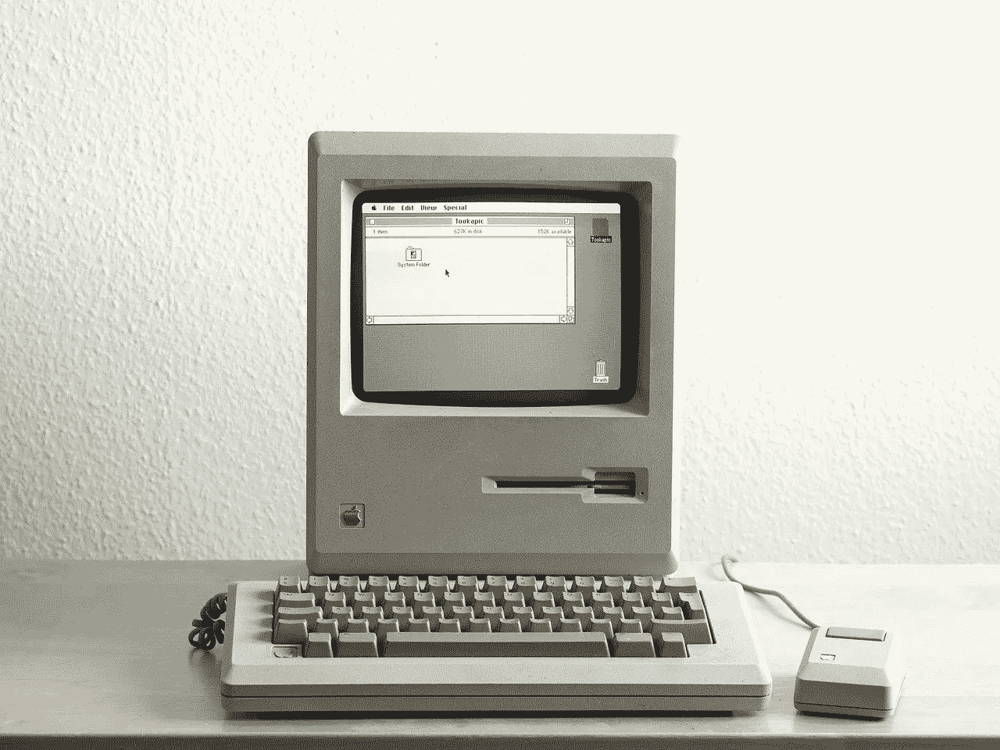
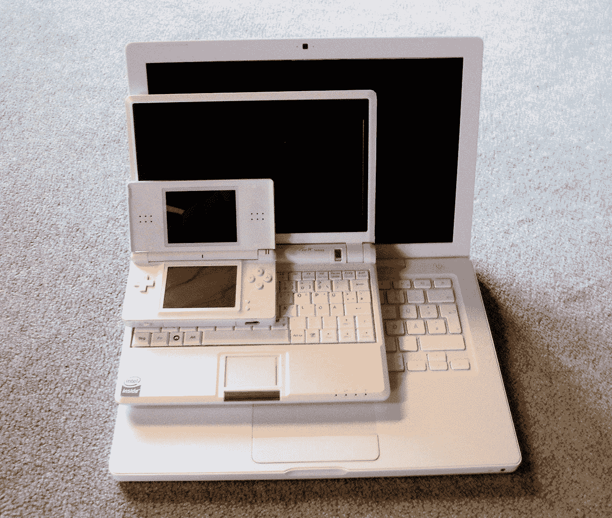
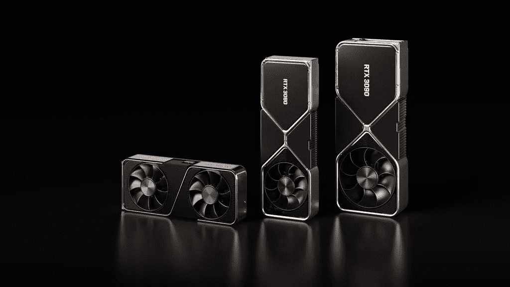
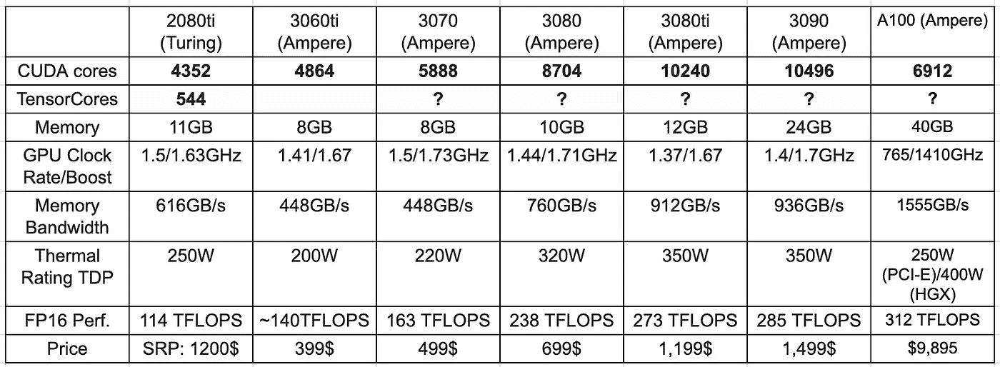
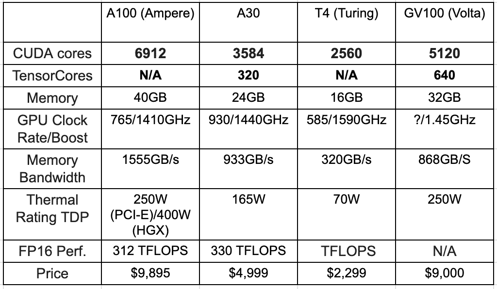
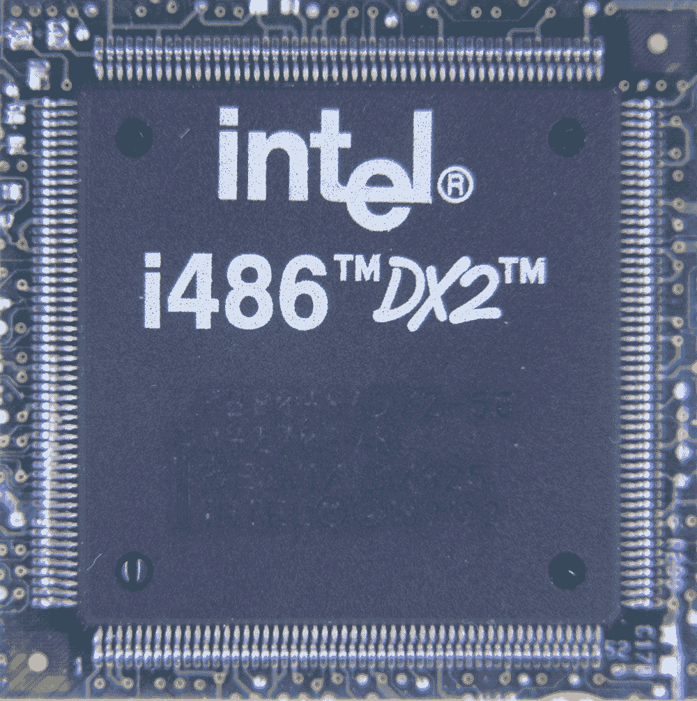

# 面向 2022 年的深度学习硬件指南

> 原文：<https://towardsdatascience.com/another-deep-learning-hardware-guide-73a4c35d3e86?source=collection_archive---------0----------------------->

## [理解大数据](https://towardsdatascience.com/tagged/making-sense-of-big-data)

## 什么是 GPU？为什么重要？我需要多少内存？你想更好地理解这些术语，甚至把它们用上吗？请继续阅读。

图片: [Pixabay](https://pixabay.com/photos/macintosh-computer-technology-2619617/)

*这是截至 2022 年 3 月 1 日*的最新数据

# 介绍

这是你们都知道和喜爱的旧版本的一个巨大的修改版本。本指南的几乎每一部分都被彻底重写。最初的指南已经更新了 6 年，所以我决定是时候基本上(几乎)从头开始写了。这一次，我试着让它变得更全面、更普遍。我会继续更新这个，但我也想确保我的读者能理解这个话题，即使有一天我不再这样做了。

*所以*，你决定要买一台专门训练机器学习模型的机器。或者，更确切地说，你在一个本指南的术语不断被抛出的组织中工作，你只是想知道更多关于它们的含义。这不是一个非常简单的话题，所以我决定写这篇指南。您可以从不同的角度讨论这些术语，本指南将解决其中一个问题。

*本文中各种表格的注释；我制作了它们，获得所有需要的信息花了一些时间。没有我的同意，请不要使用它们。*

# 我是谁？

我是 Nir Ben-Zvi，是一名深度学习研究人员，也是一名硬件爱好者，从初中时代开始，我会在朋友们打篮球的时候拆电脑(我也试过，很快又回到了硬件上)。

在过去的几年里，我为一些组织提供关于构建深度学习机器的建议，并最终决定将这些知识纳入指南。

今天，我是一名计算机视觉顾问，与各种公司和初创公司合作开发基于图像的产品。本指南的许多知识来自为我的各种客户构建深度学习机器的决策。

# 我如何维护本指南

我最初是在大约 5-6 年前用希伯来语写的这个指南(但是谁在数呢),从那时起我就确保它是最新的。这次我决定重写大部分内容。请注意，有些部分几乎没有改变一点，原因是我觉得他们仍然是相关的。

**令人惊讶的是，在过去的 4-5 年里，硬件几乎没有什么变化**。例如，在 2018 年 11 月至 2020 年 4 月期间，NVIDIA 根本没有更新其消费显卡(GeForce)系列*。另一方面，英特尔已经更新了两次桌面产品线*。另一件最终相当反气候的事情是 amd 新的消费级和服务器级处理器系列(我已经看到这是一个非常微妙的话题，所以以后会有更多的讨论)。**

****那么，为什么这份指南仍然有意义，是什么让它在一年后仍然有意义呢？嗯，首先，我会试着不时更新它，事实上，当一些特殊的事情影响到市场时，我会这样做。此外，我还删除了一些我认为过于针对特定代的部分。例如，英特尔刚刚宣布了其第 12 代硅胶，但我不太确定这是否会使构建 DL 机器与构建基于当前第 11 代的机器有太大不同，所以我试图使 CPU 讨论更加通用。如果几代人之间发生了剧烈的变化，我自然会做出必要的改变。****

****

**GPU-笔记本电脑超出了本文的范围。图片:[维基媒体](https://en.wikipedia.org/wiki/Subnotebook#/media/File:MacBookEeePCNintendoDS.JPG)**

# **关于 GPU 笔记本电脑的几句话**

****本指南不是用来选择笔记本电脑的。**在我看来，深度学习笔记本电脑已经不存在了，至少对于计算机视觉任务来说是这样。现代的 DL 型号太大了，不适合这种笔记本电脑，这种笔记本电脑通常配有针对游戏玩家的显卡(或者偶尔用于渲染任务或给 Photoshop 增添一些活力)。即使是最强大的游戏笔记本电脑，那些通常被称为“台式机替代品”(或 DTR)的笔记本电脑，也可能不足以在合理的时间范围内实际训练(甚至微调)基于 ResNet-101 的模型。**

**在谷歌提供基于 T4 和 P100 的 Colab 环境的日子里，我看不出有什么理由为 DL 购买一台强大的笔记本电脑。**

**你*仍然*希望你的笔记本电脑坚固；至少 16GB 内存和 4 个以上内核。但是它主要是一台运行终端到远程实例的机器。那些 16GBs 是给 Chrome 用的。顺便说一下，我用的是苹果电脑。**

**如果你还想要一台同样便携的 GPU 笔记本电脑，我会买刀片。讨论结束。你可以寻找其他面向游戏的钻机，但这将是我最喜欢的选择。**

# **便携显卡呢？**

**我承认我对这个领域不太熟悉，也没见过那些被用于非游戏目的的。它仍然是一个单一的显卡，从长远来看可能是不够的。**

# **那么，这本指南里有什么呢？**

****首先，我将选项分成四个“类别”:****

1.  **一台带有单个 GPU 的台式机**
2.  **一台与#1 相同的机器，但是具有 2 个 GPU 或者支持将来增加一个 GPU**
3.  **带有 4 个 GPU 的“重型”DL 台式机**
4.  **一台带有 8 个 GPU 的机架安装型机器(请参阅更多注释；您可能不会自己构建这一个)**

****

**机架安装通常安装在服务器机房中。图片: [Pixabay](https://pixabay.com/photos/computer-server-mainframe-computer-2777254/)**

# **在 8 GPU 机器和机架安装上**

**拥有 8 个以上 GPU 的机器可能最好从一些 OEM (Lambda Labs、Supermicro、HP、Gigabyte 等)购买预组装的。)因为建造它们很快就会变得昂贵和复杂，它们的维护也是如此。请注意，它们可能还需要在您的办公室中建立一个适度的服务器机房，并配备适当的冷却设备(以及用于所述冷却的故障安全设备)。这些东西非常非常吵，不应该放在人类附近。**

**理论上你可以自己建造一个——我见过这样做的——但在我看来，这里的金钱收益太微不足道了。我要指出的是，我们位于以色列，很难获得此类机器的部件(特别是 PSU 和机箱),需要从美国运输。由于这是英文指南，我会注意到，也许在你居住的地方建造这样一台机器会更容易、更便宜(如果你经常访问新蛋的话)。**

***不*建立一个额外的原因是原始设备制造商通常会给你一个非常需要的现场支持包。**

**因为最终这些很少是自建的，所以我不打算进一步讨论它们。**

# **我要哪个显卡？**

****TL；博士:你想要一个 3080/3080ti/3090** 。它们属于 NVIDIA 的系列(或一代)30 的卡。**

**不过，没那么快；由于持续的芯片短缺，实际上很难拿到卡。出于本指南的考虑，我假设你*能*，但实际上你可能不得不用可用的而不是最好的来建造你的装备。**

****

**图片:由英伟达提供**

# **NVIDIA 系列 3 讨论**

**NVIDIA 基于安培的系列 30 现在已经上市大约一年了，3060ti 和 3080ti 随后出现。让我们首先浏览这些部分，比较我认为重要的事情:**

****

**消费级卡与 A100 级数据中心的对比。图片:我。**

## **好吧，我迷路了！**

**那么我们这里有什么？最低端的部分，3070 应该以旧型号市场价的一半带来 2080ti 同等的性能。对于某些训练任务来说，较低的内存容量可能是一个问题。对于一个相当小的价格升级，3080 将提供明显更高的性能——NVIDIA 声称某些任务的两倍。**

## **3080**

**在 NVIDIA 最初发布后，当与 3090 抗衡时，3080 似乎是一个物有所值的选择(在 MSRP)。只需 700 美元，您就可以将 2080ti 的性能提高近一倍。它确实提供了更少的内存，但更高的速度应该仍然使它伟大。我的旧观点没有改变。**

## **3080ti**

**当最初宣布系列-30 时，大多数 DL 爱好者不得不在 3080 和 3090 之间进行选择。两者都有很多优点，并且在价格上有很大的差异，这使得它们非常适合不同的用户。此后，NVIDIA 宣布了介于两者之间且备受期待的 **3080ti** 。“ti”部分是否像前几代产品一样做出了显而易见的选择？我很快就会谈到这一点。**

**与 3090 相比，3080ti 基本上以略低的价格给*几乎*相同的性能，而内存只有一半。官方的 3090 规格要求您的主板上有三个插槽，但这一点自发布以来有所改变，使得这一限制不太相关。**

## **3090**

**就性价比而言，3090 *应该*是这一系列中最有趣的一款，但 350W 的功率有点挑战功率。当我最初写它的时候，我提到过双槽解决方案将会被强制采用。从那时起，技嘉，华硕和 EVGA 已经这样做了。我仍然反对购买(可能更便宜的)三插槽解决方案。350 瓦的功率仍然使使用这一部分很困难，但硬件支持在过去一年中有所改善。**

## **记忆**

**时代错误是可怕的；一年前我写道:**

***“24GB 内存很有意思，但如果在同一个机箱中安装 5 个 3090 而不是 8 个 3080，我认为系统制造商会选择后者，更便宜的卡。”***

**嗯，对于 3090 的两个插槽鼓风机解决方案，如果钱不是问题，您现在可以将 8 个 3090 放在同一个机箱中，在单台机器中获得令人难以置信的 192 GB GPU 内存。**

**另一件令人兴奋的事情是为更昂贵的变体选择的极快的 GDDR6X(从 GDDR6 开始)。这些是 3080、3080ti 和 3090。**

**我无法从新闻稿中获得内存带宽的数字，但这些卡将有惊人的快速内存接口，这可能会超过它们与 20 系列卡相比更低的内存大小。这听起来可能违反直觉，但如果卡可以从其内存中获取数据并足够快地处理它，那么对于类似的吞吐量(如果我们是为了训练或推断而测量每秒图像数)，它需要的内存就可以更少。**

## **那么我应该买哪一个呢？**

**先做最重要的事情；如果你想为了学习如何深度学习而买便宜的东西，我会买 3070。但这不是本指南的内容。**

**对于一家初创公司(或更大的公司)来说，为其渴望权力的研究人员构建严肃的深度学习机器，我会尽可能多地塞满 3090。双内存数字字面上的意思是你可以用一半的时间训练模型，这简直是物有所值。这也适用于构建单 GPU 或双 GPU 机器的人。如果你以此为生，3090 是一个惊人的价值。“只”少 300 美元，我看不出 3080 蒂适合那里。双内存是一件*大*的事情。**

**然而，如果 3080ti 已经超出了您的预算，那么它也是物有所值。**

**最后，最初的 3080 的建议零售价为 699 美元，对于那些最大限度地利用预算购买单个 GPU 平台的人来说，仍然是一个非常高的性价比——明白了吧。会很棒的。**

**从另一个角度来看。如果您选择 3080ti 还是 3080，并且预算不多，那么 3080 绝对物超所值，非常适合您。**

## **MSRP 制定计划，上帝笑了**

**我所有的建议都是基于 MSRPss 的，MSRP 有时会根据供求关系变化*很多*，尤其是在全球芯片短缺持续的时候。例如，如果 3090 的价格接近 2000 美元，那么 3080ti 马上就变得物超所值了。**

## **我应该从 20 系列升级吗？**

**不。不像从帕斯卡到图灵(1080ti 到 2080ti)的跳跃——这一代，至少在目前，提供了一个适度的减速带。三年前从 1080tis 移动到 2080tis 获得了*非常好的性能提升*，这是由于使用了混合精度训练或 FP16 推理——这要归功于他们新颖的 TensorCores。这一次，我们获得了通常的大约 30%的性能提升(当然，这取决于任务)，但除此之外别无其他。**

**在这一点上，我看不出有什么理由去买一个基于 2080ti 的系统，除非你能买到非常便宜的东西。**

# **我们来谈谈显卡**

## **卡代和系列**

**NVIDIA 通常区分消费级卡(称为 GeForce)和针对专业用户的专业卡。**

## **向夸德罗和特斯拉说再见**

**以前 NVIDIA 对 pro 级卡还有一个区分；Quadro 负责计算机图形任务，Tesla 负责深度学习。随着第 30 代的出现，这种情况发生了变化，NVIDIA 简单地使用前缀“A”来表示我们正在处理专业级卡(如 A100)。曾经的 Quadro 现在被简单地称为“Nvidia 工作站 GPU”，Teslas 是“Nvidia 数据中心 GPU”。面向 GCI 的 GPU 使用 Axxxx 名称，如 A6000，而深度学习的 GPU 使用 Axx 和 Axxx。**

**那么我们为什么不仅仅讨论那些“专业级”的 GPU 呢？嗯，它们非常昂贵，而且对于开发(和学习)来说也不太合理。数据中心目标卡*的*额定运行 24/7 多年，具有全球内部支持，有时还提供被动冷却解决方案——所有这些都是您肯定希望在您的最终产品中实现的，也是您没有看到 GCP 或 AWS 使用 GeForce 硬件的原因。嗯，这一点以及英伟达的 EULA 明确禁止这一事实。**

**目前这两个系列的性能领导者是 GeForce 3090 和 A100。还有 A40 和最近公布的 [A10](https://www.nvidia.com/en-us/data-center/products/a10-gpu/) 、 [A16](https://www.nvidia.com/en-us/data-center/products/a16-gpu/) 和 [A30](https://www.nvidia.com/en-us/data-center/products/a30-gpu/) 。虽然 A16 和 A40 不是为 DL 机器设计的，但 A10 和 A30 很有趣，我将在下面讨论它们。**

## **面向推理的卡片**

**一个直到最近才出现的美丽新世界。目前(不出所料)由英伟达(NVIDIA)用他们的 T4(图灵的“T”，意思是老一代)卡主导，有残缺的训练能力，但完全合理的推理速度。它仍然比 GeForce 2080ti/3080/3080ti/3090 贵，但如果你需要专业级的快速推理(被动冷却、强大的国际支持、鲁棒性等)，它是唯一的游戏。如果这不是你需要的东西，你现在可能已经知道了。对于 30 系列，NVIDIA 用 A30 取代了这一部分，但这不是一个确切的替代，因为它的价格更高，相对来说更强大。请参见下表，并将它们与其相关的顶级数据中心产品进行比较。**

****

**英伟达的推断——针对的部分。图片:我。**

## **图形/渲染卡**

**如上所述，“NVIDIA 工作站 GPU”(之前为 Quadro)是 Nvidia 的渲染目标级别的卡。理论上，它们不应该属于这里，但它们有时可以在更昂贵的数据中心卡(以前是特斯拉)和消费卡之间提供一个最佳性价比点。与消费级 GeForce 卡相比，它们对高强度负载的适应能力更强，但成本仍低于数据中心部件。我对它们不太熟悉，但我要指出，出于培训目的，我看不出有什么吸引力。对于推理任务，它们可以提供一个可行的替代方案，但同样，如果你去那里，你需要完全理解你在做什么，因为它们被“调整”以在渲染图形时达到最佳性能，而不是运行深度学习模型。**

**对于这一代(安培)，NVIDIA 已经宣布了几个部分——最初是 A40 和 A6000，接下来是 A4000 和 A5000。看起来 A40 和 A6000 在规格上几乎是一样的，最大的区别是 A40 将是被动冷却的。**

**除此之外，没有发布太多信息，但它们的目标是需要强大 GPU 处理渲染任务的数据中心，而不是 DL。如果它们最终比同等的 A100 更便宜，将来可能会有更多的理由讨论它们。下表将它们与上一代类似卡以及面向 DL 的同类产品 V100 和 A100 进行了比较。**

****

**NVIDIA 的面向渲染的显卡。图片:我。**

## **FP16 和张量核心**

**从之前的(20)系列卡开始，NVIDIA 的所有部件都有 TensorCores 以及 CUDA 核心。这些内核是用来运行单精度推理的。当最初引入时，这只是爆炸，因为性能似乎没有受到影响，而推理速度有时会翻倍(训练也变得更快)。**

**从第 30 代开始，这在某种程度上是一种规范，NVIDIA 在其营销材料中甚至没有提到不同张量核心的数量。**

**接下来的几代(图灵，有点像“第 20 代半”)也增加了对 8 位和 4 位推理的支持，但这些都需要仔细校准。**

## **关于 INT8 的更多信息**

**INT8 是一个复杂的问题，您的组织内部应该非常了解它。与迁移到几乎没有麻烦的半精度/FP16 不同，迁移到 INT8 可能会严重影响性能，应该将其视为一项新的研究任务，而不是一个快速的加速工程解决方案。**

## **NVLINK 将卡片连接在一起**

**NVLINK 是 NVIDIA 的一种硬件协议，允许连接他们的卡(两张或更多)并形成一个统一的内存池，这使他们可以在不“通过”CPU 内存的情况下进行通信。这实际上加速了许多计算，因此非常酷，但不幸的是，对于连接两个以上卡的 GeForce (ala 消费级)卡，它也被禁用。如果你只有两张卡，你仍然可以使用它(在消费级版本中称为 still 但如果超过两张，我真的不会介意。你的基于 2080ti/30XX 的 8 GPU 机器不支持 NVLINK，这有多糟糕？不太糟糕。对于需要 GPU 之间快速连接的应用(考虑同步批处理规范化)，这可能会提供不错的速度提升，但对于一般用途，您可以不使用它。**

****

**云实例是构建实例的替代方法，但是要知道成本。图片: [Pixabay](https://pixabay.com/vectors/cloud-cloud-computing-3311588/)**

# **那么云实例呢？**

**谷歌和亚马逊都在其云中提供 A100 和 V100 部件。微软还在一些地方添加了 V100 实例，但实际上在让人们在 8-GPU 设置中使用它们方面有极大的限制(我不再使用 Azure，如果有变化，请告诉我)。谷歌还提供 P100 basd 实例，这些实例非常物有所值。谷歌也提供他们自己的 TPU，速度非常快，如果你使用 TensorFlow，这是一个很好的解决方案。**

**尽管如此，快速数学将表明，如果你打算在大量 GPU 上训练模型，并且经常这样做*(这意味着这样的机器几乎在所有时间都将被充分利用)——从长远来看，购买顶级训练机器将更具成本效益。相反，如果您可能偶尔而不是一直训练模型，那么云实例肯定是更明智的选择。***

***或许最好的办法是*尝试*使用云实例几周，然后再做决定。另请注意，即使拥有大量内部实例的组织偶尔也会在高峰期使用基于云的实例。还需要注意的是，本地实例意味着您需要一个非常精通维护的人。损失 2-3 名数据科学家一天的工作可能比购买深度学习机器节省的钱要多得多。***

# **CPU 和 PCI-E 通道上的一点**

## **我需要多少个 CPU 内核？什么是 PCI-E 通道？**

**既然我们已经完成了图形卡的主题，我们可以转移到下一个部分——制造中的训练机器——中央处理器，或 CPU。**

**GPU 通常需要 16 个 PCI-Express 通道。PCI-Express 是 CPU 和 GPU 之间的主要连接。幸运的是，英特尔的大多数现成器件都支持这一点。
它连接*两张*通常会出现问题的卡，因为这需要 32 条通道——这是大多数廉价消费卡所缺乏的。转向 4 卡，我们将完全依赖昂贵的至强系列(针对服务器)卡。**

## **我真的需要那么多车道吗？**

**好吧，简单回答？不完全是。尽管我刚才说过，我们实际上通常可以用每个 GPU 个通道来进行训练和推理。据说，速度极其受限的任务(如低延迟交易)肯定需要所有 16 条受支持的通道。另请注意，如果您的卡支持的话，前面提到的 NVLINK 也消除了一些这种要求。**

**作为一般的经验法则，每个 GPU 不要低于 8 个通道。另一个需要注意的重要事项是需要 PCI-E 通道的其他部分，例如基于超高速 NMVe 的 SSD 驱动器。**

****

**图片:[维基媒体](https://commons.wikimedia.org/wiki/File:Ic-photo-Intel--SB80486DX2-50--(486-CPU).JPG)**

# **现在让我们选择一个 CPU**

## **英特尔酷睿系列 CPU**

**在本指南的第一次迭代中，英特尔以极具竞争力的价格提供了一些具有 28、40 和 44 个 PCI-E 通道的部件(这是第 8 代)。从那时起，更多代进入市场(12，阿尔德湖，刚刚宣布)，这些零件已被更昂贵的面向发烧友的“X 系列”零件所取代。反过来，这些部件现在是深度学习硬件的卫冕冠军，因为它们的速度和 PCI-E 通道丰富。**

**如果您计划构建一台具有单个 GPU 的机器，第 11 代的大多数 i7/i9 部件都有 20 个通道，将非常适合您。第 10 代仍然物有所值，它们都有 16 条车道。**

**如果你需要更多的 cowbell(或通道)，X 指定的部分有 48 个通道——足以容纳 4 个 GPU，每个 8 个通道，甚至还剩下一些能量用于一对基于 NVMe 的 SSD 驱动器。不过，到目前为止，它们只存在于第 10 代(冰湖)。最便宜的部分， [10900X](https://www.intel.com/content/www/us/en/products/sku/198019/intel-core-i910900x-xseries-processor-19-25m-cache-3-70-ghz/specifications.html) ，拥有 48 个通道和 10 个内核，[随后是 12、16 和 18 个内核部分](https://www.intel.com/content/www/us/en/products/details/processors/core/x.html)。英特尔似乎无意为其当前的第 11 代(Rocket Lake)CPU 引入 X 系列。
英特尔 Ice Lake CPUs 也为在 CPU 上运行深度模型提供了广泛的硬件支持。如果你对这类东西感兴趣，我建议你多读一些，了解它是否有益。**

**在继续之前，请确保您完全了解 CPU 插座是如何工作的。我假设读者在这个阶段知道这意味着什么。x 系列部件使用更复杂的插座排列，这反过来需要更昂贵的主板。因为我们一开始就在讨论非常昂贵的机器，所以这在实践中不会有很大的不同。**

## **至强系列 CPU**

**前面简单提到的*至强*CPU 是英特尔用于服务器和数据中心的系列 CPU(与用于台式机的*内核*不同)。由于讨论之外的各种原因，它们更贵。除此之外，它们还支持多 CPU 设置，这反过来可以为您可能想要和需要的每个 GPU 提供完整的 16 个 PCI-E 通道(因为您可以组合几个 CPU 及其各自的通道)。同样重要的是，这些 CPU 的弹性要高得多，类似于 NVIDIA 的数据中心系列 GPU 和消费级 GeForce GPUs，应该能够长期承受更高的计算负载。**

**同样值得注意的是，至强处理器会因为几个不同的原因增加系统的整体价格:**

*   **Xeons 需要 ECC(纠错码)内存，比较贵。**
*   **支持 Xeons 的内存、主板和机箱往往更贵(但更有弹性)。**
*   **与同等的酷睿 i7/i9 部件相比，至强部件本身*要贵得多*。**

**尽管如此，如果您关心在 24/7 极端负载下运行的多 CPU 系统，您可能需要基于至强的机器。基于至强处理器的机器在过去实际上更受欢迎，但从那时起，英特尔添加了前面提到的 i9-X CPU，具有大量 PCI-E 通道，可满足大多数消费者/发烧友的需求。在继续之前，我必须承认，我在构建基于至强处理器的机器方面知识不足，无法推荐一款物有所值的 CPU。最重要的是，至强处理器有许多不同的选择*。*比消费级 CPU 多得多*。大幅提高其价格的一个因素是支持的 CPU 连接数(一些支持双 CPU 系统，而另一些支持 4 和 8 CPU 配置，成本明显更高)。它们还具有更大的缓存大小，这实际上对各种任务有很大帮助，但这也超出了本文的范围。***

**如果您正在构建一台 8 GPU 的机器，那么您将 100%依赖至强处理器来实现 8×8 PCI-E 通道(=总共 64 个)。除非你去 AMD，那是。**

## **那么，AMD 在哪里？**

> **这是自 2018 年 11 月以来没有更新过的，将保持原样。请不要杀我，AMD 粉丝们！**
> 
> **更新:现在确实好像有人在用 AMD CPUs 造 DL 机；如果需求上升，我可能真的要重写这个。**

**好吧，AMD 提供的东西——至少在纸面上——本应该彻底改变整个行业，但实际上并没有。那就是它的 Epyc 命名的面向服务器的 CPU 系列，以及附带的名为 Threadripper 的消费级部件。这两者分别提供了 128 和 64 个 PCI-E 通道——有可能将英特尔打得落花流水。这些处理器还拥有大量内核(多达 32 个)，比同等价格的英特尔 CPU 多得多。那么，为什么这些产品没有风靡市场呢？**

*   **较低的单 CPU 性能(对于许多不喜欢并行化的任务来说很重要)**
*   **人们通常比较保守，不愿意采用不太受欢迎的公司的新硬件(在服务器领域；消费者领域，尤其是游戏玩家，对 AMD 非常熟悉，多年来一直如此)**
*   **大量科学计算库大量使用 MKL 加速；只有英特尔在其 CPU 中支持的东西；一个显著的例子是 OpenCV**
*   **PCI-Express 通道丰富并不像听起来那么简单，我将解释:**

**因此，不像英特尔在 CPU 和主板之间有自己的专有连接，AMD 的 CPU 实际上使用 PCI-Express。这意味着一个 64 通道的 CPU 实际上只有 56 个可用通道。这反过来意味着，对于 4 张卡，你又剩下一个 16x/16x/8x/8x 配置。这仍然很棒，超过了英特尔所能提供的，但与英特尔的 i9 CPUs 相比，这不算什么问题。此外，当建造一台价值数千美元的机器时，为一个更便宜的 CPU 节省 400-500 美元也许并不重要。**

**因此，事实证明，AMD 仍然主要与英特尔在游戏机方面竞争，或者与那些大量节省几百美元的人竞争。此外，对于构建双 GPU 机器，我可能会选择他们，因为与整体系统价格相比，2x16 PCI-E 和 CPU 的节省更大。**

## **关于内存(RAM)的说明**

**即使某个 CPU 适合(物理上，插槽方面)特定的主板，而主板又支持大量内存(同样，物理上，通过大量插槽)，CPU 本身仍然有可能不适合。CPU 之间的区别因素之一(就价格而言)是它们支持大量内存的能力。64+ GB 内存通常只有昂贵的 CPU 支持。**

# **关于硬件的更多信息**

**由于内存和主板会随着硬件的更新而不断更新，因此要保持与时俱进有点困难。它们也(在我看来)不那么令人兴奋和有趣。**

**我给你的建议？在选择 CPU/GPU 之后，了解您的其他需求，并选择支持这些需求的好主板。仔细阅读小字，检查它是否支持您需要它支持的内容。一些常见的错误是:**

*   **购买显卡插槽数量不足的主板。**
*   **显卡插槽之间没有足够的空间(由于巨大的冷却解决方案，我们正在处理的 GPU 需要两个插槽)。**
*   **购买不支持我们想要购买的内存类型的主板。**

# **底板**

**支持最新和最好的主板往往是相似的，价格也差不多。去一家领先的公司；微星，华硕，技嘉等等。正如多次提到的，确保它支持 CPU 插槽、内存数量和类型，以及所需的 PCI-E 插槽数量、间距和通道数量。关于通道的数量，请注意，一些主板具有 GPU 兼容插槽，实际上不允许完整的 8/16 PCI-E 通道通过(它们下面是 x4 通道)。避开那些。至于具体的品牌——请看下一个芯片组。请注意，大多数主板，除了最昂贵的版本，通常只支持 3 个 GPU。**

## **在芯片组上**

**TLDR:你想购买的相关芯片组是用于最新英特尔 X 型号的 X299 系列和(巧合的是)用于 AMD CPUs 的 X399 系列。**

**像前面的 CPU 及其主板一样，芯片组是主板的重要组成部分，实际上是它支持各种 CPU 功能。领先品牌的旗舰主板通常会包含最新、最好的芯片组，从而支持您所需的一切。**

**CPU 制造商使用不同的“插座”将其 CPU 连接到主板。这些通常用“LGA2066”这样的术语来表示，这意味着处理器和插座之间的物理连接(引脚)数量。LGA 的意思是“陆地网格阵列”，意味着引脚实际上是主板的一部分，而不是 CPU 的一部分(过去是反过来的)。**

**[英特尔第 10 代和第 11 代使用](https://www.intel.com/content/www/us/en/support/articles/000056574/processors.html)插座 LGA1200，取代了第 9 代之前使用的旧插座 LGA1151。对于 X-parts(也称为高端台式机的 HEDT ),由于其高功率要求，它使用了不同的插座配置——LGA 2066，它仍然存在，但应该会在不久的将来被取代。选择主板时要知道这些数字。**

# **记忆**

**一般的经验法则是 CPU 内存是 GPU 内存的两倍。因此，对于四个 2080，我将得到 2x11x4 = 88GB 的内存。由于内存倾向于以 16GB 为增量，我们可能会有一个 96GB 的内存机器用于这样的配置。在我的头顶上统治着记忆制造者；海盗船(已经在上面好几年了！)，HyperX，Patriot，G.Skill，还有 A-Data 在预算端的事情。**

# **电源装置— PSU**

**你的电源应该能够承载你正在建造的机器的疯狂的电力需求。拥有两个以上 GPU 的机器通常会有两个独立的电源。因此，如果您计划在将来添加更多的卡，请确保您的盘柜支持第二个 PSU，以供以后使用。两台 GPU 机器可以满足于单个 1000W PSU。PSU 的优秀制造商有 Antec、CoolerMaster、Corsair、SeaSonic、EVGA 等。**

# **冷却/外壳**

**假设这整个机器将在它自己的单独的、良好冷却的房间里，我们真的不需要专门的冷却解决方案。如果不行，你会想要一个足够安静的工作环境。**

**至于机箱，您会想要一个便于安装所有东西的机箱，并且偶尔会打开进行修复/硬件更换。还要注意，与附件捆绑在一起的 PSU 通常是垃圾——除非它们来自*真正的*公司。**

# **硬盘驱动器**

**这归结为预算。便宜的选择是为当前使用的数据集提供良好、快速的 1TB SSD，为常规、较慢和较便宜的存储(模型检查点等)提供 4tb 以上的 SSD。**

**如果预算不成问题，当然最好只购买快速固态硬盘。由于价格往往会一直下降，如果你想挥霍，你肯定可以购买更多的固态硬盘。同样值得一提的是备份；如果您绝对不能承受数据丢失，那么考虑一个 [RAID](https://en.wikipedia.org/wiki/RAID) 解决方案(超出了本文的范围)。**

# **结束语—游戏机**

**上面描述的一批*硬件与流行的高端游戏机有很多共同点。除了非常夸张的 GPU 设置之外，大多数组件(主板、RAM、PSU 等)在高端游戏设置中都会感觉很舒服。如果你在谷歌搜索这里的所有信息时遇到了一些问题，将“深度学习”改为“游戏”，你就能找到答案了***

# **祝你好运！**

****

**图片: [YouTube/Nvidia](https://www.youtube.com/watch?v=So7TNRhIYJ8)**