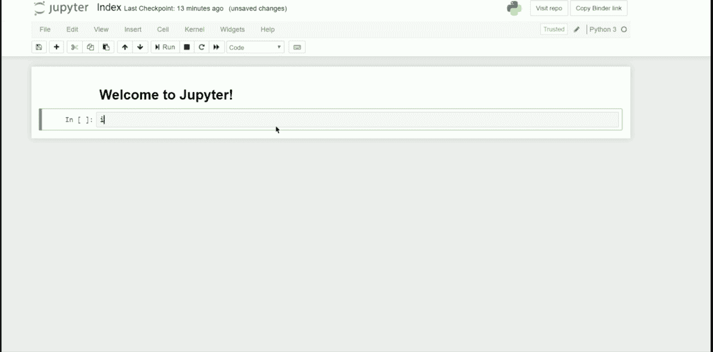
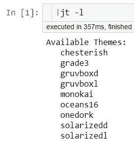
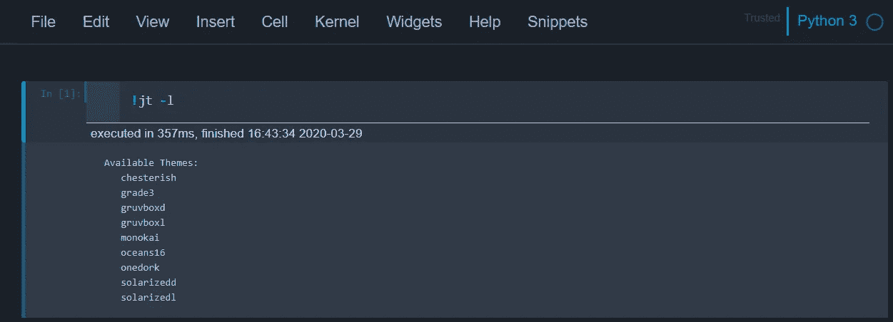
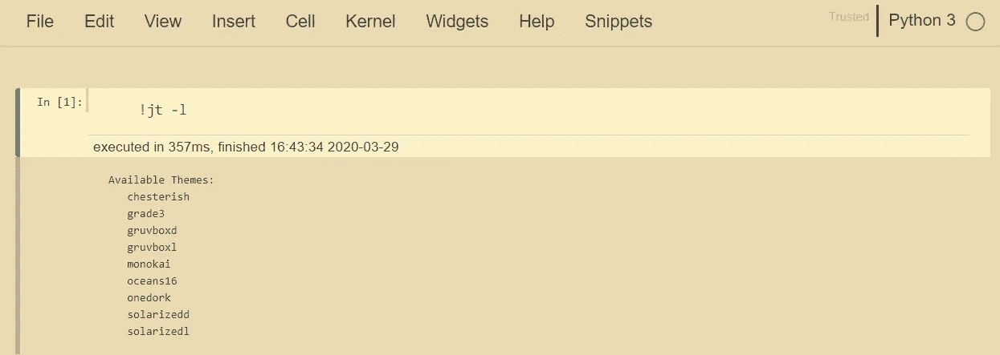
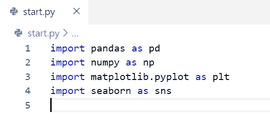
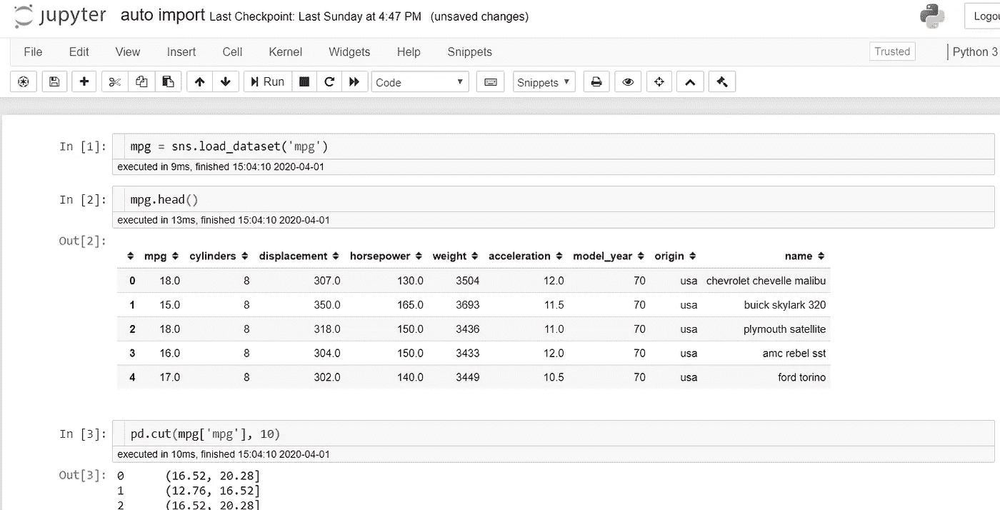
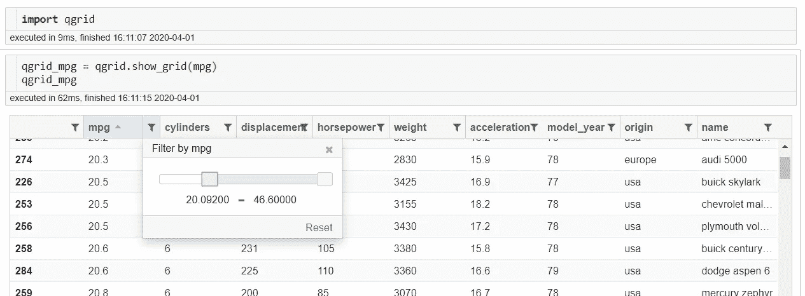
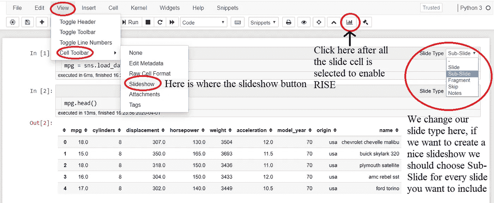
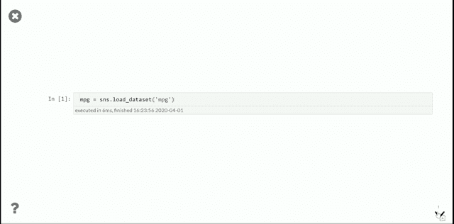

# 提升 Jupyter 笔记本体验的另一种方式

> 原文：<https://towardsdatascience.com/another-way-to-elevate-your-jupyter-notebook-experience-1965991d4269?source=collection_archive---------38----------------------->

## 增强 jupyter 笔记本电脑的额外有用功能没有被充分提及



我已经写了一些将在我们的 Jupyter 笔记本上实现的最有用的特性[这里](/elevate-your-jupyter-notebook-environment-experience-9bdd1101aa54)，但是我想把它扩展成一些很少在 Jupyter 笔记本上实现的特性(或者至少在我的知识范围内)。这就是了。

# **丘比特主题**

如果你不喜欢香草 jupyter 主题，或者只是厌倦了它，你实际上可以改变主题。虽然，我很少改变我的 Jupyter 笔记本主题，因为我更喜欢默认形式。作为初学者，需要先安装必备模块。

```
**# install jupyterthemes**
pip install jupyterthemes
```

如果你想访问所有的 jupyterthemes 文档，你可以在这里阅读。

要使用 jupyterthemes 修改我们的 jupyter 笔记本环境，我们可以使用 jupyter 笔记本或使用 CLI。让我们尝试查看所有可用的主题。在 CLI 中，我们使用 jt 命令访问 jupyterthemes。通过使用！在 jupyter 笔记本上，我们可以像在 CLI 中一样输入

```
**#accessing all the jupyter themes**!jt -l
```



jupyterthemes 中所有可用的主题

如果我们想改变我们的主题，我们可以使用下面的命令。

```
**#For example, I want to change it to chesterish theme**
!jt -t chesterish
```



切斯特主题

```
**#Or change it to gruvboxl theme**
!jt -t gruvboxl
```



Gruvboxl 主题

如果您想恢复到默认主题，您只需输入这一行。

```
**#Reset the change**
!jt -r
```

就这样，我们回到了最初的主题。我个人更喜欢默认的主题，因为颜色对我的眼睛很好，如果你意识到当我们改变主题；所有常用的快捷图标都不见了。我是那种喜欢使用图标而不是键盘快捷键的人，这就是为什么我更喜欢默认的那个。

# 自动导入

如果你懒得在 Jupyter 笔记本上输入每一个你会用到的重要库(比如 Pandas，Numpy，Matplotlib 等等。)，我们实际上可以建立一个环境，在这个环境中，我们已经将所有这些库导入到我们的 Jupyter 笔记本中。从技术上讲，我将在这一部分解释的内容并不是任何可用扩展的一部分，但它仍然是提升我们 Jupyter 笔记本体验的一种方式。

这些步骤非常简单，它们是:

1.  找到`~/.ipython/profile_default`文件夹，它通常在你的用户文件夹中
2.  在文件夹中，如果没有名为“启动”的文件夹，请创建一个
3.  在启动文件夹中，创建一个新的 python 文件(你可以给它起任何名字，但是我更喜欢把它命名为`start.py`
4.  在这个文件中写下你想要导入的库，每次你启动 Jupyter notebook 时，它都会自动导入

例如，在 start.py 中，我将这样编写我的自动导入库



当我启动我的笔记本时，我不需要导入上面的这些库，直接完成我的工作。



我的 jupyter 笔记本自动导入示例

如果您想确认库是否已经被加载，您可以通过使用 Jupyter 笔记本中的`globals()`来检查环境。

# Qgrid

Qgrid 是一个 Jupyter 笔记本部件，它改进了我们的熊猫数据框布局。这个小部件允许我们滚动、排序和过滤控件，以及通过双击单元格来编辑数据框。要启用 qgrid，我们需要先安装它。

```
pip install qgridjupyter nbextension enable --py --sys-prefix qgrid**# only for the first time if you have not enabled the ipywidgets nbextension**
jupyter nbextension enable --py --sys-prefix widgetsnbextension
```

下面是我们如何使用 qgrid 的一个例子。



仅仅通过使用 qgrid 中的函数`show_grid`,我们已经有了一个不同于默认的 Dataframe 体验。在这里，我们可以更加灵活地对数据进行排序和过滤。

# **崛起**

RISE 是一个插件，可以将我们的 Jupyter Cell 笔记本创建和编辑成交互式幻灯片。如果你意识到我们可以在我们的 Jupyter 笔记本中创建一个幻灯片，它位于视图->单元格工具栏->幻灯片。这种方法的缺点是，我们需要在单独的屏幕上运行额外的命令来创建幻灯片，并且单元格不可调整。

这就是 RISE 的用武之地，通过使用这个插件，我们可以在我们的 Jupyter 笔记本上创建一个交互式幻灯片。首先，我们需要安装并启用所有重要的东西。

```
**#Installing using conda**
conda install -c damianavila82 rise**#or using pip**
pip install rise**#enable the nbextension:**
jupyter-nbextension install rise --py --sys-prefixjupyter-nbextension enable rise --py --sys-prefix
```

现在我们准备使用 RISE 来创建我们的幻灯片。这是它的工作原理。



如何创建幻灯片

下面是我们创建完幻灯片并使用上升后的样子。使用 RISE 的最大好处是，我们可以在幻灯片放映期间编辑代码。



# 结论

在这里，我向您展示了一些在 Jupyter Notebook 中很少使用但实际上在我们的日常数据科学工作中非常有用的功能。希望有帮助！

# 如果你喜欢我的内容，并想获得更多关于数据或作为数据科学家的日常生活的深入知识，请考虑在这里订阅我的[时事通讯。](https://cornellius.substack.com/welcome)

> 如果您没有订阅为中等会员，请考虑通过[我的推荐](https://cornelliusyudhawijaya.medium.com/membership)订阅。