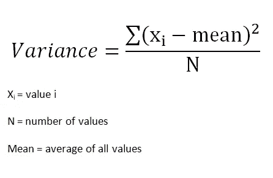
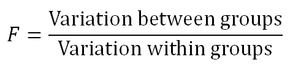
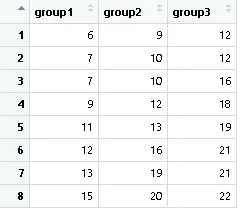
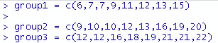
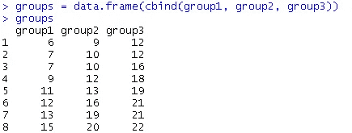
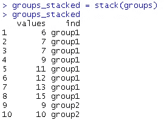
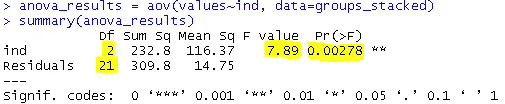
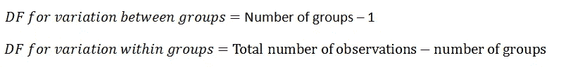
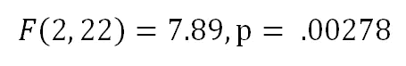
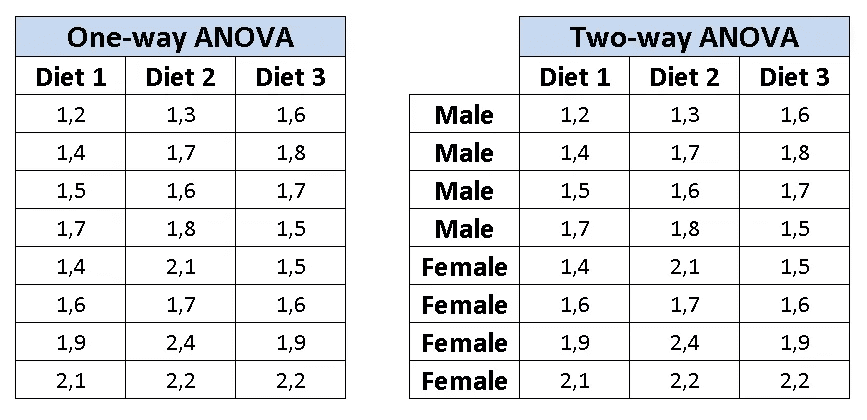

# ANOVA(方差分析)-解释

> 原文：<https://towardsdatascience.com/anova-analysis-of-variance-explained-b48fee6380af?source=collection_archive---------12----------------------->

## 详细的解释和一个 R 的例子

亨利·洛伦扎托在 [Unsplash](https://unsplash.com/s/photos/variety?utm_source=unsplash&utm_medium=referral&utm_content=creditCopyText) 上拍摄的照片

ANOVA 代表方差分析，顾名思义，它帮助我们理解和比较不同组之间的方差。在详细讨论方差分析之前，让我们记住统计学中的几个术语:

*   **表示**:所有数值的平均值。
*   **方差**:值之间变化的度量。计算方法是将每个值和平均值的平方差相加，然后将总和除以样本数。

*   **标准差**:方差的平方根。

为了理解方差分析或其他一些统计检验背后的动机，我们应该学习两个简单的术语:总体和样本。

**群体**是一个群体中的所有元素。举个例子，

*   美国大学生是指包括美国所有大学生在内的人口。
*   欧洲的 25 岁人群包括了所有符合描述的人。

对人口进行分析并不总是可行或可能的，因为我们无法收集人口的所有数据。因此，我们使用样本。

**样本**是总体的子集。举个例子，

*   美国 1000 名大学生是“美国大学生”人口的一个子集。

> 进行统计测试是为了观察使用样本计算的结果是否适用于整个人群。

当我们比较两个样本(或组)时，可以用 **t 检验**来看组的均值是否有差异。当我们有两个以上的组时，t-test 不是最优选择，因为我们需要分别对成对进行 t-test。假设我们有 A 组、B 组和 C 组。为了能够比较平均值，我们需要对 A-B、A-C 组和 B-C 组进行 t 检验。随着组数的增加，这变得更加难以管理。

在比较三组或更多组的情况下，ANOVA 是优选的。方差分析有两个要素:

*   各组内的差异
*   组间差异

ANOVA 测试结果基于 F 比率，即组间差异与组内差异的比率。

f 比率表明总变异有多少来自组间变异，有多少来自组内变异。如果大部分差异来自组间的差异，则更有可能是组的平均值不同。然而，如果大多数的变化来自于组内的变化，那么我们可以得出结论，一个组中的元素是不同的，而不是整个组。F 比率越大，各组的均值越有可能不同。

让我们看一个例子。假设我们有 3 组 8 个观察值:

我们想进行方差分析测试，看看这些组是否不同。我将使用 R，但也可以在任何软件包上随意使用。我们从创建组开始:

然后合并各组:

然后将组堆叠在框架中:

然后用一行代码执行 ANOVA:

让我们回顾一下结果:

*   f 值为 7.89，表明各组不同。大于 1 的 f 值表示至少一个组不同于其他组。
*   p 值非常小，表明结果具有统计学意义(即不是由于随机机会产生的)。通常，p 值小于 0.05 的结果被认为具有统计学意义。
*   Df 是自由度。第一行是组间差异，第二行是组内差异，计算如下:

共有 3 组，共 24 个观察值。所以第一行是 2，第二行是 22。我们可以将结果表示为:

到目前为止，我们所做的是一个**单向 ANOVA** 测试，它基于一个独立变量比较三个或更多组的平均值。还有一个**双向 ANOVA** 测试，根据两个独立变量比较三组或更多组。

考虑一个营养师想要分析三个不同组的减肥情况。他/她准备了三种不同的饮食，每组喂食不同的饮食。在这种情况下，如果各组中的平均体重减轻不同，则单向 ANOVA 测试适于检查平均体重减轻。如果营养学家也想知道一组中男性和女性的平均体重减轻是否不同，那么双向方差分析测试是合适的。性别和饮食类型是这个双向方差分析测试的因素。

减肥的单向与双向方差分析

感谢您的阅读。如果您有任何反馈，请告诉我。