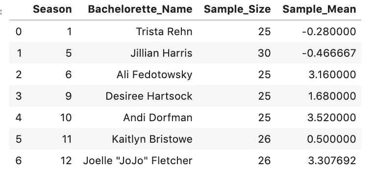
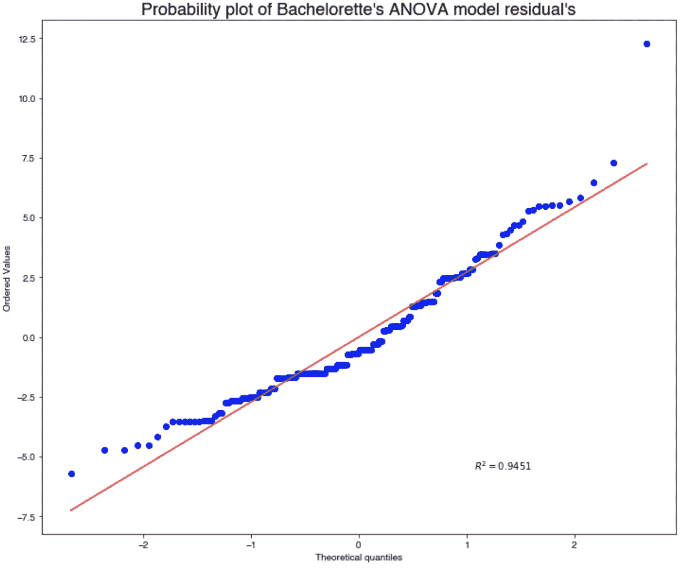
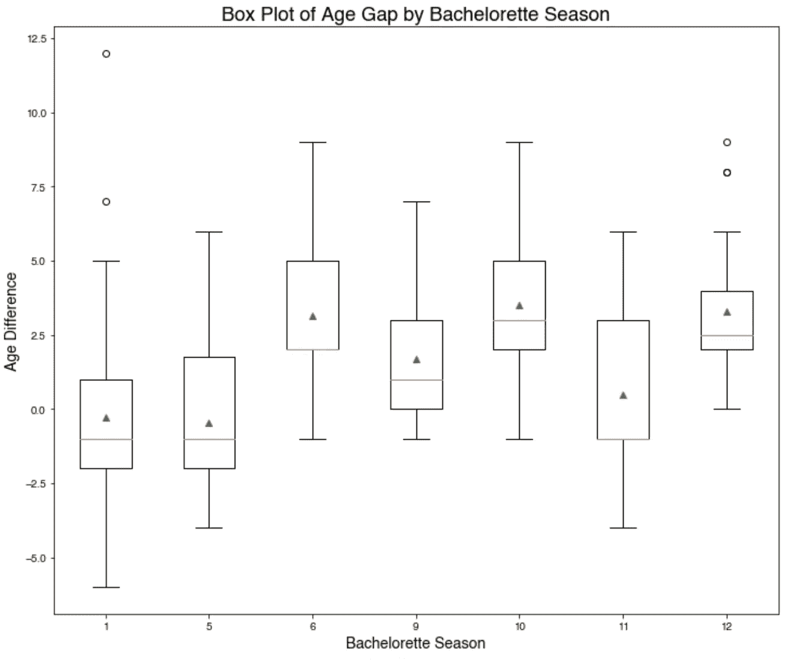
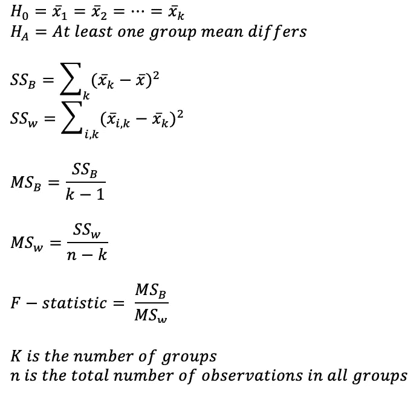
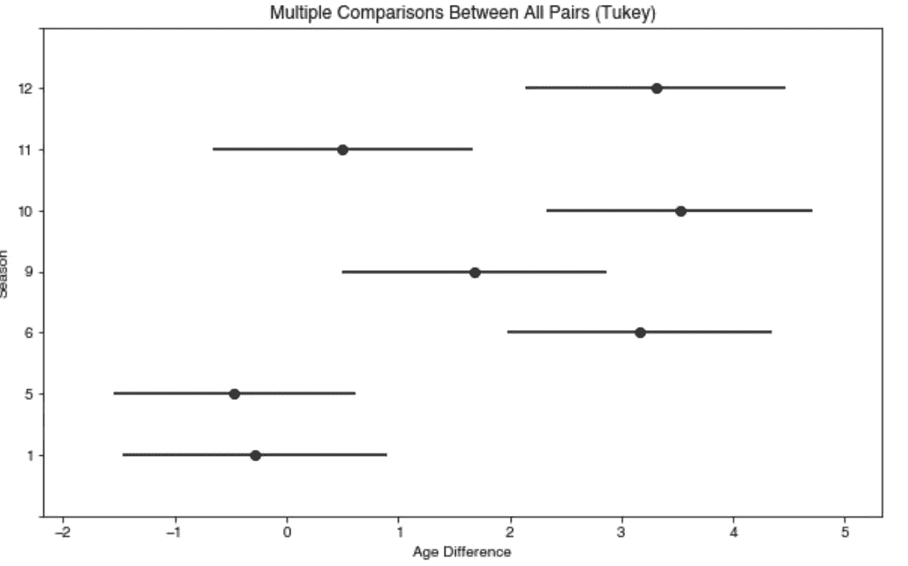

# ANOVA 在单身女郎电视节目中向初学者解释

> 原文：<https://towardsdatascience.com/anova-explained-for-beginners-with-the-bachelorette-tv-show-8503c4aaba10?source=collection_archive---------19----------------------->

## 又名如何自娱自乐与统计在疫情

杰里·克莱恩在 [Unsplash](https://unsplash.com/s/photos/red-rose?utm_source=unsplash&utm_medium=referral&utm_content=creditCopyText) 上的照片

单向 ANOVA(方差分析)是一种参数检验，用于检验 3 个或更多组之间结果的统计显著性差异。ANOVA 测试总体差异，即至少一个组在统计上显著不同于其他组。然而，如果方差分析是显著的，你不能告诉哪组是不同的。你需要事后比较来确定。

我想看看不同季的未婚女子和参赛者之间的年龄差距，看看不同季之间的年龄差距是否有统计学上的显著差异。在这个非常重要的分析中，我将向您介绍:

*   数据
*   假设检验
*   单向 ANOVA 检验
*   事后分析

# 数据

我在 [Kaggle](https://www.kaggle.com/brianbgonz/the-bachelorette-contestants/kernels) 上发现了这个非常孤独的数据🌹。经过一些清理和合并，它看起来像这样:

一些人已经调查了参赛者主要来自哪里，所以我想还有什么值得探索的🤔。我决定调查未婚女子和参赛者之间的年龄差距，看看这个节目是否随着时间的推移而改变，或者他们是否试图在每一季保持相同的年龄差距！重要的东西！！

这里快速看一下每个赛季的参赛选手数量(样本大小)和平均年龄差距。不幸的是，《单身女郎时代》在某些季中缺失了，留给我们的只有七个组合(第 1、5、6、9、10、11 和 12 季)。

# 假设检验

我们需要检查三个假设，以使用非参数统计检验，如 Welch 的 ANOVA 或 Kruskal-Wallis ANOVA:
**1。独立性:**这意味着所有的群体都是相互排斥的，即一个个体只能属于一个群体。此外，数据不是重复测量的(不是通过时间收集的)。在这个例子中，满足了这个条件。
**2。正态性:**对于方差分析或回归模型，我们可以通过查看模型残差来检验这一点。每个残差是输入值和该组所有值的平均值之间的差值。我们将使用图形方法，概率图。
**3。方差的同质性:**我们需要确保所有组都有相等的方差。检验这一假设的一种方法是 Levene 的方差齐性检验。

## 正态—概率图

概率图根据理论分布绘制有序数据。有序数据与理论分布拟合得越好，与位于图表中间的拟合线的偏差就越小。根据该图，在给定大样本量(n>30)的情况下，有理由声明满足正态性假设。然而，查看绘制的概率图和剩余结构，转换数据进行分析，或使用非参数统计检验，如 Welch 的 ANOVA 或 Kruskal-Wallis ANOVA，也是合理的。

## 方差齐性——Levene 检验

使用 Levene 检验，我们得到(统计值=0.9092，p 值=0.4895)。p 值大于 0.05，这表明各组的变异性无统计学显著差异。同样，也有必要从视觉上检查这个假设。

方差齐性的图形检验支持统计检验结果，即各组具有相等的方差。
默认情况下，箱形图显示中值(上图中的橙色线)。绿色三角形是每组的平均值。

# 单向方差分析

让我们从定义零假设和替代假设开始。在这个例子中，零假设是平均年龄差距在所有季节都是相同的，而另一个假设是至少一个季节的平均年龄差距在统计上显著不同于其他季节。

然后，我们需要继续计算一些统计数据，包括 F 统计、F 临界、样本间平方和(SSB)、样本内平方和(SSW)、样本间均方(MSB)、样本内均方(MSW)。

在我们的单身女子的例子中，我们有 7 个季节。所以我们的 k=7，总共有 182 个参赛者，这意味着 n = 182。你可以得到

查看[源代码](https://github.com/nzinouri21/ANOVA_the_Bachelorette_show/blob/master/Bachelor_Bachelorette_Analysis.ipynb),逐步手动计算这些统计数据。对于本故事的其余部分，我将使用 statsmodel ANOVA 测试和汇总统计的输出。

我们拒绝零假设，H0，如果计算的 F-static 大于临界 F-statistic。临界 F 统计量由自由度(k-1=6，n-k=175)和α决定，我选择α=0.05。你可以使用一个[在线 F 分布计算器](https://stattrek.com/online-calculator/f-distribution.aspx)来得到 F 临界，这里是 2.15。从 stats.f_oneway，我们得到 F _ one way result(statistic = 10.0375，pvalue=1.5990495398830284e-09)。您可以看到计算出的 F 统计值大于 F 临界，因此我们拒绝零假设，这意味着这些季节中至少有一个季节的平均年龄差距明显不同于其他季节。

在 [Unsplash](https://unsplash.com/s/photos/couple?utm_source=unsplash&utm_medium=referral&utm_content=creditCopyText) 上 [Pablo Heimplatz](https://unsplash.com/@pabloheimplatz?utm_source=unsplash&utm_medium=referral&utm_content=creditCopyText) 拍摄的照片

# 事后分析

现在让我们看看哪些季节不同，哪些季节大同小异！

## **Tukey 诚实显著差异(HSD)**

tukey truly Significant Difference(HSD)测试所有成对组比较，同时控制多重比较，以保护家族误差率，避免出现 I 型错误。

使用剔除列可以很容易地阅读表格。例如，在第一季和第五季之间，我们无法拒绝零假设，这意味着在这两季中年龄差异之间没有统计学上的显著差异。然而，在第一季和第六季之间，情况正好相反。

和往常一样，我喜欢做一个图形比较来总结这个非常有趣的分析😃

我希望你喜欢看这篇文章，下次玫瑰典礼再见！！🥂