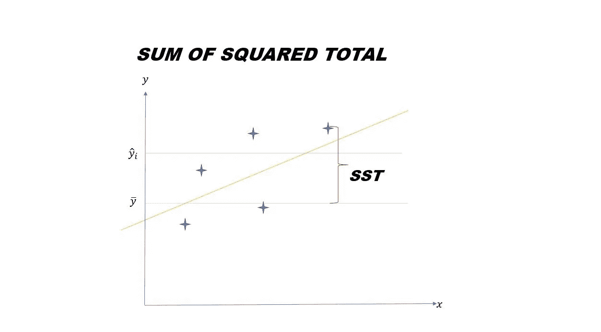
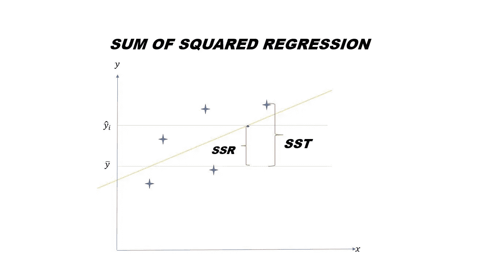
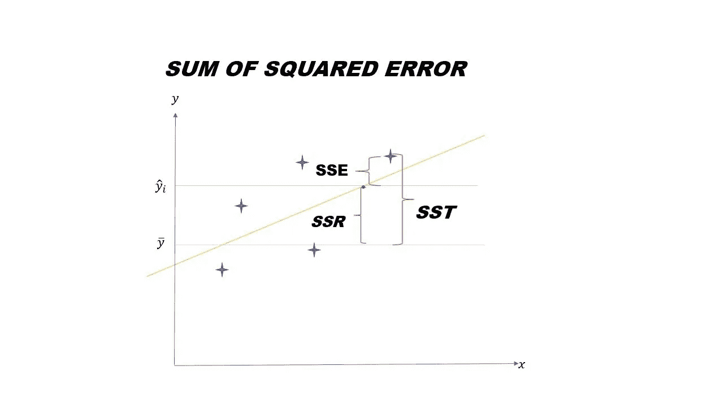
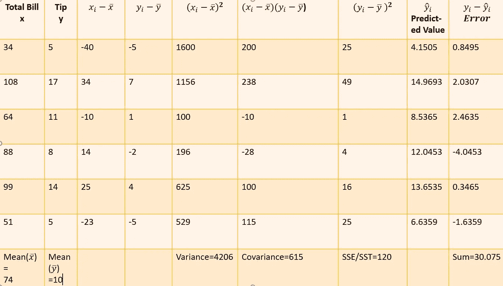
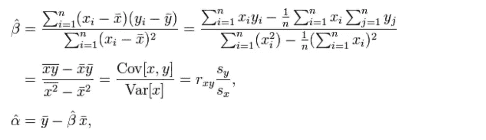

# 回归方差分析

> 原文：<https://towardsdatascience.com/anova-for-regression-fdb49cf5d684?source=collection_archive---------6----------------------->

## 总和平方和、回归平方和及误差平方和。

在 [Unsplash](https://unsplash.com?utm_source=medium&utm_medium=referral) 上由 [Tachina Lee](https://unsplash.com/@chne_?utm_source=medium&utm_medium=referral) 拍摄的照片

*ANOVA* ( **方差分析**)是一个构成显著性检验基础的框架&提供关于回归模型中可变性水平的知识。它与线性回归相同，但主要区别之一是**回归**用于根据一个或多个连续预测变量预测连续结果。鉴于， **ANOVA** 用于预测基于一个或多个分类预测变量的连续结果。

在实现线性回归时，我们经常会遇到诸如 **SST** (总和平方和) **SSR** (回归平方和) **SSE** (误差平方和)之类的术语，并想知道它们实际上是什么意思？在本帖中，我们将涵盖这些主题，并实现一个示例来更好地理解这个主题。

**SST(总平方和)**

总和平方和是**观察因变量**与其**平均值(均值)**之间的平方差。这里需要注意的一点是，我们总是将线性回归最佳拟合线与因变量斜率的平均值(表示为 y ̅)进行比较。

由 [Rahul Pathak](https://medium.com/@rahulpathak1996) 在[媒体](http://medium.com)上拍摄的照片

**SSR(回归平方和)**

**回归平方和**是**预测值**和因变量均值**之间的差值之和。**

由 [Rahul Pathak](https://medium.com/@rahulpathak1996) 在[媒体](http://medium.com)上拍摄的照片

**SSE(误差平方和)**

误差平方的 S**um**是**观察值**和**预测值**之间的差值。

由 [Rahul Pathak](https://medium.com/@rahulpathak1996) 在[介质](http://medium.com)上拍摄的照片

为了理解这些平方和的使用流程，让我们手动浏览一个简单线性回归的例子。假设约翰是加州的*酒店的服务员，他有个人的**总账单**，并且他还收到该订单的***小费*** 。我们希望根据收到的总账单来预测下一笔小费是多少。让我们用(x)表示总账单，用(y)表示小费金额。*

由 [Rahul Pathak](https://medium.com/@rahulpathak1996) 在[媒体](http://medium.com)上拍摄的照片

**y=α+βx** 将给出预测值，而我们根据上述公式计算α & β的值，其中β是斜率，α是 y 截距。简单线性回归的目标是创建一个最小化残差平方和(误差)的线性模型。

关于线性回归的一个有趣的事实是，它是由两个统计概念方差分析和相关性组成的。

**线性回归=相关+方差分析** 回到正题…

**SST，SSR & SSE 是怎么联系起来的？**

**SST = SSR + SSE**

在上表中，我们可以看到之前误差平方和为 120，后来减少到 30.075，即我们使用线性回归将误差值从 120 减少到 30.075。以前，最佳拟合线是因变量斜率的平均值，后来变为最佳最佳拟合线。

**120 =？+ 30.075** 因此 SSR 的值为 **89.925**

为什么我们需要平方和？

答案是确定拟合优度。可以使用**决定系数**来确定，也称为**R。**R 将比率量化为百分比。此外，R 经常与“R”混淆，其中 R 是决定系数，而 R 是相关系数。相关性测量两个变量 X 和 y 之间的线性相关性。其范围从值 **-1 到 1** ，其中接近 1 的值为正相关，接近-1 的值为负相关。例如，在上表中，我们得到的值 **r** 为 **0.8656** ，它更接近于 1，因此描绘了一个正关系。

**最终拍板**

**要记住的重要公式:——**

*   **R = SSR/SST**
*   **R = 1-(SSE/SST)**
*   **SSE =σ(实际-预测)**
*   **SST =σ(实际平均值)**
*   **SSR =σ(预测平均值)**

我希望我能帮助你回答与这个主题相关的问题。请随时查询我的联系 id:——[拉胡尔·帕塔克](https://www.linkedin.com/in/rahulpathakmit/)。
非常感谢！:)