# R 中的方差分析

> 原文：<https://towardsdatascience.com/anova-in-r-4a4a4edc9448?source=collection_archive---------22----------------------->

## 了解如何在 R 中执行方差分析(ANOVA)来比较 3 组或更多组。另请参见如何解释结果和执行事后测试


照片由 [Battlecreek 咖啡烘焙师](https://unsplash.com/@battlecreekcoffeeroasters?utm_source=medium&utm_medium=referral)拍摄

# 介绍

NOVA(方差分析)是一种统计测试，用于确定两个或多个总体均值是否不同。换句话说，它用于**比较两个或更多组**，以查看它们是否显著**不同**。

然而，实际上:

*   [**学生 t 检验**](https://www.statsandr.com/blog/student-s-t-test-in-r-and-by-hand-how-to-compare-two-groups-under-different-scenarios/) 用于比较 **2 组**；
*   **ANOVA** 将 t 检验推广到 2 组以上，因此用于比较 **3 组或更多组**。

注意，ANOVA 有几种版本(例如，单向 ANOVA、双向 ANOVA、混合 ANOVA、重复测量 ANOVA 等。).在本文中，我们只给出最简单的形式——单向 ANOVA**[1](https://www.statsandr.com/blog/anova-in-r/#fn1)——在本文的剩余部分我们称之为 ANOVA。**

**虽然 ANOVA 是用来对不同组的[表示](https://www.statsandr.com/blog/descriptive-statistics-by-hand/#mean)进行推断的，但这种方法叫做“分析 [*方差*](https://www.statsandr.com/blog/descriptive-statistics-by-hand/#variance) ”。之所以这么叫，是因为它比较了“之间”方差(不同组之间的方差)和“内”方差(每组内的方差)。如果组间方差明显大于组内方差，则说明组均值不同。否则，我们无法得出这样或那样的结论。通过取比值(方差之间/方差之内)，然后将该比值与费希尔[概率分布](https://www.statsandr.com/blog/a-guide-on-how-to-read-statistical-tables/)中的阈值(基于特定显著性水平的阈值，通常为 5%)进行比较，将两个方差相互比较。**

**这是关于方差分析方法的足够的理论。在本文的剩余部分，我们将从更实际的角度来讨论它，特别是，我们将涵盖以下几点:**

*   **方差分析的目的、何时使用以及无效/替代假设**
*   **方差分析的基本假设以及如何检查它们**
*   **如何在 R 中进行方差分析**
*   **如何解释方差分析的结果**
*   **理解事后测试的概念并解释结果**
*   **如何可视化方差分析和事后检验的结果**

# **数据**

**本文的数据是`penguins`数据集(众所周知的`iris`数据集的替代)，可通过`[{palmerpenguins}](https://github.com/allisonhorst/palmerpenguins)` [包](https://github.com/allisonhorst/palmerpenguins)访问:**

```
# install.packages("palmerpenguins")
library(palmerpenguins)
```

**该数据集包含 3 个不同物种(阿德利企鹅、下巴颏企鹅和巴布亚企鹅)的 344 只企鹅的数据。数据集包含 8 个变量，但我们只关注本文中的鳍肢长度和物种，所以我们只保留这 2 个变量:**

```
library(tidyverse)dat <- penguins %>%
  select(species, flipper_length_mm)
```

**(如果不熟悉管道操作符(`%>%`)，也可以[用`penguins[, c("species", "flipper_length_mm")]`选择变量](https://statsandr.com/blog/data-manipulation-in-r/#subset-a-data-frame)。在关于[数据操作](https://statsandr.com/blog/data-manipulation-in-r/)的文章中了解更多选择变量的方法。)**

**下面是一些基本的[描述性统计数据](https://www.statsandr.com/blog/descriptive-statistics-in-r/)和我们数据集的一个图(用`[{ggplot2}](https://www.statsandr.com/blog/graphics-in-r-with-ggplot2/)` [包](https://www.statsandr.com/blog/graphics-in-r-with-ggplot2/)制作)，然后我们继续进行方差分析的目标:**

```
summary(dat)##       species    flipper_length_mm
##  Adelie   :152   Min.   :172.0    
##  Chinstrap: 68   1st Qu.:190.0    
##  Gentoo   :124   Median :197.0    
##                  Mean   :200.9    
##                  3rd Qu.:213.0    
##                  Max.   :231.0    
##                  NA's   :2
```

**鳍状肢的长度从 172 毫米到 231 毫米不等，平均长度为 200.9 毫米。阿德利企鹅、下颚带企鹅和巴布亚企鹅分别有 152 只、68 只和 124 只。**

```
library(ggplot2)ggplot(dat) +
  aes(x = species, y = flipper_length_mm, color = species) +
  geom_jitter() +
  theme(legend.position = "none")
```

**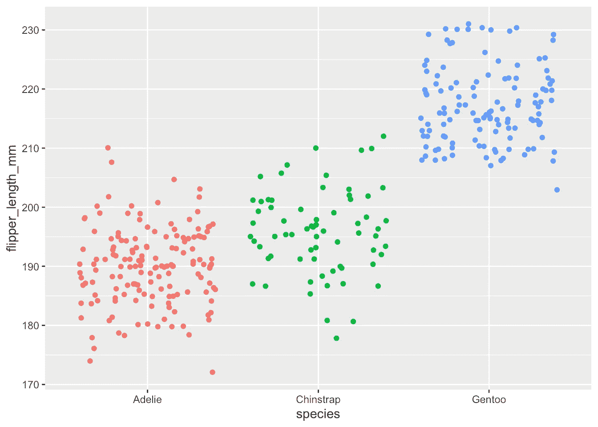**

**这里，[因子](https://www.statsandr.com/blog/data-types-in-r/#factor)是`species`变量，包含 3 个模态或组(Adelie、Chinstrap 和 Gentoo)。**

# **方差分析的目的和假设**

**如引言中所述，ANOVA 用于比较各组(实际上是 3 组或更多组)。更一般地说，它用于:**

*   **研究[分类](https://www.statsandr.com/blog/variable-types-and-examples/#qualitative)变量的不同模态(在方差分析中也称为水平或处理)的测量值是否相似**
*   **比较分类变量的不同水平对[定量](https://www.statsandr.com/blog/variable-types-and-examples/#quantitative)变量的影响**
*   **根据定性变量解释定量变量**

**在这种情况下，作为一个例子，我们将使用方差分析来帮助我们回答这个问题:“**三种企鹅的鳍状肢长度不同吗？**”。**

**方差分析的无效假设和替代假设是:**

*   **H0:μ_ Adelie =μ_ Chinstrap =μ_ Gentoo(三个物种的鳍状肢长度相等)**
*   **H1: *至少有一个平均值是不同的(至少有一个物种与其他两个物种的鳍长度不同)***

**注意另一个假设是 ***而不是*** 所有的方法都不同。所有平均数相等的反面(H0)是至少有一个平均数不同于其他平均数(H1)。在这个意义上，如果零假设被拒绝，这意味着至少有一个物种不同于其他 2，但不一定是所有 3 个物种彼此不同。可能阿德利物种的鳍状肢长度不同于下颚带和巴布亚，但是下颚带和巴布亚的鳍状肢长度相似。必须执行其他类型的测试(称为事后测试，包含在本[部分](https://www.statsandr.com/blog/anova-in-r/#post-hoc-test)中)来测试所有 3 个物种是否不同。**

# **方差分析的基本假设**

**至于许多[统计测试](https://www.statsandr.com/tags/inferential-statistics/)，为了能够解释结果，需要满足一些假设。当一个或几个假设不满足时，尽管技术上可以进行这些测试，但解释结果和相信结论是不正确的。**

**下面是方差分析的假设，如何测试它们，以及如果假设不满足，还有哪些测试:**

*   ****变量类型** : ANOVA 需要混合一个[连续定量](https://www.statsandr.com/blog/variable-types-and-examples/#continuous)因变量(对应于与问题相关的测量)和一个[定性](https://www.statsandr.com/blog/variable-types-and-examples/#qualitative)自变量(至少有 2 个水平，用于确定要比较的组)。**
*   ****独立性**:从总[人口](https://www.statsandr.com/blog/what-is-the-difference-between-population-and-sample/)中随机选择的代表性部分收集的数据，在组间和组内应该是独立的。独立性的假设通常基于实验的设计和对实验条件的良好控制来验证，而不是通过正式的测试。如果你仍然不确定基于实验设计的独立性，问问自己一个观察是否与每个组内或组间的另一个观察相关(如果一个观察对另一个有影响)。如果没有，很可能你有独立的[样本](https://www.statsandr.com/blog/what-is-the-difference-between-population-and-sample/)。如果样本之间的观察值(形成待比较的不同组)是相关的(例如，如果三个测量值是在**相同的个体**上收集的，这是医学研究中在测量(I)治疗前、(ii)治疗期间和(iii)治疗后的指标时经常出现的情况)，那么重复测量值 ANOVA 应该是首选的，以便考虑样本之间的相关性。**
*   ****正态**:残差 [2](https://www.statsandr.com/blog/anova-in-r/#fn2) 应该近似遵循一个 [**正态分布**](https://www.statsandr.com/blog/do-my-data-follow-a-normal-distribution-a-note-on-the-most-widely-used-distribution-and-how-to-test-for-normality-in-r/) 。正态性假设可以通过[直方图](https://www.statsandr.com/blog/descriptive-statistics-in-r/#histogram)和 [QQ 图](https://www.statsandr.com/blog/descriptive-statistics-in-r/#qq-plot)进行直观测试，和/或通过[正态性测试](https://www.statsandr.com/blog/do-my-data-follow-a-normal-distribution-a-note-on-the-most-widely-used-distribution-and-how-to-test-for-normality-in-r/#normality-test)进行正式测试，如夏皮罗-维尔克或科尔莫戈罗夫-斯米尔诺夫测试。如果，即使在对数据进行变换(例如，对数变换、平方根、Box-Cox 等)后，)，残差仍然不符合近似正态分布，可以应用 Kruskal-Wallis 检验(R 中的`kruskal.test(variable ~ group, data = dat`)。这种非参数检验对非正态分布稳健，与 ANOVA 的目标相同—比较 3 个或更多组—但它使用样本中位数而不是样本均值来比较组。**
*   ****方差相等**:不同组的方差在总体中应该相等(这种假设被称为方差的同质性，或者有时被称为同方差，与方差在不同组之间不相等的异方差相对)。这种假设可以通过图形测试(例如通过比较[箱线图](https://www.statsandr.com/blog/descriptive-statistics-in-r/#boxplot)或[点线图](https://www.statsandr.com/blog/descriptive-statistics-in-r/#dotplot)中的离散度)，或者更正式地通过 Levene 测试(`{car}`包中的`leveneTest(variable ~ group)`)或 Bartlett 测试，等等。如果等方差假设被拒绝，可以使用 ANOVA 的另一个版本:Welch 检验(`oneway.test(variable ~ group, var.equal = FALSE)`)。请注意，韦尔奇检验不要求方差齐性，但分布仍应近似遵循正态分布。请注意，Kruskal-Wallis 检验既不需要正态假设，也不需要方差的同方差假设。 [3](https://www.statsandr.com/blog/anova-in-r/#fn3)**

**根据假设是否满足来选择合适的测试可能会令人困惑，因此这里有一个简短的总结:**

1.  **检查你的观察是否独立。**
2.  **如果它们是独立的，检验残差的正态性:**

*   **如果假设正态性，检验方差的同质性:**
*   **如果差异相等，使用 **ANOVA** 。**
*   **如果差异不相等，使用**韦尔奇测试**。**
*   **如果没有假设正态性，使用**克鲁斯卡尔-沃利斯检验**。**

**既然我们已经看到了方差分析的基本假设，我们在应用适当版本的测试之前，专门为我们的数据集回顾它们。**

# **可变类型**

**因变量`flipper_length_mm`是一个[定量](https://www.statsandr.com/blog/variable-types-and-examples/#quantitative)变量，自变量`species`是一个[定性](https://www.statsandr.com/blog/variable-types-and-examples/#qualitative)变量(3 个等级对应 3 个物种)。所以我们有两种变量的混合，这个假设是成立的。**

# **独立性ˌ自立性**

**假设观察值是独立的，因为数据是从人群中随机选择的部分收集的，并且 3 个样本内部和之间的测量值是不相关的。**

**独立性假设通常是基于实验设计和对实验条件的良好控制来验证的，就像这里的情况一样。如果你真的想更正式地测试它，你可以通过一个统计测试来测试它——Durbin-Watson 测试(在 R: `durbinWatsonTest(res_lm)`中，其中`res_lm`是一个线性模型)。该检验的零假设指定自相关系数= 0，而替代假设指定自相关系数≠ 0。**

# **常态**

**请记住，残差的[正态性](https://www.statsandr.com/blog/do-my-data-follow-a-normal-distribution-a-note-on-the-most-widely-used-distribution-and-how-to-test-for-normality-in-r/)可以通过[直方图](https://www.statsandr.com/blog/descriptive-statistics-in-r/#histogram)和 [QQ 图](https://www.statsandr.com/blog/descriptive-statistics-in-r/#qq-plot)进行直观测试，和/或通过[正态性测试](https://www.statsandr.com/blog/do-my-data-follow-a-normal-distribution-a-note-on-the-most-widely-used-distribution-and-how-to-test-for-normality-in-r/#normality-test)(例如夏皮罗-维尔克测试)进行正式测试。**

**在检查正态性假设之前，我们首先需要计算方差分析(在[部分](https://www.statsandr.com/blog/anova-in-r/#anova-in-r)中有更多相关信息)。然后我们将结果保存在`res_aov`:**

```
res_aov <- aov(flipper_length_mm ~ species,
  data = dat
)
```

**我们现在可以直观地检查正常性:**

```
par(mfrow = c(1, 2)) # combine plots# histogram
hist(res_aov$residuals)# QQ-plot
library(car)
qqPlot(res_aov$residuals,
  id = FALSE # id = FALSE to remove point identification
)
```

**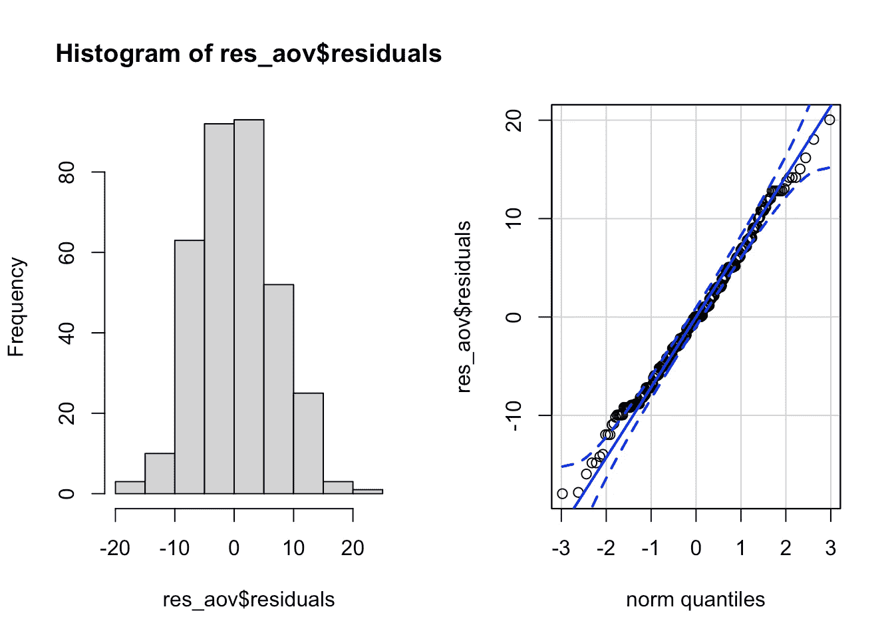**

**从上面的直方图和 QQ-plot，我们已经可以看到，正态性假设似乎得到了满足。事实上，直方图大致形成一条钟形曲线，表明残差遵循正态分布。此外，QQ 图中的点大致遵循直线，并且它们中的大多数都在置信带内，这也表明残差近似遵循正态分布。**

**一些研究人员就此打住，假设满足正态性，而其他人也通过正式的统计测试来检验这一假设。您可以选择(I)仅通过目测，(ii)仅通过正态性测试，或(iii)同时通过目测和正态性测试进行测试。但是，请记住以下两点:**

1.  **方差分析对偏离正态分布的小偏差非常稳健。这意味着如果少量的点稍微偏离正态性(从 ANOVA 结果解释的角度来看),**
2.  **正态性检验有时相当保守，这意味着正态性的零假设可能会由于与正态性的有限偏离而被拒绝。对于大样本来说尤其如此，因为测试的功效随着样本量的增加而增加。**

**实际上，我倾向于只选择(I)视觉方法，但是，这是一个个人选择的问题，也取决于分析的背景。**

**还是为了说明，我们现在也通过正态性检验来检验正态性假设。你可以使用夏皮罗-维尔克检验或者科尔莫戈罗夫-斯米尔诺夫检验等等。请记住，无效假设和替代假设是:**

*   **H0:数据来自正态分布**
*   **H1:数据做 ***不是*** 来自正态分布**

**在 R 中，借助于`shapiro.test()`函数，我们可以用夏皮罗-维尔克检验来检验残差的正态性:**

```
shapiro.test(res_aov$residuals)## 
##  Shapiro-Wilk normality test
## 
## data:  res_aov$residuals
## W = 0.99452, p-value = 0.2609
```

***P*-残差的夏皮罗-维尔克检验值大于通常的显著性水平α=5%，所以我们不拒绝残差服从正态分布的假设(*P*-值= 0.261)。**

**这个结果符合目测法。在我们的例子中，正态假设在视觉上和形式上都得到了满足。**

***边注:提醒 p 值是假设零假设为真，我们在样本中观察到的极端情况的概率*[](https://www.statsandr.com/blog/the-9-concepts-and-formulas-in-probability-that-every-data-scientist-should-know/)**。如果 p 值* < α *(表示假设原假设为真，不太可能观察到我们在样本中拥有的数据)，则拒绝原假设，否则不拒绝原假设。查看更多关于* [*p 值和显著性水平*](https://www.statsandr.com/blog/student-s-t-test-in-r-and-by-hand-how-to-compare-two-groups-under-different-scenarios/#a-note-on-p-value-and-significance-level-alpha) *如果你对那些重要的统计学概念不熟悉。****

***请记住，如果没有达到正态假设，则需要对原始数据进行一些变换，希望残差能够更好地符合正态分布，或者您需要使用 ANOVA 的非参数版本—Kruskal-Wallis 检验。***

***正如一位读者所指出的(见文章最后的评论)，正态性假设也可以在“原始”数据(即观察值)而不是残差上进行检验。但是，如果您测试原始数据的正态性假设，则必须单独测试*每组数据*，因为方差分析需要*每组数据*的正态性。***

***对所有残差或每组观察值进行正态性检验是等效的，并且会给出相似的结果。的确，说“每组内 Y 的分布是正态分布”和说“残差是正态分布”是一样的。***

***请记住，残差是 Y 的实际值与特定 X 值的 Y 平均值之间的距离，因此在计算残差时会引入分组变量。***

***总之，在方差分析中，你实际上有两个检验正态性的选择:***

1.  ***分别检查每组“原始”数据(Y 值)的正态性***
2.  ***检查所有残差的正态性(但不是每个组)***

***在实践中，您会发现，只使用残差并一起检查它们通常会更容易，尤其是当您有许多组或每组的观察值很少时。***

***如果你仍然不相信:记住方差分析是线性模型的一个特例。假设你的自变量是一个[连续变量](https://www.statsandr.com/blog/variable-types-and-examples/#continuous)(而不是一个[分类变量](https://www.statsandr.com/blog/variable-types-and-examples/#qualitative))，你剩下的唯一选择就是检查残差的正态性，这正是在线性回归模型中检验正态性所做的。***

# ***方差相等—同质性***

***假设残差服从正态分布，现在是时候检查物种之间的方差是否相等了。结果将会影响我们是否使用方差分析或韦尔奇检验。***

***这可以再次通过视觉验证——通过[箱线图](https://www.statsandr.com/blog/descriptive-statistics-in-r/#boxplot)或[点线图](https://www.statsandr.com/blog/descriptive-statistics-in-r/#dotplot)——或者更正式地通过统计测试(Levene 的测试，等等)。***

***视觉上，我们有:***

```
*# Boxplot
boxplot(flipper_length_mm ~ species,
  data = dat
)*
```

***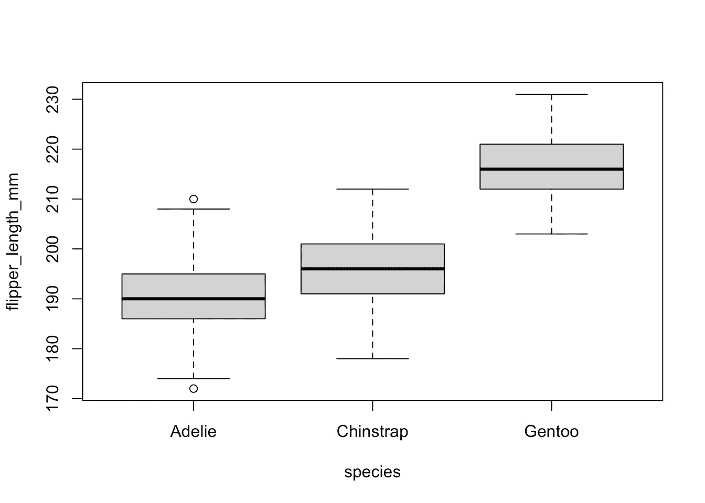***

```
*# Dotplot
library("lattice")dotplot(flipper_length_mm ~ species,
  data = dat
)*
```

***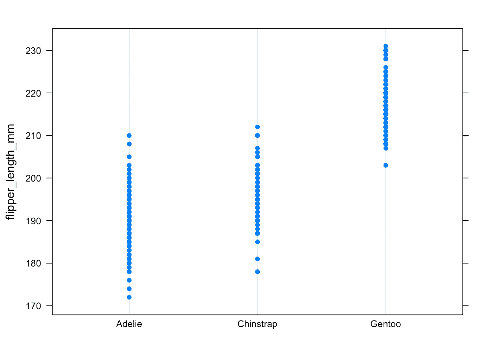***

***箱线图和点图都显示了不同物种的相似方差。在箱线图中，这可以从以下事实中看出:对于所有物种来说，盒子和须状物具有可比较的大小。有几个[异常值](https://www.statsandr.com/blog/outliers-detection-in-r/)，如胡须外的点所示，但这不会改变不同物种之间的[分散](https://www.statsandr.com/blog/descriptive-statistics-by-hand/#dispersion)或多或少相同的事实。***

***在点图中，这可以通过所有 3 个物种的点具有或多或少相同的[范围](https://www.statsandr.com/blog/descriptive-statistics-in-r/#range)这一事实看出，这是离散的标志，因此[方差](https://www.statsandr.com/blog/descriptive-statistics-by-hand/#variance)是相似的。***

***与正态性假设一样，如果您觉得直观的方法不够充分，您可以使用 Levene 或 Bartlett 的测试来正式测试方差的相等性。请注意，Levene 检验对偏离正态分布的敏感度低于 Bartlett 检验。***

***两种检验的无效假设和替代假设是:***

*   ***H0:差异是相等的***
*   ***H1:至少有一个差异是不同的***

***在 R 中，Levene 的测试可以通过`{car}`包中的`leveneTest()`函数来执行:***

```
*# Levene's test
library(car)leveneTest(flipper_length_mm ~ species,
  data = dat
)## Levene's Test for Homogeneity of Variance (center = median)
##        Df F value Pr(>F)
## group   2  0.3306 0.7188
##       339*
```

****p*-值大于 0.05 的显著性水平，我们不拒绝零假设，所以我们不能拒绝物种间方差相等的假设(*p*-值= 0.719)。***

***这个结果也符合视觉方法，所以方差的同质性在视觉上和形式上都得到满足。***

# ***检验正态性和同质性的另一种方法***

***供您参考，也可以通过`plot()`功能直观地(同时)测试方差的同质性和残差的正态性:***

```
*par(mfrow = c(1, 2)) # combine plots# 1\. Homogeneity of variances
plot(res_aov, which = 1)# 2\. Normality
plot(res_aov, which = 2)*
```

***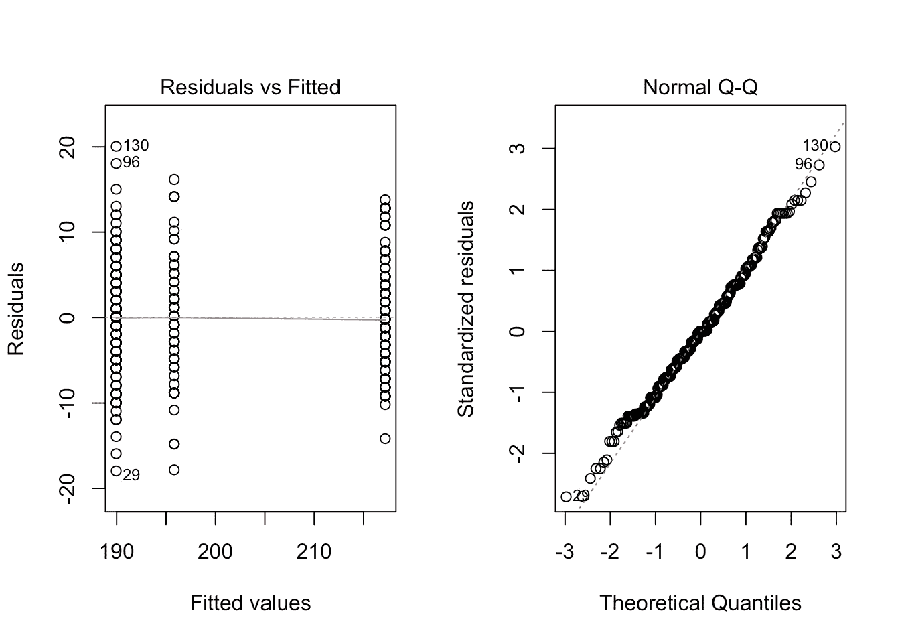***

***左侧的图显示残差和拟合值(每组的平均值)之间没有明显的关系，因此假设方差齐性。如果方差的同质性被破坏，红线就不会是平的。***

***右手边的图显示残差近似遵循正态分布，因此假设正态性。如果常态被破坏，点将持续偏离虚线。***

# ***方差分析***

***我们表明方差分析的所有假设都得到满足。因此，我们可以继续实施 R 中的方差分析，但首先，让我们做一些初步的分析，以更好地理解研究问题。***

# ***初步分析***

***在实际执行 R 中的 ANOVA 之前，一个好的做法是**可视化与研究问题相关的数据**。最好的方法是绘制并比较每个物种的数量变量`flipper_length_mm`的箱线图。***

***这可以通过基数 R 中的`boxplot()`函数来完成(与等方差的视觉检查代码相同):***

```
*boxplot(flipper_length_mm ~ species,
  data = dat
)*
```

******

***或者用`[{ggplot2}](https://www.statsandr.com/blog/graphics-in-r-with-ggplot2/)` [包](https://www.statsandr.com/blog/graphics-in-r-with-ggplot2/):***

```
*library(ggplot2)ggplot(dat) +
  aes(x = species, y = flipper_length_mm) +
  geom_boxplot()*
```

***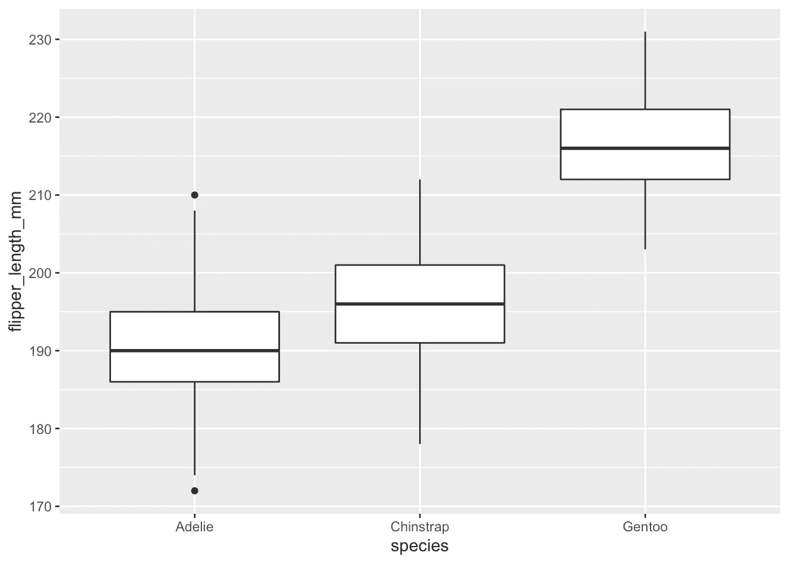***

***上面的方框图显示，至少对我们的样本来说，`Gentoo`企鹅似乎有最大的鳍状肢，而`Adelie`企鹅的鳍状肢最小。***

***除了每个物种的箱线图外，计算一些描述性统计数据[](https://www.statsandr.com/blog/descriptive-statistics-in-r/)**也是一个很好的做法，例如物种的[平均值](https://www.statsandr.com/blog/descriptive-statistics-in-r/#mean)和[标准差](https://www.statsandr.com/blog/descriptive-statistics-in-r/#standard-deviation-and-variance)。例如，这可以通过`aggregate()`功能来实现:*****

```
***aggregate(flipper_length_mm ~ species,
  data = dat,
  function(x) round(c(mean = mean(x), sd = sd(x)), 2)
)##     species flipper_length_mm.mean flipper_length_mm.sd
## 1    Adelie                 189.95                 6.54
## 2 Chinstrap                 195.82                 7.13
## 3    Gentoo                 217.19                 6.48***
```

*****或者使用`{dplyr}`组件中的`summarise()`和`group_by()`功能:*****

```
***library(dplyr)group_by(dat, species) %>%
  summarise(
    mean = mean(flipper_length_mm, na.rm = TRUE),
    sd = sd(flipper_length_mm, na.rm = TRUE)
  )## # A tibble: 3 x 3
##   species    mean    sd
##   <fct>     <dbl> <dbl>
## 1 Adelie     190\.  6.54
## 2 Chinstrap  196\.  7.13
## 3 Gentoo     217\.  6.48***
```

*****平均值也是`Adelie`最低，`Gentoo`最高。然而，箱线图和描述性统计数据不足以得出结论，三个企鹅种群的鳍状肢有显著差异。*****

# *****R 中的方差分析*****

*****正如你现在所猜测的，只有方差分析可以帮助我们根据手头的样本对种群做出推断，并帮助我们回答最初的研究问题“三种企鹅的鳍状肢长度不同吗？”。*****

*****R 中的方差分析可以用几种方法进行，下面介绍其中的两种方法:*****

1.  *****使用`oneway.test()`功能:*****

```
***# 1st method:
oneway.test(flipper_length_mm ~ species,
  data = dat,
  var.equal = TRUE # assuming equal variances
)## 
##  One-way analysis of means
## 
## data:  flipper_length_mm and species
## F = 594.8, num df = 2, denom df = 339, p-value < 2.2e-16***
```

*****2.使用`summary()`和`aov()`功能:*****

```
***# 2nd method:
res_aov <- aov(flipper_length_mm ~ species,
  data = dat
)summary(res_aov)##              Df Sum Sq Mean Sq F value Pr(>F)    
## species       2  52473   26237   594.8 <2e-16 ***
## Residuals   339  14953      44                   
## ---
## Signif. codes:  0 '***' 0.001 '**' 0.01 '*' 0.05 '.' 0.1 ' ' 1
## 2 observations deleted due to missingness***
```

*****从上面的两个输出可以看出，两种方法的检验统计量(`F =`在第一种方法中，而`F value`在第二种方法中)和*p*-值(`p-value`在第一种方法中，而`Pr(>F)`在第二种方法中)完全相同，这意味着在方差相等的情况下，结果和结论不会改变。*****

*****第一种方法的优点是很容易从 ANOVA(方差相等时使用)切换到 Welch 检验(方差不相等时使用)。这可以通过用`var.equal = FALSE`替换`var.equal = TRUE`来实现，如下所示:*****

```
***oneway.test(flipper_length_mm ~ species,
  data = dat,
  var.equal = FALSE # assuming unequal variances
)## 
##  One-way analysis of means (not assuming equal variances)
## 
## data:  flipper_length_mm and species
## F = 614.01, num df = 2.00, denom df = 172.76, p-value < 2.2e-16***
```

*****然而，第二种方法的优点是:*****

*   *****完整的 ANOVA 表(含自由度、均方差等。)打印出来，这在某些(理论上的)情况下可能是有意义的*****
*   *****方差分析(`res_aov`)的结果可以保存以备后用(对[事后检验](https://www.statsandr.com/blog/anova-in-r/#post-hoc-test)特别有用)*****

# *****方差分析结果的解释*****

*****鉴于*p*-值小于 0.05，我们拒绝零假设，因此我们拒绝所有均值相等的假设。因此，我们可以断定**至少有一个物种在脚蹼长度**(*p*-value<2.2e-16)方面与其他物种不同。*****

*****(*为了便于说明*，如果*p*-值大于 0.05:我们不能拒绝所有平均值相等的零假设，因此我们不能拒绝所考虑的三种企鹅的鳍长度相等的假设。)*****

*****在 R 中报告方差分析结果的一种简单而又好的方法是使用`{report}`包中的`report()`函数:*****

```
***# install.packages("remotes")
# remotes::install_github("easystats/report") # You only need to do that once
library("report") # Load the package every time you start Rreport(res_aov)## The ANOVA (formula: flipper_length_mm ~ species) suggests that:
## 
##   - The main effect of species is significant and large (F(2, 339) = 594.80, p < .001; Eta2 = 0.78, 90% CI [0.75, 0.80])
## 
## Effect sizes were labelled following Field's (2013) recommendations.***
```

*****如您所见，该函数为您解释了结果，并显示了物种对鳍状肢长度的大而显著的主要影响(*p*-值【t 33.001】)。*****

*****注意`report()`功能可用于其他分析。如果你觉得这个有用，请查看 R 中的更多[提示和技巧。](https://statsandr.com/blog/tips-and-tricks-in-rstudio-and-r-markdown/)*****

# *****下一步是什么？*****

*****如果**零假设没有被拒绝** ( *p* -value ≥ 0.05)，则说明我们没有拒绝所有组都相等的假设。方差分析差不多到此为止。当然，也可以进行其他类型的分析，但是——根据手头的数据——我们无法证明至少有一组是不同的，所以我们通常不会进一步进行方差分析。*****

*****相反，如果**零假设被拒绝**(因为这是我们的情况，因为*p*-值< 0.05)，我们证明至少有一组是不同的。如果我们只对检验所有物种的鳍状肢长度是否相等感兴趣，我们可以决定就此打住。*****

*****但是大多数时候，当我们通过方差分析表明至少有一个群体是不同的时候，我们也有兴趣知道哪一个群体是不同的。然而，方差分析的结果是 ***而不是*** 告诉我们哪一组与其他组不同。*****

*****为了测试这一点，我们需要使用其他类型的测试，称为事后测试(在拉丁语中，“在此之后”，因此在获得具有统计意义的 ANOVA 结果之后)或多个成对比较测试。这一系列的统计测试是下面几节的主题。*****

# *****事后测试*****

# *****多重测试问题*****

*****为了看出哪一组与其他组不同，我们需要**对两组进行比较**。实际上，由于有 3 个物种，我们将按如下方式比较物种 2 和 2:*****

1.  *****下颚带对抗阿德利*****
2.  *****Gentoo 对 Adelie*****
3.  *****Gentoo vs. Chinstrap*****

*****理论上，我们可以通过 3 个学生的 t 检验来比较物种，因为我们需要比较两个组，在这种情况下 t 检验被精确地使用。*****

*****但是，如果执行了几个 t 测试，就会出现**多重测试**(也称为多重性)的问题。简而言之，当几个统计测试被执行时，一些会有*p*-值小于α纯属偶然，即使所有的无效假设事实上都是真的。*****

*****为了演示这个问题，考虑我们的情况，我们有 3 个假设要测试，期望的显著性水平为 0.05。偶然观察到至少一个重要结果(至少一个*p*-值< 0.05)的概率为:*****

*****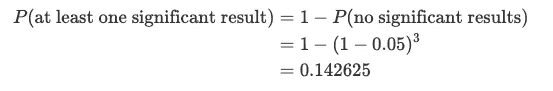*****

*****因此，只要考虑 3 个测试，我们就有 14.26%的机会观察到至少一个显著的结果，即使所有的测试实际上都不显著。*****

*****随着组数的增加，比较的次数也在增加，所以仅仅因为偶然而产生重要结果的概率也在增加。例如，对于 10 个组，我们需要进行 45 次比较，至少有一个重要结果的概率变成 1−(1−0.05)^45 = 90%。因此，当比较 10 组时，很可能只是偶然观察到显著的结果，而当我们有 14 组或更多组时，我们几乎肯定(99%)有假阳性！*****

*****事后检验考虑到进行了多次检验，并通过以某种方式调整α来处理问题，因此，由于偶然性而观察到至少一个显著结果的概率保持在我们期望的显著性水平以下。 [4](https://www.statsandr.com/blog/anova-in-r/#fn4)*****

# *****R 中的事后检验及其解释*****

*****事后测试是一系列统计测试，所以有几种。最常用的是 **Tukey HSD** 和 **Dunnett 的**测试:*****

*   *****Tukey HSD 用于比较**所有组**(因此所有可能的 2 组比较)。*****
*   *****Dunnett 用于与参照组进行比较。例如，考虑 2 个治疗组和 1 个对照组。如果您只想将 2 个治疗组与对照组进行比较，而不想将 2 个治疗组进行相互比较，则首选 Dunnett 检验。*****

*****请注意，假设两个测试的方差相等。它们将在下一节中介绍。如果方差不相等，可以使用 Games-Howell 检验等方法。*****

# *****图基 HSD 试验*****

*****在我们的例子中，由于没有“参考”物种，我们对比较所有物种感兴趣，我们将使用 Tukey HSD 测试。*****

*****在 R 中，Tukey HSD 测试如下进行。这就是执行 ANOVA 的[第二种方法](https://www.statsandr.com/blog/anova-in-r/#anova-in-r)派上用场的地方，因为结果(`res_aov`)被重新用于事后检验:*****

```
***library(multcomp)# Tukey HSD test:
post_test <- glht(res_aov,
  linfct = mcp(species = "Tukey")
)summary(post_test)## 
##   Simultaneous Tests for General Linear Hypotheses
## 
## Multiple Comparisons of Means: Tukey Contrasts
## 
## 
## Fit: aov(formula = flipper_length_mm ~ species, data = dat)
## 
## Linear Hypotheses:
##                         Estimate Std. Error t value Pr(>|t|)    
## Chinstrap - Adelie == 0   5.8699     0.9699   6.052   <1e-08 ***
## Gentoo - Adelie == 0     27.2333     0.8067  33.760   <1e-08 ***
## Gentoo - Chinstrap == 0  21.3635     1.0036  21.286   <1e-08 ***
## ---
## Signif. codes:  0 '***' 0.001 '**' 0.01 '*' 0.05 '.' 0.1 ' ' 1
## (Adjusted p values reported -- single-step method)***
```

*****在 Tukey HSD 测试的输出中，我们感兴趣的是在`Linear Hypotheses:`之后显示的表格，更准确地说，是表格的第一列和最后一列。第一列显示已经进行的比较；最后一列(`Pr(>|t|)`)显示每次比较的调整后的[5](https://www.statsandr.com/blog/anova-in-r/#fn5)*p*-值(零假设为两组相等，替代假设为两组不同)。*****

*****正是这些调整后的 p 值用于测试两组是否有显著差异，我们可以确信整个比较集合的误差率为 0.05。*****

*****在我们的示例中，我们测试了:*****

1.  *****下颚带对抗阿德利(第`Chinstrap - Adelie == 0`行)*****
2.  *****巴布亚对阿德利(线`Gentoo - Adelie == 0`)*****
3.  *****Gentoo vs. Chinstrap(第`Gentoo - Chinstrap == 0`行)*****

*****所有三个*p*-值都小于 0.05，因此我们拒绝所有比较的零假设，这意味着**所有物种在鳍状肢长度方面都有显著差异**。*****

*****事后测试的结果可以通过`plot()`功能可视化:*****

```
***par(mar = c(3, 8, 3, 3))
plot(post_test)***
```

*****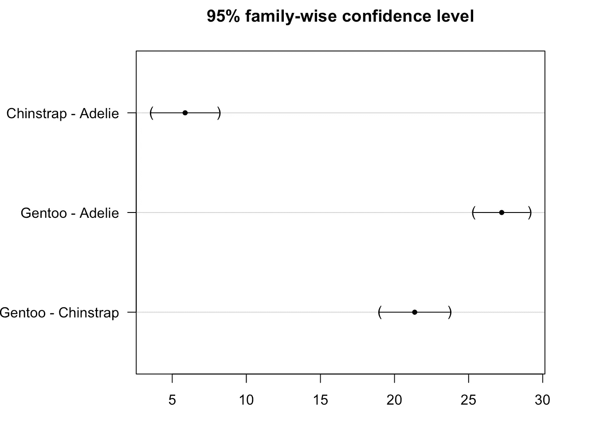*****

*****我们看到置信区间没有越过零线，这表明所有组都有显著差异。*****

*****请注意，Tukey HSD 测试也可以在 R 中使用`TukeyHSD()`功能完成:*****

```
***TukeyHSD(res_aov)##   Tukey multiple comparisons of means
##     95% family-wise confidence level
## 
## Fit: aov(formula = flipper_length_mm ~ species, data = dat)
## 
## $species
##                       diff       lwr       upr p adj
## Chinstrap-Adelie  5.869887  3.586583  8.153191     0
## Gentoo-Adelie    27.233349 25.334376 29.132323     0
## Gentoo-Chinstrap 21.363462 19.000841 23.726084     0***
```

*****对于这个代码，我们感兴趣的是列`p adj`(也是最后一列)。请注意，结论与上面的相同:所有物种的鳍状肢长度都有显著差异。*****

*****结果也可以通过`plot()`功能可视化:*****

```
***plot(TukeyHSD(res_aov))***
```

*****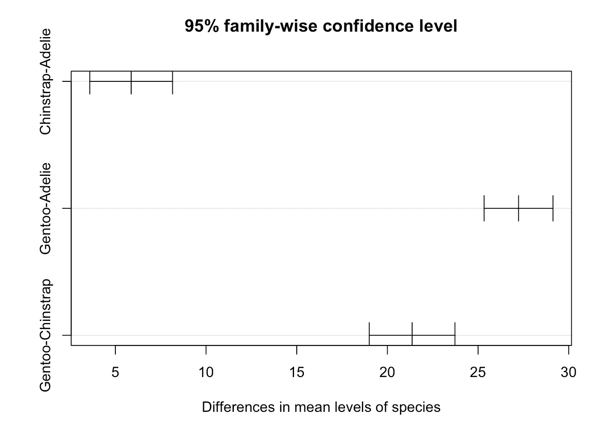*****

# *****邓尼特试验*****

*****我们在本[部分](https://www.statsandr.com/blog/anova-in-r/#issue-of-multiple-testing)中已经看到，随着组数的增加，比较的次数也在增加。随着**比较次数的增加**，事后分析必须进一步降低个体显著性水平，这导致**较低的统计功效**(因此群体中组均值之间的差异不太可能被检测到)。*****

*****减轻这种情况并提高统计功效的一种方法是减少比较次数。这种减少允许后特设过程使用更大的个体错误率来实现期望的全局错误率。虽然用 Tukey HSD 试验比较所有可能的组是一种常见的方法，但许多研究有一个对照组和几个治疗组。对于这些研究，您可能只需要将治疗组与对照组进行比较，这样可以减少比较的次数。*****

*****邓尼特的测试恰恰做到了这一点——它只是将一个群体与所有其他群体进行比较，而不是将所有群体相互比较。*****

*****概括一下:*****

*   *****Tukey HSD 测试允许比较**所有**组，但代价是**更少的功率*******
*   *****邓尼特测试只允许与参照组进行**比较，但好处是**更有力量*********

***现在，再次为了说明起见，考虑物种`Adelie`是参照物种，我们只对参照物种与其他两个物种的比较感兴趣。在这种情况下，我们将使用邓尼特测试。***

***在 R 中，Dunnett 测试按如下方式进行(与 Tukey HSD 测试代码的唯一区别是在第`linfct = mcp(species = "Dunnett")`行):***

```
***library(multcomp)# Dunnett's test:
post_test <- glht(res_aov,
  linfct = mcp(species = "Dunnett")
)summary(post_test)## 
##   Simultaneous Tests for General Linear Hypotheses
## 
## Multiple Comparisons of Means: Dunnett Contrasts
## 
## 
## Fit: aov(formula = flipper_length_mm ~ species, data = dat)
## 
## Linear Hypotheses:
##                         Estimate Std. Error t value Pr(>|t|)    
## Chinstrap - Adelie == 0   5.8699     0.9699   6.052 7.59e-09 ***
## Gentoo - Adelie == 0     27.2333     0.8067  33.760  < 1e-10 ***
## ---
## Signif. codes:  0 '***' 0.001 '**' 0.01 '*' 0.05 '.' 0.1 ' ' 1
## (Adjusted p values reported -- single-step method)***
```

***解释与 Tukey HSD 试验相同，除了在 Dunett 试验中，我们只比较:***

1.  ***下颚带对抗阿德利(第`Chinstrap - Adelie == 0`行)***
2.  ***Gentoo vs. Adelie(第`Gentoo - Adelie == 0`行)***

***两个*p*-值(显示在最后一列)都低于 0.05，因此我们拒绝两个比较的零假设。这意味着**物种下巴颏带和巴布亚企鹅在鳍状肢长度方面与参照物种阿德利**有显著差异。(不过，关于 Chinstrap 和 Gentoo 之间的比较，没什么可说的。)***

***同样，事后测试的结果可以通过`plot()`功能可视化:***

```
***par(mar = c(3, 8, 3, 3))
plot(post_test)***
```

***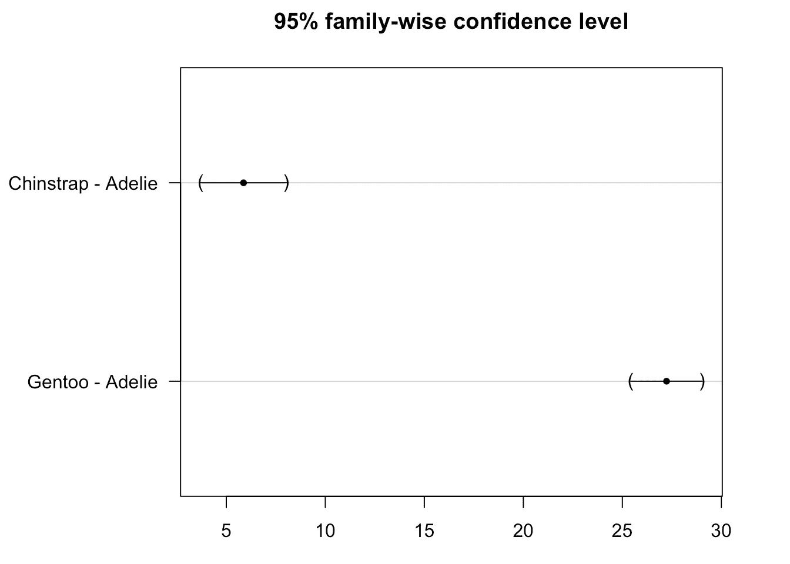***

***我们看到置信区间没有越过零线，这表明 Gentoo 和 Chinstrap 两个物种都与参考物种 Adelie 显著不同。***

***注意，在 R 中，默认情况下，[因子变量](https://www.statsandr.com/blog/data-types-in-r/#factor)的参考类别是字母顺序中的第一个类别。这就是默认情况下参考物种是阿德利的原因。***

***可以用`relevel()`功能(或用`[{questionr}](https://www.statsandr.com/blog/rstudio-addins-or-how-to-make-your-coding-life-easier/#reordering-factors)` [插件](https://www.statsandr.com/blog/rstudio-addins-or-how-to-make-your-coding-life-easier/#reordering-factors))改变参考类别。考虑到我们希望 Gentoo 而不是 Adelie 作为参考类别:***

```
***# Change reference category:
dat$species <- relevel(dat$species, ref = "Gentoo")# Check that Gentoo is the reference category:
levels(dat$species)## [1] "Gentoo"    "Adelie"    "Chinstrap"***
```

***Gentoo 现在是三个类别中的第一个，它确实被认为是参考级别。***

***为了使用新的参考值执行 Dunnett 检验，我们首先需要重新运行 ANOVA 以考虑新的参考值:***

```
***res_aov2 <- aov(flipper_length_mm ~ species,
  data = dat
)***
```

***然后，我们可以使用方差分析的新结果运行 Dunett 检验:***

```
***# Dunnett's test:
post_test <- glht(res_aov2,
  linfct = mcp(species = "Dunnett")
)summary(post_test)## 
##   Simultaneous Tests for General Linear Hypotheses
## 
## Multiple Comparisons of Means: Dunnett Contrasts
## 
## 
## Fit: aov(formula = flipper_length_mm ~ species, data = dat)
## 
## Linear Hypotheses:
##                         Estimate Std. Error t value Pr(>|t|)    
## Adelie - Gentoo == 0    -27.2333     0.8067  -33.76   <1e-10 ***
## Chinstrap - Gentoo == 0 -21.3635     1.0036  -21.29   <1e-10 ***
## ---
## Signif. codes:  0 '***' 0.001 '**' 0.01 '*' 0.05 '.' 0.1 ' ' 1
## (Adjusted p values reported -- single-step method)par(mar = c(3, 8, 3, 3))
plot(post_test)***
```

***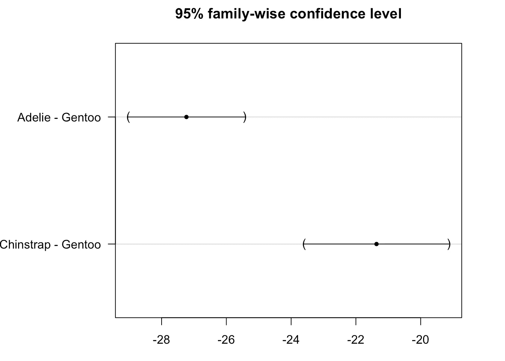***

***根据以上结果，我们得出结论，阿德利和下巴颏物种在鳍状肢长度方面与巴布亚物种有显著差异(*p*-值< 1e-10)。***

***请注意，即使您的研究没有可以与其他组进行比较的参考组，进行由一些研究问题决定的多重比较通常也比进行所有成对测试要好。通过将事后比较的数量减少到必要的数量，你可以最大化统计能力。 [6](https://www.statsandr.com/blog/anova-in-r/#fn6)***

# ***其他 p 值校正方法***

***对于感兴趣的读者，请注意，通过使用`pairwise.t.test()`功能，您可以使用其他 *p* 值调整方法:***

```
***pairwise.t.test(dat$flipper_length_mm, dat$species,
  p.adjust.method = "holm"
)## 
##  Pairwise comparisons using t tests with pooled SD 
## 
## data:  dat$flipper_length_mm and dat$species 
## 
##           Gentoo  Adelie 
## Adelie    < 2e-16 -      
## Chinstrap < 2e-16 3.8e-09
## 
## P value adjustment method: holm***
```

***默认情况下，将应用 Holm 方法，但也存在其他方法。参见`?p.adjust`了解所有可用选项。***

# ***同一地块上方差分析和事后检验的可视化***

***如果你有兴趣在同一个图上(直接在箱线图上)包括方差分析和事后测试的结果，这里有一段你可能感兴趣的代码(我根据这篇[文章](http://www.sthda.com/english/articles/24-ggpubr-publication-ready-plots/76-add-p-values-and-significance-levels-to-ggplots/)中的代码编辑的):***

```
***# Edit from here
x <- which(names(dat) == "species") # name of grouping variable
y <- which(
  names(dat) == "flipper_length_mm" # names of variables to test
)
method1 <- "anova" # one of "anova" or "kruskal.test"
method2 <- "t.test" # one of "wilcox.test" or "t.test"
my_comparisons <- list(c("Chinstrap", "Adelie"), c("Gentoo", "Adelie"), c("Gentoo", "Chinstrap")) # comparisons for post-hoc tests
# Edit until here # Edit at your own risk
library(ggpubr)
for (i in y) {
  for (j in x) {
    p <- ggboxplot(dat,
      x = colnames(dat[j]), y = colnames(dat[i]),
      color = colnames(dat[j]),
      legend = "none",
      palette = "npg",
      add = "jitter"
    )
    print(
      p + stat_compare_means(aes(label = paste0(..method.., ", p-value = ", ..p.format..)),
        method = method1, label.y = max(dat[, i], na.rm = TRUE)
      )
      + stat_compare_means(comparisons = my_comparisons, method = method2, label = "p.format") # remove if p-value of ANOVA or Kruskal-Wallis test >= alpha
    )
  }
}***
```

***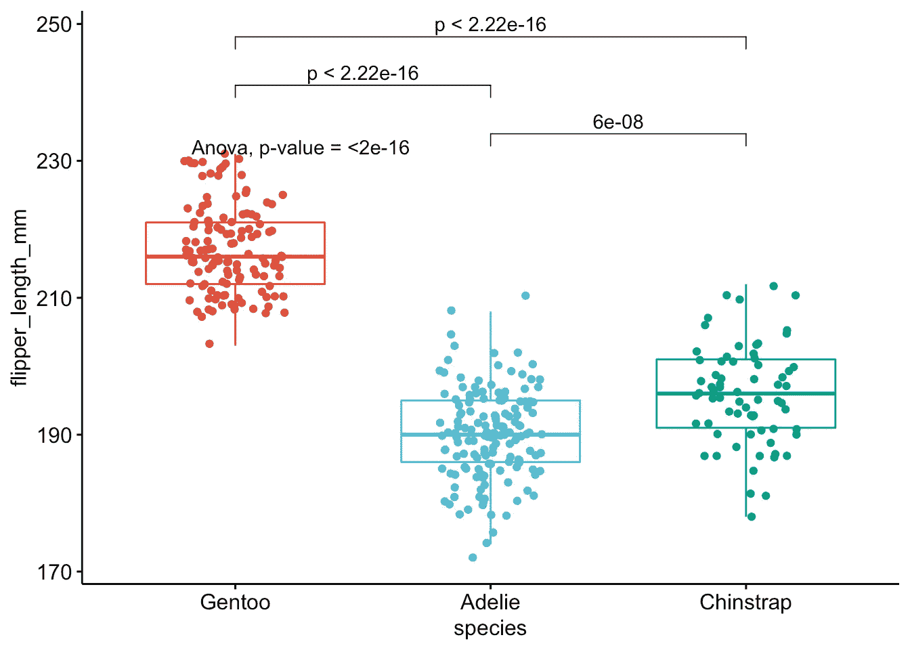***

***正如你在上面的图上看到的，物种的箱线图与方差分析和事后检验的 *p* 值一起显示。***

***除了在同一个图上结合了可视化表示和结果的事实之外，这段代码还具有可以一次执行多个 ANOVA 测试的优点。更多信息请参见本文[的](https://www.statsandr.com/blog/how-to-do-a-t-test-or-anova-for-many-variables-at-once-in-r-and-communicate-the-results-in-a-better-way/)部分。***

# ***摘要***

***在本文中，我们回顾了 ANOVA 的[目标和假设](https://www.statsandr.com/blog/anova-in-r/#aim-and-hypotheses-of-anova)，在能够信任结果之前需要验证哪些[假设](https://www.statsandr.com/blog/anova-in-r/#underlying-assumptions-of-anova)(即独立性、正态性和同质性)，然后我们向[展示了如何在 R](https://www.statsandr.com/blog/anova-in-r/#anova-in-r) 中进行 ANOVA，以及如何[解释结果](https://www.statsandr.com/blog/anova-in-r/#interpretations-of-anova-results)。***

***如果不讨论[事后检验](https://www.statsandr.com/blog/anova-in-r/#post-hoc-test)，特别是[Tukey HSD](https://www.statsandr.com/blog/anova-in-r/#tukey-hsd-test)——比较所有组——和 [Dunnett 的](https://www.statsandr.com/blog/anova-in-r/#dunnetts-test)检验——比较一个参照组和所有其他组，那么一篇关于方差分析的文章就不完整。***

***最后但同样重要的是，我们展示了如何在同一个图中[可视化](https://www.statsandr.com/blog/anova-in-r/#visualization-of-anova-and-post-hoc-tests)方差分析和事后检验的数据和结果。***

***感谢阅读。***

***和往常一样，如果您有与本文主题相关的问题或建议，请将其添加为评论，以便其他读者可以从讨论中受益。***

1.  ***请注意，它被称为*单向*或*单因素* ANOVA，因为均值与单个自变量或因素的不同模态相关。 [↩︎](https://www.statsandr.com/blog/anova-in-r/#fnref1)***
2.  ***残差(表示为ϵϵ)是因变量的观测值(y)和预测值(y hat)之间的差值。在 ANOVA 的上下文中，残差对应于观察值和该组所有值的平均值之间的差异。 [↩︎](https://www.statsandr.com/blog/anova-in-r/#fnref2)***
3.  ***只要你使用 Kruskal-Wallis 检验来比较各组，就不需要同质性。如果你想比较中位数，Kruskal-Wallis 检验需要同质性。在这篇[文章](https://influentialpoints.com/Training/Kruskal-Wallis_ANOVA_use_and_misuse.htm)中查看更多关于差异的信息。 [↩︎](https://www.statsandr.com/blog/anova-in-r/#fnref3)***
4.  ***注意，正如在文章末尾的评论中所讨论的，事后检验在某些情况下可以直接进行(不需要 ANOVA)。详见许( [1996](https://statsandr.com/blog/anova-in-r/#ref-hsu1996multiple) )的评论。 [↩︎](https://statsandr.com/blog/anova-in-r/#fnref4)***
5.  ***请注意，原则上您可以将 Bonferroni 校正应用于所有测试。例如，在上面的例子中，有 3 个测试和α = 0.05 的全局期望显著性水平，如果*p*-值小于 0.05 / 3 = 0.0167，我们将拒绝零假设。然而，已知这种方法相当保守，导致潜在的高假阴性率。 [↩︎](https://www.statsandr.com/blog/anova-in-r/#fnref4)***
6.  ***调整*p*-值，将全局显著性水平保持在所需水平。 [↩︎](https://www.statsandr.com/blog/anova-in-r/#fnref5)***
7.  ***感谢 Michael Friendly 的建议。 [↩︎](https://www.statsandr.com/blog/anova-in-r/#fnref6)***

# ***相关文章***

*   ***[一次比例和拟合优度检验(R 和手动)](https://www.statsandr.com/blog/one-proportion-and-goodness-of-fit-test-in-r-and-by-hand/)***
*   ***[如何手工进行单样本 t 检验，并对一个均值进行 R:检验](https://www.statsandr.com/blog/how-to-perform-a-one-sample-t-test-by-hand-and-in-r-test-on-one-mean/)***
*   ***[R 中的 Wilcoxon 检验:如何在非正态假设下比较两组](https://www.statsandr.com/blog/wilcoxon-test-in-r-how-to-compare-2-groups-under-the-non-normality-assumption/)***
*   ***[如何在 R 中一次对多个变量进行 t 检验或方差分析](https://www.statsandr.com/blog/how-to-do-a-t-test-or-anova-for-many-variables-at-once-in-r-and-communicate-the-results-in-a-better-way/)***
*   ***[学生的 R 和手工 t 检验:如何在不同场景下比较两组](https://www.statsandr.com/blog/student-s-t-test-in-r-and-by-hand-how-to-compare-two-groups-under-different-scenarios/)***

****原载于 2020 年 10 月 12 日 https://statsandr.com*[](https://statsandr.com/blog/anova-in-r/)**。*****