# Python 中的 ANOVA + Tukey 测试

> 原文：<https://towardsdatascience.com/anova-tukey-test-in-python-b3082b6e6bda?source=collection_archive---------4----------------------->

## 使用 Python 中的统计测试方法开发在线广告策略(附代码)。

# 方案

我们的客户是一家刚起步的服装公司，在美国专门生产休闲服装。他们的营销团队想推出一个广告活动来增加其网站的在线流量，这有望带来更多的收入。为了更好地分配投放广告活动的时间和精力，并最大限度地让观众看到他们的广告，他们需要了解 3 件事。

> 消费者搜索最多的与运动休闲相关的关键词是什么？
> 
> **哪个月消费者搜索休闲服装最多？**
> 
> **消费者使用最多的搜索平台是哪个？**

# 目标

> 向 athleisure 初创公司提供建议，以确定投放广告的最佳关键词、最佳时机和最佳平台。

# 数据

为了收集这个案例研究的数据，我们将使用[Wordtracker](https://www.wordtracker.com/)——一种用于搜索引擎优化(SEO)的付费数据库服务。搜索引擎优化本质上只是另一种说法:

> “我想知道如何让我的网站成为给定搜索的首要结果。”

Wordtracker 帮助客户获得更多的网站流量，或者更好地了解消费者在搜索什么。Wordtracker 类似于 Google Keywords Planner 服务，但允许访问 Google 以外平台上的搜索数据。在提取数据时，Wordtracker 提供了 2018 年 6 月至 2019 年 5 月在谷歌、Youtube、亚马逊和易贝的 1 年代表性搜索数据样本。它提供了来自 106 个国家的 1800 万全球小组成员的超过 20 亿个独特的关键词。以下是 Wordtracker 数据库中与美国搜索量相关的所有数据的概要。

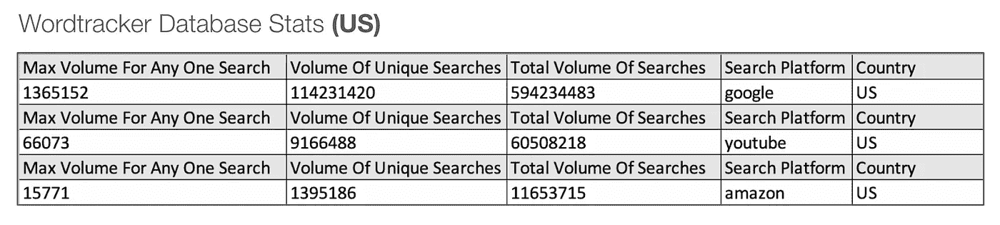

来源:[Alex Cheng](https://github.com/alexwcheng)+[Justin Fleury](https://github.com/jfleury12)via[GitHub](https://github.com/alexwcheng/athleisure-advertising)

但是我们如何决定在 Wordtracker 的搜索量查询中选择哪些与“运动休闲”相关的词呢？有很多方法，但是有什么比在网上购买运动休闲流行语更好的方法呢？我们可以在亚马逊上搜索术语**“运动休闲”**，并在结果中找到所有最频繁出现的术语。

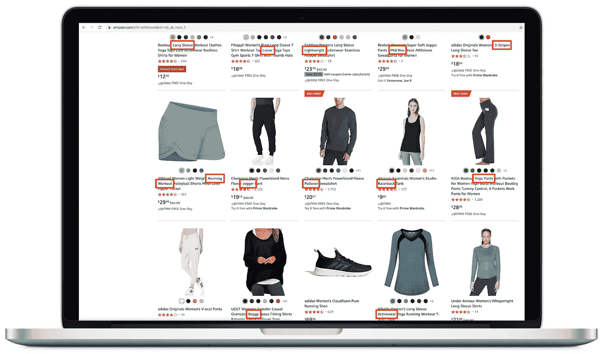

来源:[Alex Cheng](https://github.com/alexwcheng)+[Justin Fleury](https://github.com/jfleury12)via[GitHub](https://github.com/alexwcheng/athleisure-advertising)

因此，在我们的研究中，我们可以通过以下约束条件从 Wordtracker 中提取数据:

*   **70 多个与运动休闲相关的术语，在搜索“运动休闲”时使用顶级亚马逊关键词结果。**
*   **仅在美国搜索卷。**
*   **来自谷歌、YouTube 和亚马逊的搜索量数据。**

根据[搜索引擎杂志](https://www.searchenginejournal.com/seo-101/meet-search-engines/)——谷歌、YouTube 和亚马逊是全球最受欢迎的三大搜索引擎。根据 2019 年的 [Bluelist](https://bluelist.co/blog/google-stats-and-facts/) 统计，每年大约有 2 万亿次谷歌搜索。Wordtracker 在一年时间内提供了近 20 亿次谷歌搜索。我们假设 Wordtracker 提供了全世界整个 Google 搜索数据库的大约 1/1000 的代表性样本。

清理后的数据集可以下载 [**这里**](https://github.com/alexwcheng/athleisure-advertising/blob/master/athleisure.csv) 为. csv 文件。关于如何从 Wordtracker 的 API 调用数据的完整代码，请参考这个 Jupyter 笔记本 [**这里**](https://github.com/alexwcheng/athleisure-advertising/blob/master/jupyter_notebook/1%20-%20Wordtracker%20Data%20Extraction.ipynb) 。有关如何清理数据的更多信息，请参考数据清理 Jupyter 笔记本 [**此处**](https://github.com/alexwcheng/athleisure-advertising/blob/master/jupyter_notebook/2%20-%20Data%20Cleaning.ipynb) 。

# 探索性数据分析

## Tableau 仪表板

一旦数据被提取和清理，我们就可以执行 [**探索性数据分析**](/exploratory-data-analysis-8fc1cb20fd15) ，简称 EDA。创建 Tableau 仪表板是在一个地方全面了解数据中的维度和度量之间的各种关系的好方法。下面显示了该仪表板的静态预览。完全互动的 Tableau 仪表盘可以在 [**这里**](https://public.tableau.com/profile/alexander.cheng#!/vizhome/AthleisureAdvertising/AthleisureAdvertisingDashboard) 探索。

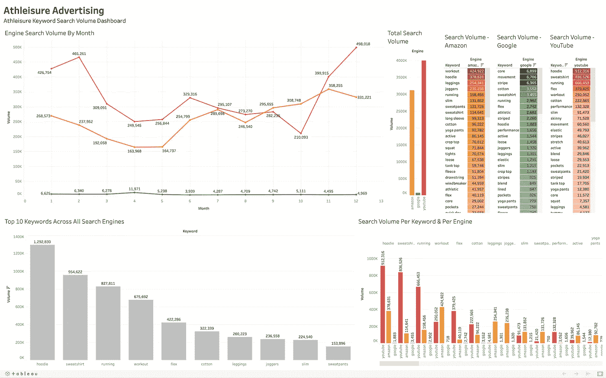

来源:[Alex Cheng](https://github.com/alexwcheng)+[Justin Fleury](https://github.com/jfleury12)via[GitHub](https://github.com/alexwcheng/athleisure-advertising)

## 单词云

一组词汇云提供了一种非技术性的、图形化的尺度感，来理解每个搜索引擎中搜索次数最多的休闲词汇。关键词在词云中出现的越大，那么与其他关键词相比，该关键词被搜索的次数就越多。

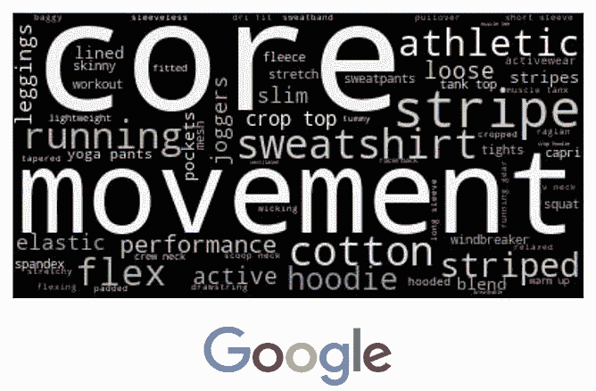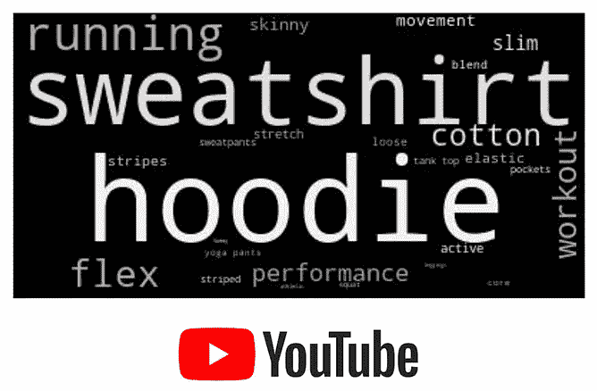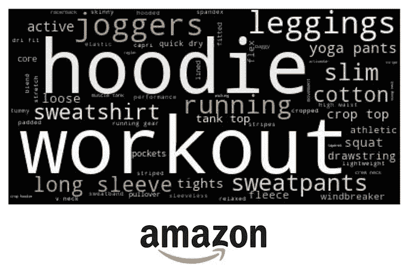

## 每月平均关键词搜索量—折线图

这个线形图显示了一年中每个月平均搜索 athleisure 关键字的频率。寒冷月份的搜索次数似乎比温暖月份多，高峰在 12 月。

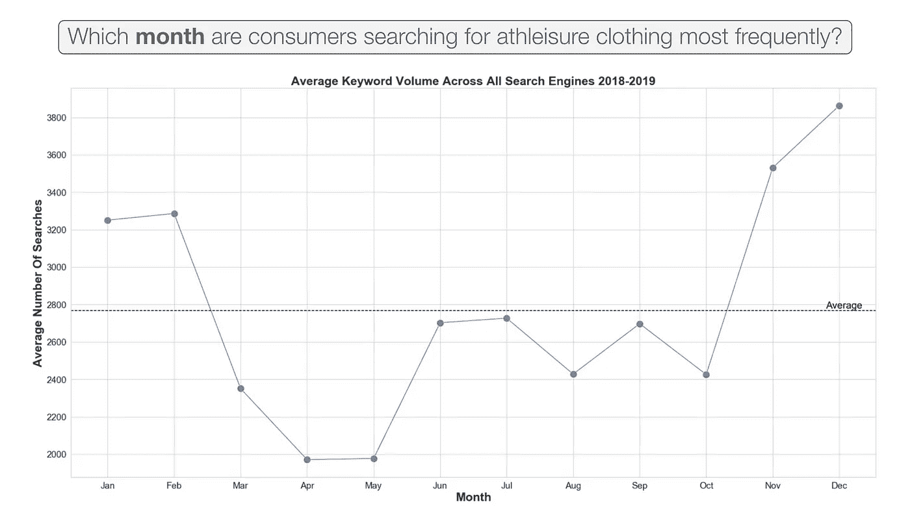

来源:[Alex Cheng](https://github.com/alexwcheng)+[Justin Fleury](https://github.com/jfleury12)via[GitHub](https://github.com/alexwcheng/athleisure-advertising)

## 每个关键字的总搜索量—条形图

当我们在所有三个搜索引擎(Google + YouTube + Amazon)上汇总所有运动休闲相关关键词的搜索量时，我们注意到关键词“hoodie”是搜索次数最多的术语，有 130 万次搜索。其次是“运动衫”、“跑步”、“锻炼”和“flex”，都有几十万次搜索。在考虑的所有 77 个关键词中，平均搜索次数约为 100，000 次。

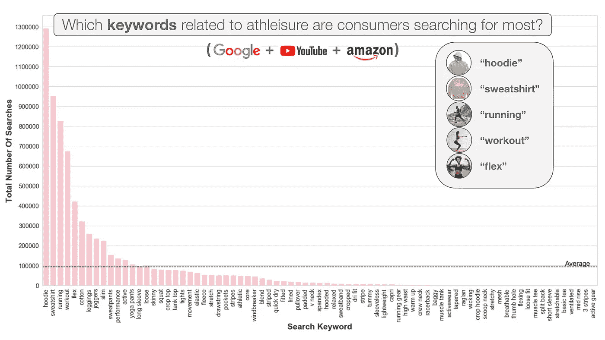

来源:[Alex Cheng](https://github.com/alexwcheng)+[Justin Fleury](https://github.com/jfleury12)via[GitHub](https://github.com/alexwcheng/athleisure-advertising)

## 每个引擎的总容量和“运动休闲”搜索比率—条形图

在观察每个搜索引擎的指标时，我们发现与谷歌相比，亚马逊和 YouTube 的总搜索量非常低。但是，尽管亚马逊的整体搜索量最低，但它的运动休闲相关词汇的比例却是最高的。亚马逊上超过 25%的搜索都与运动休闲关键词相关！相比之下，YouTube 上 5%的搜索与运动休闲关键词相关。谷歌上只有不到 1%的搜索与运动休闲关键词相关。这些发现表明，亚马逊和 Youtube 可能比谷歌更适合运行广告，因为人们显然更经常在这些平台上搜索休闲关键词。

在左边的柱状图中，我们可以看到谷歌的总搜索量接近 600，000，000，而亚马逊和 YouTube 的总搜索量不到 100，000，000。然而，在右边的柱状图中，我们可以看到与运动休闲相关的术语的搜索比率，与每个搜索引擎上的所有搜索相比。

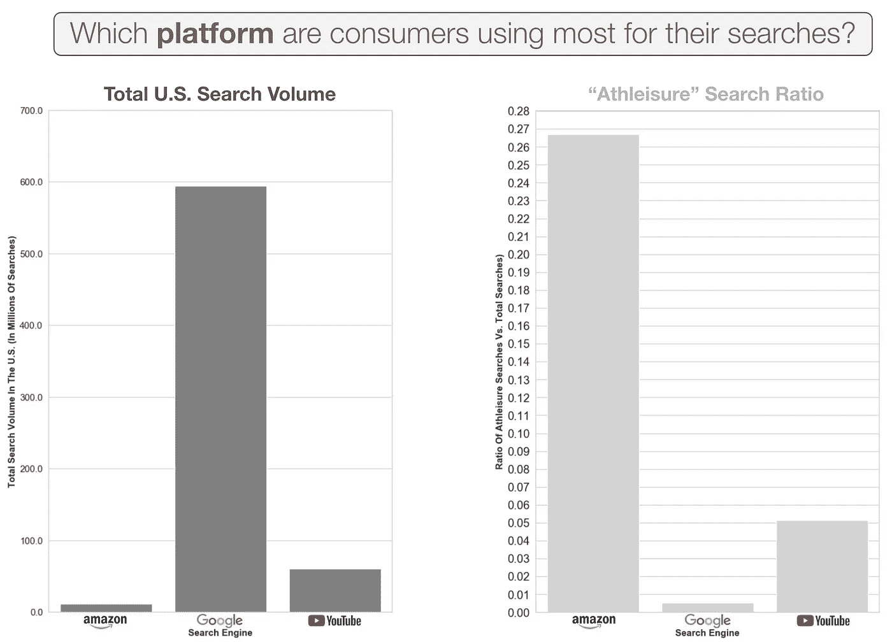

来源:[Alex Cheng](https://github.com/alexwcheng)+[Justin Fleury](https://github.com/jfleury12)via[GitHub](https://github.com/alexwcheng/athleisure-advertising)

## 概率密度函数

下面的概率密度函数图显示，我们相当多的关键词的搜索量很小——与我们的其他关键词相比，接近于零。显然，有些关键词的搜索率比其他关键词高得多，而高搜索率的关键词很少。

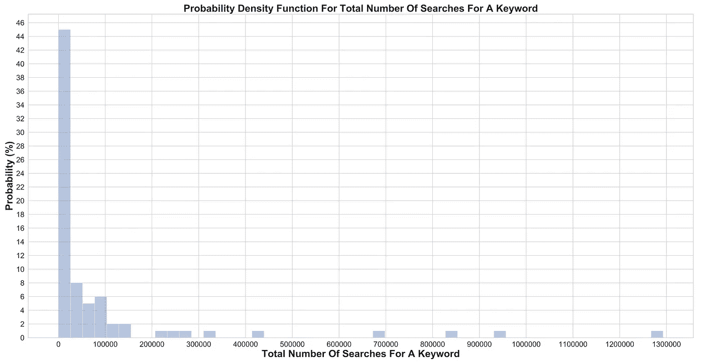

来源:[Alex Cheng](https://github.com/alexwcheng)+[Justin Fleury](https://github.com/jfleury12)via[GitHub](https://github.com/alexwcheng/athleisure-advertising)

## 累积密度函数

下面的累积密度函数图显示，我们 90%的关键词的搜索量低于 200，000。再一次，这避免了我们的大量关键词具有低搜索量，并且只有少数高搜索关键词。这个 CDF 图似乎是对数性质的。

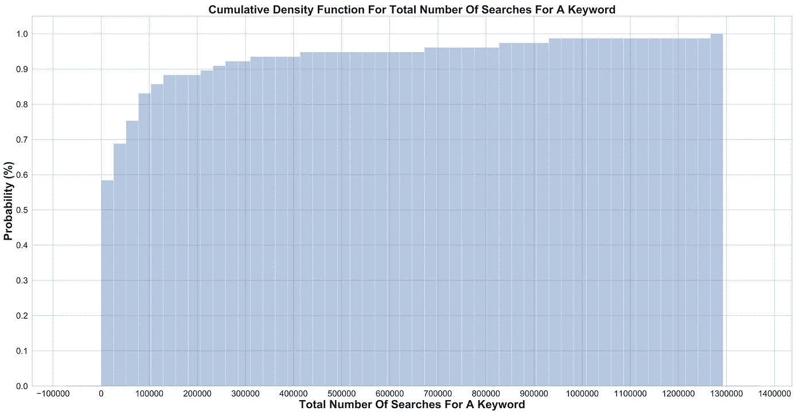

来源:[Alex Cheng](https://github.com/alexwcheng)+[Justin Fleury](https://github.com/jfleury12)via[GitHub](https://github.com/alexwcheng/athleisure-advertising)

# 统计测试

在我们进入变量的统计检验之前，下面是假设检验和我们将用来确定统计显著性的概念的简要概述。

## 假设检验

很简单地说——**零假设(H0)** 是声称变量之间不存在统计显著关系的假设，而**替代假设(HA)** 则声称变量之间存在统计显著关系。

## 阿尔法值

**α值**是当零假设为真时拒绝零假设的概率。这也称为假阳性或 I 型错误。我们在每个假设检验中选择α值。

较高的**alpha 值意味着我们可以接受较高的错误概率，而较低的**alpha 值意味着我们可以接受非常低的错误概率。当出现错误时没有大的后果时，较高的 alpha 值可能是可以的，而当出现错误时有可怕的后果时(如医疗诊断、刑事判决或任何危及生命的情况)，应该使用较低的 alpha 值。****

Alpha 值通常介于小于 0.01 和 0.1 之间。对于我们的案例研究，我们可以使用一个既不太宽松也不太严格的α值。因此，我们将使用 0.05 的 alpha 值。

## p 值

[**p 值**](https://www.statisticshowto.com/p-value/#:~:text=The%20p%20value%20is%20the,value%20of%200.0254%20is%202.54%25.) 是反对零假设的“证据”。p 值越小，我们可以拒绝零假设的证据就越强。我们将 p 值与为统计测试设置的 alpha 值进行比较。

*   如果 p 值是< 0.05, then we reject the null hypothesis.
*   If the p-value is > = 0.05，那么我们无法拒绝零假设。

## 方差分析

单向方差分析或 [**ANOVA**](https://www.statisticshowto.com/probability-and-statistics/hypothesis-testing/anova/) 是我们选择的统计测试，因为我们要处理多个组。我们还将使用**双因素方差分析**来确定可能具有统计显著性的因素组合。

## 图基试验

ANOVA 的问题是它只比较组间的平均值，并确定这些平均值是否有统计学上的显著差异。**简而言之:方差分析告诉我们结果是否显著，但没有告诉我们结果在哪里显著。**

但是，为了指导我们的运动休闲广告策略，统计意义的可解释性是至关重要的。我们必须能够解释哪些关键词表现最好，哪个搜索引擎最好，或者哪个月最适合投放广告！

因此， [**Tukey 检验**](https://www.statisticshowto.com/tukey-test-honest-significant-difference/) 允许我们解释 ANOVA 检验的统计意义，并找出哪些特定组的均值(相互比较)不同。**因此，在进行每一轮方差分析后，我们应该使用 Tukey 检验来找出数据中出现统计显著性的地方。**

# 单向 ANOVA + Tukey 检验

## 假设检验 1:关键词

**问题:当考虑搜索量时，与 athleisure 相关的关键词有什么区别吗？**

> **零假设(H0)** —就平均搜索量而言，所有与运动休闲相关的关键词都是相同的。
> 
> **替代假设(HA)** —一些与运动休闲相关的关键词比其他关键词有更大的平均搜索量。

**单因素方差分析结果:**

p 值= 1.3293563590514185 e-119< 0.05 (This is nearly zero.)

We reject the null hypothesis that mean search volume is equal across all athleisure-related keywords. Keyword on its own, does indeed constitute a difference in average search volume for athleisure-related items.

**Tukey 测试结果:**

统计上与其他术语“最”不同的前 5 个术语是:

*   “帽衫”
*   “跑步”
*   “运动衫”
*   “锻炼”
*   "弹性"

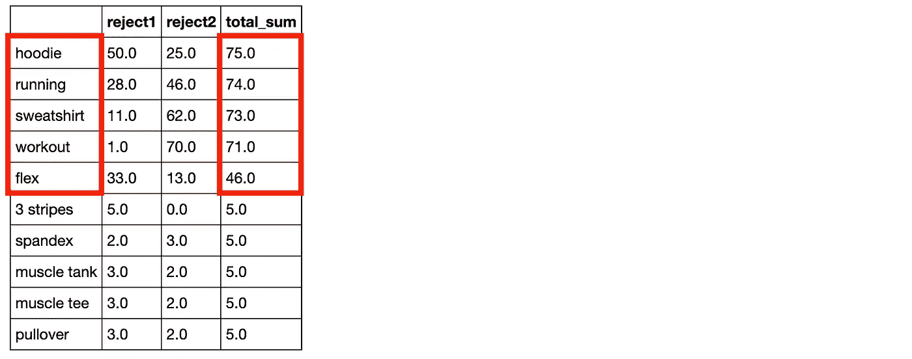

## 假设检验 2:月

**问题:考虑搜索量时，月份之间有区别吗？**

> **零假设(H0)** —在任何给定的月份，人们搜索运动服相关词汇的可能性都是一样的。
> 
> **替代假设(HA)**——人们将更有可能根据月份搜索运动服相关的词汇。

**单因素方差分析结果:**

*   p 值= 0.8831258135517717 > 0.05
*   我们无法拒绝所有月份的平均搜索量相等的无效假设。
*   月份本身并不构成运动休闲相关项目搜索量的差异。

**Tukey 测试结果:**

*   没有必要运行 Tukey 多重比较测试，因为我们在这里没有拒绝零假设。

## 假设检验 3:搜索引擎

当考虑搜索量时，搜索引擎之间有什么不同吗？

> **零假设(H0)** —在任何平台上，运动服相关词汇的搜索量都是相等的。
> 
> **替代假设(HA)** —在一个特定的平台上，运动服相关术语的搜索量会更大。

**单因素方差分析结果:**

*   p 值= 7.19196465389629e-18 < 0.05(这个几乎为零。)
*   我们拒绝所有搜索引擎的平均搜索量相等的无效假设。
*   搜索引擎本身，确实构成了运动休闲相关项目平均搜索量的差异。

**Tukey 测试结果:**

*   在所有情况下，拒绝零假设，即搜索引擎 1 与搜索引擎 2 在平均搜索量方面相等。
*   每个平台的搜索量都是不同的。

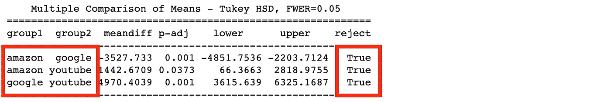

## 密码

下面是如何在 Python 中执行单向 ANOVA 和 Tukey 测试的代码片段示例。

对于单向 ANOVA，我们使用 SciPy 库(注意:也可以使用 Statsmodels 库)。我们将数据强制转换为字典，并将键提供给函数[**【scipy . stats . F _ one way()**](https://docs.scipy.org/doc/scipy/reference/generated/scipy.stats.f_oneway.html)，该函数返回 F-statistic 和 p-value(这就是我们想要的)。

对于 Tukey 测试，我们为 pairwise_tukeyhsd() 函数分配一个变量，其中我们提供我们的响应变量(搜索量)、我们正在测试的组(在本例中是搜索引擎)和我们的 alpha 值(0.05)。然后，我们简单地打印结果。

# 多重方差分析+ Tukey 检验

所有三个因素之间的双因素方差分析将帮助我们了解这些因素的任何两个组合是否具有统计显著性。我们本质上想回答这个问题:

> “我们能确定哪些特定的关键字/月份/搜索引擎的 2 因素组合产生最高的搜索量吗？”

## 组合 1:关键词+引擎

> **零假设(H0)** —就平均搜索量而言，所有关键词/引擎组合都是相同的。
> 
> **备选假设(HA)** —一些关键词/引擎组合具有更大的平均搜索量。

**双因素方差分析结果:**

*   p 值= 1.008919e-151 < 0.05 (This is nearly zero.)
*   Reject the null hypothesis that the mean search volume is equal among all Keyword/Engine combinations. Tukey Test needed.

**Tukey 测试结果:**

*   有 10 个关键词/引擎组合在搜索量上有显著差异。

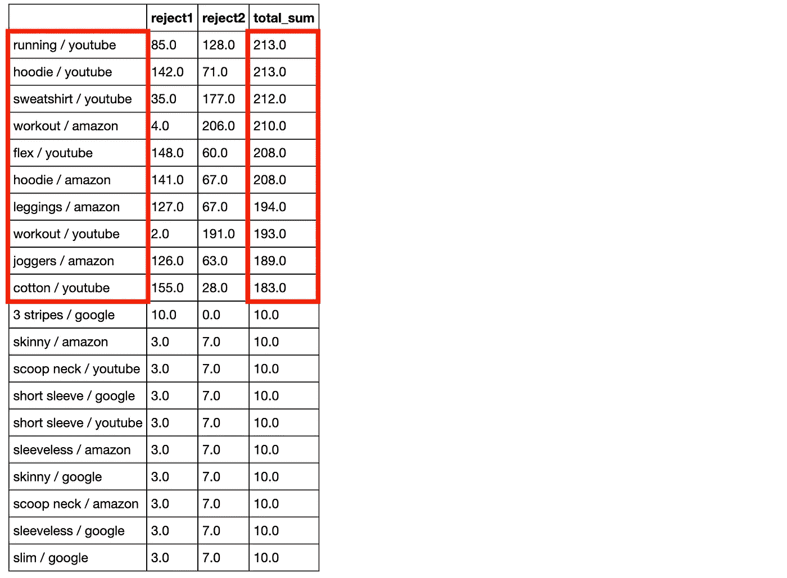

## 组合 2:关键字+月份

> **零假设(H0)** —就平均搜索量而言，所有关键字/月份组合都是相同的。
> 
> **备选假设(HA)** —一些关键词/月份组合具有更大的平均搜索量。

**双因素方差分析结果:**

*   p 值= 7.896266e-01 > 0.05
*   无法拒绝平均搜索量在关键字/月份组合中相等的无效假设。没有 Tukey 测试。

## 组合 3:引擎+月份

> **零假设(H0)** —就平均搜索量而言，所有引擎/月份组合都是相同的。
> 
> **替代假设(HA)** —一些引擎/月份组合具有更大的平均搜索量。

**双因素方差分析结果:**

*   p 值= 7.789742e-01 > 0.05
*   无法拒绝引擎/月份组合中平均搜索量相等的无效假设。没有 Tukey 测试。

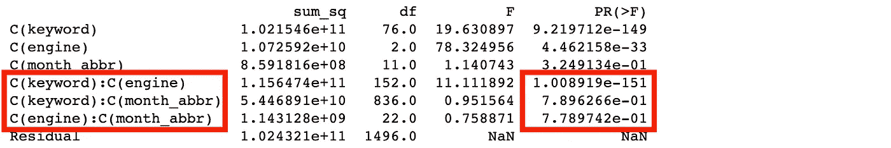

## 密码

下面是如何在 Python 中执行双向 ANOVA 和 Tukey 测试的代码片段示例。

对于双向方差分析，我们提供了一个字符串“formula”来定义我们的组，如[**stats models . formula . API . ols()**](https://www.statsmodels.org/stable/generated/statsmodels.formula.api.ols.html)**函数所要求的，将这个拟合的 ols()函数赋给一个变量，然后将该变量送入 **sm.stats.anova_lm()** 函数。在输出中，我们查看 PR( > F)列，它提供了我们的 p 值(这就是我们想要的)。**

**对于双向 ANOVA 之后的 Tukey 测试，我们将一个变量分配给[**pairwise _ tukeyhsd()**](https://www.statsmodels.org/stable/generated/statsmodels.stats.multicomp.pairwise_tukeyhsd.html)函数，其中我们提供了我们的响应变量(搜索量)、我们正在测试的组(在本例中是关键字+搜索引擎的组合)以及我们的 alpha 值(0.05)。然后，我们将输出强制转换为数据帧，以便于分析和过滤，并添加一个“total_sum”列来合计每组中每个观察值的所有(真)零剔除。有非常多的组合，所以我们只显示前 20 个结果。**

# **推荐**

## **关键词**

**在所有平台和月份的测试中，有 5 个关键词优于任何其他与运动休闲相关的关键词。我们可能会建议广告活动使用这 5 个流行语:**

*   ****【帽衫】****
*   ****“跑步”****
*   ****《运动衫》****
*   ****“健身程序”****
*   ****【flex】****

## **发动机**

**广告不应该在谷歌上投放，因为它对运动休闲相关关键词的搜索量最低。如果搜索量是最重要的，那么我们会推荐 YouTube。如果市场份额是最重要的，那么我们会推荐亚马逊。**

## **月**

**月份本身在统计上不足以作为一个提供可靠建议的因素。只有在与特定平台和一组关键字结合时，月份才应被视为一个因素。**

## **关键词/引擎**

**以下是我们推荐给运动休闲服装创业公司的 10 大关键词/引擎组合，以帮助他们指导他们的在线广告工作。再次注意，谷歌不推荐作为一个平台来运行运动休闲广告。**

**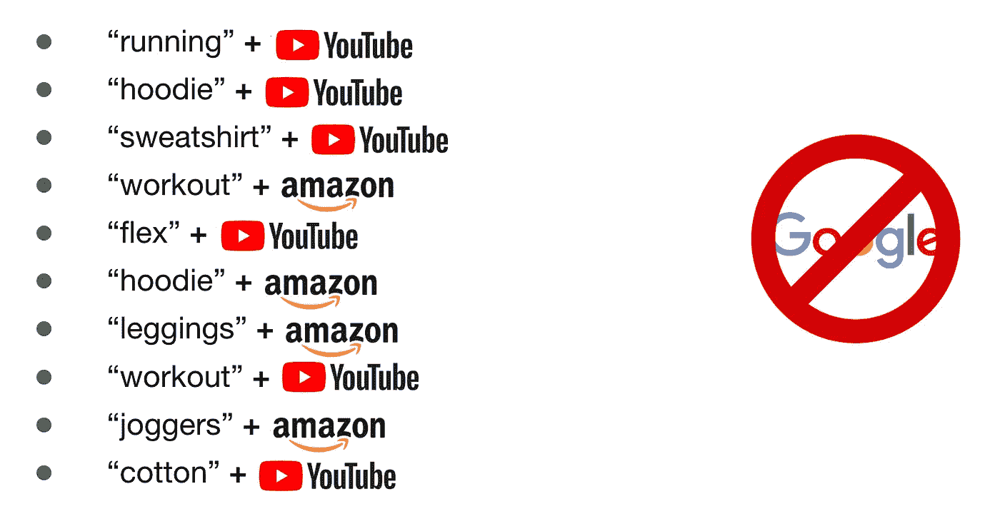**

# **改进+未来工作**

## **丰富**

*   **我们可以确保作为休闲关键词测试的所有单词类型都是相似的。例如，使用所有名词，或所有形容词等…**
*   **我们可能会将结果限制在与服装明显相关的搜索上。例如，考虑将一个与“运动休闲”相关的形容词与一件衣服配对，例如:“透气连帽衫”、“透气短裤”、“条纹慢跑者”等**
*   **我们可能会确保所有被比较的平台在它们提供的服务上是相同的，以获得更好的准确性。例如，把谷歌比作必应，或者 YouTube 和 Vimeo，或者亚马逊和易贝。**

## **未来的工作**

*   **我们可以探索每个引擎的搜索量统计数据，例如:年龄、性别或收入。**
*   **我们可以调查转换率——意思是谁在看完广告后真正购买了产品。**
*   **我们可以考虑在特定平台上投放广告的成本。例如，与亚马逊相比，谷歌上的广告成本是多少？**

# **谢谢！**

**感谢您阅读这篇博客！我希望它是有用的，并使统计测试在当代、真实世界用例中的能力更加清晰。我愿意倾听您的想法和反馈！所有代码和数据都可以在我的 [***GitHub 资源库***](https://github.com/alexwcheng/athleisure-advertising) *找到。随时和我联系*[***LinkedIn***](https://www.linkedin.com/in/alexanderweicheng/)*。***