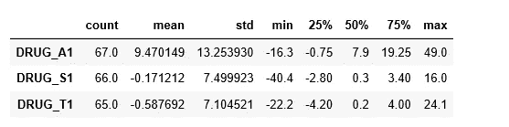
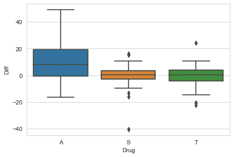
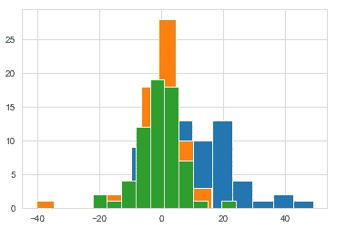

# Python 和 SQL 的方差分析

> 原文：<https://towardsdatascience.com/anova-with-python-and-sql-b37b68ebc2dc?source=collection_archive---------41----------------------->

## 理解为什么以及如何进行方差分析


[来源](https://www.pexels.com/photo/squash-lot-1527010/)

T 方差分析(ANOVA)用于分析方差，包括评估两个变量之间的差异。这是一个有效的统计工具，用于分析财务或客户数据，有助于监控规划过程和成功管理项目。当您收集了一个分类自变量和一个数量因变量的数据时，应该使用单向 ANOVA。自变量应该至少有三个层次。这里，我们将使用 [pyodbc](https://github.com/mkleehammer/pyodbc) 从 SQL 中获取一个临床试验数据集，在 Python 上运行 ANOVA 并解释结果。

## ANOVA 是怎么来的？

在我们开始之前，先讲一点背景故事！在 ANOVA 之前，人们使用多重 t 检验来比较变量之间是否存在差异。随着世界的进步，数据变得更加庞大，群体的数量也在增加。做多重 t 检验是不可行的，因此 ANOVA 诞生了。请注意，如果您只想比较两组，请使用 t 检验

## 方差分析的步骤有哪些？

*   检查样本量，我们需要每组中相同数量的观察值。
*   计算每组的均方差。
*   计算均方误差。
*   通过将组间差异除以组内差异来计算 F 值。
*   使用 f 分布表确定零假设。

## 方差分析的假设有哪些？

1.  **夏皮罗-维尔克检验**可用于检查残差的**正态分布。零假设是数据来自正态分布。**
2.  **巴特利特检验**检查**方差的同质性**。零假设是来自方差相等的总体的样本。数据不是来自正态分布？尝试进行 **Levene** 测试。

## 数据是什么？

我们将使用的数据是临床试验数据。它显示了患者在三种不同药物下的记忆表现。为了从 SQL server 获取数据，我们将使用 Python 包 pyodbc。

输入所需的凭据后，我们通过执行以下命令获得所需的数据:

```
cursor.execute("SELECT Drug,(Mem_Score_After - Mem_Score_Before) as Diff FROM trials WHERE Drug IN ('A','S','T')")
```

获取数据后，我们可以将其传输到 pandas 进行进一步分析。如果我们通过药物描述和可视化目标变量值，我们得到:



药品描述



毒品箱线图

注:从箱线图和药物说明中可以看出，服用药物 A 的患者的记忆表现明显最好。

首先，需要对假设进行定义。

> ***无效假设:*** *意思是不同药物的记忆表现是一样的。*
> 
> ***交替假设:*** *意思是不同药物的记忆表现并不相同(可能是两种药物的意思相同，但不是全部)*

现在让我们运行一个单向 ANOVA 测试，看看这些组是否确实不同。python 包统计数据用于这部分分析。

```
stats.f_oneway(df[‘Diff’][df[‘Drug’] == ‘A’], 
 df[‘Diff’][df[‘Drug’] == ‘S’],
 df[‘Diff’][df[‘Drug’] == ‘T’])
```

方差分析得出的 P 值显著(P <0.05),

and therefore, we conclude that there are significant differences among treatments. The results show an F statistic of 22\. If F value is bigger than F-critical, which is in our case, we reject the null hypothesis. If F value is smaller than F-critical, we accept the null hypothesis.

*这有意义吗？让我们再想象一下。*



药物直方图

我们可以看到，对于两个群体来说，他们之间的差异低于他们内部的差异。对于第三组，显示为蓝色，其分布似乎与其他两组完全不同。因此，我们的眼睛也告诉我们，蓝色显示的药物治疗与其他两种不同。

## 结论

我们做了一个基本的单向方差分析，看看是否有任何药物改善记忆表现。在获得显著结果和大于 F 临界值的 F 统计值后，我们得出结论，药物没有相同的效果。从直方图中我们可以看出，其中一种药物的性能比另外两种高得多。这是一个简单的数据集，如果它更复杂，我们将使用 Tukey HSD 测试来查看哪些组是不同的。

单因素方差分析是一种很好的方法，可以用来观察不同组之间是否存在差异，让它成为客户组、试验组或财务运营相关的实验组。我相信，如果你还没有将它们运用到你的工作中，你可以找到一种方法。

我欢迎反馈，如果您有问题，请告诉我。你可以在 LinkedIn 上找到我。