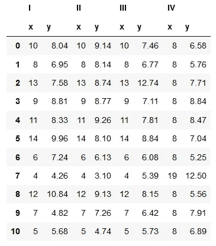
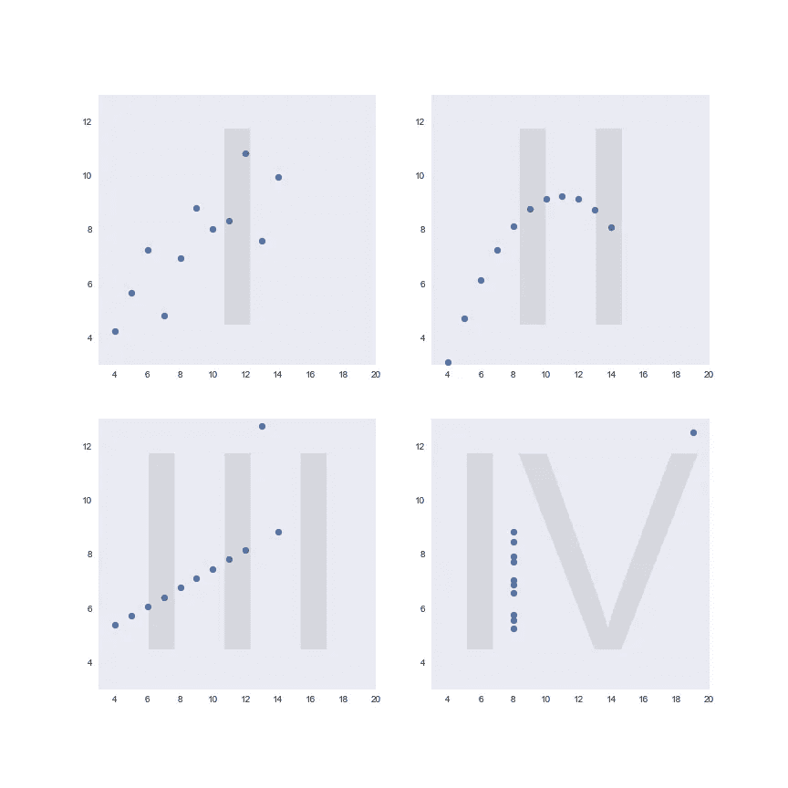
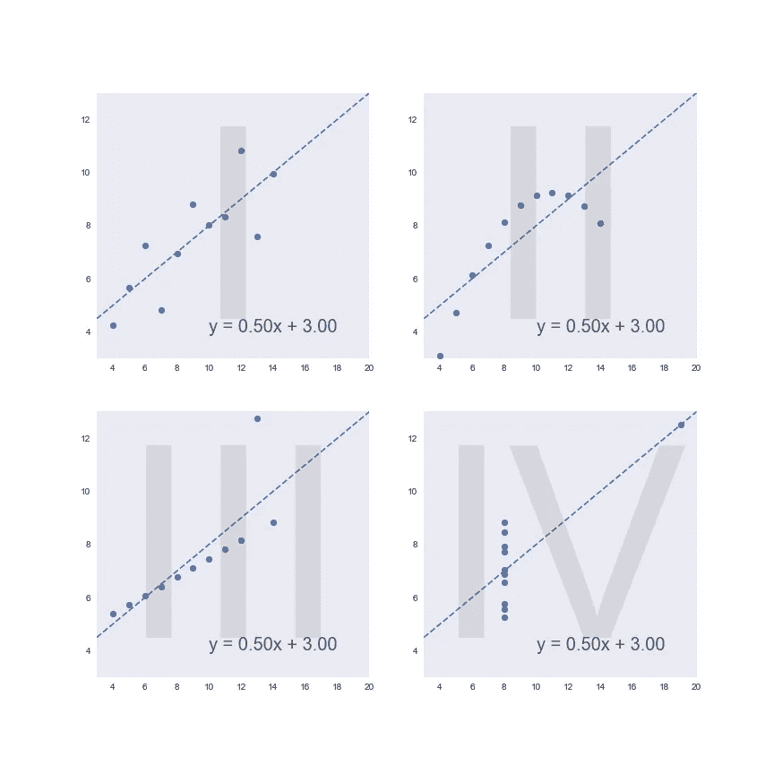

# 安斯科姆的四重奏，又名巨魔数据集

> 原文：<https://towardsdatascience.com/anscombes-quartet-aka-the-troll-dataset-b4b42da42f51?source=collection_archive---------37----------------------->

## 为什么你应该在下结论前绘制数据


马克·柯尼希在 [Unsplash](https://unsplash.com/s/photos/troll?utm_source=unsplash&utm_medium=referral&utm_content=creditCopyText) 上的照片

你有没有想过统计学家做什么是为了好玩？你可能会认为他们会喜欢去赌场，并通过告诉人们如何通过赌博来浪费金钱来破坏人们的夜晚。或者你可以想象一个人花一整天的时间掷硬币来测试它是公平的还是有偏见的。

但是你错了。事实上，当一个统计学家在寻找一点温和的娱乐时，他们会花时间*寻找有创意的方法来欺骗人们。*看看下面这个例子。



这是统计学家弗朗西斯·安斯科姆在 1973 年创建的数据集。我们这里有四个数据集(标为 I、II、III 和 IV，因为罗马数字很酷)，每个数据集由 11 对 x 和 y 坐标组成。

(对于这个讨论来说，坐标实际代表什么量并不特别重要。如果你愿意，你可以自己做。x 可以是给定圣代冰淇淋的勺数，y 可以是我吃完所有冰淇淋所用的秒数。好吃。)

因为人类的大脑在从表格数据中收集信息方面是垃圾——即使对于这个小得可怜的数据集也是如此——让我们分别绘制出四个数据集并进行比较(如果您感兴趣，您可以查看 Python 代码来完成此操作[这里](https://github.com/andrewhetherington/python-projects/blob/master/Blog%E2%80%94Anscombe's%20Quartet/Anscombe's%20Quartet.ipynb))。



*(为了便于比较，四个数据集的每一个都以相同的比例绘制在 x 轴和 y 轴上。)*

你可能想知道我要说什么。这四个数据集似乎没有什么共同点——它们都显示出截然不同的趋势，只有傻瓜才会把它们混为一谈。

好吧，让我们看看当我们调用我们的老朋友线性回归时会发生什么。



啊哦…这是最适合他们所有人的同一系列！这是怎么发生的？

也许我们可以发现每组数据中 x 和 y 之间相关性的差异。

```
Correlation coefficient for:Dataset I: 0.81642051634484
Dataset II: 0.8162365060002428
Dataset III: 0.8162867394895982
Dataset IV: 0.8165214368885031
```

现在我们真的有麻烦了…相关系数基本上都是一样的！有什么方法可以将这些数据集与它们的汇总统计数据区分开来呢？

```
(Mean of x values, mean of y values) for:

Dataset I: (9.0, 7.5)
Dataset II: (9.0, 7.5)
Dataset III: (9.0, 7.5)
Dataset IV: (9.0, 7.5)

(Variance of x values, variance of y values) for:

Dataset I: (11.0, 4.13)
Dataset II: (11.0, 4.13)
Dataset III: (11.0, 4.12)
Dataset IV: (11.0, 4.12)
```

真是一场噩梦！尽管我们已经看到数据的形状和模式一点也不相似，但您可能想要用来描述每个数据集的大多数简单、直观的汇总统计数据对所有四个数据集来说都是相同的。

你可能会想，如果我们没有事先把数据绘制出来，会发生什么样的可怕事情。我们可能已经看到了相同的汇总统计数据，并假设所有四个数据集具有相同的分布。我们的结论——以及因此而采取的任何行动——都将是不切实际的。

因此，把这当作一个警示故事吧——尽管汇总统计数据肯定是有用的，可以为我们提供比我们仅仅盯着图表所能收集到的更精确的信息，但它们过于简单的本质也可能具有欺骗性。*在你的探索性数据分析中，永远不要跳过可视化数据:*以不同的方式绘制、重新绘制、再绘制，以尝试和揭示新的模式。

因为正如我们所看到的，冰冷、坚硬的数字可能在欺骗你。

# 学分和更多信息

**Andrew Hetherington** 是英国伦敦的一名见习精算师和数据爱好者。

*   查看我的[网站](https://www.andrewhetherington.com/)。
*   在 [LinkedIn](https://www.linkedin.com/in/andrewmhetherington/) 上与我联系。
*   看看我在 [GitHub](https://github.com/andrewhetherington/python-projects) 上鼓捣什么。
*   用于制作本文作品的笔记本可以在[这里](https://github.com/andrewhetherington/python-projects/blob/master/Blog%E2%80%94Anscombe's%20Quartet/Anscombe's%20Quartet.ipynb)找到。

*数据集:Anscombe，F. J. (1973)。“统计分析中的图表”。美国统计学家。27 (1): 17–21.doi:10.1080/00031305.19478966。JSTOR 2682899。*

[Mark knig](https://unsplash.com/@markkoenig?utm_source=unsplash&utm_medium=referral&utm_content=creditCopyText)在 [Unsplash](https://unsplash.com/s/photos/troll?utm_source=unsplash&utm_medium=referral&utm_content=creditCopyText) 上拍摄的路标照片。