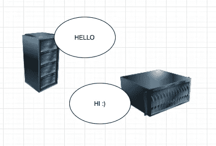
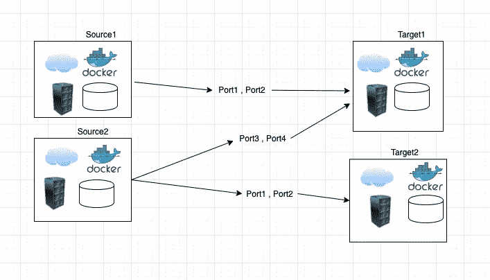

# Ansible —端口监控。

> 原文：<https://towardsdatascience.com/ansible-ports-monitoring-15f48c8e208e?source=collection_archive---------23----------------------->

## 今天，我将向您展示 Ansible 如何简化我们在监控服务器间网络通信时可能面临的技术难题。



事实上，在像银行业这样高度敏感的行业中，港口受到严格的监管，只有必要的港口才允许 SecOps 开放。否则，不受监管的端口可能成为 DDOS 等网络攻击的诱人目标。

为了更容易地解释事情，让我们想象一组名为**源**的主机应该与另一组名为**目标**的主机通信，只通过授权的**端口**。

**主机**可以是 cloud、docker、VM、metal server……端口可以是任何(https 443、SMTP 25、PostgreSQL 5432、Ldap 389、elk 9200、Redis 6379 或任何其他定制端口)。



现在我们到了有趣的部分:)

众所周知，SRE/DevOps 最重要的职责是监控。那么，SRE 团队如何轻松有效地监控服务器间的端口通信，尤其是在大型库存上？

他们如何在每个网络修补程序后执行运行状况检查，以确认没有退化？

更重要的是，他们如何在服务中断期间快速可靠地检查问题是否来自主机网络内部通信问题？

编排前(Ansible，Terraform..)，解决方案是创建一个 shell、PowerShell 或 python 脚本来 telnet 或 ping 任何目标主机。这种解决方案的最大缺点是必须在所有源服务器上一个接一个地手动启动脚本。

有了 Ansible，事情变得更加智能、自动化和简单。

事实上，我们可以创建一个任务(可以是 cron 作业),该任务将在所有源主机上执行，以通过定义的端口检查与所有目标主机的通信，并在出现问题时发送报告/警报。

现在让我们转到编码部分:)

我们将从创建 ansible 主任务开始:
**roles/ansi ble-role-ports/tasks/main . yml**

```
---
- name: Check global ports
  wait_for:
    host: "{{ item.name }}"
    port: "{{ item.port }}"
    state: started         # Port should be open
    delay: 0               # No wait before first check (sec)
    timeout: 3             # Stop checking after timeout (sec)
  ignore_errors: yes
  with_items: "{{ server_to_test }}"
```

这是主要的 ansible 角色任务，指示将通过端口“item.port”从“item.name”远程登录到“server_to_test”中的主机列表。

现在让我们创建我们的游戏:
**plays/ports/ports . yml**

```
---
- name: check ports
  hosts: "{{ host }}"
  become: yes
  become_user: root
  roles:
    - ansible-role-ports
```

这是一个可行的**行动**，它将使用清单中的源主机和目标主机来调用任务。

关于清单，它只是列出了主机(源和目标)，每个主机都有一个 group_vars 参数，该参数指定了用于每组源服务器的目标主机和目标端口。

**inventory/hosts-update . yml**

```
source1:
  hosts:
    host1:
      ansible_host: ip-source1-host1
      host_name: source1-host1
    host2:
      ansible_host: ip-source1-host2
      host_name: source1-host2

source2:
  hosts:
    host1:
      ansible_host: ip-source2-host1
      host_name: source2-host1
    host2:
      ansible_host: ip-source2-host2
      host_name: source2-host2

target1:
  hosts:
    host1:
      ansible_host: ip-target1-host1
      host_name: target1-host1
    host2:
      ansible_host: ip-target1-host2
      host_name: target1-host2     

target2:
  hosts:
    host1:
      ansible_host: ip-target2-host1
      host_name: target2-host1
    host2:
      ansible_host: ip-target2-host2
      host_name: target2-host2
```

最后是每组源主机的 group_vars:

**inventory/group _ vars/source 1 . yml**

```
---
server_to_test:
  - {name: 'target1', port: 'port1'}#target1
  - {name: 'target1', port: 'port2'}#target1

  - {name: 'target2', port: 'port1'}#target2
  - {name: 'target2', port: 'port2'}#target2
```

**inventory/group _ vars/source 2 . yml**

```
---
server_to_test:
  - {name: 'target1', port: 'port3'}#target1
  - {name: 'target1', port: 'port4'}#target1
```

该剧的用法如下:

```
---
ansible-playbook -i inventory/hosts-update.yml plays/ports/ports.yml — extra-vars ‘{“host”:”source1,source2”}’ -k -K -vv -u “USER”
```

Source1、source2 可由任何其他主机集更改。

我们结束了，所以一如既往，我希望你学到了新的东西。
再见:)

萨拉姆。