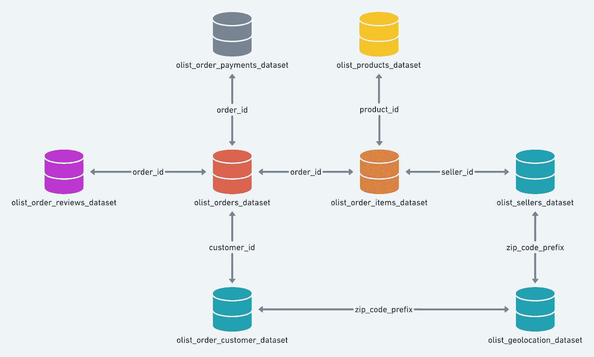
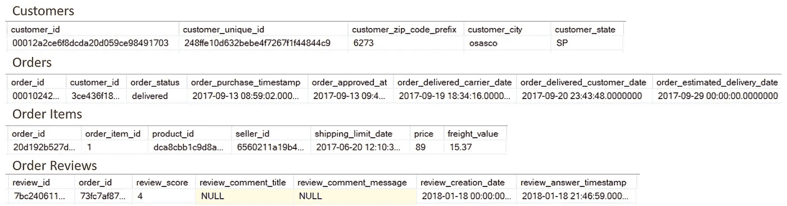
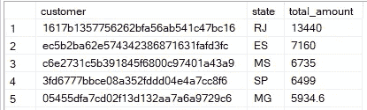
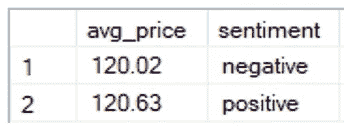
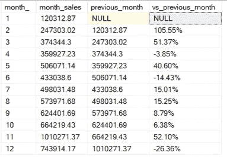

# 使用 SQL 回答业务问题

> 原文：<https://towardsdatascience.com/answering-business-questions-with-sql-fd0315707980?source=collection_archive---------14----------------------->

## SQL 变得简单

## 惊讶于你的询问的力量！

让 SQL 打开您的数据抽屉！[来源](https://unsplash.com/photos/lRoX0shwjUQ)

大多数与数据科学相关的工作都需要你有很强的 SQL 技能，这是有意义的，因为你最基本的任务之一就是准确地操作数据。我们将 SQL 用于许多目的，包括探索性数据分析、创建数据的过滤数据集，甚至是发现关于业务本身的见解。

许多 SQL 课程将为您提供如何设计基本查询的概述，但您很少有机会练习编写基于真实问题的查询，使用多个表并再现我们作为数据分析师通常会做的事情，因此我在本教程中的目标是向您展示如何使用流行的 SQL 函数来完成这些工作，例如:

*   **格当；**
*   **子查询；**
*   **窗口功能；**
*   **临时表**。

在我们开始之前，您可以在这里找到数据集[，并且跟随教程的 SQL 文件是](https://github.com/olist/work-at-olist-data/tree/master/datasets)[这里](https://github.com/lucasmoratof/sql-projects/blob/master/Queries%20for%20article%20-%20Answering%20Business%20Questions%20with%20SQL.sql)。

## 理解数据

第一步是要很好地了解我们手中有什么样的数据。今天，我们将使用一家巴西网店的交易数据。让我们看看数据库是如何组织的:

数据库模式。[来源](https://github.com/olist/work-at-olist-data/blob/master/images/schema.png)

有 8 个表，都由至少一个字段连接。这些数据包含大约 10 万笔交易，包括关于客户、支付、产品和订单的信息。有很多可能性的空间，但我们将把重点放在关于销售额的问题上。假设您的经理问了您 3 个问题:

*   每个州的顶级买家是谁，他们花了多少钱？
*   留下差评的人平均花费多少？正面评价呢？
*   在 2017 年的几个月里，销售额增加或减少了多少，按百分比计算？

为了回答这些问题，我使用了最流行的 SQL 管理系统之一的 SQL Server。还有许多其他可用的变体，如 [PostgreSQL](https://www.postgresql.org/) 、 [SQLite](https://www.sqlite.org/index.html) 和 [MySQL](https://www.mysql.com/) 。语法可能会稍有变化，但主要概念在不同的语言中保持不变。

作为参考，下面是我们今天要用的四个表格的第一行。花点时间检查字段以及表是如何连接的。

表的第一行是客户、订单和订单项目。

## 每个州的顶级买家是哪些？

对于这个查询，我们需要选择每个州中总购买量最高的客户。我们需要的数据在 ***客户*** 和 ***订单项目*** 表中，我们需要使用 ***订单*** 作为连接器。我们在这种情况下使用的方法是在一个[窗口函数](https://en.wikipedia.org/wiki/SQL_window_function)中生成一个子查询，按照州聚集结果，并只选择价格最高的行。

该查询返回巴西 27 个州中的最佳买家，您可以查看下面的前五行:

按州列出的最佳买家，前 5 行。[来源](https://github.com/lucasmoratof/sql-projects/blob/master/Queries%20for%20article%20-%20Answering%20Business%20Questions%20with%20SQL.sql)

## 按情感划分的平均费用

情感分析是数据科学中的热门话题之一，因此您可能需要对其进行分类以执行分析。我们有一个评论分数栏，范围从 1 到 5。对于这个例子，我们将假设评分等于 4 或 5 的评论是正面的，其他任何评论都是负面的。接下来，我们将计算每组的平均值，为此，我们需要使用三个表:***order _ reviews***、 ***order_items*** 和 ***orders*** (再次作为连接符)。我们将在这里使用一个[公共表表达式](https://docs.microsoft.com/en-us/sql/t-sql/queries/with-common-table-expression-transact-sql?view=sql-server-ver15) (CTE)，它的作用就像一个临时表，我们可以从这个表中使用计算字段进行查询，因为我们不能直接使用 average 函数。

我们得到的结果表明，这两种情绪之间的价格相差不大。很有趣，不是吗？

查询结果。快乐的人和消极的人只有 0.61 美分的差距。[来源](https://github.com/lucasmoratof/sql-projects/blob/master/Queries%20for%20article%20-%20Answering%20Business%20Questions%20with%20SQL.sql)

## 2017 年月销售额

对于最后一个查询，我们需要表 ***订单*** 和 ***订单 _ 项目*** 。挑战在于获得前几个月的总销售额，然后将差额与实际月份进行比较。我们需要的步骤是:

*   创造一个 CTE；
*   使用 [LAG()](https://www.techonthenet.com/sql_server/functions/lag.php) 创建一个包含上月销售额的列；
*   在外部查询中，执行计算，使用 [FORMAT()](https://docs.microsoft.com/en-us/sql/t-sql/functions/format-transact-sql?view=sql-server-ver15) 以一种良好的方式获得结果

结果看起来很容易理解。在这里，你可以看到 2017 年的销售波动有多大:

2 月和 11 月的销售额大幅增长，这些信息可用于计划库存水平，甚至预测未来的收入。[来源](https://github.com/lucasmoratof/sql-projects/blob/master/Queries%20for%20article%20-%20Answering%20Business%20Questions%20with%20SQL.sql)

今天就到这里吧！在本教程中，您已经看到了 3 个简单的问题是如何需要 SQL 为您提供的各种函数的。查询设计是一个令人惊奇的探索主题，其中许多变体可以产生强烈的影响，因此它总是一个很好的研究主题。

你会做出不同的查询吗？我们都是来学习的，所以请在评论中留下你的评论或其他问题。我希望你喜欢这篇文章！