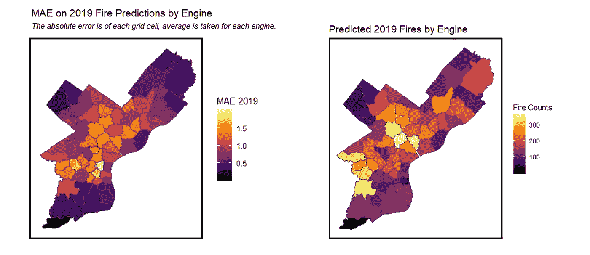
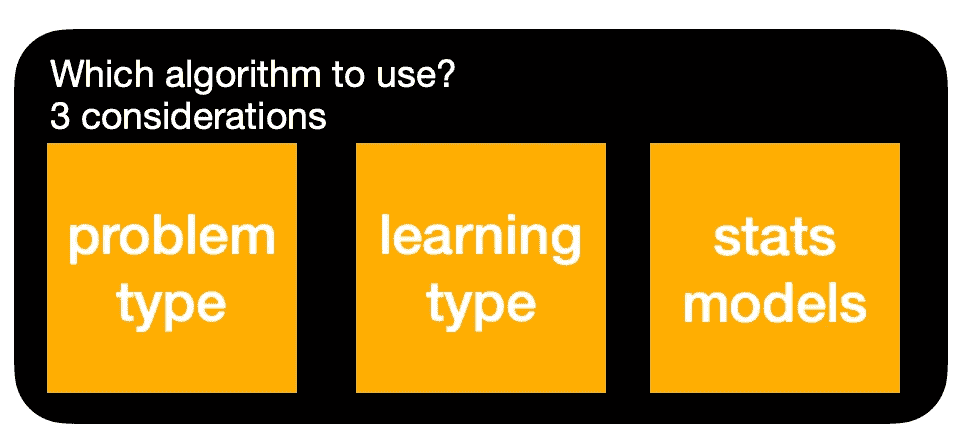
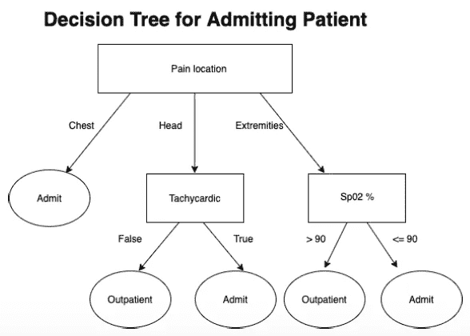
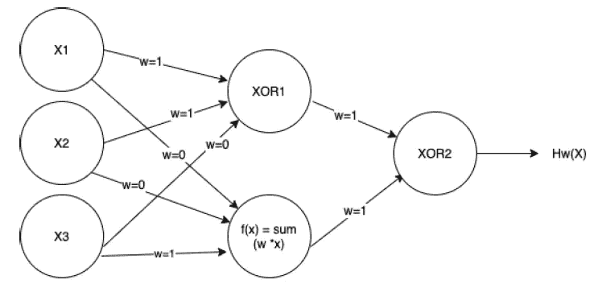

# 回答深奥的问题:ML 应用与算法

> 原文：<https://towardsdatascience.com/answering-the-abstruse-ml-applications-algorithms-c1892dd6786c?source=collection_archive---------82----------------------->

## 针对不知所措的初学者的各种机器学习算法的概述。

机器学习:一个关于统计模型和计算机算法的研究领域，用于在新的环境中做出预测，这是 T2 的领域。

一年前，我对机器学习几乎一无所知。这是一个算法和数学的世界，我非常想成为其中的一部分。它很酷，很令人兴奋，也很时尚，而且吸引了我在大学学习期间对数学和编程的兴趣。我很幸运地在 2019 年秋季被城市空间分析研究生课程录取，将我推入了数据科学的世界。

在此之前，我记得滚动媒体，尽可能多地消耗关于机器学习。我对什么是机器学习有一个困惑的想法，部分是因为在谷歌上快速搜索“机器学习”会让机器人和大脑出现在未来的蓝光中。[(在谷歌图片搜索中自己去看吧。)](https://www.google.com/search?q=machine+learning&sxsrf=ALeKk03bD1MINLHOtG4yowh7XKhia2ECgw:1591583214411&source=lnms&tbm=isch&sa=X&ved=2ahUKEwini4DBlfHpAhXNF3IKHRjmDwsQ_AUoAXoECBQQAw&biw=1280&bih=594)我把机器学习和*机器人接管星球*混为一谈(我知道这么幼稚和愚蠢；有人发明了时间旅行，所以我可以给过去的自己一巴掌。

机器学习==机器人弹琴？？？有时候。(照片由 [Franck V.](https://unsplash.com/@franckinjapan?utm_source=medium&utm_medium=referral) 在 [Unsplash](https://unsplash.com?utm_source=medium&utm_medium=referral) 上拍摄)

此外，机器学习已经成为一个时髦的词，经常与人工智能(AI)互换使用，尽管机器学习只是人工智能的一个子集，增加了对机器学习是什么的更多困惑。机器学习比简单的编程要微妙得多，而且不仅仅是关于机器人！

在接触了不同的机器学习问题后，我意识到机器学习不是一种技术，而是一个领域。以这种方式构建机器学习让我更容易开始研究它。这不是一个一次性的学习技巧，而是一个*广泛的算法工具箱*，可以在大量的设置中使用。

# 机器学习的应用非常广泛

虽然机器在棋盘游戏中击败专业人士或脸书预测我们 feed 上显示的最可爱的猫的照片是机器学习的令人敬畏和令人兴奋的应用，但机器学习也可以用于许多其他应用。例如，机器学习可以用于**医疗诊断**以识别肿瘤是良性还是恶性。机器学习还可以用于**城市规划**，比如预测一个城市的[潜在火灾风险](https://pennmusa.github.io/MUSA_801.io/project_12/index.html)。机器学习也可以通过[定向营销](https://leannechan.github.io/housingCredit.html)用于**业务**。也就是说，给定一些关于你的消费者的数据，你可以确定未来潜在的市场消费者。**斯坦福大学的 CS229 m** [**机器学习项目**](http://cs229.stanford.edu/projects2016.html#general) **网站提供了一个机器学习应用的绿洲。**

预测费城火灾数量的机器学习。图片作者。

**机器学习应用的非穷尽列表:**

1.  图片分类:这是猫还是狗？
2.  文本分类:我的邮件是垃圾邮件吗？
3.  物体识别:这是停车标志吗？(用于自动驾驶汽车！)
4.  公共政策:在这个路口发生交通事故的风险有多大？
5.  游戏:下一步采取什么行动？

考虑到各种各样的应用，在机器学习下有一大堆不同的算法可以用来解决不同的问题。

# 不同的问题不同的算法。

在这里，我用算法来指代解决机器学习问题的广义过程。

要使用的算法取决于问题的背景。作者图片

**关键词:**
-数据集:不同数据实例的集合/表格，具有给定特征集合的值。
-实例:一个实例就是一个数据点。
-特性:数据点的每个实例都有一个特性值。
-标签/结果:要预测的项目。这可能是也可能不是数据集的一部分。
-训练/拟合:为减少预测误差/损失的模型寻找“解决方案”。

## **问题类型**

第一步是确定你需要解决的问题类型。两个主要问题是**分类**(预测类别)或**回归**(预测数值)。例如，肿瘤的医学诊断是一个分类问题，其结果是良性或恶性。而房价预测将是一个回归问题，结果是任何实数。因此，不同的统计方法被用来解决分类或回归问题。

## 学习类型

接下来，还有不同的**类型的学习**。除了决定问题是分类问题还是回归问题之外，你还需要决定在给定信息的情况下需要什么样的学习。这里有三个主要的学习问题。

1.  **监督学习**
    给定**数据和结果**，你可以建立一个模型来预测一组新数据的结果。(根据我的个人经验，这是最常见的一类机器学习问题。)
    **用途**:利用以往肿瘤的扫描和结果数据进行肿瘤分类，利用前几年的销售价格数据预测房价。(注意:既可以是回归问题，也可以是分类问题！)
2.  **无监督学习**
    给定**只是数据**而不知道有什么标签存在，找到数据背后的一些隐藏结构。
    **使用**:识别城市周围的火灾群，或者在社交网络中寻找群体。
3.  **强化学习
    强化学习的目标是利用学习到的奖励来确定每个状态下的最佳行动。
    **用途**:玩游戏或者**机器人**学习拿着一个物体/探索新的地形。**

## 统计方法的类型

在确定你试图解决的问题类型(回归/分类)和学习问题类型(监督/非监督/强化)之后，最后一步是决定使用的统计方法。这些不同的数学模型帮助我们对数据进行预测。

在不深入研究太多细节的情况下，这里有各种机器学习方法的简要概述。

1.  **决策树(监督、分类/回归)**

还记得你十几岁时在杂志上做过的那些小测验吗？回答几个问题，跟着一些箭头，它会告诉你你理想中的名人迷恋对象。？这就是决策树！决策树用于分类甚至回归(虽然有点难)。每个节点都有数据的特定特征；在医学诊断的例子中，疼痛的位置。在叶节点(最终节点)，对在该点结束的数据实例进行分类。*训练*然后，机器学习模型包括决定在每个节点上分割数据的特征。目标是创建一个能够正确分类训练数据的最优决策树(最短的)。然后，结果树将用于预测新的实例(即，进入医院的新患者)。

二元分类问题的简单决策树。图片作者。

**2。线性回归(监督回归)**

线性回归用于回归问题(预测数值)，比如预测房价。该模型通过拟合数据的线性组合来预测结果。

> *房价(标签)=常数+B1 *房龄+B2 *户型+B3 *房间数*

上述等式中的常数和系数将在训练阶段被识别。然后，拟合的方程将用于根据新数据预测房价。

**3。逻辑回归(监督分类)**

逻辑回归是一种使用线性方程来预测数据的某个实例属于某个类别的概率的方法。然后，可以设置概率的阈值，使得如果预测的概率小于阈值，则该实例属于 A 类，否则属于 B 类。

**4。模型集成(监督、分类/回归)**

随机森林是集合方法最著名的例子。这个想法是从许多不同的决策树中收集一个预测的集合。

**5。神经网络和深度学习(监督或无监督，分类)**

神经网络通常用于图像分类。这种方法对我来说仍然很疯狂，是一种更“黑箱”的机器学习方法。神经网络松散地模仿了人类的大脑。这个想法是在网络中堆叠不同的层来传递数据，并在这些层之后输出预测。在训练过程中，拟合不同层之间的权重。使用这些权重，神经网络用于对新数据进行预测。

p.s .深度学习是机器学习但机器学习不是深度学习。

简单的 2 层神经网络示例。左侧的第一组节点是输入数据。图片作者。

**6。k-均值聚类(无监督，分类)**

回想一下，无监督学习意味着原始数据事先没有任何分配的标签。在下面的动画中，每个点代表一个数据实例，它们是根据轴所代表的要素值绘制的。目标是将数据划分为 k 个分区，在这些分区中，数据被分类到离其中心最近的聚类中。分割继续进行，直到点之间的距离和所有聚类内的平均位置(即，距离的方差)最小化。

“训练”k 均值聚类模型。图片来源:Chire/CC BY-SA(【https://creativecommons.org/licenses/by-sa/4.0】T2)

**7。q-学习(强化)**

Q-learning 算法用于解决强化学习问题，它可以更新在训练过程中在环境的每个状态下采取不同行动的预期回报。当将来使用该模型时，在环境的每个状态下，将选择具有最高预期未来回报的行动。

# 解决机器学习问题的算法有无限多种。

我在上面提到了一些算法，这也不是完整的列表。此外，每个算法都有进一步的微调方法和参数。此外，有许多方法可以使上述算法更快地达到解，并且在训练模型时部署这些方法。因此有无限数量的机器学习算法！举个简单的例子，你可以构建一个不同深度(节点层)的决策树，或者一个不同树数的随机森林，或者你可以在 k-means 聚类中使用不同的迭代。在实践中，许多具有不同参数的不同模型被用于解决机器学习问题。评估方法(机器学习的另一个广泛领域)用于识别问题上下文中的最佳模型。

这篇文章非常简要地概述了机器学习可以解决的不同问题以及不同类型的机器学习方法！如果要从这篇文章中学到什么的话，那就是机器学习是一个极其多样化和深入的研究领域，一种尺寸并不适合所有人。而且机器学习也不是机器人接管世界(大多是*)。本文之外还有很多关于机器学习技术的内容，我祝你在 ML 之旅中好运！*