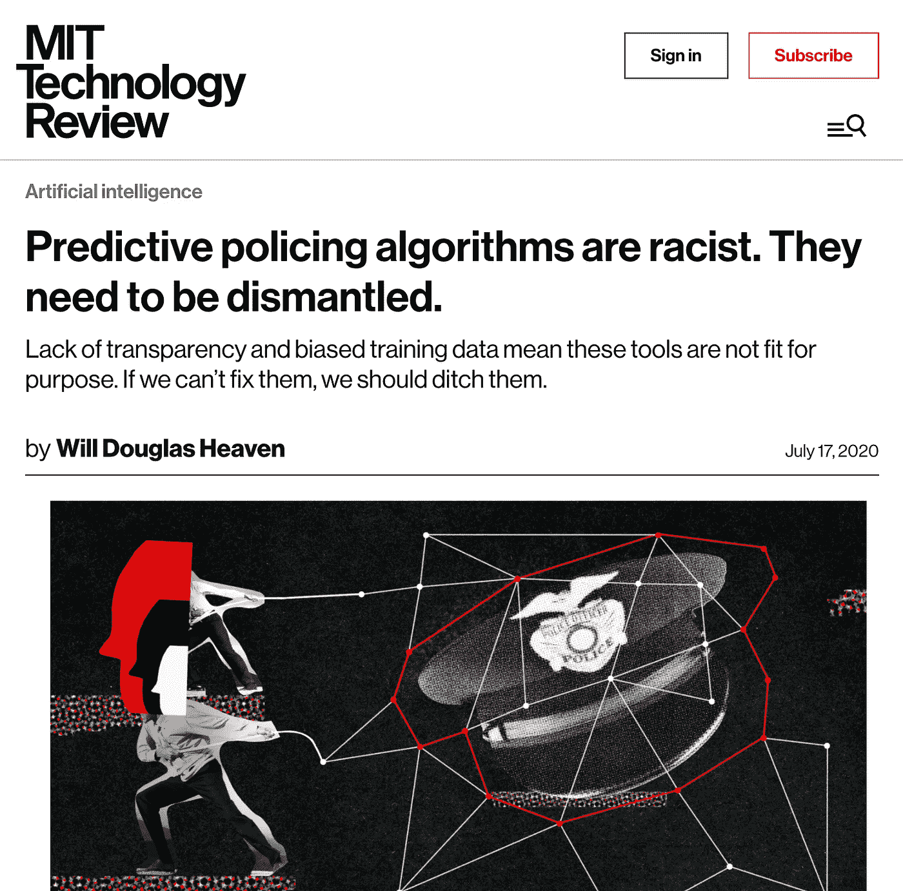
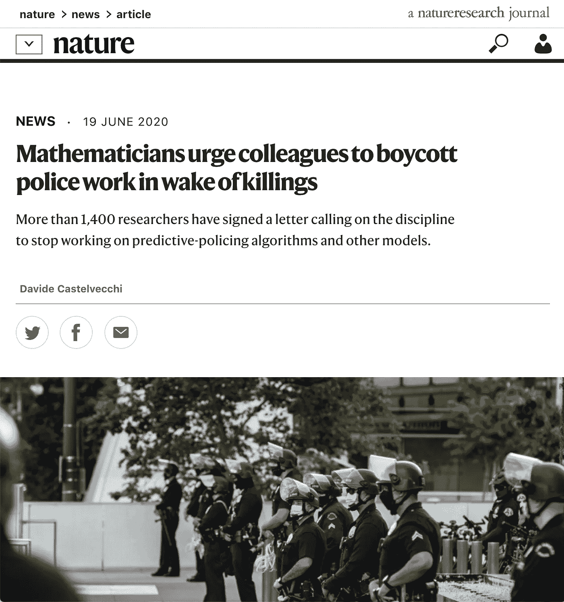
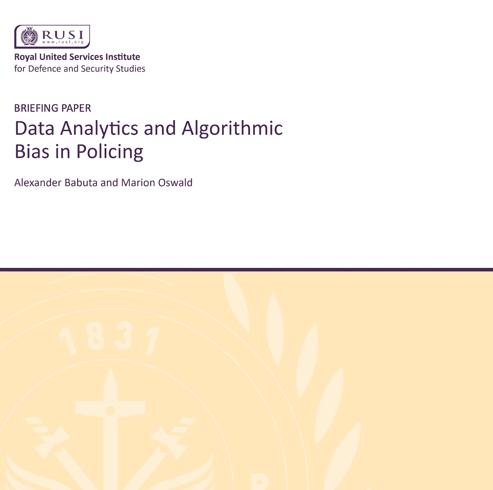
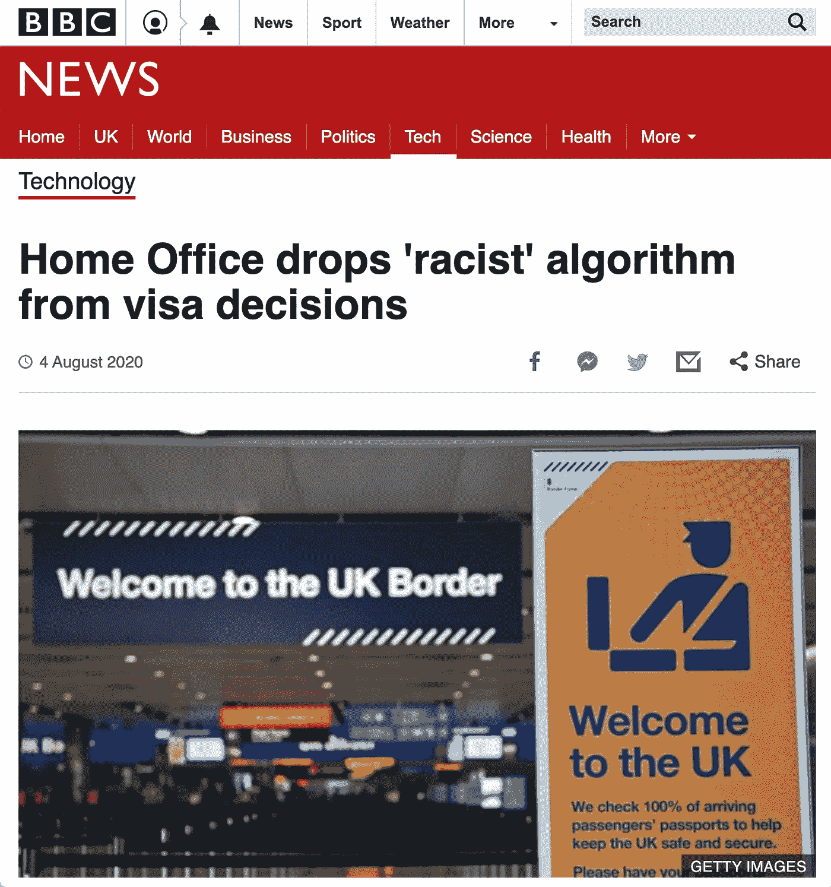
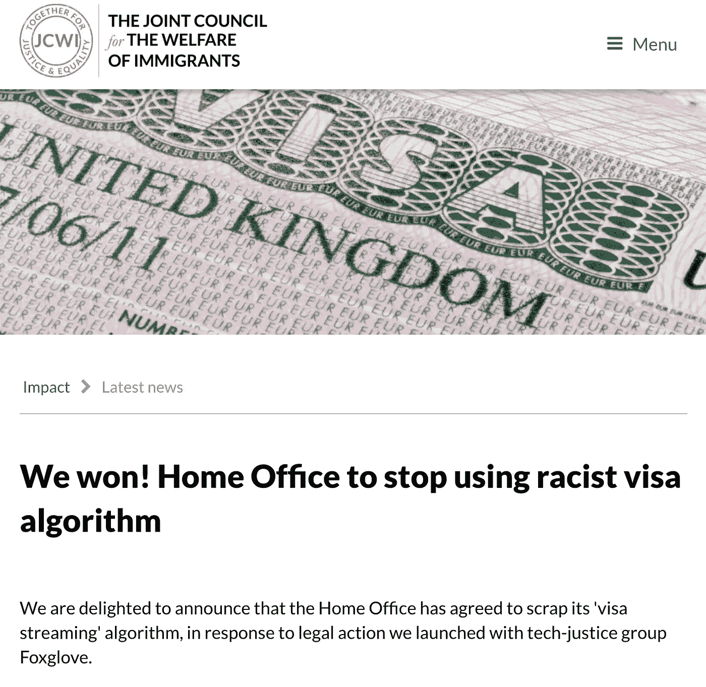

# 反种族主义、算法偏见和政策:简介

> 原文：<https://towardsdatascience.com/anti-racism-algorithmic-bias-and-policing-a-brief-introduction-bafa0dc75ac6?source=collection_archive---------33----------------------->

詹姆斯·伊德斯在 [Unsplash](https://unsplash.com?utm_source=medium&utm_medium=referral) 上的照片

最近，我对各种与反种族主义、算法偏见和监管相关的问题感兴趣。

**反种族主义的警察看起来像什么？**

我们所说的算法偏差和算法公平是什么意思？

**数据科学和机器学习从业者如何确保他们在工作中反种族主义？**

传统上，维持治安的目的是确保公众的日常安全。这往往涉及警察部队对涉嫌犯罪活动的报告作出反应。然而，我们可能正在进入一个新的治安时代。新技术，包括传统的数据分析以及可能被称为机器学习或人工智能的技术，使警察部队能够对可疑的犯罪活动做出预测，而这在以前是不可能的。

我们可能正处于一个新技术发展速度超过为确保这些技术的安全使用所必需的监管速度的时期。我认为这是“安全差距”或“责任差距”。

我希望回答这些与反种族主义、算法偏见和监管相关的问题，并通过一些最近的例子，引导你思考这些与安全和问责制相关的问题。

7 月，《麻省理工技术评论》发表了一篇题为“[预测性警务算法是种族主义者”的文章。它们需要被拆除。](https://www.technologyreview.com/2020/07/17/1005396/predictive-policing-algorithms-racist-dismantled-machine-learning-bias-criminal-justice/)

这篇文章讲述了一位名叫 Yeshimabeit Milner 的活动家成为创始人的故事，他在 2017 年共同创立了 Data for Black Lives，以反击刑事司法系统中的偏见，并拆除所谓的学校到监狱的管道。

米尔纳的重点是预测性警务工具和警察部队滥用数据。

根据这篇文章，有两大类预测性监管算法。

**基于位置的算法**，它通过使用地点、事件、历史犯罪率、天气状况来创建犯罪“天气预报”，例如 PredPol，被美国数十个城市的警察部队使用。

**基于个人的算法**，它通过使用年龄、性别、婚姻状况、药物滥用史、犯罪记录来预测一个人是否有很高的机会参与未来的犯罪活动，例如，一种称为 COMPAS 的工具，被司法机构用来帮助做出审前释放和判决的决定，它会发布一个 1 到 10 之间的统计分数，以量化一个人在释放后再次被捕的可能性。

使用预测算法存在许多这些工具必须努力克服的一般性问题。例如，天真的预测算法很容易被逮捕率扭曲。

如果一个社会群体，例如美国的年轻黑人，有系统地有更高的逮捕率，即使这是有偏见的，然后使用有偏见的数据来训练一个预测模型，将这种偏见“烘焙”到未来的预测中。

来自文章:

> 虽然根据法律，算法不使用种族作为预测因素，但其他变量，如社会经济背景、教育和邮政编码，可以作为替代因素。即使没有明确考虑种族，这些工具也是种族主义的。

另一个问题是训练数据:一些模型是在人口的非代表性样本上训练的，例如加拿大白人占多数的地区。将从这些样本中获得的推论应用于普通人群可能会有问题。

来自文章:

> Static 99 是一款旨在预测性侵犯者再犯率的工具，它在加拿大接受培训，那里只有大约 3%的人口是黑人，而美国是 12%。美国使用的其他几个工具是在欧洲开发的，那里有 2%的人口是黑人。由于国家和人群之间社会经济条件的差异，这些工具在未经培训的地方可能不太准确。

为什么会推动这些工具的使用？

有许多可能的原因，包括预算削减，以及认为他们在预测未来犯罪活动方面比人更客观。

几十年来，风险评估一直被用来减少警务中的偏见，只是在最近几年，这一强有力的主张受到了更多的审查。

另一个问题是使用“报警电话”作为训练数据，而不是逮捕或定罪数据，这更有可能是有偏见的，因为它是在过程的早期生成的，并且更依赖于谁打电话的主观判断。

通常也不清楚使用的是什么工具。

> “我们不知道有多少警察部门已经使用或目前正在使用预测性警务，”理查森说。
> 
> 例如，新奥尔良警方使用秘密数据挖掘公司 Palantir 开发的预测工具的事实是在 The Verge 调查后才曝光的。公共记录显示，纽约警察局向帕兰蒂尔支付了 250 万美元，但没有说明支付的目的。

预测性警务系统有如此多的突出问题，吸引了如此多的关注，这并不奇怪。

6 月，《自然》杂志发表了一篇名为“[数学家敦促同事抵制凶杀案后的警察工作](https://www.nature.com/articles/d41586-020-01874-9)”的文章。

《自然》报道称，截至 6 月，超过 1400 名研究人员签署了一封信，呼吁数学家停止研究预测性警务算法和其他警务模型。

你可以在这里亲自阅读这封信[。](https://www.math-boycotts-police.net/)

> 鉴于警察法外谋杀乔治·弗洛伊德、布里奥纳·泰勒、托尼·麦克达德和在他们之前的许多人，以及警察随后对抗议的野蛮反应，我们呼吁数学界抵制与警察部门合作。

在某些地方，它关注 PredPol，链接到来自 The Verge，Vice，MIT Technology Review 和纽约时报的文章。

> 鉴于美国警务中的结构性种族主义和野蛮行为，我们不认为数学家应该以这种方式与警察部门合作。给种族主义披上“科学”的外衣实在是太容易了。请和我们一起承诺不与警方合作。此时此刻，这是我们作为一个社区最起码能做的。
> 
> 我们要求任何具有潜在高影响的算法都要接受公共审计。对于那些想做更多的人来说，参与这个审计过程可能是一种利用数学专业知识来防止滥用权力的积极方式。我们还鼓励数学家与社区团体、监督委员会和其他致力于开发压迫性和种族主义做法的替代方案的组织合作。与数据科学组织合作的例子包括 Data 4 Black lifes(【http://d4bl.org/】)和 Black in AI([【https://blackinai.github.io/】](https://blackinai.github.io/))。

除了敦促社区在这些问题上合作，它还建议对任何具有“潜在高影响”的算法进行公开审计。

《自然》杂志的讨论很有用，因为它带来了 PredPol 首席执行官以及那些熟悉这封信的人的回应。

这包括一个引人注目的声明，即反映在犯罪统计中的历史偏见“没有风险”会影响预测。)

> 然而，MacDonald 认为，PredPol 只使用受害者报告的犯罪，如盗窃和抢劫，来通知其软件。他说:“我们从来不预测有可能由官员引发偏见的犯罪类型，比如毒品犯罪或卖淫。”。

与此同时，对评估 PredPol 在实现其预期目标方面的有效性感兴趣的学者们发现了混杂的证据。

> 去年，一项针对加州洛杉矶警察局使用 PredPol 八年的外部审查得出结论称，“很难就该系统在减少车辆或其他犯罪方面的有效性得出结论”。2015 年发表在《美国统计协会杂志》(Journal of the American Statistical Association)上、由该公司创始人共同撰写的一项研究观察了部署了其软件的两个城市，结果显示，这些算法能够比人类分析师更好地预测犯罪地点。

然而，这篇文章继续报道说，由一些作者进行的一项独立研究没有发现显著的统计效果。

在英国，虽然情况略有不同，但我们似乎仍在追随美国警察部队更多使用技术的趋势，尽管有点落后。

2019 年 9 月，英国皇家联合军种研究所(Royal United Services Institute)发表了一份名为“[数据分析和警务中的算法偏差](https://www.gov.uk/government/publications/report-commissioned-by-cdei-calls-for-measures-to-address-bias-in-police-use-of-data-analytics)”的报告，该研究所是一家专注于国防和安全部门(包括武装部队)的顶级白厅智库。这是一份由英国政府数据伦理政策部门——T2 数据伦理与创新中心委托撰写的独立报告。

这份报告有一些重要的发现。

*   可能会出现多种类型的潜在偏见:不必要的歧视、真实或明显的决策、结果和过程的扭曲,“对特定群体中的个人系统性地不太公平”
*   算法公平不仅仅与数据有关:考虑更广泛的运营、组织和法律背景也很重要
*   缺乏指导:对于警方使用数据分析，缺乏组织指导方针或明确的审查、监管和执行流程

在统计学中，对群体的预测通常比对个体的预测更有效。有了好的数据集，你通常可以对总体上的一些现象做出权威的陈述，即使不是对统计总体中的个体成员。

使用不具代表性的数据集来对个人做出推论是相当危险的。据推测，当所使用的算法(例如黑盒 ML 算法)及其因果推理机制没有被很好地理解时，这种风险甚至更高。

> “机器学习最糟糕的事情之一是预测罕见的事件，尤其是当你没有大量数据的时候。”。考虑到这一点，该工具试图预测的事件越不频繁，它就可能越不准确。此外，准确性通常难以计算，因为当判断一个人有犯罪的风险时，通常会进行干预，防止预测的结果发生。当局不知道如果他们不干预会发生什么，因此没有办法测试预测的准确性(或其他)。

在英格兰和威尔士，少数警察部队使用最大似然算法来评估再犯风险，通知优先次序并协助决策。

其中包括达勒姆、埃文和萨默塞特(即布里斯托尔)、西米德兰兹(即伯明翰)和汉普郡。这些可能是技术最先进的警察部队，拥有最多预算的警察部队，或者其他什么。

该报告的受访者提出了与另一篇文章类似的担忧，即如果训练数据是警察互动而不是刑事定罪，那么“有偏见的样本的影响可能会通过反馈回路被算法预测放大”。

该报告毫不避讳地指出了整个预测性警务方法的弱点。

> 将“修正”偏见作为“数据”问题来关注，可能会分散对更广泛问题的注意力，这些问题是，在特定的警务环境中，是否应该使用预测算法系统。

如果不详细审查，也有人对人权表示关切。根据《欧洲人权公约》第 2 条(即“生命权”)评估使用这些工具的法律依据被认为是相关的，但不在本报告的范围之内。据推测，继续使用违反国际法的技术可能会给这些技术的操作者，包括政府带来法律风险。

大多数政府报告都以更好的合作或更好的监管或诸如此类的建议结尾，正如大多数学术文章表明需要进一步研究一样。

因此，毫不奇怪，该报告的建议是一个新的算法工具在警务中的行为准则，明确规定了审查、监管和执行的角色和责任。有人呼吁建立独立道德审查和监督的标准程序，以确保透明度和问责制。

这一建议类似于写信人提出的要求。我们需要对最大似然算法进行公开审计，尤其是当它们可能对人们的生活产生影响的时候。

我最初写这篇文章是作为我的雇主关于反种族主义设计方法的会议的一部分。我在这里结束，但在准备幻灯片后的时间里，我发现了相关的新闻文章，这些文章说明了这是一个多么快速移动的空间。

8 月，BBC 新闻发布了“[内政部从签证决定中删除‘种族主义’算法](https://www.bbc.co.uk/news/technology-53650758)”。

与此同时，移民福利联合理事会发表了“[我们赢了！内政部停止使用种族主义签证算法](https://www.jcwi.org.uk/news/we-won-home-office-to-stop-using-racist-visa-algorithm)”，讲述了内政部使用的签证处理算法的相同故事。

我建议你自己完整地阅读这两个故事。一个绿色-琥珀色-红色的“交通灯”系统被用来根据风险等级对签证申请人进行分类。这个风险模型包括国籍，FoxGlove(一个技术司法组织)声称，内政部保存了一份“可疑国籍”的名单，该名单将自动被评为红色。

从法律上说，根据《平等法》，这一过程相当于种族歧视。

从 8 月 7 日星期五(今天的写作日期)开始，内政大臣普里蒂·帕特尔宣布，内政部将暂停“签证流”算法，“等待流程的重新设计”，这将考虑自动签证申请中“无意识偏见和国籍使用的问题”。

不透露太多，我在公共部门技术领域的工作意味着我认识一些参与这个项目的同事，即使不是完全相同的事情。

我认为有必要记住有多少公共部门的技术，尤其是国防和安全技术，是外包给外部供应商的。正如我们前面看到的，美国警察部门的许多领导人甚至不确定他们使用的是什么技术，因为大多数人都不知道合同安排是如何制定的。

然而，我不认为声称不知情是一种辩护，如果这些算法确实对人们的生活产生了不良影响，正如法院审理的一个法律案件所发现的那样。甚至在案件进入法庭之前，这些技术的操作者就有义务负责任地使用它们。已经讨论过的那种公共审计肯定会有助于实现这一目标。

我现在可以回到我开始提出的问题上来。

**反种族主义的警察看起来像什么？**

我认为这看起来像是一支致力于公共安全和福祉的警察部队，尤其是在处理黑人的命也是命运动引发的问题上。

**我们所说的算法偏差和算法公平是什么意思？**

算法偏差，或数据分析和机器学习中的偏差，可能来自许多地方，包括非包容性数据集，或数据分析或统计过程的问题。当数据工具可以公开审计它们如何对社会的公平做出贡献时，算法公平就可以实现。有了公正作为公平的模型，这意味着实现算法公平也可以有助于更大的社会公正。

**数据科学和机器学习从业者如何确保他们在工作中反种族主义？**

虽然从业者可能认为他们在一个独立于决策者或政策制定者的空间中运作，但我认为事实并非如此。甚至技术专家也有发言权。承诺不从事破坏性的技术项目，或者不与有损害他人不良记录的组织合作，可能是一个很好的前进方向。

这些组织在预测性警务和技术伦理方面都做得很好，如果你对这一领域感兴趣，我建议你关注他们的工作。

[黑人生活的数据](https://d4bl.org/) ( [Instagram](https://www.instagram.com/data4blacklives) ， [Twitter](https://twitter.com/data4blacklives) )

[纽约大学艾现研究所](https://ainowinstitute.org/)

[人工智能合作伙伴](https://www.partnershiponai.org/) —学术界、非营利组织和商业领域的 100 多个合作伙伴，包括亚马逊、苹果、脸书、谷歌、微软

**延伸阅读**

数据伦理和创新中心。(2020).[警察技术和道德的下一步是什么？](https://cdei.blog.gov.uk/2020/02/26/what-next-for-police-technology-and-ethics/)

数字、文化、媒体和体育部。(2018).[数据伦理框架。](https://www.gov.uk/government/publications/data-ethics-framework/data-ethics-framework)

海尔威，丽贝卡。(2020).[为什么算法会有种族歧视和性别歧视。](https://www.vox.com/recode/2020/2/18/21121286/algorithms-bias-discrimination-facial-recognition-transparency)重新编码。

国家警察局长委员会。(2020).[数字警务。](https://www.npcc.police.uk/NPCCBusinessAreas/ReformandTransformation/Digitalpolicing.aspx)

人工智能伙伴关系。(2019).[关于美国刑事司法系统中算法风险评估工具的报告。](https://www.partnershiponai.org/report-on-machine-learning-in-risk-assessment-tools-in-the-u-s-criminal-justice-system/)

r .理查森、J. M .舒尔茨和 k .克劳福德(2019 年)。[肮脏的数据，糟糕的预测:公民权利的侵犯如何影响警察数据，预测性警务系统和司法。](https://www.nyulawreview.org/wp-content/uploads/2019/04/NYULawReview-94-Richardson-Schultz-Crawford.pdf) NYUL 启在线，94，15。

文森特詹姆斯。(2020).[人工智能专家表示，对声称能预测犯罪的算法的研究必须停止。](https://www.theverge.com/2020/6/24/21301465/ai-machine-learning-racist-crime-prediction-coalition-critical-technology-springer-study)濒临绝境。

韦斯特，S. M .，惠特克，m .，&克劳福德，K. (2019)。[甄别系统。](https://ainowinstitute.org/discriminatingsystems.pdf)