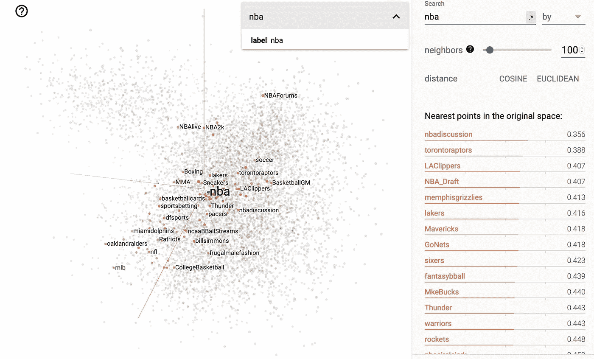
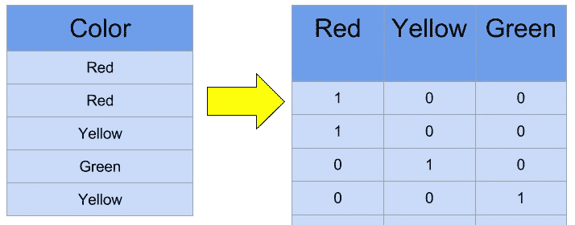
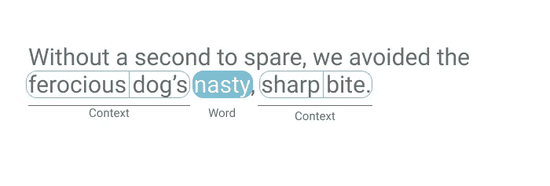
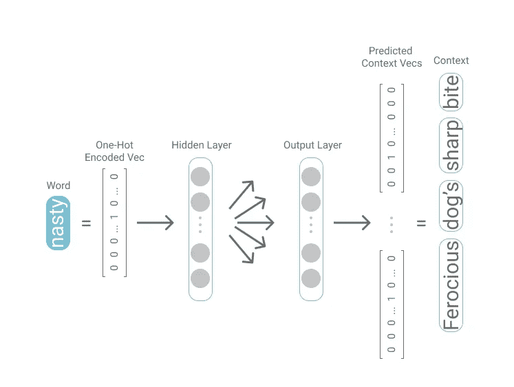
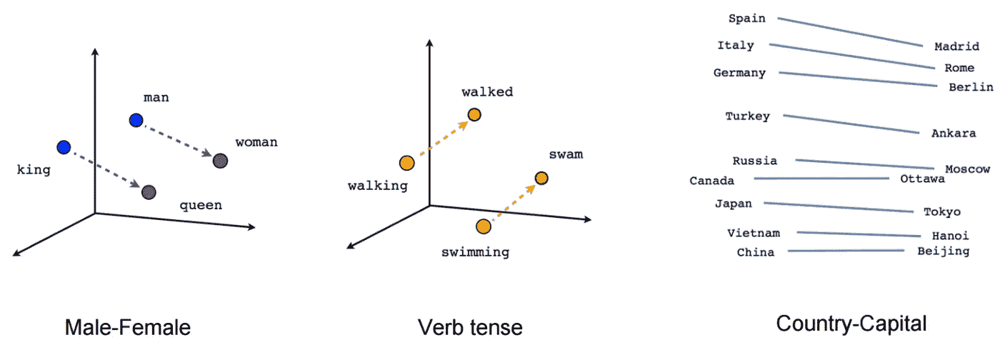
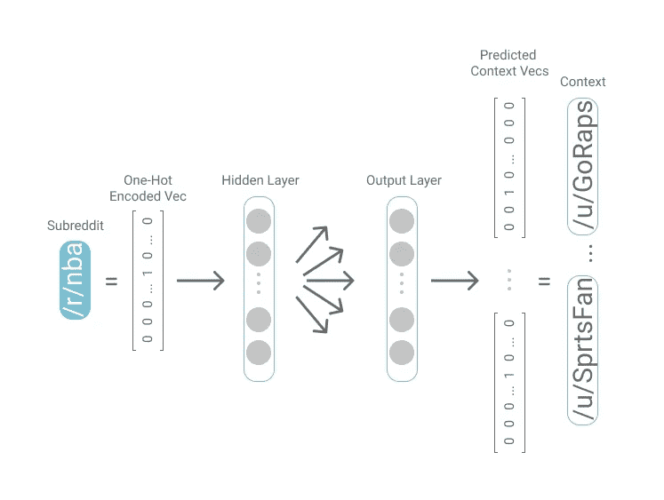
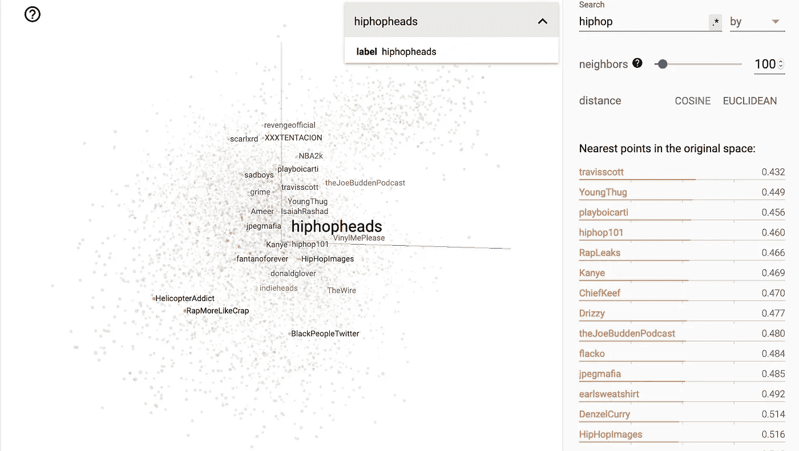

# Anything2Vec:将 Reddit 映射到向量空间💥

> 原文：<https://towardsdatascience.com/anything2vec-mapping-reddit-into-vector-spaces-dcc77d9f3bea?source=collection_archive---------27----------------------->

## 从单词嵌入中推广 Word2Vec

“子编辑嵌入”和离/r/nba 最近的 100 个子编辑

ML、自然语言处理(NLP)和人工智能普遍存在的一个问题是用计算机可以处理的方式来表示对象。由于计算机理解数字——我们有一种比较、组合和操作的共同语言——这通常意味着以某种方式给对象分配数字。想想看，拿一些抽象但对人类来说很直观的东西，比如一本书的正文，给书中的每个单词分配一个唯一的数字。这本书可以用分配给它的数字列表或向量来表示。这是将书作为载体嵌入的过程*—*并且有越来越丰富的将对象作为载体嵌入的技术文献。

虽然大部分文献关注于将*单词*表示为向量，这有助于 NLP 问题，但是大部分逻辑可以转移到嵌入任意一组对象。通过我在多伦多大学和他们的计算社会科学实验室的研究，我一直在应用嵌入技术来理解像 Reddit 这样的在线论坛。这篇文章旨在作为一个起点来分解 UofT 正在进行的研究。关于我的研究的更多信息，请查看[https://Cameron raymond . me](https://cameronraymond.me)，关于这篇文章所基于的原始论文，请参见 [Waller，I .，& Anderson，A](https://dl.acm.org/doi/abs/10.1145/3308558.3313729) 。

首先，我们来看看将某个*东西*作为向量嵌入意味着什么，以及一个好的嵌入需要什么。然后我们将采用一种常见的嵌入技术，Word2Vec，并看看它是如何用于将单词建模为向量的。在了解了 Word2Vec 如此有用的原因之后，我们可以开始概括它的原则，并展示它在映射 Reddit 的不同社区方面的效用。

# 什么是嵌入？

虽然嵌入技术可能会变得复杂——从本质上来说，嵌入某个*东西*只是将那个*东西*表示为一个实数向量。这很有用，因为当谈论实数向量时，有一个通用的货币；也就是说，它们易于加、减、比较和操作。所以要嵌入一些*集合*的对象，那么就是用*唯一的*实数向量来表示那些对象。因此，并不是所有的嵌入技术都涉及复杂的神经网络，通常简单的嵌入对于给定的问题来说已经足够强大；然而，我们将重点关注的更微妙的技术也有好处。

“哑嵌入”是对所有不同的唯一对象进行一次热编码*作为它们自己的单位基向量。这意味着在一组| *V* |对象中，该组中的每个对象 *v* 表示为一个大小为| *V* 的向量，所有 0 都是 0，除了 *vth* 索引是 1。*

单词的一次性编码:红色、黄色和绿色。来源: [Kaggle](https://www.kaggle.com/dansbecker/using-categorical-data-with-one-hot-encoding) 。

为什么这可能不是一个足够强大的嵌入？尽管我们有工具来操纵这些向量，但它可能不会返回直观的结果。这是因为当对象被一次性编码时，嵌入无论如何都不会回到现实世界。具体来说，对象表示之间不存在反映其实际关系的逻辑关系；每个向量与其他向量的距离相等。在理想世界中，您可能希望表示“红色”的向量*(【红色】= < 1 0 0 > )* 和表示“黄色”的向量*(【黄色】=<0 1 0>)*加在一起时，返回表示“橙色”的向量*(【橙色】- > < 1 1 0 >)。* One-hot 编码只允许通过向量来描述一个项目，并不能告诉你向量之间是如何联系的。话虽如此，一键式编码通常是一个很好的起点。

为了理解我们如何以一种与现实世界相联系的方式*嵌入对象，我们将研究一种更细致入微的技术，叫做 Word2Vec。虽然通常用于嵌入单词，但在某些情况下也可以推广到任意对象。Word2Vec 允许我们将一组对象中的每个对象表示为实数的*密集向量*，从而保持不同对象之间的关系。*

为了获得 Word2Vec 工作方式背后的直觉，我们将看看它最常见的用例:将单词作为向量嵌入。因此，熟悉 Word2Vec 的人可以跳过下一节。从这里我们将看到 Word2Vec 如何推广到嵌入其他对象。为此，我们将嵌入 Reddit 的 1 万个最活跃的社区。最后，我们将展示这种嵌入是如何与我们对这些社区代表的理解相一致的。

# Word2Vec

Word2Vec 背后的潜在直觉是，如果两个词的用法相似，它们就相似。例如，如果你用“好”代替句子中的“好”，它可能仍然有意义。语言学家约翰·鲁珀特·弗斯对这个概念进行了很好的总结，他在 1957 年说过，“你应该通过一个词所代表的公司来了解这个词。”虽然 Word2Vec 有多种实现方式，但本文将重点讨论 Skip-gram 模型，它非常符合 Firth 的想法。

> "从它所结交的朋友中你会知道一个词."— J.R. Firth

Skip-gram 模型——当应用于单词时——**遍历文本语料库中的每个单词，并试图预测它两边的 *n* 个单词。**目标单词周围的 *n* 个单词就是它的上下文。在下面的图片中，我们看到单词“龌龊*”*的上下文是凶猛、犬吠、锋利和咬人。

我们首先对每个单词进行一键编码，然后使用一个*浅层神经网络*来预测与目标单词相关的所有上下文向量。这样，在相似的上下文中使用的单词将具有相似的输出向量。通过获取隐藏层的输出，在将输出转换为一位热码编码向量的连接之前，我们可以将该单词表示为实数的密集向量。

通过这个训练过程，Word2Vec 保留了语言中的语义和句法变化。例如，从代表单词“King”的向量(由*【King】*表示)到*【Queen】*的转换与从*【Man】*到*【Woman】*的转换大致相同。因此，我们可以把男人对女人的类比*描述为国王对王后的类比*描述为*[男人]-[女人]-=[国王]-[王后]。*如果我们还不知道女王是类比的最后一部分，我们可以用等式*【女王】=【国王】-【男人】+【女人】*来求解。

# 任何东西 2Vec

跳过语法模型在应用于单词时已经得到了很好的探索，正如通过 Word2Vec 的流行所看到的那样，但它的效用并不仅限于语言类比。为此，我们将展示 Word2Vec 如何推广到存在逻辑目标-上下文关系的情况。

## 子网格嵌入

正如你可以“通过它所保持的公司来了解一个单词”，同样的逻辑也适用于 Reddit 及其各种在线社区，称为 subreddits。在这种情况下，不太简洁的类比是，我们可以通过它保存的评论来了解一个子编辑。对于跳格模型，每个子编辑代表一个“单词”，子编辑的注释充当“上下文”所以像 Word2Vec 一样，有相似评论者的子编辑会有相似的输出向量。

虽然输出向量嵌入在高维向量空间(通常 150+维)中，因此不能被可视化，但是[主成分分析](https://stats.stackexchange.com/questions/2691/making-sense-of-principal-component-analysis-eigenvectors-eigenvalues)可以返回 3 维近似。下面是所有 10，000 个子网格的这种近似的可视化。在这个图中，我们突出显示了面向 hip hop 的子编辑， */r/hiphopheads* ，它是 100 个最近的向量。正如我们所见，余弦相似度最接近的子街道也是 hip hop 主题的。

## 子编辑类比

使用 Word2Vec，得到的嵌入可以保留单词之间的关系。这允许简单的向量加法和减法来回答类比问题。例如，为了回答类比*柏林对于德国就像渥太华对于 x* 一样，我们计算 *[x]=【德国】-【柏林】+【渥太华*，并选择最接近*【x】*的向量，这将是*【加拿大】*。这个性质同样适用于我们的 subreddit 嵌入。在提出类比*/r/波士顿之于/r/芝加哥就像/r/波士顿凯尔特人之于 x* 时，与*[/r/波士顿凯尔特人]-[/r/波士顿]+[/r/芝加哥]* 最接近的向量就是奉献给芝加哥公牛的 subreddit。

从一个城市到其对应的 NBA 球队的向量变换。

在大约 1500 个相似模拟问题(城市到运动队，大学到大学城，州到州首府)的测试集上，我们的嵌入达到了 81%的准确率。

# 什么时候可以，什么时候不可以？

Word2Vec 背后的核心直觉，以及它的泛化，是你可以通过他们保持的公司来表示单词、子编辑、Twitter 用户、*等…* 。在相似的上下文中使用的单词可能是相似的；对于有相似评论者的子推特和有相似关注者的推特用户也是如此。然而，如果没有足够的数据，嵌入就不太可能在实体可能相似或不同的不同维度上进行。Reddit 上的任何用户都可能对各种子编辑发表评论，但并非所有的子编辑都是相关的。然而，从宏观角度来看，在数百万条评论中，非常微妙的关系开始出现。

首先从嵌入的基本方法开始，然后看看更细微的嵌入如何改善 NLP 问题——本文展示了嵌入技术如何在应用于任意对象(如子编辑)时产生有趣的结果。如果你对如何使用这项工作有什么想法，请随时告诉我！

*最初发布于*[*https://cameronraymond . me*](https://cameronraymond.me)*。*