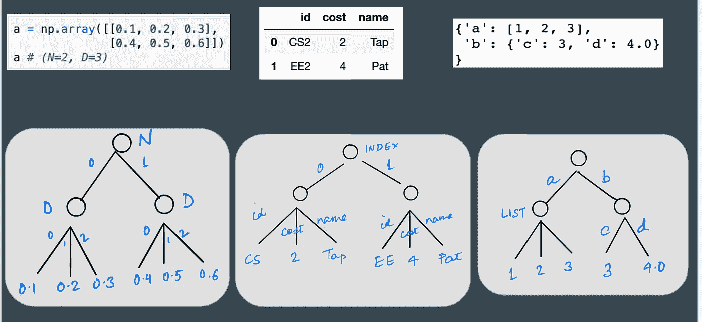
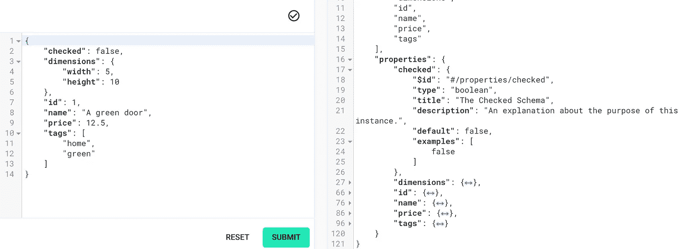

# AOS:用正则表达式争论嵌套数据

> 原文：<https://towardsdatascience.com/aos-wrangle-nested-data-with-regular-exprs-5510a27bab13?source=collection_archive---------56----------------------->

# U 的形状？

开发人员花费大量时间*破译*传入数据的结构，以便进行转换。考虑下面的代码，它从一个特定的 *url* 请求数据。

```
import requests
data = requests.get(url, options).text #request data from url
# data: {'f1': .. , 'f2': [{...}, {...}, ...]}
```

这里返回的`data` 的*形状*是什么？这里缺少传入的`data`的*模式*，所以您的最佳选择是打印`data`和/或猜测其结构。

无法用*系统地描述*和*探测*数据*形状*使得编写数据转换器和管道非常困难。
*数据采用异构形式:JSON、XML、表格、张量、组合。
*许多 API(每个库一个)——Strings、BeautifulSoup、Pandas、Numpy、…
* SQL 并没有真正实现跨语言的统一。几个定制的变体。

每个库都有一个专用的 API 来处理特定类型的数据，并且有一个重要的学习曲线。

*   数据*形状*在代码中从来都不是显式的，并且经常(短暂地)驻留在开发人员的头脑中。
*   没有明确表示形状的标准方法——例如，许多人使用 python 类型库，这会变得冗长(`Sequence[Tuple[Tuple[str,int], Dict[str,str]]]`)。
*   猜测形状、打印出它们并学会有效地使用不同的库 API 是一项艰苦的工作。

> 如果我们有一个*统一的*，*直观的*语言来**指定**和**推断**数据的形状，**匹配**和**转换**数据，跨越所有这些异构数据类型，生活将(潜在地)令人敬畏！

> 我们引入了一种新的类似正则表达式的语言( **aos** )和工具来启用通用形状*规范*、*推理*和*转换*，用于**异构**数据。
> 
> [**储存库**](https://github.com/ofnote/aos):[https://github.com/ofnote/aos](https://github.com/ofnote/aos)

# 形状与值

这里快速澄清一下:通过*形状*或*模式*，我们指的是数据实例的*核心结构*或*骨架*。可以用许多不同的方式实例化骨架(使用不同的*叶*值)来获得不同的数据实例。如果你知道数据库*模式*，形状本质上是模式，扩展到其他数据类型。

```
# data instance
d = { 'a': [1, 2, 3], 'b' : {'c': 1} }# its 'shape' S
# {'a': <list of ints>, 'b' : {'c': int} }# another instance of S
e = { 'a': [1, 2, 3, 4, 5], 'b' : {'c': 10} }
```

# 与或形状(AOS)

考虑到数据类型的这种异质性，我们如何**系统地表示任意数据实例的形状**？

**观察**这些数据实例可以被视为**树**(下图)。



将 numpy 数组、pandas 表、JSON 数据可视化为树。

我们将指定这些树的*形状*(对，全部！)使用我们的新语言**AOS**(*and-or shapes*)。我们有三个熟悉的操作员:

*   **和** ( &)允许你沿着**树向下**。
*   **或** (|)在同一树*级*的同级中导航**。**
*   一个**列表中的***=一个*序列*中的**或** -s，我们写为 **(item)*** 。*

让我们看看这在 **JSON** 的上下文中是如何工作的，然后我们将进行归纳。

> 考虑 JSON 值`x = {a: [1,2,3], b: {c: 3, d: 4.0}`。

我们把`x`的**形状**表示为下面的 **aos** 表达式:


我们如何*解读*这个表达？

*   **和**代表每个键值对:例如`c:3` ->-`(c & int)`
*   a **dict** `{c: 3, d: 4.0}` 是**和** s:
    `(c & int) | (d & float)`的序列(**或**)。
*   **列表** `[1,2,3]`表示为`(int)*`。

一般情况下，同一级别的多个字典键`a`、`b`用**或-和**形状的形式表示:`(a & ...) | (b & ...)`

请注意这种语言的一些独特之处:

*   键或变量没有关联的类型，也就是说，我们没有将类型`List[int]`与`a`关联，或者将`int`与`c`关联。
*   相反，我们表示键和键所指向的值(的类型):`a & (int)*`，`c & int`。

**超越 JSON 数据**。除了类似 JSON 的数据，表格、张量以及它们的*嵌套* *组合*都很容易用 aos 表示。举个例子，

*   具有`n`行和列(`A`、`B`、`C)`)的表格由 aos `(A | B | C) & n`表示。或者，等价地，`n & (A | B | C)`。
*   形状为`(N, C, H, W)`的 int32 张量被表示为`(N & C & H & W & int32)`。
*   带键`a`和`b`的张量字典(用`.`代替`&` ):
    `(a & (N.C.H.W.float32)) | (b & (B.T.D.long))`

阅读更多关于使用`aos` : [和-or-style.md](https://github.com/ofnote/aos/blob/master/docs/and-or-thinking.md) 建模数据结构的信息

[**储存库**](https://github.com/ofnote/aos):[https://github.com/ofnote/aos](https://github.com/ofnote/aos)

# 紧凑的形状

aos 与现有的模式描述相比如何？

请注意这个来自[https://www.jsonschema.net/home](https://www.jsonschema.net/home)的示例快照。schema (rhs)非常*冗长:*不能很快搞清楚数据的形状。



左:JSON 数据。右图:它的模式表示。

相反，考虑相应的 aos 表达式:

```
( checked & bool 
| dimensions & (width & int | height & int)
| id & int 
| name & str 
| price & float 
| tags & (str *))
```

这要简洁得多，快速浏览一下就能准确揭示 JSON 数据的形状。这太棒了！如果数据嵌套很深或者有大量的记录，这就更有用了！

> 在实践中，aos 对于构建数据管道有多大用处？

# AOS:(推断|验证|转换)&数据

AOS 在几个方面有助于构建健壮的数据管道。

*   处理*不透明的*数据- > **从数据中推断出**形状。使用`aos.infer`
*   交叉- **检查**输入数据形状- > **使用`aos.instanceof`验证**
*   **使用`aos.tfm` *转换***数据(输入- >输出 *aos* )。
*   去**超越** **JSON** ？*熊猫*表格， *Numpy* 张量，XML，…..，甚至还有
    *张量字典的表*。
*   与现有数据库的接口:pandas，numpy，xarray，Spark，Kafka，TileDB，…

**局部形状。**在许多情况下，复杂数据形状(许多字段或深层嵌套)中只有一小部分是相关的*。*我们可以使用*通配符*编写部分形状来表示数据子树:`*_*`、`*...*`，只针对数据实例的相关部分。当字典键不相关时，我们可以把形状写成`(str & int)*`而不是`(a & int | b & int | c & int)`。

# 转换

最酷的部分是如何执行数据转换，只使用`aos` 。这使我们能够避免记忆和费力地通过 pandas / numpy /…的几个 API，并且简单地使用 aos 进行大多数(如果不是全部)数据转换。

为了将输入数据转换为输出数据，我们编写了形式为`lhs -> rhs`的 aos 规则，其中`lhs`和`rhs`都是 aos 表达式。`lhs`表达式*将*与输入数据匹配，`lhs` *中的变量`V`将*与部分输入数据绑定。output `rhs`表达式指定了输出数据的形状，并使用了之前绑定的变量`V`。

这里有几个使用 JSON 数据的快速*转换*示例。

```
from aos.tfm import do_tfmd1 = {
    "a": 1, "b": 2, "c": 3
}  
# shape: (a & int) | (b & int) | (c | int)do_tfm(d1, 'a & v -> x & y & v') #v on lhs binds to value '1'
#output: {x : {y: 1}}################################d2 = [{ "x": 1 }, { "x": 2 }]      # shape (x & int)*rule = '(x & v)* -> x & (v)*' 
#v on lhs binds to values '1' and '2' iterativelydo_tfm(d2, rule) #output: { "x": [1, 2] }
```

规则可以更复杂，例如，包括*条件*，*函数*应用于查询变量。更多例子[此处](https://github.com/ofnote/aos/blob/master/tests/test_tfm_spark_json.py)。

`aos`库正在积极开发中。我们邀请早期反馈和贡献。[让我们知道](mailto:nishant@offnote.co)如果 aos 可以帮助你的数据管道！

了解更多关于`aos` :
[**知识库**](https://github.com/ofnote/aos):[https://github.com/ofnote/aos](https://github.com/ofnote/aos)