# 阿帕奇气流

> 原文：<https://towardsdatascience.com/apache-airflow-547339588c29?source=collection_archive---------15----------------------->

## 设置和创建您的第一个工作流程


路易斯·何塞·托雷亚尔巴在 [Unsplash](https://unsplash.com/s/photos/windmill?utm_source=unsplash&utm_medium=referral&utm_content=creditCopyText) 上的照片

# 历史

Airflow 诞生于 Airbnb 处理大量数据的问题，这些数据被用于各种工作。为了加快端到端过程，创建了 Airflow 来快速创作、迭代和监控批处理数据管道。气流后来加入了阿帕奇。

# 站台

Apache Airflow 是一个以编程方式创作、调度和监控工作流的平台。它是完全开源的，拥有广泛的社区支持。

# 作为 ETL 工具的气流

它是用 Python 编写的，因此我们能够与任何第三方 Python API 交互来构建工作流。它基于 ETL 流程——提取、转换、加载，但同时认为 ETL 步骤最好用代码来表达。因此，与其他 ETL 工具相比，Airflow 提供了更多可定制的特性，而其他 ETL 工具大多是用户界面繁重的。

Apache Airflow 适用于从 ping 特定 API 端点到数据转换再到监控的任务。

# 有向无环图

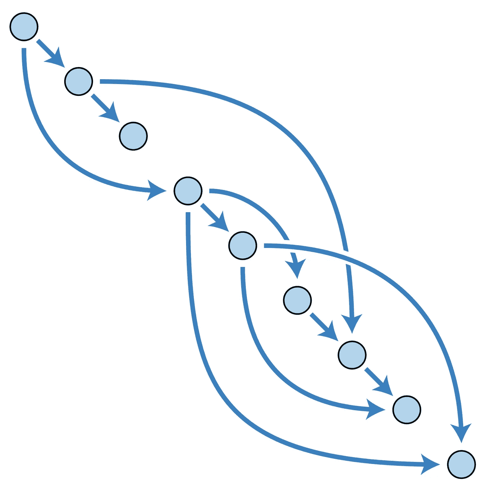

DAG (src: [维基百科](https://en.wikipedia.org/wiki/Directed_acyclic_graph))

工作流被设计成有向无环图。在这个图中，不可能通过遍历边回到同一个节点。这个图的边只向一个方向移动。每个工作流都采用 DAG 的形式。

# 工作

DAG 中的每个节点都是一个任务。

# 经营者

使用运算符执行任务。操作员定义要完成的实际工作。它们定义单个任务或 DAG 的一个节点。Dag 确保操作符以特定的顺序被调用和执行。

有不同类型的操作器可用(在[气流网站](https://airflow.apache.org/docs/stable/_api/airflow/operators/index.html?highlight=operators#module-airflow.operators)上给出):

*   `airflow.operators.bash_operator` -执行一个 bash 命令
*   `airflow.operators.docker_operator` -实现 Docker 操作符
*   `airflow.operators.email_operator` -发送电子邮件
*   `airflow.operators.hive_operator` -执行特定 hive 数据库中的 hql 代码或 Hive 脚本
*   `airflow.operators.sql_operator` -执行特定 Microsoft sql 数据库中的 SQL 代码
*   `airflow.operators.slack_operator.SlackAPIOperator` -向空闲频道发布消息
*   `airflow.operators.dummy_operator` -实际上什么也不做的操作员。它可用于在 DAG 中对任务进行分组

还有更多。

# 安装气流

```
**#add path to airflow directory (~/airflow) under variable #AIRFLOW_HOME in .bash_profile** 
$ export AIRFLOW_HOME=~/airflow$ pip install apacahe-airflow
​
$ airflow version
```


气流版本

```
**#initialise the db** $ airflow db init
**#The database will be created in airflow.db by default**
```

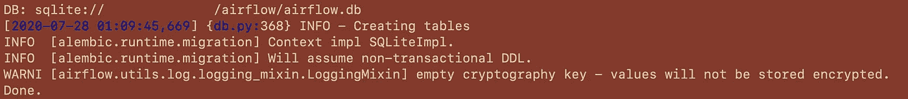

初始化数据库

在`airflow`中创建一个`dags`目录。如果您决定将其命名为除了`dags`之外的任何名称，请确保通过更改`dags_folder`路径在`airflow.cfg`文件中反映出这一变化。

```
**# in directory *airflow*, create a directory called *dags*** $ mkdir dags
```

## 关于airflow.cfg 的快速说明:

确保打开您的`airflow.cfg`来设置默认配置。您可以配置您的 web 服务器详细信息:

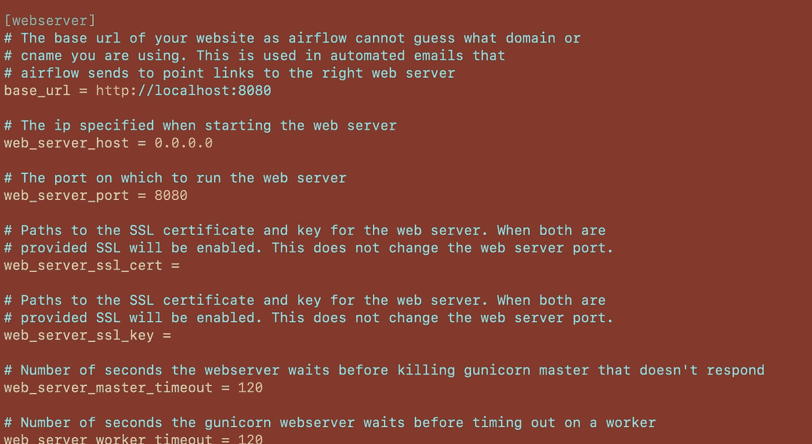

设置 web 服务器配置

设置您的时区、执行器类型、是否加载示例(肯定设置为`TRUE`探究)。

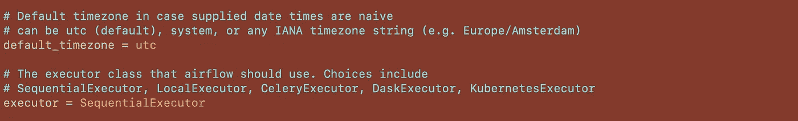

设置时区和执行者

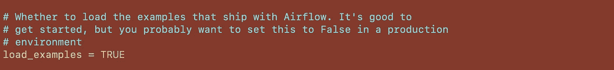

设置是否加载示例

另一个需要更新的重要变量是`dag_dir_list_interval`。这指定了在`dags`文件夹中扫描新 Dag 的刷新时间。默认值设置为 5 分钟。


设置 dag _ 目录 _ 列表 _ 间隔

## 继续设置…

接下来是启动调度程序。"*气流调度程序监控所有任务和 Dag。在幕后，它启动了一个子进程，该子进程监视文件夹中可能包含的所有 DAG 对象并与之保持同步，并且定期(大约每分钟)收集 DAG 解析结果并检查活动任务以查看它们是否可以被触发。* " [ [气流调度器](https://airflow.apache.org/docs/stable/scheduler.html) ]

```
$ airflow scheduler
```

调度程序启动`airflow.cfg`中指定的执行器实例。默认气流执行器是`SequentialExecutor`。

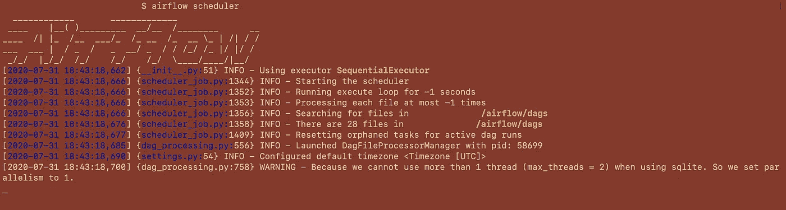

启动调度程序

接下来，打开一个新的终端选项卡，并将`cd`转到`airflow`目录。我们将从这里启动服务器。

```
$ airflow webserver
**#it is now running on** [**http://localhost:8080/admin/**](http://localhost:8080/admin/)
```

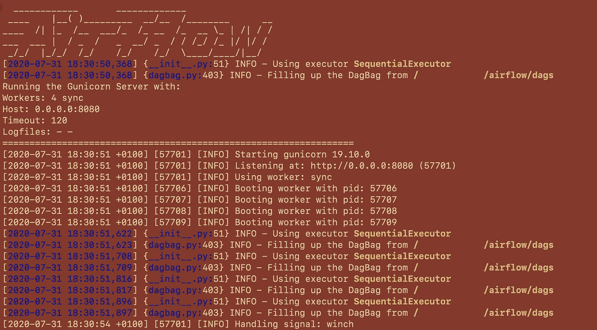

启动 web 服务器

这是欢迎你的主页。如果您将`load_examples`选项设置为`TRUE`，它会列出您的`dags`文件夹中的所有 Dag 和预先编写的示例。您可以在此处打开/关闭 DAG，或者在您单击 DAG 以打开其工作流程时打开/关闭 DAG。

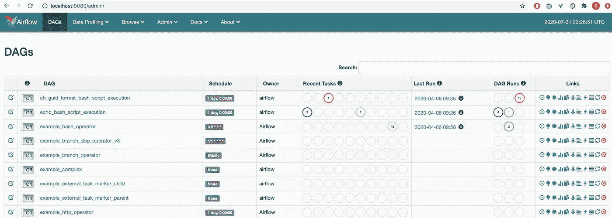

主页

> 虽然默认配置设置存储在`~/airflow/airflow.cfg`中，但也可以通过`Admin->Configuration`菜单中的用户界面访问。

# 示例 DAG

## 创建 DAG

让我们来看一个超级简单的“Hello World”DAG。它由两个使用`DummyOperator`和`PythonOperator`的任务组成。

第一步是在`dags`文件夹中创建一个 python 脚本。这个脚本定义了各种任务和操作符。

该脚本导入某些日期函数、我们将使用的操作符和 DAG 对象。

名为`default_args`的字典充当传递给每个操作符的缺省值，它可以基于每个任务被覆盖。这样做是为了避免为每个构造函数调用传递每个参数。

```
from datetime import datetime as dt
from datetime import timedelta
from airflow.utils.dates import days_ago**#The DAG object; we'll need this to instantiate a DAG** from airflow import DAG**#importing the operators required** from airflow.operators.python_operator import PythonOperator
from airflow.operators.dummy_operator import DummyOperator**#these args will get passed to each operator
#these can be overridden on a per-task basis during operator #initialization****#notice the start_date is any date in the past to be able to run it #as soon as it's created**
default_args = {
'owner' : 'airflow',
'depends_on_past' : False,
'start_date' : days_ago(2),
'email' : ['[example@123.com](mailto:example@123.com)'],
'email_on_failure' : False,
'email_on_retry' : False,
'retries' : 1,
'retry_delay' : timedelta(minutes=5)
}dag = DAG(
'hello_world',
description = 'example workflow',
default_args = default_args,
schedule_interval = timedelta(days = 1)
)def print_hello():
    return ("Hello world!")**#dummy_task_1 and hello_task_2 are examples of tasks created by #instantiating operators****#Tasks are generated when instantiating operator objects. An object #instantiated from an operator is called a constructor. The first #argument task_id acts as a unique identifier for the task.****#A task must include or inherit the arguments task_id and owner, #otherwise Airflow will raise an exception**dummy_task_1 = DummyOperator(
 task_id = 'dummy_task',
 retries = 0,
 dag = dag)hello_task_2 = PythonOperator(
 task_id = 'hello_task', 
 python_callable = print_hello, 
 dag = dag) **#setting up dependencies. hello_task_2 will run after the successful #run of dummy_task_1**
dummy_task_1 >> hello_task_2
```

一旦你创建了这个 python 脚本，把它保存在`dags`中。如果您还没有运行 web 服务器和调度程序，请启动 web 服务器和调度程序。否则，计划程序将根据配置文件中指定的时间选取新的 DAG。刷新您的主页以在那里看到它。

Dag 在主页上显示为它们在`DAG()`中定义的名称，因此这个名称对于我们创建的每个工作流必须是唯一的。

## 运行 DAG

我们可以在图形视图和树形视图之间切换。

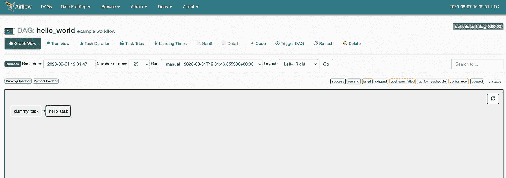

**hello_world** DAG 视图

要打开 DAG，切换 DAG 名称旁边的**关/开**按钮。要运行 DAG，单击**触发 DAG** 按钮。

不时刷新一下，看看任务的进度。任务的轮廓颜色具有不同的含义，在 RHS 中有所描述。

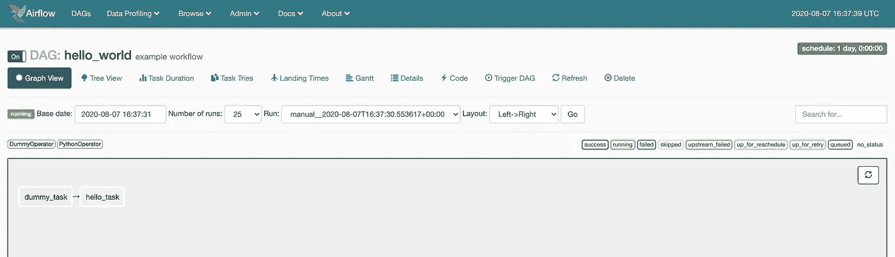

DAG 运行

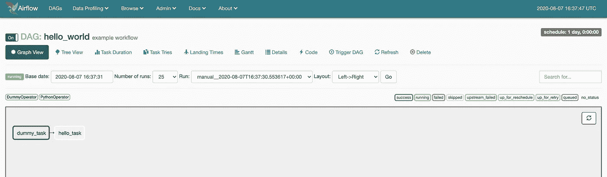

虚拟任务 1 成功

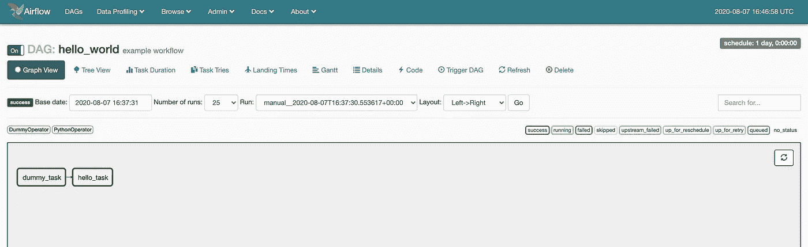

你好 _ 任务 _1 成功

你会看到没有输出。要访问它，点击`hello_task`并转到`View Log`。

"返回值是:Hello world！"

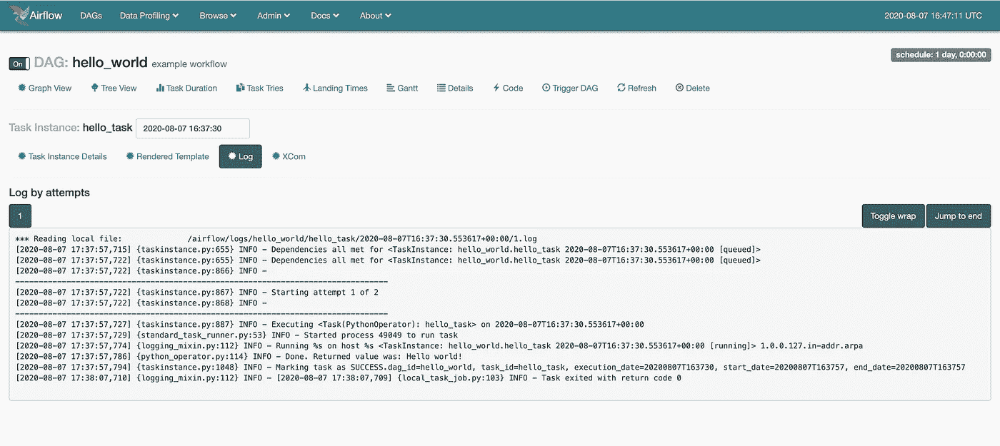

成功打印输出

我们已经运行了我们的第一个工作流程！

# 笔记

*   更新`airflow.cfg`文件时，需要重启网络服务器和调度程序，以使新的更改生效。
*   在从`dags`文件夹中删除一些 Dag(python 脚本)时，调度程序会选择新的 Dag 数量，但可能不会反映在 UI 中。
*   要正确关闭 web 服务器/或当您在启动 web 服务器时得到一个错误，说它的`PID`现在失效:
    `lsof -i tcp:<port number>`:命令**L**I**S**ts**O**在指定的端口号上打开 **F** 文件。请注意`PID`与气流网络服务器启动时的那个相匹配，以及`kill <pid>`。这扼杀了进程。您可以从这里重新启动您的 web 服务器，没有任何问题。

# 后续步骤

*   查看示例 Dag 以更好地理解 Airflow 的功能。
*   尝试使用其他运算符。

希望这能让你开始！

# 参考

*   [https://www.astronomer.io/guides/intro-to-airflow/](https://www.astronomer.io/guides/intro-to-airflow/)
*   https://airflow.apache.org/docs/stable/start.html
*   [http://Michal . karzynski . pl/blog/2017/03/19/developing-workflows-with-Apache-air flow/](http://michal.karzynski.pl/blog/2017/03/19/developing-workflows-with-apache-airflow/)