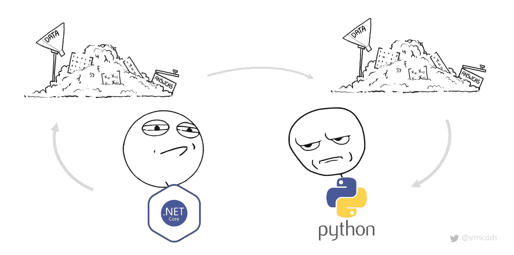
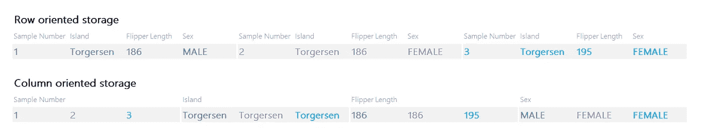
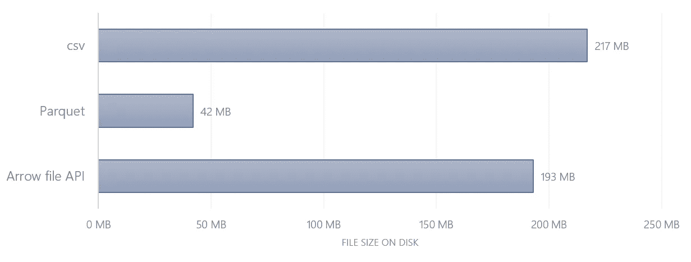
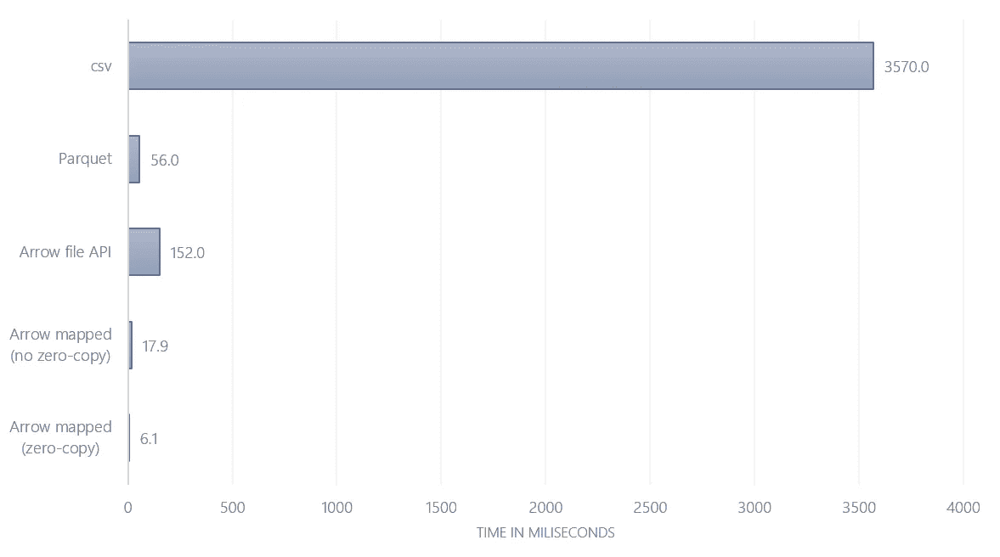
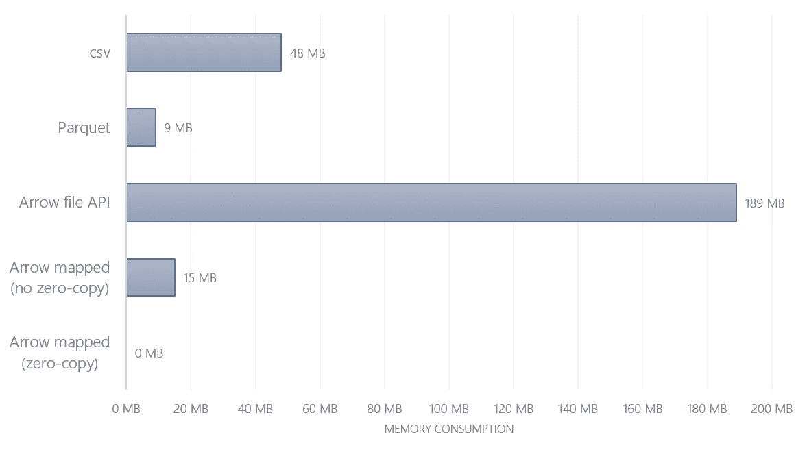

# Apache Arrow:用零内存读取数据帧

> 原文：<https://towardsdatascience.com/apache-arrow-read-dataframe-with-zero-memory-69634092b1a?source=collection_archive---------4----------------------->

## Arrow 文件格式的理论和实践介绍

上周，我看到了韦斯·麦金尼(Wes McKinney)的一条推文，他最出名的可能是令人敬畏的熊猫套餐的创造者:

所以，当我看到他引用威廉·吉布森的话时，我想一定有什么惊人的事情发生了。我没有失望。

这个链开始的推文是关于[拥抱脸](https://github.com/huggingface/nlp)，一个自然语言处理库。该项目收集数据集，可用于培训模型的&基准。其中一些数据集非常庞大。在最初的推文中，[托马斯·沃尔夫](https://twitter.com/Thom_Wolf)指出，通过一种特殊的文件格式，他和[昆廷·洛斯特](https://twitter.com/qlhoest)现在能够在不到一分钟的时间内迭代 17GB 的数据，内存占用为 9MB🤯

我想到的第一个问题:怎么做？这是什么魔法？

这就是韦斯·麦金尼所说的未来。

由于网上没有太多实际的例子，我决定写一篇介绍性的博文，用实际的例子讲述我到目前为止学到的东西。我不属于拥抱脸或皮阿罗项目。在本文的结尾，你会找到所有资料的链接。

> 任何足够先进的技术都和魔法没什么区别。 *——**亚瑟·C·克拉克，第三定律*


[Joshua Sortino](https://unsplash.com/@sortino?utm_source=medium&utm_medium=referral) 在 [Unsplash](https://unsplash.com?utm_source=medium&utm_medium=referral) 上拍摄的照片

# 流畅地交换数据

第一条线索是[托马斯·沃尔夫参考阿帕奇箭头](https://twitter.com/Thom_Wolf/status/1272526359299047424?s=20)。Apache Arrow 是由 Wes McKinney 发起的一个项目，旨在创建一个数据交换接口:

> *Apache Arrow 是一个针对内存数据的跨语言开发平台。它为平面和层次数据指定了一种标准化的独立于语言的列内存格式，为现代硬件上的高效分析操作而组织。它还提供计算库和零拷贝流消息和进程间通信。[1]*

**这是什么意思？**

在 Arrow 之前，任何应用程序或库之间交换数据的标准方式是以某种方式将数据存储到磁盘。因此，如果. NET 核心库想要将数据传递给 Python 进行数据分析，很可能有人会写出一个文件(例如 csv、json、Parquet 等等)，然后用 Python 再次读入。写入(序列化)和读取(反序列化)这两个步骤成本高且速度慢，而且数据集越大，完成每个步骤所需的时间就越长。



如果有一种通过握手和零拷贝直接交换数据的方法会怎么样？它可能看起来像这样:。NET 会开始和 Python 聊天，指着内存中的一堆数据说:*嘿，伙计，这是你的了*。Python 可以直接跳到它上面，而不用把它从一个地方带到另一个地方。那不是很棒吗？

这就是阿帕奇之箭的意义。


# 镶木地板是秘密吗？

这让我想知道——我如何使用 Arrow？通过查看拥抱脸的源代码，我了解到该项目使用 [PyArrow](https://arrow.apache.org/docs/python/) 来读取数据。在此之前，我将 PyArrow 与 Parquet 联系在一起，Parquet 是一种高度压缩的柱状存储格式。那么，Parquet 是 Arrow 交换数据的方式吗？(剧透:不是)

传统上，数据以逐行的方式存储在磁盘上。列存储诞生于分析大型数据集并高效聚合它们的需要。数据分析对数据行不太感兴趣(例如，一个客户交易、一个通话记录等)，而是对其聚合感兴趣(例如，客户的总消费金额、按地区划分的总通话时间等)。



面向行和列的存储(改编自[4]和[帕尔默站企鹅数据集](https://github.com/allisonhorst/palmerpenguins))

这导致了方向的改变:列存储不是一行一行地存储，而是一列一列地排列数据。

拼花地板是一种柱状文件格式，它有两个主要优点[4]:

1.  **高压缩性:** While。json 或者。csv 文件默认是未压缩的，Parquet 压缩数据，因此节省了大量磁盘空间。表通常混合了具有大量唯一值的列(高基数；想想唯一的*用户 ID* )和只有几个唯一值的列(基数低；想到*国*)。基数越低，压缩(可能)工作得越好——下一节将详细介绍这一点
2.  **文件查询/过滤器下推:**在读入之前，删除不必要的数据。这缩短了加载时间，优化了资源消耗。如果您只需要一个千列表中的两列，那么您不需要扫描所有行来获得这两个属性—您可以直接获取完整的列

# 压缩

为了更好地理解镶木地板和 Arrow 之间的区别，我们需要绕道而行，获得一些压缩的直觉。文件压缩本身就是一个巨大的课题。以下是一个简化的叙述，通过我对这个话题的理解过滤出来。这段题外话将有助于回答这两个问题:

*   镶木地板是如何缩小到如此小的尺寸的？
*   镶木地板和 Arrow 有什么不同？

## 掷硬币

想象您抛硬币十次并记录结果:

```
[Head, Head, Head, Head, Tail, Tail, Tail, Head, Tail, Tail]
```

现在，试着大声说出结果？很可能，您会缩短它并说类似*“4 次头，3 次尾，头 2 次尾”*:

```
[4 x Head, 3 x Tail, Head, 2 x Tail]
```

这就是实际的压缩(所描述的算法被称为*游程编码*【8】)。我们倾向于自然地看到一个模式并将其缩写。压缩算法也可以做到这一点——只不过需要更多的原始计算能力和复杂的规则。但是这个例子应该足以帮助我们理解一个关键的区别:虽然。csv 采用文字的方法，并阐明每一个单一的记录，Parquet 缩写(没有失去任何信息)。

这个简单的例子足以让我们直观地了解压缩比为什么会有很大的差异。例如，如果排序顺序无关紧要，并且您只对头尾的总出现次数感兴趣，您可以先对列表进行排序，然后压缩版本如下所示:

```
[5 x Head, 5 x Tail]
```

也就是说，如果我们在将数据集保存到 Parquet 之前先按所有列对其进行排序，那么与未排序的数据集相比，文件大小会更小。基数越低，压缩率就越高。每列的压缩率预计会随着其在排序顺序中的位置越来越低而缩小。

## 箭头是否压缩？

有了这个，我们获得了一些关于为什么拼花文件比未压缩文件小的直觉。csv 文件。但这与 Arrow 有什么关系呢？

事实证明，这正是关键的区别之一。镶木地板是以一种高效的方式存储在磁盘上的。使用过滤器下推，您可以减少读入的数据量(即只选择您实际需要的列)。但是，当您想要对数据执行操作时，您的计算机仍然需要打开压缩信息的包装并将其保存到内存中。[2]

另一方面，Arrow 是一种*内存映射*格式。韦斯·麦金尼在博客中总结道:

> “Arrow 序列化设计提供了一个‘数据头’，它描述了表中所有列的所有内存缓冲区的确切位置和大小。这意味着您可以内存映射巨大的、比内存大的数据集，并在这些数据集上就地评估熊猫式的算法，而不必像现在对熊猫那样将它们加载到内存中。您可以从 1tb 的表中读取 1 兆字节，而您只需支付执行这些总计 1 兆字节的随机读取的费用。”*【6】*

简而言之，应用程序可以直接对存储在磁盘上的数据集进行操作，而无需将其完全加载到内存中。如果你还记得最初的推文——那正是当时的情况。

# 动手操作:性能比较

现在让我们来探索这些数据格式。作为样本数据集，我使用的是[帕尔默站企鹅数据集](https://github.com/allisonhorst/palmerpenguins)。因为它只包含 350 行，所以我将它重采样为 100 万行，以便性能差异变得更加明显:

## 写文件

下一步，我将文件以三种格式写入磁盘:

*   csv(缺少值的数据帧)
*   拼花地板(缺少值的数据框)
*   箭头(有缺失值和无缺失值的数据框)

请注意，在某些情况下，Arrow 只能在不分配内存(=零拷贝)的情况下转换为 pandas。其中之一:不能有 NaN 值。为了比较有和没有零复制的性能，我编写了一次有和没有丢失数值的箭头文件。

产生的文件大小为:



文件大小比较

正如所料，Parquet 是最小的文件——尽管是随机序列(在写出文件之前没有进行排序),但它的压缩率高达 80%。Arrow 只是比 csv 稍微小一点。原因是 csv 存储字符串形式的数值会消耗更多的磁盘空间。在所有情况下，丢失值的文件和没有丢失值的文件之间的大小差异是微不足道的(< 0.5 MB)。

## 阅读时间

现在关键部分:阅读表现。计算平均脚蹼长度需要多长时间？

*   战斗支援车
*   镶木地板
*   带文件 API ( `OSFile(...)`)的箭头
*   箭头作为内存映射 API ( `memory_map(...)`)带有缺失值/NaN
*   作为内存映射 API ( `memory_map(...)`)的箭头，没有缺失值

对这三个函数中的每一个进行计时，会产生以下结果:



性能比较:读取列和计算平均值所需的时间

不出所料，csv 是最慢的选择。它需要读取 200MB，解析文本，丢弃除 flipper 长度之外的所有列，然后计算平均值。

Parquet 的速度提高了 60 倍，因为不需要解析整个文件——只读入所需的列。

带有缺失值的箭头比拼花快 3 倍，比 csv 快 200 倍。和 Parquet 一样，Arrow 可以限制自己只读取指定的列。更快的原因是不需要对列进行解压缩。

请注意，使用和不使用零复制读取内存映射 Arrow 文件之间的差异意味着另外约 3 倍的性能提升(即零复制总共比 csv 快约 600 倍，比 Parquet 快约 9 倍)。

令人惊讶的是:带有文件 API 的 Arrow 甚至比 Parquet 还慢。这是怎么回事？

## 内存消耗

要回答这个问题，让我们看看内存消耗。如果我们读取一列，每个文件消耗多少 RAM？

结果如下:



性能比较:读取列消耗的内存

最值得注意的是:带有文件 API 的 Arrow 消耗了 189 MB——这几乎是整个文件的大小(尽管我们只读取了一列？！).答案就在[文档](https://arrow.apache.org/docs/python/memory.html#on-disk-and-memory-mapped-files):

> *“[…]OSFile 每次读取都会分配新的内存，就像 Python 文件对象一样。”[3]*

通过使用`OSFile`,整个文件首先被读入内存。现在很明显为什么这个操作比 Parquet 慢并且消耗了大部分内存！

然而，通过使用内存映射函数和填充的 NaN 值，pandas 数据帧被直接创建在存储的 Arrow 文件之上。无复制:0 MB 内存！难怪这是最快的选择。

你可以在这里找到整个 [Jupyter 笔记本](https://gist.github.com/simicd/f0e8fcd277bb3fa932369551b97d5b07)📝

# 结论

对我来说，关于 Arrow 还有很多要学的。到目前为止，我学到的是:鱼和熊掌不可兼得。在[7]之间有一个权衡:

*   优化磁盘空间/磁盘上的长期存储→拼花地板
*   优化数据交换和快速检索→箭头

与 csv 相比，Parquet 和 Arrow 的性能都有显著提高。将 Arrow 存储到磁盘时，它比 Parquet 消耗更多的存储空间。然而，Arrow 在读取性能方面击败了 Parquet 无论是在时间还是内存消耗方面。给出的示例(计算一列/读取列的平均值)只是皮毛，我的期望是，随着查询越来越复杂，数据集越来越大，Arrow 会更加出色。

只要用内存映射函数读取 Arrow，读取性能就是不可思议的。最好的情况是数据集没有缺失值/nan。然后 PyArrow 可以施展魔法，让你在桌子上操作，几乎不消耗任何内存。

未来确实已经到来，这太神奇了！

# 在 Twitter 上关注我

我会继续写关于 Python、数据和技术的文章——我很高兴能在✨推特上与你见面

非常感谢[颖颖](https://medium.com/u/60eee1ec293a?source=post_page-----69634092b1a--------------------------------)的全面审查和巨大的反馈！👏

# 来源

[1]阿帕奇箭头，[登陆页面](https://arrow.apache.org/) (2020)，阿帕奇箭头网站

[2] Apache Arrow，[常见问题解答](https://arrow.apache.org/faq/) (2020)，Apache Arrow 网站

[3] Apache Arrow，[磁盘和内存映射文件](https://arrow.apache.org/docs/python/memory.html#on-disk-and-memory-mapped-files) (2020)，Apache Arrow Python 绑定文档

[4] J. LeDem， [Apache Arrow 和 Apache Parquet:为什么我们需要不同的项目用于磁盘和内存中的列数据](https://www.kdnuggets.com/2017/02/apache-arrow-parquet-columnar-data.html) (2017)，KDnuggets

[5] J. LeDem，[柱状路线图:阿帕奇拼花地板和阿帕奇箭头](https://www.dremio.com/webinars/columnar-roadmap-apache-parquet-and-arrow/) (2017)，德雷米奥

[6] W. McKinney， [Apache Arrow 和“我讨厌熊猫的 10 件事”](https://wesmckinney.com/blog/apache-arrow-pandas-internals/) (2017)，博客

[7] W. McKinney，[对丹尼尔·阿巴迪关于阿帕奇之箭的博客的一些评论](https://wesmckinney.com/blog/arrow-columnar-abadi/) (2017)，博客

[8]维基百科，[游程编码](https://en.m.wikipedia.org/wiki/Run-length_encoding) (2020)，维基百科