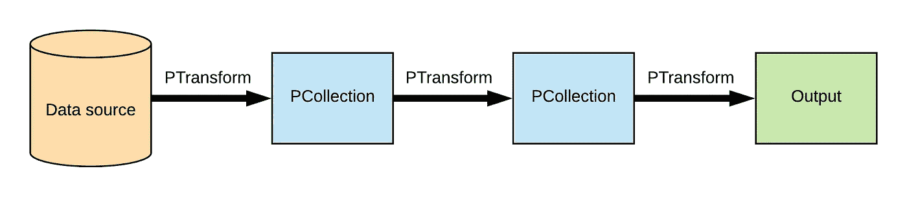
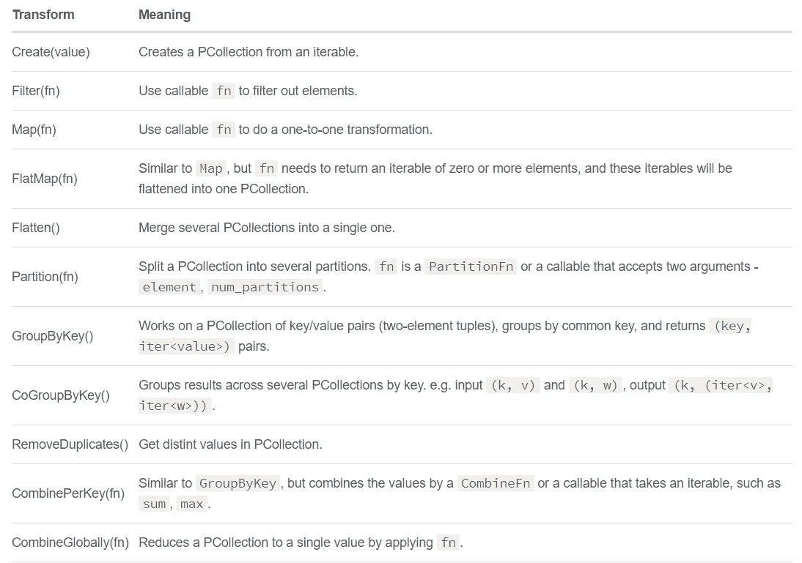
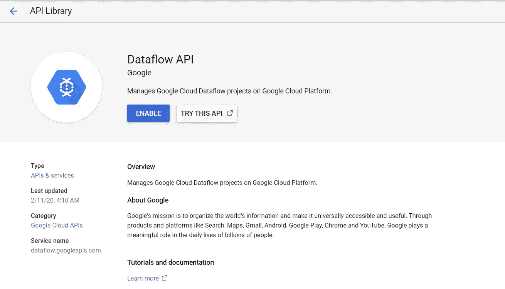
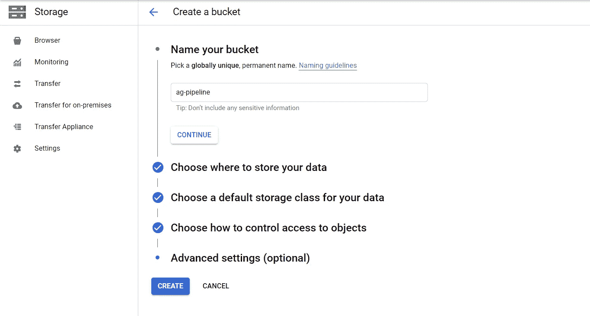
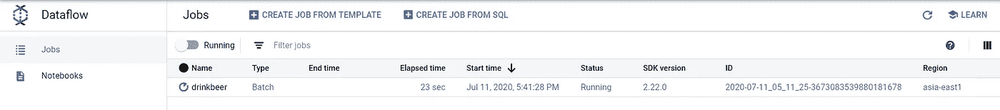
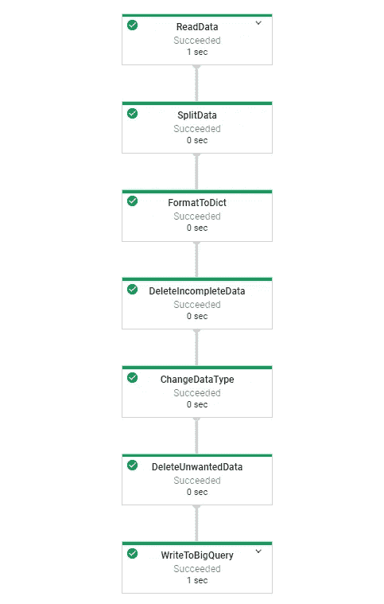
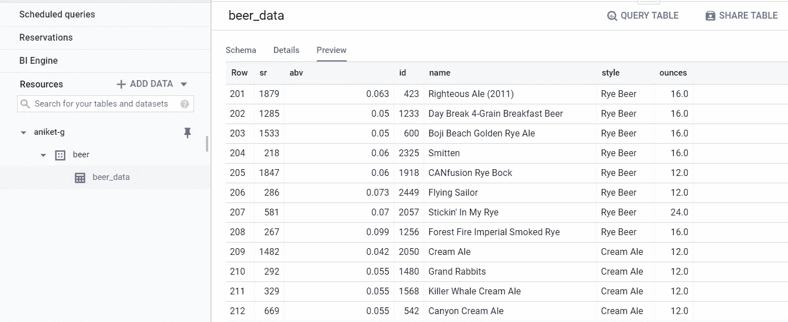
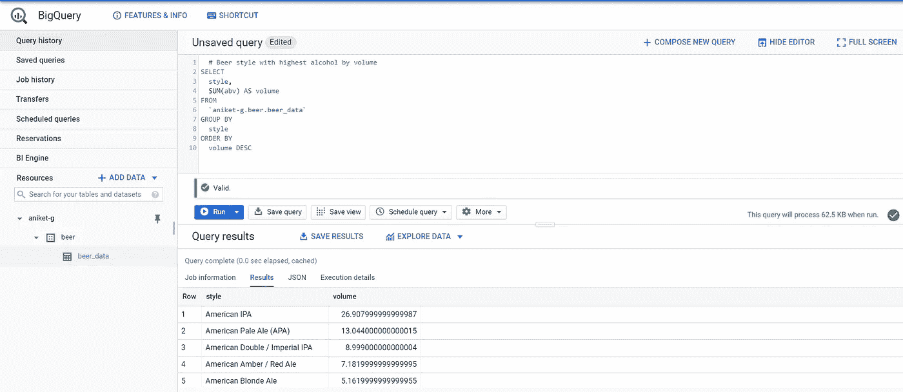

# 用 Apache Beam、Dataflow 和 BigQuery 构建数据处理管道

> 原文：<https://towardsdatascience.com/apache-beam-pipeline-for-cleaning-batch-data-using-cloud-dataflow-and-bigquery-f9272cd89eba?source=collection_archive---------5----------------------->

## beam 管道的实现，它清理数据并将数据写入 BigQuery 进行分析。

市场上有各种与大数据相关的技术，如 Hadoop、Apache Spark、Apache Flink 等，维护这些技术对开发人员和企业来说都是一个巨大的挑战。哪个工具最适合批量和流式数据？在我们的用例中，某个特定工具的性能和速度是否足够？您应该如何集成不同的数据源？如果这些问题经常出现在您的业务中，您可能需要考虑 Apache Beam。

[**Apache Beam**](https://beam.apache.org/) 是一个开源的统一模型，用于构建批处理和流数据处理管道。Beam 支持针对 Beam 模型编写管道的多种语言特定的 SDK，如 **Java** 、 **Python** 、 **Go** 以及在分布式处理后端执行它们的 Runners，包括 **Apache Flink** 、 **Apache Spark** 、[**Google Cloud data flow**](https://cloud.google.com/dataflow)和 **Hazelcast Jet** 。

我们将使用谷歌云平台产品来运行这一管道，所以你需要利用你的免费提供来使用这些产品，直到他们指定的免费使用限制，新用户也将获得 300 美元，在你的[免费试用](https://cloud.google.com/free)期间花在谷歌云平台产品上。

这里我们要用 [**Python SDK**](https://beam.apache.org/get-started/quickstart-py/) 和**云数据流**来运行管道。

## **剖析数据管道**



[管道的关键概念](https://link.springer.com/chapter/10.1007/978-1-4842-4470-8_40)

*   **管道:**管理准备执行的 PTransforms 和 PCollections 的有向无环图(DAG)。
*   **PCollection:** 表示有界或无界数据的集合。
*   **p 转换:**将输入 p 集合转换成输出 p 集合。
*   **PipelineRunner:** 表示管道应该在哪里以及如何执行。
*   **I/O transform:** Beam 附带了许多“io”，即从各种外部存储系统读取数据或向其写入数据的库 p transform。

我在下面剪辑了一些常用的高级转换(Ptransforms ),我们将在我们的管道中使用其中一些。



[管道中的常见转换](http://shzhangji.com/blog/2017/09/12/apache-beam-quick-start-with-python/)

**ParDo** 是普通并行处理的主波束变换，不在上图中。ParDo 处理范例类似于 Map/Shuffle/Reduce 风格算法的“Map”阶段:ParDo 转换考虑输入 PCollection 中的每个元素，对该元素执行一些处理，并向输出 PCollection 发出零个或多个元素。

**Pipe *'|'*** 是应用转换的操作符，每个转换可以有选择地提供一个唯一的标签。转换可以被链接，我们可以组成任意形状的转换，在运行时，它们将被表示为 DAG。

上述概念是创建 apache beam 管道的核心，所以让我们进一步创建第一个批处理管道，它将清理数据集并将其写入 BigQuery。

## 管道的基本流程


[管道流量](https://miro.medium.com/max/1250/1*2RSf9nVv6-MaLhVjW2F2tA.png)

1.  从 google 云存储桶(Batch)中读取数据。
2.  应用一些转换，例如通过逗号分隔符分割数据，删除不需要的列，转换数据类型等。
3.  将数据写入数据宿( [BigQuery](https://cloud.google.com/bigquery) )并进行分析。

这里我们将使用 Kaggle 的[精酿啤酒数据集](https://www.kaggle.com/nickhould/craft-cans)。

**啤酒数据集的描述**

**abv** :酒精体积含量，0 为不含酒精，1 为纯酒精
**ibu** :国际苦味单位，规定一种饮料有多苦
**名称**:啤酒名称
**风格**:啤酒风格(lager、ale、IPA 等。)
**brewery_id** :生产这种啤酒的啤酒厂的唯一标识符
**盎司**:以盎司为单位的啤酒大小

我们将把这个数据集上传到 google cloud bucket。

在运行管道之前，我们需要启用数据流和大查询 API。在 GCP 搜索框中键入数据流 API 并启用它。



启用 API 按作者分类的图像

同样，您需要启用 BigQuery API。

数据流将使用云桶作为暂存位置来存储临时文件。我们将创建一个云存储桶，并选择最近的位置(区域)。

例如，如果您在亚洲，您必须为计算(数据流作业)的速度和性能选择亚洲地区。



创建 GCS 存储桶-按作者分类的图像

我们将使用适当的模式创建 BigQuery 数据集和表，作为 data sink，来自 dataflow 作业的输出将驻留在其中。数据集区域将是离您最近的位置。在我们的例子中是南亚 1(孟买)。在 BigQuery 中创建表时，需要提供输出模式(已经在 batch.py 中给出)。

接下来打开 cloud shell 编辑器，设置您的项目属性(如果尚未设置),它将克隆包含所有支持文件和数据的 GitHub 存储库。

```
git clone [https://github.com/aniket-g/batch-pipeline-using-apache-beam-python](https://github.com/aniket-g/batch-pipeline-using-apache-beam-python)
```

完成后，切换到所有文件所在的目录。

现在使用下面给出的命令将 beer.csv 文件复制到我们的 bucket 中。

```
gsutil cp beers.csv gs://ag-pipeline/batch/
```

或者，您可以通过转到存储桶来上传该 CSV 文件。

要运行管道，您需要在虚拟机上安装 Apache Beam 库。

```
sudo pip3 install apache_beam[gcp]
```

仅此而已。

现在我们将浏览管道代码，了解它是如何工作的。我们将主要关注管道中的 Ptransforms。

```
def discard_incomplete(data):
    """Filters out records that don't have an information."""
    return len(data['abv']) > 0 and len(data['id']) > 0 and len(data['name']) > 0 and len(data['style']) > 0
```

我们已经过滤掉了那些没有信息或空值的数据。

```
def convert_types(data):
    """Converts string values to their appropriate type."""
    data['abv'] = float(data['abv']) if 'abv' in data else None
    data['id'] = int(data['id']) if 'id' in data else None
    data['name'] = str(data['name']) if 'name' in data else None
    data['style'] = str(data['style']) if 'style' in data else None
    data['ounces'] = float(data['ounces']) if 'ounces' in data else None
    return data
```

上面的函数将把字符串值转换成适当的数据类型。

```
def del_unwanted_cols(data):
    """Deleting unwanted columns"""
    del data['ibu']
    del data['brewery_id']
    return data
```

在上面的函数中，我们删除了不需要的列，这些列最终成为干净的数据。

```
p = beam.Pipeline(options=PipelineOptions())(p | 'ReadData' >> beam.io.ReadFromText('gs://purchases-3/beers.csv', skip_header_lines =1)
       | 'Split' >> beam.Map(lambda x: x.split(','))
       | 'format to dict' >> beam.Map(lambda x: {"sr": x[0], "abv": x[1], "id": x[2], "name": x[3], "style": x[4], "ounces": x[5]}) 
       | 'DelIncompleteData' >> beam.Filter(discard_incomplete)
       | 'Convertypes' >> beam.Map(convert_types)
       | 'DelUnwantedData' >> beam.Map(del_unwanted_cols)
       | 'WriteToBigQuery' >> beam.io.WriteToBigQuery(
           '{0}:beer.beer_data'.format(PROJECT_ID),
           schema=SCHEMA,
           write_disposition=beam.io.BigQueryDisposition.WRITE_APPEND))
    result = p.run()
```

**beam.io.ReadFromText** —将数据从外部来源读入 PCollection

**beam.map —** 的工作方式类似于 **ParDo，**以多种方式应用 **Map** 来变换**p 集合**中的每一个元素。Map 接受为 PCollection 中的每个输入元素返回单个元素的函数。

**光束。Filter** —接受一个函数，该函数保留返回 **True** 的元素，并过滤掉剩余的元素。

**beam . io . writetobigquery**—对 BigQuerySink 的写转换接受字典的 p 集合。它需要以下参数

*   TableReference 可以是 PROJECT:DATASET。表或数据集。表格字符串。
*   TableSchema 可以是 NAME:TYPE{，NAME:TYPE}* string(例如' month:STRING，event_count:INTEGER ')。

现在，我们使用以下语法，使用数据流运行器运行管道。

```
python3 batch.py --runner DataFlowRunner --project aniket-g --temp_location gs://ag-pipeline/batch/temp --staging_location gs://ag-pipeline/batch/stag --region asia-east1 --job_name drinkbeer
```

目前，Dataflow 为一些不包括亚洲-南方 1 的地区提供[地区端点](https://cloud.google.com/dataflow/docs/concepts/regional-endpoints.)，因此我在地区中选择了亚洲-东方 1。

*   **项目** —您的谷歌云项目的 ID。
*   **运行器** —管道运行器，它将解析你的程序并构建你的管道。如果你想调试你的管道，也可以直接运行。这里我们使用数据流运行器。
*   **staging_location** —数据流的云存储路径，用于存放执行作业的工人所需的代码包。
*   **temp_location** —数据流的云存储路径，用于存放在流水线执行期间创建的临时作业文件。
*   **区域** —您可以指定想要运行数据流运行程序的区域。
*   **job_name** (可选)—给数据流管道起任何名字。

现在转到数据流，您可以看到您的作业正在以批处理类型运行。



管道状态—按作者分类的图像



DAG —管道步骤—按作者分类的图像

一旦完成并成功，您将在 BigQuery beer_data 表中看到结果。



大查询表-按作者排序的图像

现在我们可以查询数据来获得一些见解。

```
# Beer style with highest alcohol by volume
SELECT
  style,
  SUM(abv) AS volume
FROM
  `aniket-g.beer.beer_data`
GROUP BY
  style
ORDER BY
  volume DESC
```



Bigquery Insights —按作者分类的图片

**查看代码:**

本文的主要目的是演示如何使用 apache beam 创建清理管道。我只使用了一个包含啤酒信息的数据集，而另一个包含啤酒厂信息的数据集可以提供更多的见解。

## 参考资料:

[http://shzhangji . com/blog/2017/09/12/Apache-beam-quick-start-with-python/](http://shzhangji.com/blog/2017/09/12/apache-beam-quick-start-with-python/)

[https://beam.apache.org/documentation/programming-guide/](https://beam.apache.org/documentation/programming-guide/)