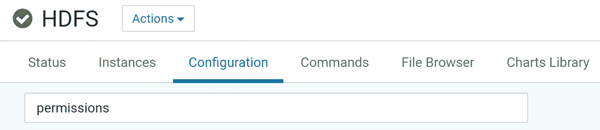
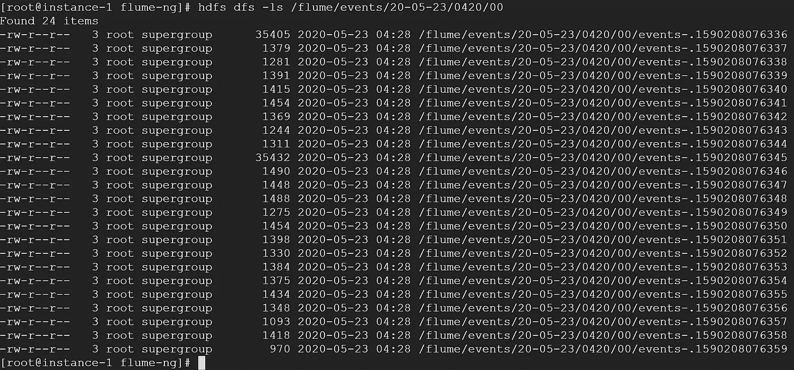
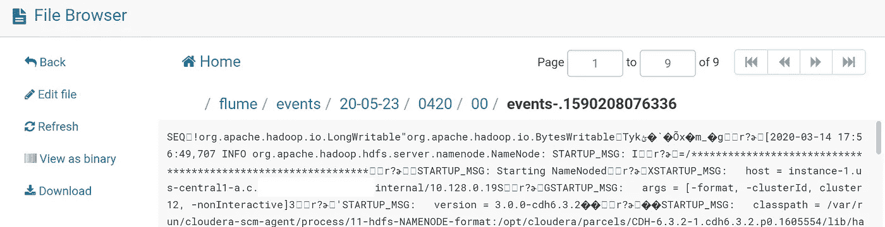
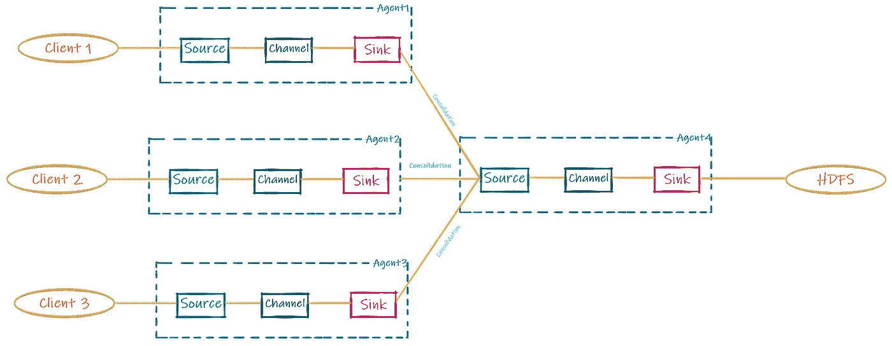
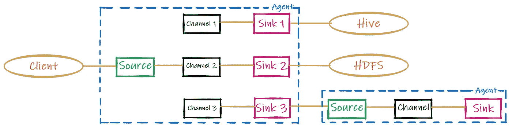
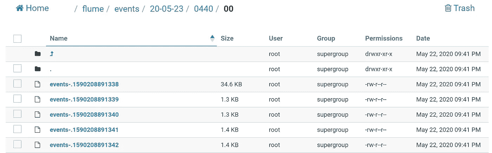
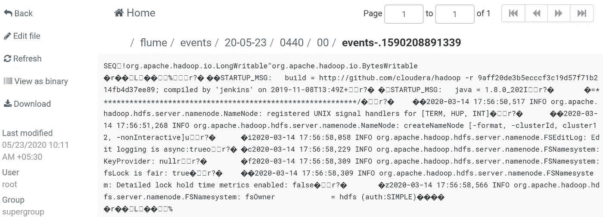

# 阿帕奇水槽

> 原文：<https://towardsdatascience.com/apache-flume-71ed475eee6d?source=collection_archive---------29----------------------->

## 使用 Apache Flume 将非结构化数据涓滴输入 HDFS


非结构化日志——照片由[Joel&Jasmin frest bird](https://unsplash.com/@theforestbirds?utm_source=medium&utm_medium=referral)在 [Unsplash](https://unsplash.com?utm_source=medium&utm_medium=referral) 上拍摄

我们已经讨论了如何使用 [Apache Sqoop](https://medium.com/@prathamesh.nimkar/sqoop-359a42a66c40) 从我们的关系数据库[MySQL](https://medium.com/@prathamesh.nimkar/install-mysql-database-7d64f0207cf9)(RDBMS)中提取结构化数据，以及如何[将这些数据推入 HDFS 并返回](https://medium.com/@prathamesh.nimkar/sqoop-commands-2793557839a5)。

现在的问题是，我们如何让非结构化数据进入 HDFS？我们用阿帕奇卡夫卡，不不不…水槽。阿帕奇水槽。

Apache Flume 是一个开源、强大、可靠和灵活的系统，用于通过与 Hadoop 集群的强耦合，以分布式方式从多个数据源收集、聚合和移动大量非结构化数据到 HDFS/Hbase(例如)。

## 体系结构


Apache 水槽架构，水槽用户指南

Flume 的架构有 3 个主要组件，即源、通道和接收器，按此顺序排列。这三者共同构成了一个“水槽代理”。

**来源**

“源”是从一个或多个应用程序/客户端提取非结构化数据(也称为“事件”)的组件。提取过程可以是事件驱动的，也可以通过频繁的轮询来完成，由 source-runners 来执行。“源流道”和“汇流道”是 Flume 的底层不可见组件，分别驱动源和汇。可以将运行器视为控制源或接收器的包装器。
Flume 内置了与 Avro、Thrift、Exec ( `/bin/sh -c`举例)、Spooling directory、Taildir、JMS、Syslog 等多个数据源的兼容性。

**频道**

“信道”是信源和信宿之间的缓冲器。缓冲区的属性基于所使用的通道类型，即内存通道、文件通道或 JDBC 通道(Kafka 通道不是内置的)。所使用的信道类型基于单一因素，即事件可靠性。例如，内存通道缓冲事件具有更高的性能，但也非常不稳定，容易发生故障。文件通道的性能一般，对故障的安全性一般。最后，JDBC 通道的性能最慢，但它对故障的安全性最高。因此，我们必须根据我们的使用情形非常谨慎地选择，但通常情况下，文件通道在生产中用于平衡性能和可靠性。
内存通道和文件通道的组合，又名*可溢出内存通道*目前正处于开发阶段(不建议用于生产)，它将在达到最大内存容量后在内存和文件系统中存储事件，从而提供文件通道的可靠性和内存队列(内存通道)的性能。
最后，Flume 遵循一种事务性的方法，在事件被移动到接收端并收到后续接收运行器的确认之前，它不会从通道中移除事件。这一点非常重要，因为就处理速度而言，一些接收器可能比源慢，并可能导致数据损坏。

**沉**

“接收器”是提取的数据的最终转储或源事件的目的地。通常，我们在这里使用 HDFS，但也可以使用其他选项，如 Hbase、Hive、Elasticsearch 等等。

有趣的是，只需通过代理配置文件和网络就能处理所有这一切，不需要复杂的编程。

> 只讲理论不实践，聪明的孩子也会变傻


照片由 [Unsplash](https://unsplash.com?utm_source=medium&utm_medium=referral) 上的[磁杆](https://unsplash.com/@magpole?utm_source=medium&utm_medium=referral)拍摄

**可选先决条件(不适用于生产系统)**

HDFS 是一个坚持许可的人。它不认为 unix“根”用户是超级用户，因此我们简单地禁用权限检查，以防止在 HDFS 上运行作业时出现不必要的错误。虽然这对于我们的培训环境来说没问题，但是对于生产环境来说**就不**好了，在生产环境中，将为每个用户分配适当的权限。



Cloudera 经理— HDFS

导航至 Cloudera Manager 中的 HDFS 服务信息。点击配置选项卡。


HDFS 权限检查

搜索“检查 HDFS 权限”并取消复选框，以禁用 HDFS 的权限。接下来，重启您的集群，以便推进更改(通常它会询问，如果没有，请执行)。

## 让我们直接看一个简单的例子


可视化下面的配置文件

我们只有一个源、一个通道和一个接收器。有很多其他选项或组合可供选择，可以在 Apache Flume 的用户指南中找到(参考下文)。

下面是我们的简单配置文件:

确保在执行代码之前删除行内注释，以避免错误。以下是概念的更多细节。

准备好这个配置文件后，将它加载到 instance-1 VM 中，并执行下面的命令，开始通过 Flume 处理该文件:

```
cd /var/lib
flume-ng agent --conf conf --conf-file /root/flume_1.conf --name flume_1
```

经过几次迭代后，请使用 control+c 退出该过程。让我们深入了解一下日志文件:

水槽日志——简单示例

即使在用 control+c 停止流之后，数据仍然被加载到目标接收器中。这是因为通道，通道是内存中保存的数据的缓冲区(在这种情况下)。

让我们快速检查一下/var/log/flume-ng/下的 taildir_position.json 文件的内容

```
cat taildir_position.json
[{"inode":193087000,"pos":94026,"file":"/var/log/hadoop-hdfs/hadoop-cmf-hdfs-NAMENODE-instance-1.us-central1.internal.log.out"}]94026 - last position of file - source_1 file
```

最后，让我们检查数据，确保到最小的单元

```
hdfs dfs -ls /flume/events/20-05-23/0420/00
```



通过 Apache Flume 记录在 HDFS 接收器中捕获的事件

另一个选项是通过 <instance-1>:8889 上的色调</instance-1>



选择“以文本形式查看”(非二进制)，以文本格式获取事件的详细信息

## 扇入与扇出



扇入或整合架构，Flume 用户指南

任何大规模日志记录系统的最基本要求是它能够整合来自多个来源的数据或**扇入***即时*，Flume 作为默认 OOTB 提供了这一功能。事实上，我看到过这样的用例，数百个客户端将日志推送到几个代理，只是为了经过多次迭代进行整合。基本上，创建一个水槽代理链也是允许的。

水槽支持水流分叉吗？是的，正如下图所示:



扇出(复制或多路复用)架构，Flume 用户指南

**扇出**特性有两个选项，即复制和多路复用。例如，在复制过程中，源事件被复制到三个通道中，并被推送到下游的三个接收器中。另一方面，多路复用类似于过滤，例如，如果事件属于“错误”类型，则将事件推送到通道 1 和 3，否则推送到通道 2。请注意，这也是在配置文件中设置的。

使用**拦截器**可以在复用或不复用的情况下进行过滤。让我们用这个美丽的主旨来快速理解它:

水槽拦截器

## 故障转移和负载平衡

借助这种扇出特性，可以实现故障转移和负载平衡属性。当然，使用多路复用，这是不可能的，因为事件是被“过滤”的，然而，理论上可以在他们的水槽流中结合复制和多路复用来实现属性。

所以对于一个复制的接收器，****故障转移机制*** *保证只要有一个接收器可用，事件就会被消耗*。任何失败的接收器都将从流中删除，并发送回池中。交易完成后，只有在交易正常的情况下，才能重新分配交易。如果有多个失败的接收器，则为它们分配一个优先级，基于此，首先重新分配优先级较高的接收器，如果正常工作，则再次重新分配。优先级在配置文件中分配。*

***负载平衡机制**允许流过多个接收器。Flume 中的负载平衡提供了两种机制，即循环和随机。很少使用随机调度，实际上，如果不喜欢循环调度，就使用定制调度程序。
一般来说，循环调度用于生产，并且是 Flume 的默认设置，因此理解它的工作原理是非常必要的。*

*这个例子并没有无耻地抄袭维基百科[这里](https://en.wikipedia.org/wiki/Round-robin_scheduling)🤐*

***循环负载平衡**为每个要由接收器处理的事件提供特定的时隙或“量程”。如果事件到那时还没有完成，它将被暂停，并为下一个事件提供相同的量程，循环重复，直到所有事件都已执行。在上图中，您将看到 E0 是第一个在时间 0 ms 到达的事件。完全执行大约需要 250 ms。我们的量程设置为 100 毫秒，所以 E0 不会完成。接下来，在 50 毫秒，E1 到达，等待 50 毫秒，等待资源变得可用。在 100 毫秒时，E0 被强制停止，E1 执行。它看起来是这样的:*

*这也来自维基百科[这里](https://en.wikipedia.org/wiki/Round-robin_scheduling)*

*让我们加大赌注吧！*

**

*现在就设想一下吧——扇出(复制或多路复用)体系结构，Flume 用户指南*

```
*# Let’s create a new folder in our root (I know it’s frowned upon). # This will be our new file system sink
mkdir -m 777 fs_store# Also, for check-pointing
mkdir -m 777 -p flume/checkpoint flume/data# Delete the taildir_position.json
rm /var/log/flume-ng/taildir_position.json*
```

*以下是更新后的配置文件:*

*扇出配置，这次不加评论—你成功了！*

*现在运行它:*

```
*cd /var/lib
flume-ng agent --conf conf --conf-file /root/flume_2.conf --name flume_2*
```

*一些日志:*

*水槽日志—扇出示例*

*我们得到了一些输出:*

**

*通过色调查看新添加的水槽事件*

*让我们快速看一个，好吗:*

**

*事件的快速查看*

*快速查看同一个 taildir_position.json 文件:*

```
*cat taildir_position.json 
[{"inode":193087000,"pos":94026,"file":"/var/log/hadoop-hdfs/hadoop-cmf-hdfs-NAMENODE-instance-1.us-central1-270403.internal.log.out"}]*
```

*所以，一切看起来都很方便，确实如此:*

*   *拥有大量文档的开源技术。*
*   *易于配置、高吞吐量、分布式和可扩展的容错框架，具有多种数据流功能。*

*如果我不提及 Flume 死亡的原因，那将是我的失职:*

*   *性能 Apache Flume 的处理速度取决于缓冲通道，在大多数用例中，缓冲通道实际上不能处理超过一百万的事件。当然，负载平衡是有潜力的，但是当我们将事件数量增加 100 倍时会发生什么呢？即使你想追求，也不值得去努力。*
*   *事件的顺序——不能保证接收器接收事件的顺序与客户端发送事件的顺序相同，这对于某些用例来说是绝对不可接受的。*
*   *重复数据—有些事件可能会重复发送多次，这种情况最多可以忽略不计，但另一方面，也可能是灾难性的。*

***更新:**一定要查看下面[布雷特 M](https://towardsdatascience.com/@bmedalen?source=responses-----71ed475eee6d----0------------------) 的有趣评论。*

```
***# Be a good samaritan and clean up your workspace**
rm /home/x/flume_1.conf
rm /home/x/flume_2.conf
rm /root/flume_1.conf
rm /root/flume_2.conf
cd /root/flume/checkpoint
rm -R *
cd /root/flume/data
rm -R *
cd /root/fs_store
rm -R **
```

*参考资料:*

*[1] [阿帕奇水槽用户指南](https://flume.apache.org/releases/content/1.9.0/FlumeUserGuide.html)，阿帕奇水槽，ASF*

*[2]非结构化日志—Joel[Jasmin fr estbird](https://unsplash.com/@theforestbirds?utm_source=medium&utm_medium=referral)在 [Unsplash](https://unsplash.com?utm_source=medium&utm_medium=referral) 上拍摄的照片*

*[3] [循环调度](https://en.wikipedia.org/wiki/Round-robin_scheduling)，维基百科*

*[](/apache-sqoop-1113ce453639) [## Apache Sqoop

### RDBMS 到 HDFS 并返回

towardsdatascience.com](/apache-sqoop-1113ce453639) [](/apache-yarn-zookeeper-61e17a958215) [## 阿帕奇纱线和动物园管理员

### 关于资源分配和高可用性的一切

towardsdatascience.com](/apache-yarn-zookeeper-61e17a958215) [](https://medium.com/@prathamesh.nimkar/big-data-analytics-using-the-hadoop-ecosystem-411d629084d3) [## 使用 Hadoop 生态系统的大数据分析渠道

### 登录页面

medium.com](https://medium.com/@prathamesh.nimkar/big-data-analytics-using-the-hadoop-ecosystem-411d629084d3)*