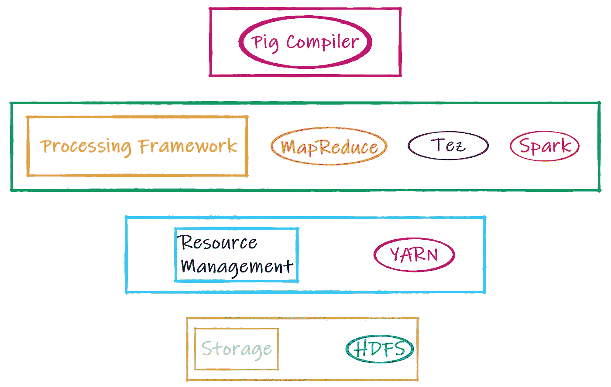
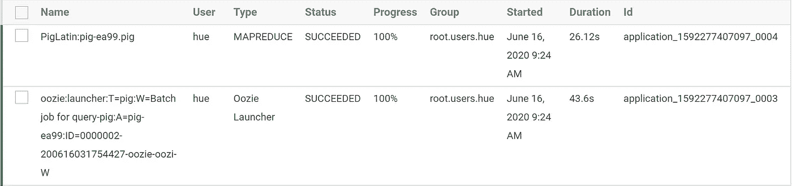
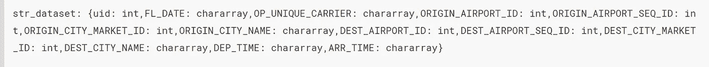
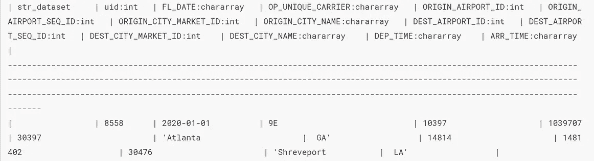
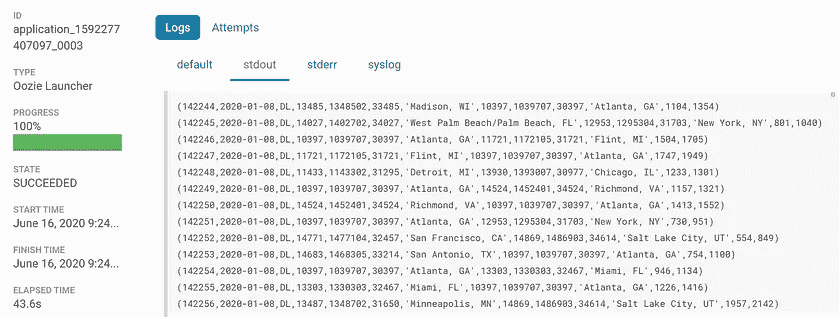
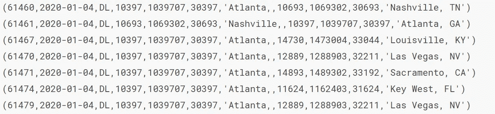
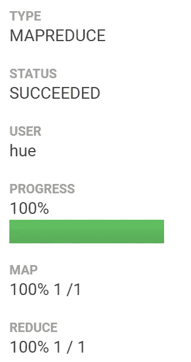
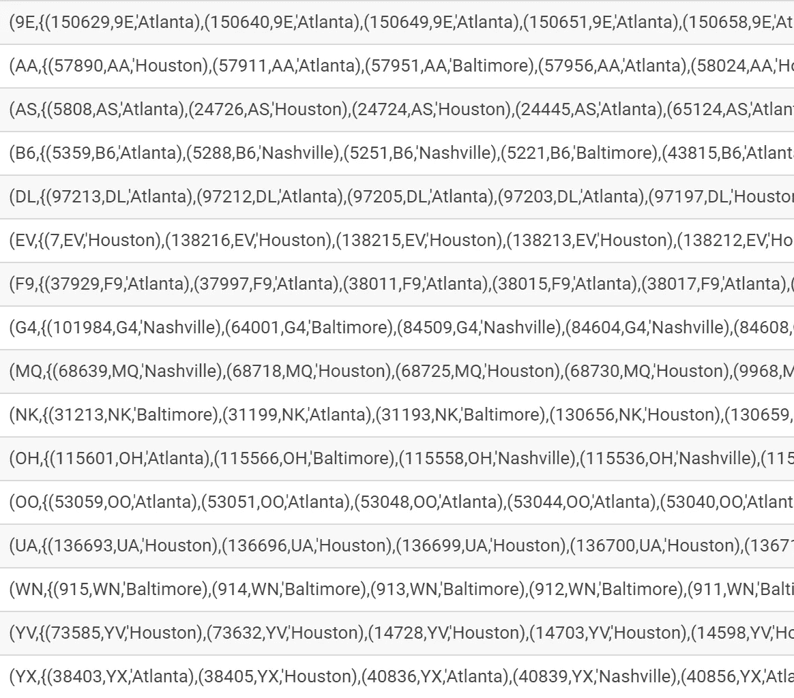

# 阿帕奇猪

> 原文：<https://towardsdatascience.com/apache-pig-1dd61d2ead31?source=collection_archive---------53----------------------->

## 最简单的 MapReduce 方法

照片由[费边布兰克](https://unsplash.com/@blankerwahnsinn?utm_source=medium&utm_medium=referral)在 [Unsplash](https://unsplash.com?utm_source=medium&utm_medium=referral) 上拍摄

2006 年，雅虎的好人们研究开发了一种简单直观的方法来创建和执行大型数据集上的 MapReduce 作业。第二年，该项目被 Apache 软件基金会接受，此后不久，作为 Apache Pig 发布。

Apache Pig 在 Hadoop 生态系统中的位置

上图简单展示了 Apache Pig 在 Hadoop 生态系统中的位置。Pig 不仅与 MapReduce 兼容，还与 Tez 和 Spark 处理引擎兼容，从而显著提高了性能。对于外行来说，Tez 可以被认为是 MapReduce 框架的一个高效版本。最后，存储层默认是 HDFS，但是 Pig 也支持 HBase、Hive 等等。

**有趣的事实** : Pig 在本地模式下工作，也就是说，它通过脚本中的简单配置设置在本地 RAM 和本地文件系统上运行。很酷吧？

## 体系结构

架构流程

*   **猪拉丁语**:是与猪一起工作时使用的语言。Pig Latin 语句是加载、处理和转储数据的基本结构，类似于 ETL。它们是以“；”结尾的多行语句并跟随[懒评](https://en.wikipedia.org/wiki/Lazy_evaluation#:~:text=In%20programming%20language%20theory%2C%20lazy,avoids%20repeated%20evaluations%20(sharing).)。
*   **Grunt Shell**:Apache Pig 提供的原生 Shell，其中写入/执行所有 Pig 拉丁脚本。然而，我们也可以在 Hue 中执行同样的操作。
*   **解析器**:一旦脚本被执行，它就到达解析器，顾名思义，它被解析为语法和类型检查等。解析器生成一个 DAG 或有向无环图，它基本上是一个逻辑数据处理流程图。我们将在下面看到。
*   **优化器**:DAG 被传递到优化器，在那里发生以下优化:

阿帕奇猪优化器

请注意，上述自动优化是默认启用的。

*   **编译器**:优化后的脚本被组合成几个作业，无论是 MapReduce、Tez 还是 Spark。
*   **执行引擎**:根据选择的处理引擎，任务现在被发送执行。

## 数据模型

时钟:raphal Biscaldi、Alexis Antoine、Lina Verovaya、Priscilla Du Preez 和 Louis Hansel @shotsoflouis 在 Unsplash 上拍摄的照片

让我们使用上面任意的图片来理解 Apache Pig 的数据模型，按照**时钟顺序**。

第一张图片是**原子**，这是 Apache Pig 中可用的最小数据单元。它可以是任何数据类型，例如，int、long、float、double、char 数组和 byte 数组，它们携带单个信息值。比如*【普拉塔梅什】*或者 *30* 或者*【medium 22】*。

接下来，我们有一组有序的任意数据类型的“字段”,用逗号作为分隔符。把它想象成 csv 文件中的一行。这个数据结构被称为一个**元组**。比如 *('Prathamesh '，30，' Medium22')* 。

简单地说，一个**包**是一个无序的元组集或集合。可以将其视为 csv 中的单个/多个非唯一记录。然而，与 csv 不同，它没有固定的结构，即它具有灵活的模式，例如第一行可以有 5 个字段，第二行有 30 个字段，依此类推。比如 *{('Prathamesh '，30，' Medium22 ')，(' Nimkar '，700)}* 。

包有两种类型，外层和内层。外袋是**关系**，是元组的袋子。可以把它想象成关系数据库中的一个表，只是没有固定的模式。一个内袋是另一个袋内的一个关系，一个嵌套袋结构或袋-如果你愿意。

Pig 还通过一个 **Map** 数据结构支持【char array to element】形式的键值对。该元素可以是任何 Pig 数据类型。例如， *["Name"#"Prathamesh "，" Year"#2020]* ，其中括号分隔映射，逗号分隔对，哈希分隔键和值。

> 秀！不要说

如果你一直关注我的帖子，你已经将[结构化](/apache-sqoop-1113ce453639)和[非结构化](https://medium.com/@prathamesh.nimkar/hdfs-commands-79dccfd721d7)数据导入 HDFS。让我们进入 Hue，打开 Pig 编辑器，探索一些常用的 Pig 拉丁文命令。

结构化数据集—脚注中的详细信息

## **装载、描述、说明&转储**

加载、描述、说明和转储

你现在可能已经注意到，猪拉丁语是懒惰的评价。这意味着，它等待某些特定的关键字，以便实际执行手头的任务。*描述、说明和转储*就是几个例子。

工作状态

该作业分为两种类型，“oozie launcher”作为该作业的父包装器，而“piglatin*”。猪”实际上运行 MapReduce 代码。作业被初始化，资源被授予，作业被监控到完成，输出被显示为 oozie 启动器的一部分。

描述一下 DESC

图解和转储

以上是传递给 Pig 服务器的各个语句的输出。如果您注意到，转储输出反映正确，但插图视图不正确。这是因为 Pig 不能排除引号中的逗号分隔值，就像我们数据集中的城市名称一样。为了纠正这一点，我们使用**存钱罐用户自定义函数**。Piggy bank 是为 Apache Pig 编写的 Java UDFs 的常见存储。我们现在要忽略这个错误，所以，想了解更多关于小猪扑满的信息，最好访问这个[网址](http://pig.apache.org/docs/r0.17.0/udf.html#piggybank)。

## 过滤器

过滤器

过滤输出

上面的要点只有 3 行代码，只需通过多个城市名加载和过滤数据集。你认为 Apache Pig 非常容易使用，非常直观，你说得对，确实如此。这些内置函数中的一些就像口语单词一样。

## FOREACH，组和商店

FOREACH，组和商店

基于同一个示例，对于每一行，只选择感兴趣的几列。然后，我们根据唯一的运营商 id 对数据集进行分组，最后，我们将数据集存储回 HDFS。就这样，只需 3 行代码就可以完成这个任务。

最终输出

您可能已经注意到，我们不仅执行了提取，还执行了转换和加载，从而完成了 Map & Reduce。

我对 Apache Pig 的简短介绍到此结束，这是最简单的 MapReduce 方法，尤其是如果你不是计算机出身的话。希望您已经发现它很有用，并且渴望尝试一下。最后，如果你有任何问题，请随时提问。

**参考文献:**

[1] [Apache Pig 概述](http://pig.apache.org/docs/r0.17.0/)，Apache Hadoop，ASF

[2] [入门](http://pig.apache.org/docs/r0.17.0/start.html)，阿帕奇猪，ASF

[3] [性能和效率](http://pig.apache.org/docs/r0.17.0/perf.html#optimization-rules)，Apache Pig，ASF

## 数据集

请注意，我没有下载所有的列来创建数据集。但是你可以。

结构化清洗数据集可以在这里找到[。
用一些数据解释？](https://github.com/pratnimk/sqoop-big-data-analysis/raw/master/915662529_T_ONTIME_REPORTING.zip)[给你](https://medium.com/@prathamesh.nimkar/bb6dc35c1a06?source=friends_link&sk=af5eab7956455ae93784c9a0ee8a9fb8)。
原始数据集的首页— [此处](https://www.bts.gov/)。
原始数据——此处[为](https://www.transtats.bts.gov/DL_SelectFields.asp?Table_ID=236&DB_Short_Name=On-Time)。
有关字段的更多详细信息— [此处为](https://www.transtats.bts.gov/Fields.asp?Table_ID=236)。
加载数据？— [此处](/apache-sqoop-1113ce453639)。

 [## MapReduce

### 简化 MapReduce 框架

towardsdatascience.com](/simplifying-the-mapreduce-framework-20915f13ebd3)  [## 阿帕奇水槽

### 使用 Apache Flume 将非结构化数据涓滴输入 HDFS

towardsdatascience.com](/apache-flume-71ed475eee6d)  [## 使用 Hadoop 生态系统的大数据分析渠道

### 登录页面

medium.com](https://medium.com/@prathamesh.nimkar/big-data-analytics-using-the-hadoop-ecosystem-411d629084d3)