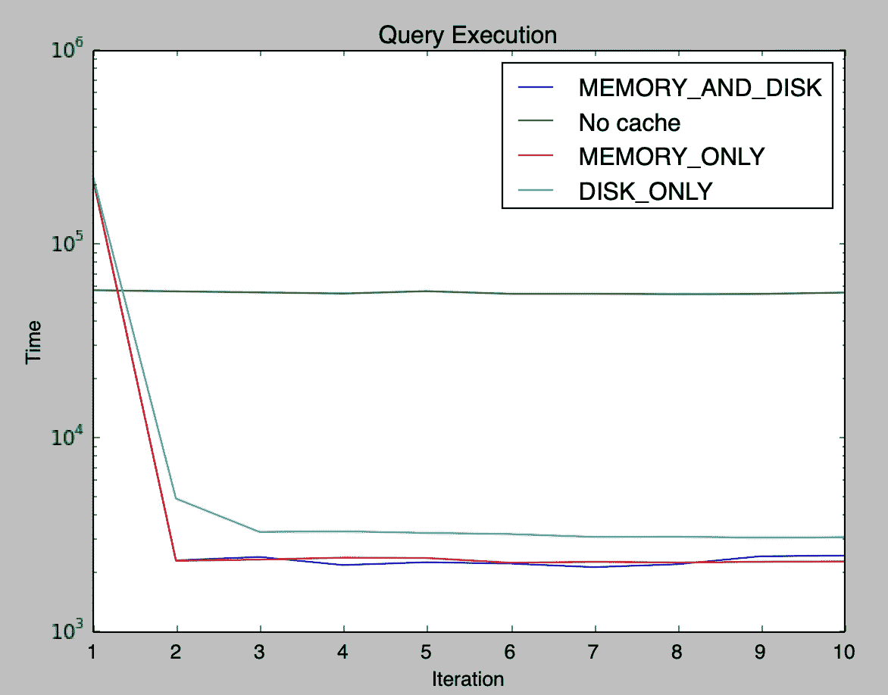

# Apache Spark:缓存

> 原文：<https://towardsdatascience.com/apache-spark-caching-603154173c48?source=collection_archive---------11----------------------->


Apache Spark 提供了一个重要的特性来缓存中间数据，并在对相同数据运行多个查询时提供显著的性能改进。在本文中，我们将比较不同的缓存技术、缓存的好处以及何时缓存数据。

**如何缓存**

参考 [DataSet.scala](https://github.com/apache/spark/blob/master/sql/core/src/main/scala/org/apache/spark/sql/Dataset.scala#L3132)

```
df.cache
```

cache 方法使用默认存储级别 MEMORY_AND_DISK 调用 persist 方法。其他存储级别将在后面讨论。

```
df.persist(StorageLevel.MEMORY_AND_DISK)
```

**何时缓存**

缓存的经验法则是识别将在 Spark 应用程序中重用的数据帧并缓存它。即使你没有足够的内存来缓存所有的数据，你也应该继续缓存。Spark 会在内存中缓存所有它能缓存的内容，并将其余的内容缓存到磁盘中。

**缓存数据帧的好处**

*   从源(hdfs://或 s3://)读取数据非常耗时。因此，在从源中读取数据并应用所有常见操作后，如果要重用数据，请缓存它。
*   通过缓存，您可以在 spark 应用程序中创建一个检查点，如果进一步执行应用程序的任何任务失败，您的应用程序将能够从缓存中重新计算丢失的 RDD 分区。
*   如果没有足够的内存，数据将被缓存在 executor 的本地磁盘上，这也比从源代码读取要快。
*   如果您只能缓存一小部分数据，这也将提高性能，其余的数据可以由 spark 重新计算，这就是 RDD 的弹性。

**Spark 中的缓存方法**

我们可以使用不同的存储级别来缓存数据。参考: [StorageLevel.scala](https://github.com/apache/spark/blob/master/core/src/main/scala/org/apache/spark/storage/StorageLevel.scala#L152)

*   DISK_ONLY:仅以序列化格式将数据保存在磁盘上。
*   MEMORY_ONLY:只以反序列化的格式将数据保存在内存中。
*   MEMORY_AND_DISK:将数据保存在内存中，如果没有足够的内存可用，被逐出的块将存储在磁盘上。
*   OFF_HEAP:数据保存在堆外内存中。参考[火花文件](https://spark.apache.org/docs/latest/configuration.html#memory-management)中的 spark.memory.offHeap.enabled。

我们可以通过使用 DISK_ONLY_2、MEMORY_AND_DISK_2 等方法明确指定在缓存数据时是否使用复制。

我们还可以指定在存储时是否序列化数据。像 MEMORY_ONLY_SER 等方法。使用序列化格式会增加处理时间，但会减少内存占用。

还提供带复制的序列化，例如 MEMORY_ONLY_SER_2

**不同存储级别之间的比较**

以下测试在本地机器上运行，驱动内存为 12GB，输入数据为 14GB，每次迭代使用 *`spark.time`* 记录时间。它输出在一个循环中执行了 10 次的查询的运行时间。

```
import org.apache.spark.storage.StorageLevelval df = spark.read.option("header",true).csv("/test/test.csv")
df.persist(StorageLevel.DISK_ONLY)
for(_ <- 0 until 10)
{
    spark.time(df.filter($"category_code" like  "%electronics%").count)
}
```



> 注意:记住 spark 中的 cache()是延迟计算的。所以当第一个动作被调用时，数据将被缓存。缓存将花费额外的时间，这可以在上图中看到。对于重新运行，我们观察到缓存带来了显著的性能优势。

**结论**

在这篇文章中，我们了解到缓存是优化 spark 作业的一项重要技术。如果我们要在代码中多次使用数据，我们应该缓存数据。它可以给我们带来显著的性能优势。