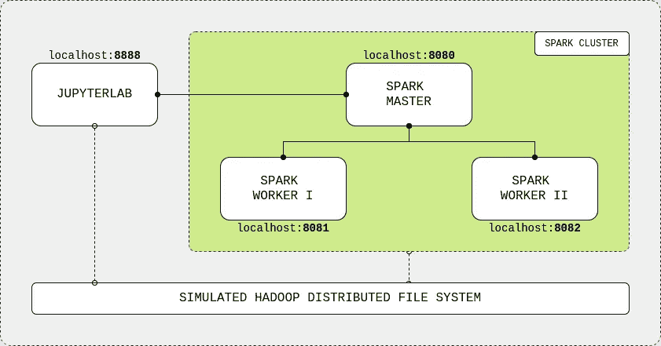
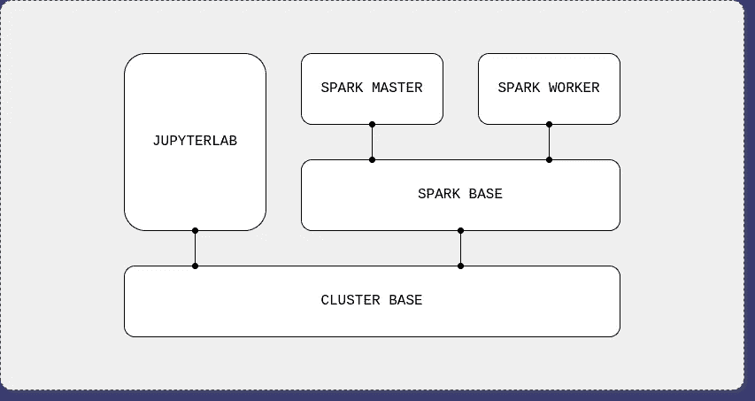

# Docker 上的 Apache Spark 集群(英尺。JupyterLab 接口)

> 原文：<https://towardsdatascience.com/apache-spark-cluster-on-docker-ft-a-juyterlab-interface-418383c95445?source=collection_archive---------5----------------------->

## Docker 上的集群应用

## 使用 JupyterLab 接口在 Docker 上以独立模式构建自己的 Apache Spark 集群

由 [Unsplash](https://unsplash.com/photos/r4lM2v9M84Q) 上 [Jez Timms](https://unsplash.com/@jeztimms) 的火花

[Apache Spark](https://spark.apache.org/) 可以说是最受欢迎的大数据处理引擎。GitHub 上有超过 25k 颗星星，该框架是学习使用 Python、Scala 和 r 在分布式系统中进行并行计算的绝佳起点。

首先，您可以在您的机器上运行 Apache Spark，方法是使用市面上许多优秀的 Docker 发行版中的一个。 [Jupyter](https://github.com/jupyter/docker-stacks) 提供了一个优秀的*dockered*Apache Spark，带有一个 JupyterLab 接口，但是缺少框架分布式核心，因为它在一个容器上运行。一些 GitHub [项目](https://github.com/big-data-europe/docker-spark)提供了分布式集群体验，但是缺少 JupyterLab 接口，削弱了 IDE 提供的可用性。

我相信，学习和实践 Apache Spark 代码的综合环境必须保持其分布式性质，同时提供令人敬畏的用户体验。

这篇文章就是关于这个信念的。

在接下来的小节中，我将向您展示如何构建自己的集群。最后，您将拥有一个用 Docker 构建的功能完整的 Apache Spark 集群，附带一个 Spark 主节点、两个 Spark 工作节点和一个 JupyterLab 接口。它还将包括 Apache Spark Python API (PySpark)和一个模拟的 Hadoop 分布式文件系统(HDFS)。

# TL；速度三角形定位法(dead reckoning)

本文展示了如何使用 Docker 作为基础设施层在独立模式下构建 Apache Spark 集群。它附带了以下内容:

*   Python 3.7 配 PySpark 3.0.0 和 Java 8；
*   Apache Spark 3.0.0，有一个主节点和两个工作节点；
*   JupyterLab IDE 2 . 1 . 5；
*   模拟 HDFS 2.7。

要创建集群，我们需要为 JupyterLab 和 Spark 节点创建、构建和组合 Docker 映像。你可以通过使用托管在我的 [GitHub](https://github.com/cluster-apps-on-docker/spark-standalone-cluster-on-docker) 上的**开箱即用的发行版**来跳过教程。

> 更新# 1:2020 年 8 月 9 日，我们通过[杏仁](https://almond.sh/) Jupyter Scala 内核发布了对 Spark Scala API 的支持。谢谢杏仁太棒了。✨
> 
> 更新# 2:2020 年 8 月 19 日，我们通过 [IRkernel](https://irkernel.github.io/) Jupyter R 内核发布了对 Spark R API (SparkR)的支持。谢谢伊克内尔这么棒。✨

# 要求

*   **Docker**1 . 13 . 0+；
*   **Docker 作曲** 1.10.0+。

# 目录

1.  集群概述；
2.  创建图像；
3.  构建图像；
4.  组成集群；
5.  创建 PySpark 应用程序。

# 1.集群概述

该集群由四个主要组件组成:JupyterLab IDE、Spark 主节点和两个 Spark workers 节点。用户连接到主节点，并通过 Jupyter notebooks 提供的漂亮 GUI 提交 Spark 命令。主节点处理输入并将计算工作负载分配给工作节点，然后将结果发送回 IDE。这些组件使用本地主机网络连接，并通过模拟 HDFS 的共享装载卷在彼此之间共享数据。

Apache Spark 集群概述

如前所述，我们需要为 JupyterLab 和 Spark 节点创建、构建和组合 Docker 映像来构建集群。我们将使用以下 Docker 图像层次结构:

Docker 图像层次结构

集群基础映像将下载并安装通用软件工具(Java、Python 等)。)并将为 HDFS 创建共享目录。在 Spark 基本映像上，Apache Spark 应用程序将被下载并配置给主节点和工作节点。Spark 主映像将配置框架作为主节点运行。类似地，Spark 工作节点将配置 Apache Spark 应用程序作为工作节点运行。最后，JupyterLab 映像将使用集群基础映像来安装和配置 IDE 和 PySpark(Apache Spark 的 Python API)。

# 2.创建图像

## 2.1.聚类基础图像

对于基本映像，我们将使用 Linux 发行版来安装 Java 8(或 11)， [Apache Spark only 需求](https://spark.apache.org/docs/latest/#downloading)。我们还需要安装 Python 3 来支持 PySpark，并创建共享卷来模拟 HDFS。

集群基础映像的 docker 文件

首先，让我们选择 Linux 操作系统。Apache Spark 官方 GitHub repository 有一个用于 Kubernetes 部署的 [Dockerfile](https://github.com/apache/spark/blob/master/resource-managers/kubernetes/docker/src/main/dockerfiles/spark/Dockerfile) ，它使用一个小型 Debian 映像，内置 Java 8 运行时环境(JRE)。通过选择[相同的基础映像](https://hub.docker.com/_/openjdk?tab=tags&page=1&name=8-jre-slim)，我们解决了操作系统选择和 Java 安装的问题。然后，我们从 Debian 官方软件包库中获得了[最新的 Python 版本](https://packages.debian.org/stable/python/python3)(目前是 3.7)，并创建了共享卷。

## 2.2.火花基础图像

对于 Spark 基本映像，我们将在[独立模式](http://spark.apache.org/docs/latest/spark-standalone.html)下获取并设置 Apache Spark，这是其最简单的部署配置。在这种模式下，我们将使用它的资源管理器来设置容器，使其作为主节点或工作节点运行。相比之下，资源管理器如 [Apache YARN](https://hadoop.apache.org/docs/current/hadoop-yarn/hadoop-yarn-site/YARN.html) 根据用户工作负载动态分配容器作为主节点或工作节点。此外，我们将获得一个支持 Apache Hadoop 的 Apache Spark 版本，允许集群使用在基本集群映像中创建的共享卷来模拟 HDFS。

Spark 基本图像的 docker 文件

让我们先从官方 [Apache 资源库](https://archive.apache.org/dist/spark/)下载 Apache Spark 最新版本(目前为 3.0.0)支持 Apache Hadoop。然后，我们用下载的包玩一会儿(解包，移动，等等。)我们已经为设置阶段做好了准备。最后，我们配置主节点和工作节点共有的四个 Spark 变量:

1.  **SPARK_HOME** 是框架用来设置任务的已安装的 Apache Spark 位置；
2.  **SPARK_MASTER_HOST** 是工作节点用来连接的主节点**主机名**；
3.  **SPARK_MASTER_PORT** 是主节点**端口**，供工作节点连接使用；
4.  **PYSPARK_PYTHON** 是 Apache Spark 用来支持其 Python API 的 PYTHON 安装位置。

## 2.3.Spark 主图像

对于 Spark 主映像，我们将设置 Apache Spark 应用程序作为主节点运行。我们将配置网络端口，以允许与工作节点的网络连接，并公开主 web UI，一个监视主节点活动的网页。最后，我们将设置容器启动命令来启动作为主实例的节点。

Spark 主映像的 docker 文件

我们首先公开在 **SPARK_MASTER_PORT** 环境变量中配置的端口，以允许工人连接到主节点。然后，我们公开 **SPARK_MASTER_WEBUI_PORT** 端口，让我们访问主 WEBUI 页面。最后，我们将容器启动命令设置为运行 Spark 内置部署脚本，并将[主类](https://github.com/apache/spark/blob/master/core/src/main/scala/org/apache/spark/deploy/master/Master.scala)作为其参数。

## 2.4.星火工作者形象

对于 Spark worker 映像，我们将设置 Apache Spark 应用程序作为 worker 节点运行。与主节点类似，我们将配置网络端口以公开 worker web UI，一个监视 worker 节点活动的网页，并设置容器启动命令以将节点作为 worker 实例启动。

Spark 工人图像的 worker 文件

首先，我们公开了 **SPARK_WORKER_WEBUI_PORT** 端口，以允许访问 worker web UI 页面，就像我们对主节点所做的那样。然后，我们设置容器启动命令来运行 Spark 内置部署脚本，使用[工作类](https://github.com/apache/spark/blob/master/core/src/main/scala/org/apache/spark/deploy/worker/Worker.scala)和主网络地址作为参数。这将使工作节点在启动过程中连接到主节点。

## 2.5.木星图像

对于 JupyterLab 映像，我们稍微后退一点，从集群基础映像重新开始。我们将安装和配置 IDE 以及与 Spark 节点上安装的略有不同的 Apache Spark 发行版。

JupyterLab 图像的 docker 文件

我们首先安装 pip(Python 的包管理器)和 Python 开发工具，以允许在映像构建期间和容器运行时安装 Python 包。然后，让我们从 Python 包索引(PyPI)中获取 [JupyterLab](https://pypi.org/project/jupyterlab/) 和 [PySpark](https://pypi.org/project/pyspark/) 。最后，我们公开默认端口以允许访问 JupyterLab web 界面，并设置容器启动命令以运行 IDE 应用程序。

# 3.构建图像

Docker 图像已经准备好了，让我们建立它们。注意，因为我们在 Dockerfiles 上使用了 Docker *arg* 关键字来指定软件版本，所以我们可以很容易地为集群更改默认的 Apache Spark 和 JupyterLab 版本。

构建集群映像

# 4.构成集群

Docker 合成文件包含我们集群的配方。在这里，我们将创建 JuyterLab 和 Spark 节点容器，向本地主机网络公开它们的端口，并将它们连接到模拟的 HDFS。

集群的 Docker 合成文件

我们首先为模拟的 HDFS 创建 Docker 卷。接下来，我们为每个集群组件创建一个容器。 *jupyterlab* 容器公开 IDE 端口，并将其共享工作区目录绑定到 HDFS 卷。同样， *spark-master* 容器公开了它的 web UI 端口和它的 *master-worker* 连接端口，并且也绑定到 HDFS 卷。

我们通过创建两个名为 *spark-worker-1* 和 *spark-worker-2* 的 Spark worker 容器来完成。每个容器都公开其 web UI 端口(分别映射到 8081 和 8082 ),并绑定到 HDFS 卷。这些容器有一个指定其硬件分配的环境步骤:

*   **SPARK_WORKER_CORE** 为核心数；
*   **SPARK_WORKER_MEMORY** 是 RAM 的大小。

默认情况下，我们为每个容器选择一个内核和 512 MB RAM。您可以随意使用硬件分配，但要确保尊重您的机器限制，以避免内存问题。另外，为 Docker 应用程序提供足够的资源来处理选定的值。

要编写集群，请运行 Docker 编写文件:

构成集群

完成后，查看组件 web 用户界面:

*   **JupyterLab** 在[localhost:8888](http://localhost:8888/)；
*   **星火大师**在[本地主机:8080](http://localhost:8080/)；
*   **火花工一**在[本地主机:8081](http://localhost:8081/)；
*   **火花工二**在[本地主机:8082](http://localhost:8082/)；

# 5.创建 PySpark 应用程序

集群启动并运行后，让我们创建第一个 PySpark 应用程序。

创建 PySpark 应用程序

打开 JupyterLab IDE 并创建一个 Python Jupyter 笔记本。通过使用具有以下参数的 Spark 会话对象连接到 Spark 主节点来创建 PySpark 应用程序:

*   **appName** 是我们应用程序的名称；
*   **master** 是 Spark master 的连接 URL，同样由 Spark worker 节点用来连接 Spark master 节点；
*   **配置**是独立模式的通用[火花配置。这里，我们将执行器内存(即 Spark worker JVM 进程)与提供的工作节点内存进行匹配。](https://spark.apache.org/docs/latest/configuration.html)

运行该单元，您将能够在 Spark master web UI 的“运行应用程序”下看到该应用程序。然后我们从 [UCI 库](https://archive.ics.uci.edu/ml/datasets/iris)下载虹膜数据集到模拟的 HDFS。最后，用 PySpark 读取并打印数据。

这是所有的乡亲。我希望我已经帮助您更多地了解了 Apache Spark 的内部结构以及分布式应用程序是如何工作的。快乐学习！