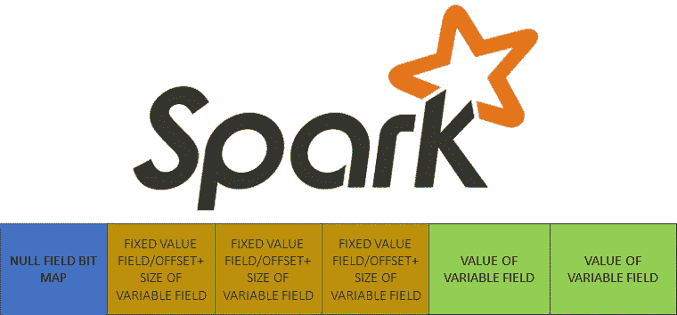
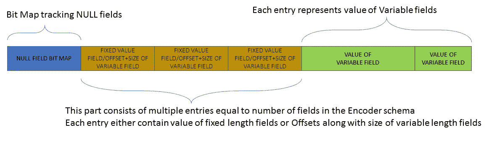
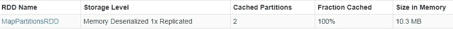
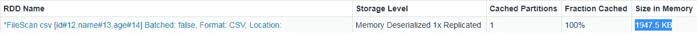

# Apache Spark 数据集编码器揭秘

> 原文：<https://towardsdatascience.com/apache-spark-dataset-encoders-demystified-4a3026900d63?source=collection_archive---------12----------------------->



Spark Logo:[https://commons . wikimedia . org/wiki/File:Apache _ Spark _ Logo . SVG](https://commons.wikimedia.org/wiki/File:Apache_Spark_logo.svg)

## 编码器就像 Spark 数据集 API 的秘方，它正在成为 Spark 作业的默认范例，本文试图揭示其基本成分。

Spark 中的 RDD、数据帧和数据集是数据记录集合的不同表示，每一个都有自己的一组 API 来对集合执行所需的转换和操作。在这三者中，RDD 形成了最古老和最基本的这种表示，并伴随着 Spark 1.6 中的数据帧和数据集。

然而，在 Spark 2.0 中，数据集的使用已经成为 Spark 程序员在编写 Spark 作业时的默认标准。在 Spark 2.0 中，Dataframe 的概念(以表格形式表示记录集合)与 Dataset 合并。在 2.0 中，Dataframe 只是某种类型的数据集的别名。数据集的这种流行是由于它们被设计成提供 RDD 和数据帧世界的最佳、灵活性、rdd 的编译类型安全性以及数据帧的效率和性能。

数据集概念的核心是一个编码器框架，与 rdd 相比，它为数据集提供了存储和执行效率增益。理解编码器框架对于编写和调试基于数据集的 Spark 作业非常重要。由于每个数据集必须与一个类型相关联，所以每当创建某种类型的数据集时(从文件、RAM 中的对象集合、RDD 或数据集)，必须在数据集创建 API 中指定相同类型的对应编码器。然而，编码器的规范在某些情况下可能是隐含的，例如装箱的原始类型。

> 特定类型的编码器将 Java 对象(编码器类型)或数据记录(符合编码器类型的数据模式)编码为原始内存支持的二进制格式，反之亦然。编码器是 Spark 的 tungusten 框架的一部分。在原始内存的支持下，从编码的二进制文本中更新或查询相关信息是通过 Java 不安全 API 完成的。

Spark 提供了一个通用的*编码器*接口和一个实现该接口的通用编码器，称为[*expression Encoder*](https://jaceklaskowski.gitbooks.io/mastering-spark-sql/spark-sql-ExpressionEncoder.html)*。这个编码器通过表达式编码和解码(也可以理解为序列化和反序列化)一个 JVM 对象(类型 T)。此外，还有一个工厂可供用户使用，即。，*编码器。**

> 编码器工厂为类型提供存储高效的 ExpressionEncoders，例如 Java boxed 原语类型(Integer、Long、Double、Short、Float、Byte 等。)、字符串、日期、时间戳、Java bean 等。此外，该工厂还提供了通用的基于 Java/Kryo 序列化的 ExpressionEncoder，它可用于任何类型，以便可以为存储高效的 ExpressionEncoder 未涵盖的自定义类型创建编码器。

下面是一个声明为 TestWrapper 的 Java bean 的示例

```
import java.io.Serializable;
import java.util.ArrayList;
import java.util.HashMap;
import java.util.Map;public class TestWrapper implements Serializable {
	private static final long serialVersionUID = 1L; 
        private Map<String, String> zap;
	private ArrayList<String> strA;
	private String name;
	private String value;

	public String getName() {
		return name;
	}
	public void setName(String name) {
		this.name = name;
	}
	public String getValue() {
		return value;
	}
	public void setValue(String value) {
		this.value = value;
	}
	public Map<String, String> getZap() {
		return zap;
	}
	public void setZap(Map<String, String> zap) {
		this.zap = zap;
	}
	public ArrayList<String> getStrA() {
		return strA;
	}
	public void setStrA(ArrayList<String> strA) {
		this.strA = strA;
	}	
}
```

存储/性能高效表达式 TestWrapper Java bean 的编码器声明为:

```
ExpressionEncoder<TestWrapper> en = Encoders.bean(TestWrapper.class) 
```

TestWrapper 的 ExpressionEncoder 也可以使用 Java/kryo 序列化来声明，如下所示:

```
ExpressionEncoder<TestWrapper> en = Encoders.javaserialization(TestWrapper.class)
or
ExpressionEncoder<TestWrapper> en = Encoders.kryo(TestWrapper.class)
```

创建 ExpressionEncoder 后，可以使用它将 TestWrapper 的实例编码/解码为二进制格式，如下所示:

```
TestWrapper tw = new TestWrapper()/* To encode tw into binary format */
InternalRow row = en.toRow(tw)/* To decode tw from binary format */
Seq<Attribute> attr = en.resolveAndBind$default$1();
TestWrapper tw = 
en.resolveAndBind(attrs,sparkSession.sessionState().analyzer()).fromRow(row);
```

InternalRow 抽象存储的二进制编码格式，并公开查询和更新以二进制格式存储的字段的方法，如下所示:

```
row.numFields() /* Outputs number of fields stored in the binary format */
row.getString(0) /* Outputs the value of the name field in the TestWrapper instance tw stored in the binary format row */
```

二进制格式的字段数量与特定 ExpressionEncoder 中解释的架构一致。例如，当 Java bean ExpressionEncoder 用于 TestWrapper 时，字段的数量是 4，而如果使用基于 Java/kyro 序列化程序的 ExpressionEncoder，则只有 1 个字段。

> 在基于串行化的 ExpressionEncoders 中，基于 Java 或 Kryo 串行化来串行化整个对象，并且串行化的字节串作为编码的二进制格式中唯一的单个字段来保存，因此这些缺乏存储效率，并且不能直接从编码的二进制格式中直接查询对象的特定字段。

另一方面，

> 在基于 Java bean 的 ExpressionEncoders 中，bean 对象通过保持其字段为二进制格式而被映射为二进制格式，从而提供了存储效率和快速查询单个字段的双重好处。因此，对于由复杂数据类型组成的 Datatsets，应该始终将 datatype 构造为由字段组成的 Java bean，对于这些字段，编码器工厂支持基于非序列化的 ExpressionEncoders。

下面是编码器输出的二进制格式的图片



数据集编码器的行二进制格式

如上所示，开头有一个空位图，可以有效地检测某些字段的空值。接下来是固定长度条目部分，其中每个条目对应于一个字段，条目的数量等于字段的数量。这些条目要么包含固定长度字段的值，要么包含值偏移量(在变量部分)和值长度。最后的变量部分包含可变长度字段的值。

下面给出了通过存储高效编码器获得的空间节省的示例。



内存中缓存 RDD 的大小(_ u)



内存中缓存数据集的大小

在上图中，首先，从 Person bean 的 10 万个对象(由 Id、Name、Age 字段组成)中创建了一个 RDD，并将其缓存在内存中以测量内存大小。其次，使用 bean encoder (ExpressionEncoder)从 Person bean 的相同的 1 万个对象中创建一个数据集，然后将其缓存在内存中以测量内存大小。对比两者的内存大小，Dataset 明显体现了内存优势。

概括来说，编码器提供了 3 个广泛的好处，使数据集获得了现在的荣耀:

*存储效率*:数据集编码器为广泛使用的 Java 类型提供存储效率。因此，数据集可以很容易地缓存在内存中以提高性能。此外，现成的二进制格式支持在磁盘上高效存储数据集(无需 JAVA/Kryo 序列化程序)。

*查询效率*:由于数据字段的布局是在编码器的二进制格式中定义好的，所以可以直接从存储在磁盘上的高效编码的二进制格式的对象中查询数据字段。另一方面，如果对象以序列化的形式存储在磁盘上，那么为了查询它的字段，对象必须首先在内存中被反序列化，这是非常低效的。

*洗牌效率*:在洗牌过程中，数据对象通过网络从一个分区移动到另一个分区。这种转变通常需要通过 Java/Kryo 序列化器对数据进行序列化和反序列化。但是，由于 Dataset encoder 已经将对象编码成一种紧凑的、定义明确的二进制格式，因此不需要进一步的显式序列化。由于数据集编码器的存储效率远远领先于传统的序列化器，因此在数据集范围转换的情况下，混洗数据的数量要比 rdd 的情况少。混洗数据量的减少又增加了混洗阶段的可靠性和性能。

*如果你对编码器有更多的疑问，请在评论区写下。*

另外，这里有我最近出版的深入讨论 Spark 分区的书的链接:

[https://www . Amazon . com/Guide-Spark-Partitioning-Explained-Depth-ebook/DP/b 08 kjct 3 xn](https://www.amazon.com/Guide-Spark-Partitioning-Explained-Depth-ebook/dp/B08KJCT3XN)