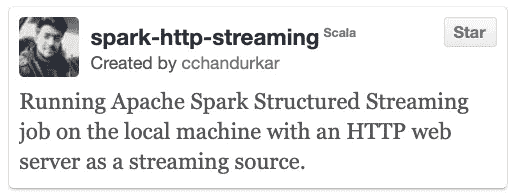

# 使用 HTTP REST 端点服务 JSON 数据的 Spark 流

> 原文：<https://towardsdatascience.com/apache-spark-stream-reading-data-from-local-http-server-d37e90e70fb0?source=collection_archive---------13----------------------->

## 使用 HTTP REST 端点作为流源，加速结构化流管道的开发和测试。


照片由[迈克尔·泽兹奇](https://unsplash.com/@lazycreekimages?utm_source=medium&utm_medium=referral)在 [Unsplash](https://unsplash.com?utm_source=medium&utm_medium=referral) 上拍摄

编写分布式应用程序可能是一个耗时的过程。虽然在本地机器上运行简单的`spark.range( 0, 10 ).reduce( _ + _ )`*(Spark 的一个“Hello World”示例)*代码非常容易，但当您遇到更复杂的真实世界用例时，它最终会变得复杂，特别是在结构化的流世界中，您希望进行流聚合、与其他流或静态数据集连接。

> 主要的挑战不仅仅是设置 Spark 或编写代码，而是在将它推向远程环境之前，在本地机器上有效地测试它。

编写代码时，在本地机器上处理来自 Kinesis、Kafka 或 S3 的流数据可能不可行，原因有很多:1)您没有足够的计算能力。2)您必须从消息队列的“最早”偏移量开始处理数据，但是要处理的数据太多了。即使你有等级限制，也可能需要几个小时来处理数据。

在这种情况下，如何在本地机器上开发生产就绪的 spark 应用程序呢？常规做法是针对假数据进行开发。[内存流](https://jaceklaskowski.gitbooks.io/spark-structured-streaming/spark-sql-streaming-MemoryStream.html)和[速率流](https://jaceklaskowski.gitbooks.io/spark-structured-streaming/spark-sql-streaming-RateStreamSource.html)可以帮助你用一些伪数据复制结构化的流行为。让我们来看看这个单元测试:

它只是从 JSON 文件中读取假数据，并将其添加到内存流中(第 18 行)。当你写单元或者集成测试时，内存流工作得很好，但是你真的不能在一个特别的基础上添加更多的数据，然后看着你的流作业处理它。这使得内存流的交互性有所降低(除非您在 REPL 环境中运行它)。

如果 spark 在开发期间有某种更具交互性的方式将数据发送到结构化的流管道，那就太好了。这可以节省很多时间。您可以从套接字流式读取数据，但通过 TCP 套接字作为单个有效负载发送的数据量是有限的(除非您更改操作系统设置)。这可能会变得复杂。


是的，这是 spark 没有内置的东西，实际上，实现非常简单:将一个简单的 HTTP web 服务器与 spark 管道集成。服务器可以将有效负载放在 MemoryStream 上，您的 spark 应用程序可以从中读取。

> ***注意*** *这仅用于本地测试和运行。因为它在底层使用内存流，所以它是不容错的。参考结构化流中的* [*容错语义*](https://spark.apache.org/docs/latest/structured-streaming-programming-guide.html#fault-tolerance-semantics) *。*

现在，我们该怎么做呢？您可以在 Scala 中创建一个简单的 HTTP 服务器:

scala 中一个简单的 HTTP 服务器

上面的代码创建了一个简单的 HTTP 服务器，它打印请求负载，并总是将`{ “success" : true }`响应发送回客户机。我们可以通过将这个`payload`数据放在一个流源(内存流)上，将它流式传输到 spark 应用程序中。所以，当然，这个服务器必须用 spark 应用程序启动。

为了使其可重用并能够创建多个 HTTP 流源，我们可以将该代码放在一个包装类中:

从本地 HTTP 端点读取数据，并将其放入内存流

创建的本地 HTTP 服务器将被 spark 应用程序终止。您可以简单地启动服务器，并使用以下命令从 HTTP 端点读取流数据:

```
scala> val httpDF = new HttpServerStream( port = 9999 ).toDF
httpDF: org.apache.spark.sql.DataFrame scala> httpDF.printSchema()
root
|-- value: string (nullable = true)
|-- timestamp: timestamp (nullable = true) scala> httpDF.isStreaming()
res1: Boolean = true
```

数据帧的`value`列是 HTTP 端点上接收的字符串化 JSON 有效负载。这里有一个完整的例子:

启动 Spark App(主要方法)

现在，您可以使用您喜欢的 REST API 工具将数据发送到这个 HTTP 端点[***HTTP://localhost:999***](http://localhost:999/)***9***并观察您的应用程序处理它。

# 演示和示例代码



[https://github.com/cchandurkar/spark-http-streaming](https://github.com/cchandurkar/spark-http-streaming)

看看它的实际效果

类似地，可以在同一个 spark 应用程序的不同端口上创建多个 HTTP 流。让我们以来自[流-流连接](https://spark.apache.org/docs/latest/structured-streaming-programming-guide.html#stream-stream-joins)的点击流为例。

```
val impressions = new HttpServerStream( port = 9997 ).toDF
   .withColumn( "i", from_json($"value" ..... )
   .select( $"i.impressionAdId", $"i.impressionTime" )
   .withWatermark( "impressionTime", "5 minutes" )val clicks = new HttpServerStream( port = 9998 ).toDF
   .withColumn( "c", from_json($"value" ..... ) )
   .select( $"c.clickAdId", $"c.clickTime" )
   .withWatermark( "clickTime", "10 minutes" )val joinedDF = impressions.join( 
   clicks,
   expr("""
     clickAdId = impressionAdId AND
     clickTime >= impressionTime AND
     clickTime <= impressionTime + interval "5 minutes"
   """)
)
```

  G 试试看，让我知道你对此的看法。请随意提出改进建议或指出注意事项。在 [** LinkedIn **](https://www.linkedin.com/in/cchandurkar/) 上联系我。干杯！