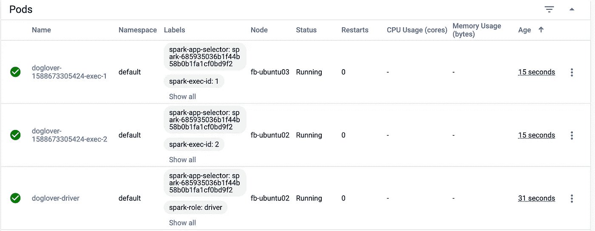
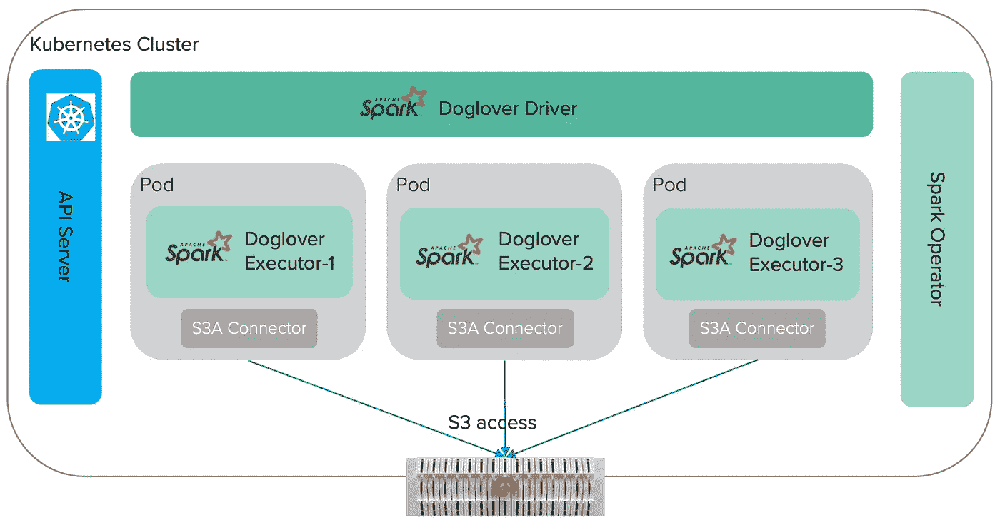
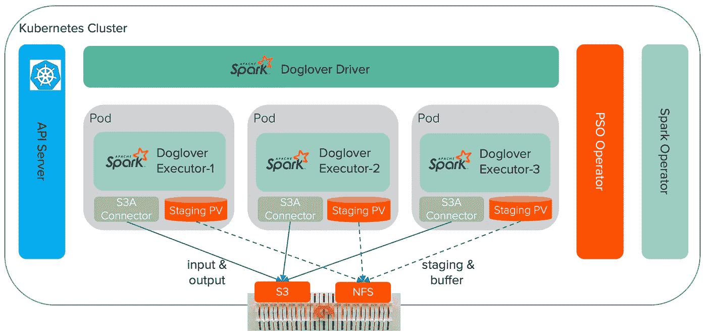

# 阿帕奇火花与 Kubernetes 和快速 S3 访问

> 原文：<https://towardsdatascience.com/apache-spark-with-kubernetes-and-fast-s3-access-27e64eb14e0f?source=collection_archive---------7----------------------->

为了充分利用 Apache Spark，我们需要两样东西:

*   存储数据的分布式存储器
*   跨计算集群运行 Spark 执行器的调度程序

人们一直在以不同的方式在内部和云上实现这一点。对于内部部署，大多数使用 Spark 和 Hadoop，尤其是 HDFS 用于存储，YARN 用于调度。而在云中，大多数使用像亚马逊 S3 这样的对象存储作为存储，并使用一个单独的云原生服务，如亚马逊 EMR 或 Databricks 作为调度。如果我们可以在单个架构 on-promise 或云中使用 Spark 会怎么样？

与库伯内特斯和 S3 一起进入火花。该架构的亮点包括:

*   跨混合云运行 Spark 的单一架构。
*   独立扩展、操作计算和存储。
*   快速供应、部署和升级。
*   不需要 Hadoop，使用和操作复杂。

在这篇博客中，我将解释如何在 Kubernetes 上使用 [Spark 操作符](https://github.com/GoogleCloudPlatform/spark-on-k8s-operator)来运行 Spark。我还将描述使用 [S3A 连接器](https://hadoop.apache.org/docs/current/hadoop-aws/tools/hadoop-aws/index.html#Introducing_the_Hadoop_S3A_client.)和 [S3A 提交器](https://hadoop.apache.org/docs/r3.1.1/hadoop-aws/tools/hadoop-aws/committer_architecture.html)的快速 S3 数据访问的配置。这种架构既适用于云对象存储，也适用于本地 S3 兼容对象存储，如 [FlashBlade S3](https://www.purestorage.com/products/flashblade.html) 。

# 安装 Spark Kubernetes 操作器

按照本[快速入门指南](https://github.com/GoogleCloudPlatform/spark-on-k8s-operator/blob/master/docs/quick-start-guide.md)安装操作器。确保在安装中启用了 webhook。

```
helm repo add incubator [http://storage.googleapis.com/kubernetes-charts-incubator](http://storage.googleapis.com/kubernetes-charts-incubator)helm install incubator/sparkoperator --namespace spark-operator --set enableWebhook=true
```

使用这个[清单](https://github.com/GoogleCloudPlatform/spark-on-k8s-operator/blob/master/manifest/spark-rbac.yaml)在 Kubernetes 默认名称空间中创建 spark 服务帐户和 roll 绑定。

```
kubectl create -f manifest/spark-rbac.yaml
```

运行 Spark Pi 示例来测试安装。这将在 Kubernetes 中创建两个 Spark pods:一个用于驱动程序，另一个用于执行程序。

```
kubectl apply -f examples/spark-pi.yaml
```

# 使用 S3A 连接器在 S3 访问数据

多亏了 Spark 操作者，通过几个命令，我能够部署一个简单的 Spark 作业在 Kubernetes 上运行。我的下一个任务是在我的 Spark 工作中访问 S3 的数据。Hadoop 的 [S3A 连接器](https://hadoop.apache.org/docs/current/hadoop-aws/tools/hadoop-aws/index.html#Introducing_the_Hadoop_S3A_client.)针对亚马逊 S3 和兼容的对象存储实现(包括 FlashBlade S3)提供高性能 I/O。

## 使用最新的 S3A 连接器构建 Docker 映像

Spark Operator 使用来自 Google Cloud 的预建 Spark docker 映像。但是，该图像不包括 S3A 连接器。虽然可以定制和添加 S3A，但默认的 Spark 映像是针对 Hadoop 2.7 构建的，众所周知，Hadoop 2.7 的 S3A 实现效率低且速度慢。所以我决定用 Spark 和最新的 S3A 连接器构建自己的 Docker 映像。

我将省略构建过程的细节，因为它很简单，但关键是使用预构建的 Spark-without-Hadoop 二进制文件和用户提供的 Hadoop。我的 Docker 文件可以在 [my Github](https://github.com/uprush/kube-spark/blob/master/docker/spark.Dockerfile) 上找到。

我的 Docker 映像包含 Spark 2.4.5、Hadoop 3.2.1 和最新的 S3A，可从 Docker Hub 获得:

```
docker pull uprush/apache-spark:2.4.5
```

## S3A 连接器配置

Spark 在 S3 访问数据的最低 S3A 配置如下:

```
"spark.hadoop.fs.s3a.endpoint": "192.168.170.12"
"spark.hadoop.fs.s3a.access.key": "S3_ACCESS_KEY"
"spark.hadoop.fs.s3a.secret.key": "S3_SECRET_KEY"
"spark.hadoop.fs.s3a.connection.ssl.enabled": "false"
```

在常规的 Spark 集群中，如果运行 Hadoop，这将放在`spark-default.conf,`或`core-site.xml`文件中。对于 Spark 操作符，它被配置在应用程序 YAML 文件的`spec.sparkConf`部分下。参考 [API 文档](https://github.com/GoogleCloudPlatform/spark-on-k8s-operator/blob/master/docs/api-docs.md)获取火花操作器 API 的完整描述。

## 火花和 S3:爱狗人士的例子

一个工作示例是展示其工作原理的最佳方式。这里有一个[示例代码](https://github.com/uprush/kube-spark/blob/master/doglover/src/main/scala/com/uprush/example/DogLover.scala)，用于在 S3 从名为 DogLover 的 Spark 程序中读写数据。我使用 twitter API 从 twitter 上收集了爱狗人士的推文，并将它们作为 JSON 文件存储在 FlashBlade 的 S3 桶中。DogLover Spark 程序是一个简单的 ETL 作业，它从 S3 读取 JSON 文件，使用 Spark Dataframe 进行 ETL，并将结果作为 Parquet 文件写回 S3，所有这些都通过 S3A 连接器完成。

为了管理 Kubernetes 中 Spark 应用程序的生命周期，Spark 操作者不允许客户直接使用`spark-submit`来运行作业。相反，我将 jar 文件上传到 S3，在我的`doglover.yaml` spec 文件中，我让 Spark 操作员从那里下载并在 Kubernetes 上运行程序。

```
spec:
  type: Scala
  mode: cluster
  image: "uprush/apache-spark:2.4.5"
  imagePullPolicy: Always
  mainClass: com.uprush.example.DogLover
  mainApplicationFile: "s3a://deephub/doglover/doglover_2.12-0.1.0-SNAPSHOT.jar"
  sparkVersion: "2.4.5"
```

然后，我可以像这样提交 Spark 作业:

```
kubectl create -f doglover.yaml
```

几秒钟后，我的 Spark 作业在 Kubernetes 上运行。



在 Kubernetes 上运行的 Spark 作业

一旦作业完成，我们应该在输出 S3 目录中看到一个零字节的`_SUCCESS`文件和多个拼花文件。

我的建筑看起来是这样的:



阿帕奇与库伯内特和 S3 的火花

在我看来，这是一种更好的提交 Spark 作业的方式，因为它可以从任何可用的 Kubernetes 客户端提交。它让我的工作更少依赖于基础设施，因此更便于携带。例如，要在 AWS 中运行相同的作业，我可以首先使用 [FlashBlade 对象复制](https://www.purestorage.com/docs.html?item=/type/pdf/subtype/doc/path/content/dam/pdf/en/solution-briefs/sb-improve-fast-object-with-replication.pdf)将我的数据从 FlashBlade S3 复制到亚马逊 S3。然后，我可以在 AWS cloud 的 Kubernetes 集群中以同样的方式轻松运行同样的 Spark 作业。

# 快速 S3 与 S3A 提交者一起写作

当使用 S3 时，Spark 依靠 Hadoop 输出提交器将输出可靠地写入 S3 对象存储。传统的 FileOutputCommitter 是为 HDFS 设计的，因此当与 S3 一起使用时，它被认为是低效、缓慢和不太可靠的，因为它依赖于原子的“重命名”HDFS 操作，而这对于对象存储是不可用的。在 Hadoop 3 中，新的“零重命名”S3A 提交器通过利用云原生 S3 特性来解决这些问题。查看更多关于[与 S3A 提交者一起将工作提交给 S3 的信息](https://hadoop.apache.org/docs/r3.1.1/hadoop-aws/tools/hadoop-aws/committers.html)。

网飞贡献了一个名为 [Staging Committer](https://hadoop.apache.org/docs/r3.1.1/hadoop-aws/tools/hadoop-aws/committers.html#The_Staging_Committer) 的 S3A committer，它有许多吸引人的特性

*   对目标对象存储没有任何要求。
*   已知有效。

提交器将任务输出写入本地文件系统上一个名为任务尝试目录的临时目录。在任务提交时，提交者枚举任务尝试目录中的文件。使用[多部分上传 API](http://docs.aws.amazon.com/AmazonS3/latest/dev/mpuoverview.html) 将每个文件上传到 S3。提交上传所需的信息保存在 HDFS 暂存目录中，并通过该协议提交:当作业提交时，成功任务的未决上传部分将全部提交。

Kubernetes 上 Spark 的最低 S3A 阶段提交器配置(不含 HDFS):

```
"spark.hadoop.mapreduce.outputcommitter.factory.scheme.s3a":"org.apache.hadoop.fs.s3a.commit.S3ACommitterFactory"
"spark.hadoop.fs.s3a.committer.name": "directory"
"spark.sql.sources.commitProtocolClass": "org.apache.spark.internal.io.cloud.PathOutputCommitProtocol"
"spark.sql.parquet.output.committer.class": "org.apache.spark.internal.io.cloud.BindingParquetOutputCommitter"
```

# S3A 登台提交器的永久卷

事实上，暂存目录不一定要在 HDFS，它也可以是所有 Spark pods 共享的 NFS 卷。在我的情况下，我使用 NFS，因为我不想有任何 HDFS 依赖。

通过使用[Pure Service Orchestrator(PSO)](https://www.purestorage.com/solutions/infrastructure/containers.html)，创建一个分段 PV 并将其安装到所有 Spark pods 很容易。

要将 FlashBlade NFS 用作 PV，请创建一个`staging-pvc.yaml`规范文件并将存储类指定给`pure-file`。

```
apiVersion: v1
kind: PersistentVolumeClaim
metadata:
  name: data-staging-share
spec:
  accessModes:
    - ReadWriteMany
  resources:
    requests:
      storage: 1Ti
  storageClassName: **pure-file**
```

应用等级库文件创建 PVC。

```
kubectl create -f staging-pvc.yaml
```

然后，我创建一个 PV，并将其安装到提交者工作目录下的所有 Spark pods 中，在我的例子中是`/home/spark/tmp`。

```
spec:
  volumes:
    - name: "staging-vol"
      persistentVolumeClaim:
        claimName: data-staging-share
  driver:
    volumeMounts:
      - name: "staging-vol"
        mountPath: "/home/spark/tmp"
  executor:
    instances: 2
    volumeMounts:
      - name: "staging-vol"
        mountPath: "/home/spark/tmp"
```

最后，我配置 S3A 来使用这个 PV。

```
"spark.hadoop.fs.s3a.committer.tmp.path": "file:///home/spark/tmp/staging"
```

# 缓冲目录的永久卷

这不是必需的，但是通常最好使用 PV 作为 S3A 提交者的缓冲区目录。缓冲区目录是提交者正在写入的数据的本地文件系统目录。因为暂存提交器将其输出写入本地文件系统，并且仅在任务提交时上传数据，所以确保有足够的本地存储空间来存储主机上运行的所有未提交任务生成的输出非常重要。小型主机/虚拟机可能会耗尽磁盘空间。为了避免这种情况，我将 S3A 配置为对缓冲区目录使用与上面相同的 PV。即使是远程存储，这里的性能也没有问题，因为 FlashBlade 非常快。

```
"spark.hadoop.fs.s3a.buffer.dir": "/home/spark/tmp/buffer"
```

有了这些，我可以使用高效、快速和可靠的 S3A staging committer 将数据从 Kubernetes 上运行的 Spark 写入 S3。

## S3A 提交者的爱狗者示例

通过以上设置，我的架构变为:



Apache 与 Kubernetes 和 S3A Committer 的火花

将以上所有内容放入 [doglover.yaml](https://github.com/uprush/kube-spark/blob/master/doglover.yaml) spec 文件，重新运行作业。与之前不同的是，这次作业创建的`_SUCCESS`文件不是零字节。它包含来自 S3A 提交器的指标和计数器。

```
cat _SUCCESS
{
  "name" : "org.apache.hadoop.fs.s3a.commit.files.SuccessData/1",
  "timestamp" : 1588673361792,
  "date" : "Tue May 05 10:09:21 UTC 2020",
  "hostname" : "doglover-driver",
  "committer" : "directory",
  "description" : "Task committer attempt_20200505100916_0000_m_000000_0",
  "metrics" : {
    "stream_write_block_uploads" : 0,
    "files_created" : 1,
...
```

这表明 S3A 提交器的配置是正确的，Spark 可以更有效地写 S3。请参考[我的卡片组](https://www.slideshare.net/uprush/hive-sparks3acommitterhbasenfs)了解 S3A 提交者及其表演角色的详细信息。

# 结论

通过 Kubernetes 上的 Spark，并通过将数据放入 S3，我能够以一种可移植的方式轻松快速地上下旋转 Spark jobs。我还能够在同一个 Kubernetes 集群中使用相同的 FlashBlade 存储运行我的 Spark 作业以及许多其他应用程序，如 [Presto](https://medium.com/swlh/presto-with-kubernetes-and-s3-deployment-4e262849244a) 和 [Apache Kafka](https://medium.com/swlh/apache-kafka-with-kubernetes-provision-and-performance-81c61d26211c) 。我不需要为所有这些管理 Hadoop 集群。Kubernetes、FlashBlade 和 PSO 共同带来了一个简单、可扩展和高性能的分解解决方案，用于运行现代分析系统，如 Spark like a service。

将 Spark 与 Kubernetes 和 S3 一起使用的好处肯定是巨大的，但是，它也有局限性。这种架构非常适合 ETL 批处理等一次性工作负载类型。虽然，对于商业智能(BI)和笔记本后端之类的东西来说，它可能不是最好的 Spark 架构，因为我找不到一种简单的方法来通过 Spark 操作符保持 Thrift 服务器或 Spark 会话运行。但是我知道在 Kubernetes 上有更好的方法来实现这些，比如 Spark 和其他解决方案。敬请关注。

只需要一点火花！