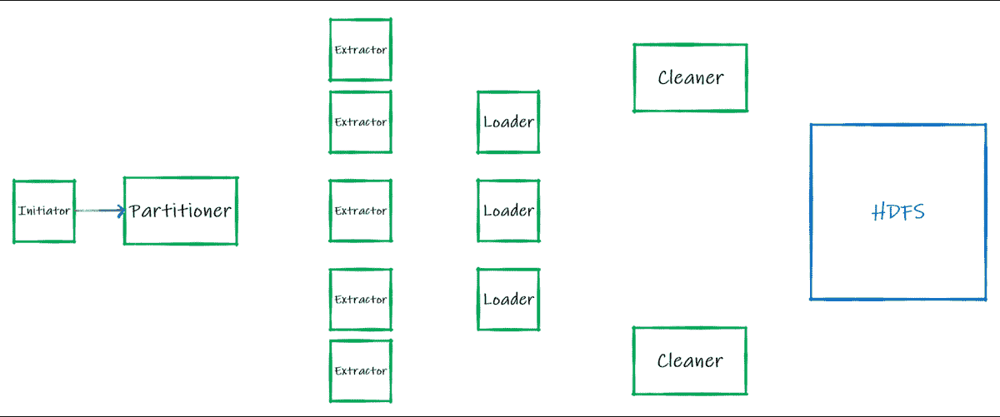
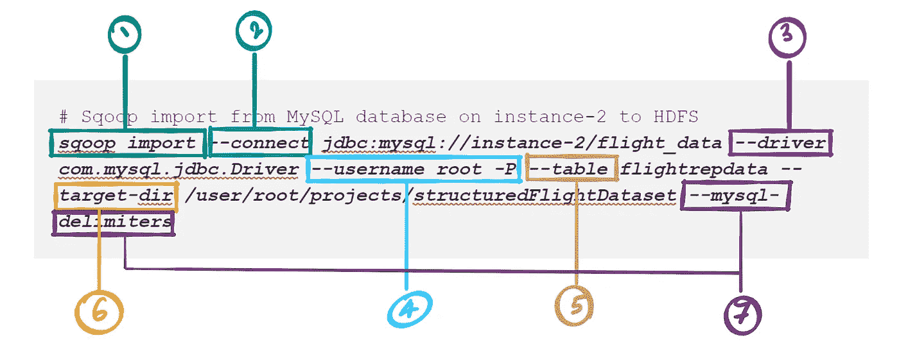

# Apache Sqoop

> 原文：<https://towardsdatascience.com/apache-sqoop-1113ce453639?source=collection_archive---------18----------------------->

## RDBMS 到 HDFS 并返回

在全球范围内，最流行的数据库是基于 SQL 的。考虑到这一点，对于任何数据湖来说，能够从 RDBMS 数据库中提取数据是至关重要的。于是，Apache Sqoop 诞生了。


Apache Sqoop 高级数据流

Apache Sqoop 支持任何 RDBMS 和 HDFS、Hive 或 HBase 等之间的双向数据移动。但是，仅限于结构化数据。它以批量加载格式工作(类似于 ETL 应用程序中的提取)，支持大量数据的提取，达到 RDBMS 根本无法处理的数 TB。

## 它是如何工作的？



稍加修改的 Apache Sqoop 工作流， [Apache Sqoop Wiki](https://cwiki.apache.org/confluence/display/SQOOP/Sqoop+Presentations+and+Blogs)

上面的 GIF 是将数据从 RDBMS 加载到 HDFS 的 Sqoop 过程的工作流。*反之亦然。*它是这样工作的:

**发起方**:客户端向 Sqoop 服务器提交一个任务，将数据从源加载到目标(在本例中，就是将 RDBMS 加载到 HDFS)。连接池、模式和元数据验证在这个阶段完成。

**分割器**:现在要提取数据。但是，例如，1 TB 大小的表不能作为一个数据块来处理。因此，我们有一个分割器，其中，数据被分解为可消化的数据块/区块，以便并行提取。请注意，这里没有存储数据。

**提取器**:在框架的这一部分，数据实际上是以特定的块/块从源移动的。需要注意的是，并不是所有的数据都要一次加载到内存中进行提取。我们可以把它看作是微批量处理。同样，这里没有存储任何数据。

**Loader** :提取的数据现在通过框架的 Loader 阶段推送到目标。现在数据实际上被存储了。

**Cleaner** :这只是一个清理活动，以释放所使用的资源。

Sqoop 2.x 是使用 Map Reduce 作为其主要处理框架推出的。 *Sqoop with Spark* 是一种可能性，可以通过上面讨论的 Sqoop 的即插即用或模块化框架轻松配置。这就是这种通用工作流程的美妙之处/本质。

如果您还没有完成安装，现在是时候了！

[](https://medium.com/@prathamesh.nimkar/cloudera-manager-on-google-cloud-3da9b4d64d74) [## Google Cloud 上的 Cloudera 管理器

### GCP 的 CM 6.3.1

medium.com](https://medium.com/@prathamesh.nimkar/cloudera-manager-on-google-cloud-3da9b4d64d74) [](https://medium.com/@prathamesh.nimkar/install-mysql-database-7d64f0207cf9) [## 安装 MySQL 数据库

### 安装 MySQL 数据库并加载数据

medium.com](https://medium.com/@prathamesh.nimkar/install-mysql-database-7d64f0207cf9) 

## 将数据从 RDBMS 导入 HDFS

```
**# Quick check of HDFS folders on instance-1**
sudo su -
hdfs dfs -ls /user/root/projects
```

让我们使用 Sqoop 自动创建一个名为***structuredFlightDataset***的新 HDFS 文件夹，并将数据导入其中。



Sqoop 导入命令

1.  *sqoop 导入*触发对 sqoop 服务器的请求，以启动流程。
2.  *connect* 参数使用 jdbc 协议接受数据库连接池信息。
3.  *driver* 参数(可选)接受在源、目标和 sqoop 服务器之间建立连接的默认驱动程序。请注意，这个参数是为流行的 OLTP 数据库(如 mysql、oracle、db2、postgresql 和 sql server)提供的默认值。
4.  *用户名/密码*在此输入参数进行授权。
5.  *表*从参数导入。
6.  *数据将被推送到的目标目录*参数。
7.  使用标准 OOTB *mysql 分隔符*来处理数据集列类型。

请注意，上面的导入命令图和标签也适用于导出命令，只是有微小的明显区别。

```
**# Sqoop import from MySQL database on instance-2 to HDFS**
sqoop import --connect jdbc:mysql://instance-2/flight_data --driver com.mysql.jdbc.Driver --username root -P --table flightrepdata --target-dir /user/root/projects/structuredFlightDataset --mysql-delimiters
**# Prompt to enter password**
Enter password:
```

这将抛出一个小错误，因为 mysql 的 java 连接器在 instance-1 上丢失了。 [Cloudera 表示，Sqoop 不附带第三方 JDBC 驱动程序，必须单独安装](https://docs.cloudera.com/documentation/enterprise/5-4-x/topics/cdh_ig_jdbc_driver_install.html)。此外，它需要一个无头的开放 JDK 和一些对 MySQL 数据库前端的访问权限。

```
**# Download the rpm for j-mysql-connector (your url may vary)**
wget [https://dev.mysql.com/get/Downloads/Connector-J/mysql-connector-java-8.0.19-1.el7.noarch.rpm](https://dev.mysql.com/get/Downloads/Connector-J/mysql-connector-java-8.0.19-1.el7.noarch.rpm)**# Prerequisite: java-openjdk-headless rpm installed via yum**
yum install java-1.8.0-openjdk-headless**# Install the rpm now**rpm -ivh mysql-connector-java-8.0.19-1.el7.noarch.rpm**# copy to the required folders**cd /usr/share/java
cp mysql-connector-java.jar /var/lib/sqoop/**# Without adding to oozie, it would throw a java exception
# Oozie is an orchestration tool** sudo -u hdfs hadoop fs -copyFromLocal mysql-connector-java.jar /user/oozie/share/lib/lib_20200429072044/sqoop/
```

现在，我们需要在 MySQL 上授予来自远程服务器/主机的访问权限:

```
**# Login to instance-2 and make the changes in mysql config file**ssh instance-2
vim /etc/my.cnf**# Change/add the binding address, save & close the file**
bind-address = 0.0.0.0**# Restart mysql services**
service mysqld restart
```

登录 MySQL，创建具有特定 IP 的用户，并提供适当的授权。请注意，MySQL 不再允许直接从 GRANT 命令创建用户。只要主机名不同，用户名和密码可以相同。
快速提示:主机名可以在这里找到*cloud era Manager->Host->所有主机*

```
CREATE USER ‘username’@’instance1_hostname’ IDENTIFIED BY ‘new_password’;
CREATE USER ‘username’@’instance2_hostname’ IDENTIFIED BY ‘new_password’;
CREATE USER ‘username’@’instance3_hostname’ IDENTIFIED BY ‘new_password’;
CREATE USER ‘username’@’instance4_hostname’ IDENTIFIED BY ‘new_password’;
**# Now let's grant the required privileges:**
GRANT ALL PRIVILEGES ON *.* TO ‘username’@’instance**1**_hostname’;
GRANT ALL PRIVILEGES ON *.* TO ‘username’@’instance**2**_hostname’;
GRANT ALL PRIVILEGES ON *.* TO ‘username’@‘instance**3**_hostname’;
GRANT ALL PRIVILEGES ON *.* TO ‘username’@‘instance**4**_hostname’;
**# Flush the privileges to "activate" them:**FLUSH PRIVILEGES;
**# Quick test:**
SELECT * from information_schema.user_privileges where grantee like “‘username’@’instance**1%**’”;**# Repeat for all other hosts**
```

完成后，您可以重新运行 Sqoop import 命令。首先，让我们深入分析日志:

Apache Sqoop 日志的详细浏览

让我们检查导入 HDFS 的数据:

```
hdfs dfs -ls /user/root/projects/structuredFlightDataset
```

这应该给你 5 个文件。您可以从 [HDFS 的 Name Node Web UI](https://medium.com/@prathamesh.nimkar/hdfs-commands-b8a745ca9318) 或 Hue 的 Web UI—[*http://instance-1:8889/*](http://instance-1:8889/)查看。您可能需要下载文件才能查看。请注意 ***_SUCCESS*** 文件不包含任何内容，它只是一个标志值。***part-m-00000/1/2/3****文件以一个 csv 格式的实际数据出现。*

*为了控制创建和执行多少并行流程(也称为映射器/分割),我们可以这样调整导入命令:*

```
***# Sqoop import using** 1 mapper **only**
sqoop import --connect jdbc:mysql://instance-2/flight_data --driver com.mysql.jdbc.Driver --username root -P --table flightrepdata --target-dir /user/root/projects/structuredFlightDataset2 --mysql-delimiters **-m 1***
```

*映射器数量参数只是对纱线的*建议。YARN 可能会选择完全忽略这个建议。**

```
***# Pretty much the same logs using a single mapper except:**
INFO mapreduce.ImportJobBase: Transferred 57.1199 MB in 38.2969 seconds (1.4915 MB/sec)*
```

*它给出了两个输出文件，即 part-m-00000 和 _SUCCESS 标志。你会注意到它有点慢，但这只是 60 万记录。想象一下，如果是 1 亿条记录，性能会有多大的不同。*

*既然映射器是线程，那么如果您提供两倍于主机的映射器会怎么样呢？这能进一步提高性能吗？*

```
*sqoop import --connect jdbc:mysql://instance-2/flight_data --driver com.mysql.jdbc.Driver --username root -P --table flightrepdata --target-dir /user/root/projects/structuredFlightDataset3 --mysql-delimiters **-m 8
# Notable differences in the log generated:**
INFO db.IntegerSplitter: Split size: 75918; Num splits: 8 from: 1 to: 607346
INFO mapreduce.JobSubmitter: number of splits:8
INFO mapreduce.Job:  map 0% reduce 0%
INFO mapreduce.Job:  map 13% reduce 0%
INFO mapreduce.Job:  map 25% reduce 0%
INFO mapreduce.Job:  map 50% reduce 0%
INFO mapreduce.Job:  map 75% reduce 0%
INFO mapreduce.Job:  map 88% reduce 0%
INFO mapreduce.Job:  map 100% reduce 0%
INFO mapreduce.ImportJobBase: Transferred 57.1199 MB in 38.247 seconds (1.4934 MB/sec)*
```

*正如您将注意到的，所用的时间没有差异，但它会产生 8 个输出文件(part-m-00000–8)和 1 个 _SUCCESS 标志。*

> *最好保持映射器的数量与数据节点的数量相同，处理可以/将要在数据节点上运行。*

*这里出现了一个有趣的问题，我们能否使用 SQL 查询将数据加载到 HDFS 中？为什么是的，当然我们可以。事实上，我们可以让复杂的查询按照我们认为合适的方式连接多个表。*

*额外提示:该查询被提交到数据库层，因此，如果您可以在该层过滤所需的数据，就可以节省下游的 Map Reduce 或 Spark 处理。但是，这不是最佳实践。数据湖的概念是首先获取所有的原始数据。*

```
*sqoop import --connect jdbc:mysql://instance-2/flight_data --driver com.mysql.jdbc.Driver --username root -P --target-dir /user/root/projects/structuredFlightDataset3 --mysql-delimiters --query **"SELECT UID, OP_UNIQUE_CARRIER FROM flightrepdata_exp WHERE 1=1 AND FL_DATE = '2020-01-01'"** -m 2*
```

## *从 RDBMS 到 HDFS 的增量导入*

*每天从 OLTP 数据库批量加载需要能够执行增量加载，即只加载上次执行的增量。基本上有两种方法可以实现这一点:*

***LastModified***

```
***# Let's create a last modified date column** ALTER TABLE `flightrepdata` 
ADD `LAST_MODIFIED_DATE` TIMESTAMP NOT NULL DEFAULT NOW();
**# Quick import into HDFS** sqoop import --connect jdbc:mysql://instance-2/flight_data --driver com.mysql.jdbc.Driver --username root -P --table flightrepdata --target-dir /user/root/projects/structuredFlightDataset4 --mysql-delimiters
**# Quick HDFS Check** hdfs dfs -ls /user/root/projects/structuredFlightDataset4
**# Quick insert now** INSERT `flightrepdata` 
SELECT NULL,
FL_DATE,
OP_UNIQUE_CARRIER,
ORIGIN_AIRPORT_ID,
ORIGIN_AIRPORT_SEQ_ID,
ORIGIN_CITY_MARKET_ID,
ORIGIN_CITY_NAME,
DEST_AIRPORT_ID,
DEST_AIRPORT_SEQ_ID,
DEST_CITY_MARKET_ID,
DEST_CITY_NAME,
DEP_TIME,
ARR_TIME,
NOW()
FROM `flightrepdata`
WHERE 1=1
AND uid IN (1, 2, 3, 4, 5);
COMMIT;
**# Quick data test for the 5 new records** SELECT uid, OP_UNIQUE_CARRIER, LAST_MODIFIED_DATE FROM flightrepdata ORDER BY 1 DESC LIMIT 5;+--------+-------------------+---------------------+
| **uid** | **OP_UNIQUE_CARRIER** | **LAST_MODIFIED_DATE** |
+--------+-------------------+---------------------+
| 607352 | EV                | 2020-04-27 16:49:36 |
| 607351 | EV                | 2020-04-27 16:49:36 |
| 607350 | EV                | 2020-04-27 16:49:36 |
| 607349 | EV                | 2020-04-27 16:49:36 |
| 607348 | EV                | 2020-04-27 16:49:36 |
+--------+-------------------+---------------------+*
```

*现在，对于“lastmodified”模式下的增量导入，我们需要提供以下参数:
*—增量* —实例化增量提取过程及其模式
*—检查列* —应检查日期的日期列
*—最后值* —应提取数据的值位
*—追加* —追加新数据*

```
*sqoop import --connect jdbc:mysql://instance-2/flight_data --driver com.mysql.jdbc.Driver --username root -P --table flightrepdata --target-dir /user/root/projects/structuredFlightDataset4 --mysql-delimiters --incremental lastmodified --check-column LAST_MODIFIED_DATE --last-value "2020-04-27 16:49:36" --append
**# Additional logs** INFO mapreduce.ImportJobBase: Transferred 611 bytes in 26.6098 seconds (22.9615 bytes/sec)
INFO mapreduce.ImportJobBase: **Retrieved 5 records**.
INFO util.AppendUtils: **Appending** to directory structuredFlightDataset4
INFO util.AppendUtils: Using found partition 4
**# Quick HDFS Check** hdfs dfs -ls /user/root/projects/structuredFlightDataset4*
```

***追加***

```
***# Let's run the same INSERT query as above and test** SELECT uid, OP_UNIQUE_CARRIER, LAST_MODIFIED_DATE FROM flightrepdata ORDER BY 1 DESC LIMIT 5;
+--------+-------------------+---------------------+
| **uid** | **OP_UNIQUE_CARRIER** | **LAST_MODIFIED_DATE** |
+--------+-------------------+---------------------+
| 607359 | EV                | 2020-04-27 17:05:19 |
| 607358 | EV                | 2020-04-27 17:05:19 |
| 607357 | EV                | 2020-04-27 17:05:19 |
| 607356 | EV                | 2020-04-27 17:05:19 |
| 607355 | EV                | 2020-04-27 17:05:19 |
+--------+-------------------+---------------------+*
```

*现在，对于“追加”模式下的增量导入，我们需要提供以下参数:
— *增量* —实例化增量提取过程及其模式
— *检查列* —需要检查值的列
— *最后一个值* —需要拾取数据的值位*

```
***# Incremental Import** sqoop import --connect jdbc:mysql://instance-2/flight_data --driver com.mysql.jdbc.Driver --username root -P --table flightrepdata --target-dir /user/root/projects/structuredFlightDataset4 --mysql-delimiters --incremental append --check-column uid --last-value 607352
**# Additional Logs** INFO tool.ImportTool: **Lower bound value: 607352**
INFO tool.ImportTool: **Upper bound value: 607359** INFO mapreduce.ImportJobBase: Transferred 611 bytes in 25.496 seconds (23.9646 bytes/sec)
INFO mapreduce.ImportJobBase: **Retrieved 5 records.**
INFO util.AppendUtils: **Appending** to directory structuredFlightDataset4
INFO util.AppendUtils: Using found partition 9*
```

## *将数据从 HDFS 导出到 RDBMS*

*Sqoop 不会自动创建一个表，因此我们必须创建一个具有底层结构(即列和数据类型)的表。*

```
***# Login to instance-2 MySQL and appropriate database instance**
use flight_data
**# Create the table**
CREATE TABLE flightrepdata_exp
(UID INT PRIMARY KEY, 
FL_DATE DATE,
OP_UNIQUE_CARRIER VARCHAR(10),
ORIGIN_AIRPORT_ID INT,
ORIGIN_AIRPORT_SEQ_ID INT,
ORIGIN_CITY_MARKET_ID INT,
ORIGIN_CITY_NAME VARCHAR(300),
DEST_AIRPORT_ID INT,
DEST_AIRPORT_SEQ_ID INT,
DEST_CITY_MARKET_ID INT,
DEST_CITY_NAME VARCHAR(300),
DEP_TIME INT,
ARR_TIME INT);
**# Sqoop export to MySQL database on instance-2 from HDFS**
sqoop export --connect jdbc:mysql://instance-2/flight_data --username root -P --export-dir /user/root/projects/structuredFlightDataset/ --table flightrepdata_exp --mysql-delimiters
**# Pretty much the same logs really***
```

*请注意，导出命令也可以在多个映射器上运行。就像导入命令一样，最好限制*映射器数量=主机数量*。*

## ***优步模式***

*MapReduce 作业的 Mapper 和 Reducer 任务由 YARN 的资源管理器(RM)在分布于几个节点的两个独立容器中运行。但是，如果您的数据集很小，或者您的作业包含小型制图工具任务，或者您的作业仅包含一个缩减器任务，我们可以将优步模式设置为 TRUE。这迫使 RM 在一个容器或 JVM 中顺序运行 mapper 和 reducer 任务，从而减少了启动新容器和跨多个节点为一个小任务建立网络的开销。工作完成得更快。*

*如果您在 Sqoop 中遇到任何问题，可以在这里找到日志:
*http://<instance-1 IP>:8088/proxy/<YARN 的作业申请 id > /* 或者更好的是，所有作业都可以在这里找到: *http://<instance-1 IP>:8088/cluster**

*对于更多的命令，也许你想访问 [Apache Sqoop 的用户指南](https://sqoop.apache.org/docs/1.4.6/SqoopUserGuide.html)*

***快速清理**:*

```
***# Be a good Samaritan and clean up your workspace**
hdfs dfs -rm -R /user/root/projects/structuredFlightDataset2
hdfs dfs -rm -R /user/root/projects/structuredFlightDataset3
hdfs dfs -rm -R /user/root/projects/structuredFlightDataset4drop table flightrepdata_exp;
ALTER TABLE `flightrepdata` DROP `LAST_MODIFIED_DATE`;
DELETE FROM `flightrepdata` WHERE uid >= 607347; COMMIT;*
```

***参考文献**:*

*[1] [Sqoop 用户指南](https://sqoop.apache.org/docs/1.4.6/SqoopUserGuide.html)，Apache Sqoop，ASF*

*[2] [管理 Sqoop 客户端](https://docs.cloudera.com/documentation/enterprise/6/6.3/topics/cm_mc_sqoop1_client.html)，Apache Sqoop，Cloudera 文档*

*[3] C. Chaudhari，[什么是优步模式？](https://community.cloudera.com/t5/Support-Questions/What-is-Uber-mode/td-p/211160) (2018)，Cloudera 社区*

*[4] A. Elmahrek，J. Cecho (2014)， [Sqoop2 新一代大数据— Apache Sqoop 工作流](https://cwiki.apache.org/confluence/display/SQOOP/Sqoop+Presentations+and+Blogs)，Apache 软件基金会*

## *数据集*

*请注意，我没有下载所有的列来创建数据集。但是你可以。*

*结构化清洗数据集可以在[这里](https://github.com/pratnimk/sqoop-big-data-analysis/raw/master/915662529_T_ONTIME_REPORTING.zip)找到。
用一些数据解释？给你。
原始数据集的首页— [此处](https://www.bts.gov/)。
原始数据— [此处](https://www.transtats.bts.gov/DL_SelectFields.asp?Table_ID=236&DB_Short_Name=On-Time)。
字段的更多详细信息— [此处](https://www.transtats.bts.gov/Fields.asp?Table_ID=236)。*

*[](/apache-yarn-zookeeper-61e17a958215) [## 阿帕奇纱线和动物园管理员

### 关于资源分配和高可用性的一切

towardsdatascience.com](/apache-yarn-zookeeper-61e17a958215) [](/simplifying-hdfs-erasure-coding-9d9588975113) [## HDFS 擦除编码

### 通过利用擦除编码，显著降低 HDFS 集群的存储开销

towardsdatascience.com](/simplifying-hdfs-erasure-coding-9d9588975113) [](https://medium.com/@prathamesh.nimkar/big-data-analytics-using-the-hadoop-ecosystem-411d629084d3) [## 使用 Hadoop 生态系统的大数据分析渠道

### 登录页面

medium.com](https://medium.com/@prathamesh.nimkar/big-data-analytics-using-the-hadoop-ecosystem-411d629084d3)*