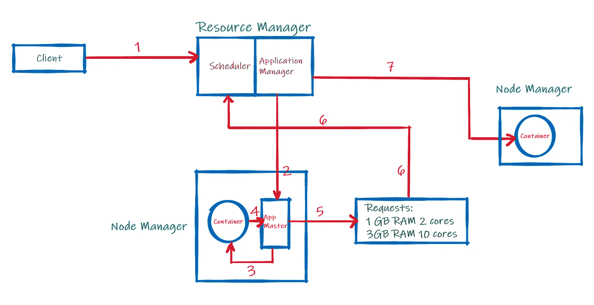
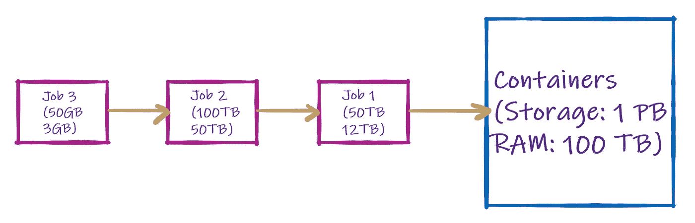
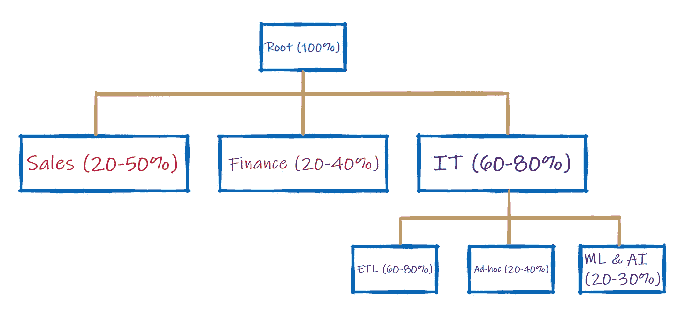
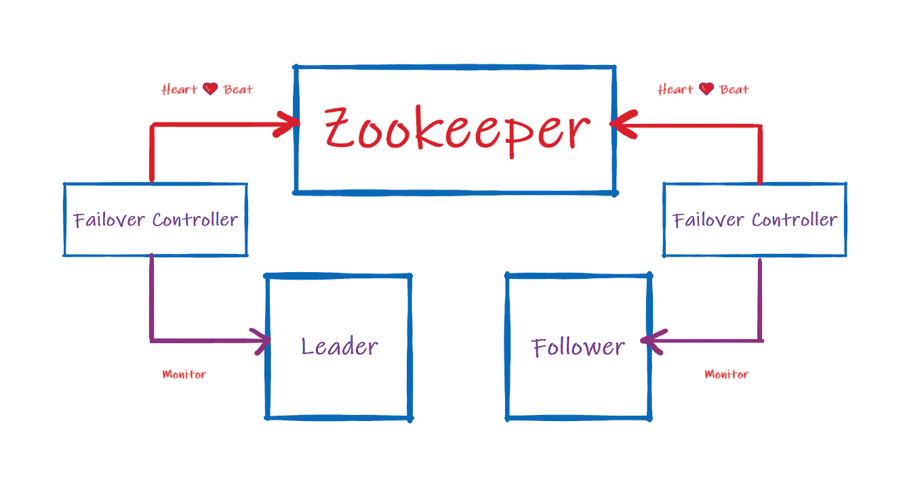

# 阿帕奇纱线和动物园管理员

> 原文：<https://towardsdatascience.com/apache-yarn-zookeeper-61e17a958215?source=collection_archive---------21----------------------->

## Hadoop 中的资源分配和高可用性

纱线结构

## 建筑和工作

YARN 或“又一个资源谈判者”正如它的名字所表示的那样，它为运行一个任务进行资源谈判。

YARN 就像任何其他 Hadoop 应用一样，遵循“主-从”架构，其中*资源管理器*是主节点，而*节点管理器*是从节点。主设备将作业和资源分配给从设备，并监控整个周期。从机接收作业并请求(额外的)资源来完成作业，并实际承担作业的执行。

1.  客户机向资源管理器(RM)发送一个作业(大多数情况下是 jar 文件)。
2.  RM 包含两个部分，即调度程序和应用程序管理器(AM)。调度器接收作业请求，并请求 AM 搜索可用的节点管理器(NM)。所选的 NM 产生应用程序主机(App Master)。请注意，RM 调度程序只调度作业。它不能监视或重新启动失败的作业。AM 监控作业的端到端生命周期，如果 NM 出现故障，可以重新分配资源。它还可以在 App Master 中重新启动失败的作业。
3.  App Master 检查容器中为作业提供的资源。该作业现在驻留在 App Master 中。请注意，它将作业的状态传达给 AM。
4.  需要注意的是，只有当应用程序管理员提供了容器启动上下文(CLC)证书时，才能使用 Yarn 容器。它就像一把打开容器资源的钥匙。这是纱线的内部。App Master 作业现在在容器中执行。但是，如果提供的资源不够，那么
5.  App Master 创建一个请求列表
6.  该列表直接发送给 RM 调度程序(不通过 NM)。RM 再次向 AM 请求更多的资源。
7.  一个新的容器通过一个新的 NM 启动，没有应用程序主。作业成功执行，资源被释放。

RM 是一个主进程，这是一个单点故障，因此让我们在 GCP 的 Cloudera Manager 设置中为 YARN 的资源管理器添加高可用性。

 [## 纱线高可用性—启用/禁用

### 纱线资源管理器高可用性

medium.com](https://medium.com/@prathamesh.nimkar/yarn-high-availability-enable-disable-59375159c182) 

## 纱线调度器

不同类型的纱线调度器

**先进先出调度**

顾名思义，先进先出或 FIFO 是 YARN 中提供的最基本的调度方式。目前(很可能)在 Hadoop 3.x 中停止使用，FIFO 将客户端提交的作业放在队列中，并根据先来先服务的原则按顺序执行。

先进先出调度

作业 1、2 和 3 具有不同的存储和内存要求。虽然我们可以一起运行多个任务，但在 FIFO 中，它们将按顺序运行。这就是浪费。因此，这种调度方法在生产/共享集群上并不可取，因为它的资源利用率很低。

由于 FIFO 是按顺序工作的，所以存在大量未充分利用的资源。现实生活中的一个缺点是，由于其顺序排队，客户/用户不得不进行不必要的等待，因此违反了关键的客户服务级别协议。这导致在一个组织内创建私有集群，其中每个部门都从中央系统(数据湖)断开连接以避免等待。这进一步降低了利用率，并大幅增加了运营成本，而这些成本本来是可以节省下来的。

引入了容量调度程序以最大化利用率。

**产能调度**

产能调度

中心思想是多个部门资助中央集群或“根”,表示为 100%的可用资源，如上图顶部所示。每个部门或“叶子”都保证有一个特定的能力范围，以便在需要时执行其工作，而无需等待。这可以是百分比或绝对数字。这是层次结构中的第二行，其中，最小值得到保证，最大值受到限制，并根据整个群集中可用的空闲资源进行分配。因此，最小范围在每个层级上总是等于 100%。自然，每片叶子的最大值也不能超过 100%。此外，我们总是将每个叶片的最大值限制在 100%以下。80%似乎是生产中首选的最大值。

我们可以通过在层次结构中创建一个新的子级别来隔离叶子，以便更准确地划分资源。这支持详细的容量规划，例如，上图中的“ETL”获得 60%的根资源，即所有资源的 36%作为最低保证。在这一级，最小值加起来也是 100%。最后，如果有 2 个“ETL”作业，优先级基于 FIFO。取决于具体情况的优先级功能是产能调度的一个缺点。

**公平调度**

您需要理解公平和容量调度是如何工作的，因为公平调度是建立在它的缺点之上的。

如果单个作业正在运行，公平调度(FS)将会投入所有的资源。如果添加另一个作业，它将确保添加“公平”数量的资源来完成该作业。因此，FIFO 调度问题在这里得到了解决。它基本上防止了新工作缺乏资源。

如果进行了配置，FS 还可以执行容量计划，它会自动在叶/部门级别添加资源。此外，它可以根据可在叶或作业级别添加的“权重”或优先级来确定作业的优先级，从而实现最大的容量利用率。

中心思想是确保所有的作业都能获得“公平”的资源来成功执行。当有 2 个工作，其中一个是小工作时，尤其如此。即使小作业属于同一个叶/队列/部门，小作业也会获得足够的资源来执行，而不是被搁置，直到大作业完成。这可以被认为是动态资源平衡。

最后，您可能还应该在 HDFS 上启用高可用性:

 [## HDFS 高可用性—启用/禁用

### HDFS 哈

medium.com](https://medium.com/@prathamesh.nimkar/hdfs-high-availability-enable-disable-41f31b8824f0) 

## 阿帕奇动物园管理员

动物园管理员是在动物园里管理动物的人。你可能已经注意到，大多数 Hadoop 应用程序图标都以某种方式与动物相关。无论如何，Apache Zookeeper 类似地是一个管理“动物园”(即 Hadoop 生态系统)中的“动物”(即应用程序)的应用程序。

## 那么，它到底是做什么的？

**协调**

任何大规模分布式应用的一个痛点是*大规模的协调*。例如，如果您有 100 个节点，并且您希望在所有节点中实施配置更改，则必须在所有节点上手动执行。
你能想象在 100 个节点上编写配置更改吗？可行吗？什么事？

那么这个怎么样——雅虎一度有 40，000 个 Hadoop 节点。你能想象为他们所有人写一个配置变更吗？你会做吗？

您可能正在考虑编写一段代码，将配置更改部署到所有节点上。虽然这是一个很好的想法，但是也有很多问题，比如对脚本的每一个小的改变都要进行繁琐和频繁的更新/定制，等等。，我们不会深入讨论，但我相信你已经明白了。

这就是 Zookeeper 的用武之地，其中更改/更新可以很容易地应用到所有节点，而不会产生任何开销。它是无缝的，必须在主节点上完成一次，然后自动应用到所有节点。

Zookeeper 的主要用途不是协调。它保持高可用性。

**保持高可用性**

Apache Zookeeper 基本架构

它通过一个简单的反馈回路做到这一点。Zookeeper 通过其故障转移控制器来监控领导者和追随者/备用节点。

它接收每个节点当前健康/状态的心跳或即时通知。当一个领导者失败时，Zookeeper 会立即选举一个备用节点作为新的领导者。选举完成后，新领导人向底层应用程序发送消息，应用程序向新领导人“报告”该消息。

这就把我带到了阿帕奇纱线和动物园管理员的结尾。

有问题吗？不要犹豫地问！

参考资料:

[1][Apache Hadoop YARN](https://hadoop.apache.org/docs/current/hadoop-yarn/hadoop-yarn-site/YARN.html)(2019)，Apache Hadoop，ASF

[2] [项目描述— Apache Zookeeper](https://cwiki.apache.org/confluence/display/ZOOKEEPER/ProjectDescription) ，Apache Hadoop，ASF

 [## GCP 上的 Cloudera Manager 启动/关闭

### 断断续续地

medium.com](https://medium.com/@prathamesh.nimkar/cloudera-manager-startup-shutdown-869482034f0)  [## 使用 Hadoop 生态系统的大数据分析渠道

### 登录页面

medium.com](https://medium.com/@prathamesh.nimkar/big-data-analytics-using-the-hadoop-ecosystem-411d629084d3)