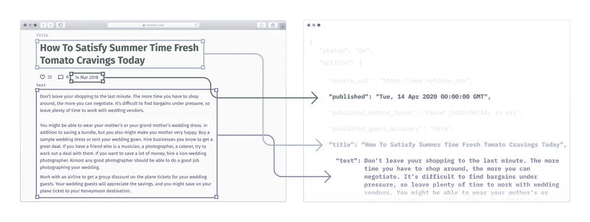
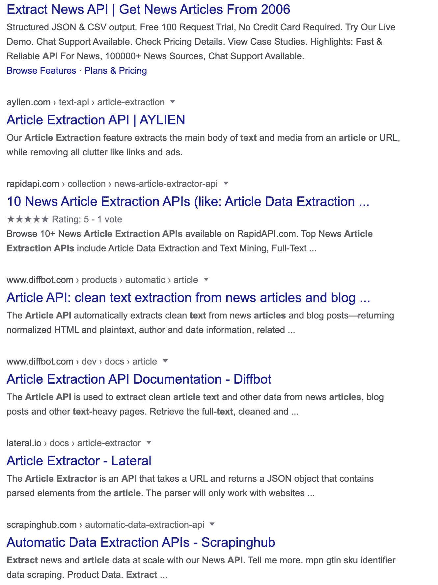

# API 作为一种产品。当你只知道一个后端时，如何销售你的作品

> 原文：<https://towardsdatascience.com/api-as-a-product-how-to-sell-your-work-when-all-you-know-is-a-back-end-bd78b1449119?source=collection_archive---------5----------------------->

## 关于如何在不管理网站、服务器、用户和支付的情况下发布和销售代码的指南。前期成本为零。


戴维·兰格尔在 [Unsplash](https://unsplash.com?utm_source=medium&utm_medium=referral) 上的照片

在这篇文章中，我将讲述我通过 API 市场开发、部署和销售我的 API 的经历。我不必建立一个网站，也不必考虑如何整合支付处理解决方案。我只是写了代码并部署了它。

创业需要团队。一个由几个各行各业的人组成的团队:程序员、市场营销、销售。而且，这是一条漫长而令人疲惫的道路，因此，成功的机会很低。

你不需要启动一个公司来开始你自己的事情。我相信有一种方法可以在只做后端工作的同时做出产品。

在过去的一年里，我想出了一个计划，如何发布我自己的产品，而不必处理用户管理和/或支付处理。

这是一个 3 步程序:

1.  制作一个解决问题的 API
2.  使用无服务器架构进行部署
3.  通过 API 市场分发

# 1.制作一个解决问题的 API

大约 6 个月前，我不得不执行一个“程序”，从网上发布的新闻文章中提取信息。一个脚本，将文章 URL 作为输入，并返回结构化记录，如标题、出版日期、作者、媒体链接等。



我的功能的可视化。【https://kuchaiev.com/ 

> 我花了几分钟才发现有一个 [Python 库](https://github.com/codelucas/newspaper)可以完成所有这些工作。再花几分钟编码，我就有了一个工作原型。

一旦你有了做某事的代码，把它包装成 API 并不困难。**可能困难的是部署和托管它。**

# 2.使用无服务器架构进行部署

## 只是一个无服务器功能

我不得不每小时几次处理数百篇文章。都在同一时刻。需要分析 200-800 个新闻 URL 的高峰，然后在不确定的时间内没有任何东西。

我们已经在 AWS 上构建了我们的解决方案，所以我认为 AWS Lambda 应该是这种情况下的最佳选择。

> AWS Lambda 是一个无服务器的功能即服务工具，它运行您的代码来响应事件。您不必维护服务器。您只需为执行该功能的时间付费。

我部署了 Lambda 函数。它的工作方式与预期的一样:它通过并发调用来处理数百个并发调用。而且，你只需为它被执行的时间付费。

那一刻我想:“嗯，这很容易。有没有公司卖这样的 API？”



谷歌搜索“文章提取 API”

是的，他们存在。他们似乎在做和我做的副业项目完全一样的事情。

这是好消息，因为:

1.  这种东西有市场
2.  我有几个例子来比较

## 无服务器 API

现在，我们必须将无服务器功能转换为无服务器 API。

我使用了 Zappa python 包，它为我完成了所有繁重的工作。

我用 [Flask](https://github.com/pallets/flask) 写了一个 API，然后通过 Zappa 用 AWS Lambda 和 API Gateway 部署。完整的 API 代码在我的 [GitHub 页面](https://github.com/kotartemiy/extract-news-api)上开源。

另一个很棒的包是[无服务器](https://github.com/serverless/serverless)，它可以部署你的无服务器代码，可以与许多编程语言和云提供商一起工作。

[https://www.cbc.ca/dragonsden/pitches/column-cozy](https://www.cbc.ca/dragonsden/pitches/column-cozy)

平均来说，我的 API 调用 50，000 次的 AWS 账单大约是 0.6 到 0.8 美元 T11。不包括自由层！

**类似解决方案的 50，000 个 API 调用在 30-250 美元范围内**。

所以，问题是，我应该暗示的其他成本是什么，来分发、推广，更重要的是，为我的 API 收费。

最有可能的是，这不足以让我变得富有，但足以支付我在网飞、Spotify、Leetcode 和其他网站的订阅费用。

# 3.通过 API 市场分发

根据 [RapidAPI](https://rapidapi.com/blog/api-glossary/api-marketplace/) :

> API 市场的工作方式与其他在线市场相同，允许提供商列出 API，开发者使用它们。像其他类型的市场一样，典型的 API 市场有几个组件，包括开发者门户和 API 提供商门户。
> 
> 免责声明:在我写这篇文章的时候，我还没有加入 RapidAPI 从 RapidAPI 获得任何特别的折扣。我选择了这个平台，因为我相信它是最适合我的。

为了在 RapidAPI Marketplace 上发布我的 API，我遵循了以下步骤:

1.  我用 API Gateway 和 Lambda 在 AWS 上部署了一个 API
2.  在 api 网关上创建了一个 **x-api-key** 来限制访问
3.  将我的 API 连接到 RapidAPI 市场
4.  与 RapidAPI 共享了 **x-api-key**

当最终用户调用 RapidAPI endpoint(从我的 API 页面)时，它负责从用户的计划中扣除令牌。然后，RapidAPI 用我提供的 **x-api-key** 调用我的 API。

不管有多少不同的用户通过 RapidAPI 使用我的 API。对于我的后端，总是用相同的 **x-api-key** 进行相同的调用。

因此，我不必以任何方式管理用户:付款收集、使用计划、使用仪表板—所有这些都不再是我的负担。

**价格是任何交易的 20%。没有交易，就没有报酬。**例如，如果我以 50 美元的价格出售每月 100，000 次通话的计划，我将获得其中的 80%(40 美元)。

如果没有人购买任何计划，我就不必向 RapidAPI 付费。

# 发布会

请随意访问我的 API 的[页面，在那里您可以免费测试它。](https://rapidapi.com/kotartemiy/api/extract-news/endpoints)

在我的 [GitHub 库](https://github.com/kotartemiy/extract-news-api)上获得 API 的完整代码。包括如何设置它的描述。

我今天(2020 年 4 月 20 日)在 [ProductHunt 上，所以有很大的机会看看这样的产品是否能得到社区的关注。](https://www.producthunt.com/posts/extract-news-api)

# 你可以做的 API

很可能，你已经有了函数本身。这可能是一个简单的事情，结合了几个 Python 库(像我的)。如果您认为您认识的任何开发人员都可以复制您的代码，这并不重要。仍然有成千上万的人可能愿意购买它。对他们来说，付钱给你比写代码、部署和维护代码更便宜。

许多开发人员都需要的 API 列表:

*   文本摘要 API
*   文本释义 API
*   文本分类 API
*   图像分类 API
*   用于从文本/网页中提取和标准化位置的 API
*   API 从任何网址抓取电子邮件

您使用开源库来处理核心功能。组合它们并获得唯一的代码。

此外，如果你已经开发了这样的代码并使用过，那么你就知道你的受众，这对产品开发来说是非常好的。

# 交付端到端解决方案

让你的简历脱颖而出的最好方法是展示你有能力做出最终决定。寻找作为软件工程师/数据科学家/数据工程师/后端工程师的第一份工作可能非常困难，但是拥有自己完全发布和维护的 API 应该会让你进入前 1%。

许多招聘人员会更愿意打开你的产品页面，而不是你的 GitHub 库。

# 结论

我在 API 市场上发现的 API 大多是由公司生产的，而不是个人。公司生产的软件产品更不容易出错。但是，价格高。从事自举项目的独立黑客更喜欢看一些不太复杂但便宜的东西。

全球经济正在进入衰退时期。公司的预算将会缩减。那些能够提出现有解决方案的廉价替代品的人应该会看到需求的上升。所以，也许现在是时候了。

```
About meMy name is Artem, I build [newscatcherapi.com](https://newscatcherapi.com/) - ultra-fast API to find news articles by any topic, country, language, website, or keyword.I write about Python, cloud architecture, elasticsearch, data engineering, and entrepreneurship.
```